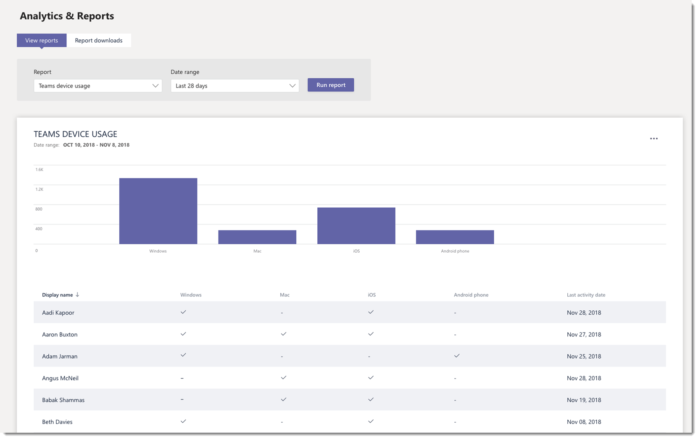

# Monitor usage and feedback in Microsoft Teams
It's important to know how users are using Teams and what their experience is with Teams. Usage reports can help you better understand usage patterns, and along with user feedback, give you insights to inform your wider rollout and where to prioritize training and communication efforts.

## Monitor usage
For your first set of teams, we recommend you review reports twice a week to understand emerging trends. 

For example, usage reports show that not many users are using the Teams mobile clients. This may indicate that users aren't sure how to install the clients. Posting step-by-step installation instructions in a channel may help drive usage of a wider range of clients. Or, usage reports show that users are primarily using Teams for private chats. In this example, you may want to review your team scenarios because users are chatting outside the initial teams and channels that were set up. 

Here's how to get reports to view Teams usage. 

### Teams analytics & reports (Microsoft Teams admin center)

Teams reports in the Microsoft Teams admin center give you insights into how Teams is used in your organization. Use the reports to get a view into Teams usage, user activity, and device usage across your organization. 

To view these reports, you must be a global admin in Office 365, Teams service admin, or Skype for Business admin. Go to the Microsoft Teams admin center, in the left navigation, select **Analytics & reports**, and then under **Report**, choose the report you want to run.

- **Teams usage report**: This report gives you an overview of usage activity in Teams, including the total active users and channels, and the number of active users and channels, guests, and messages in each team. 

         
- **Teams user activity report**: This report gives you insight into the types of activities users engage in, such as how many people communicate through 1:1 calls, channel messages, and private chat messages. 

     
`
- **Teams device usage report**: This report shows you how users connect to Teams, including how many people use Teams on their mobile devices when on-the-go. 

    

To learn more, check out [Teams analytics and reporting](teams-analytics-and-reports/teams-reporting-reference.md). 

### Teams activity reports (Microsoft 365 admin center)
You can also view Teams activity through reports that are available from the Microsoft 365 admin center. These reports are part of the Office 365 reports in the Microsoft 365 admin center and provide information about user activity and device usage. 

To view these reports, go to the Microsoft 365 admin center, click **Reports** > **Usage**. Under **Select a report**, click **Microsoft Teams**. From here, choose the report you want to view.

To learn more, go to [Use activity reports for Teams](teams-activity-reports.md).

### Microsoft 365 usage analytics

You can use Microsoft 365 usage analytics in Power BI to view and analyze usage data for Teams and other Office 365 products and services. Microsoft 365 usage analytics is a content pack that includes a pre-built dashboard and a number of pre-built reports. Each report gives you specific usage data and insights. To connect to the content pack, you need Power BI and must be a global admin in Office 365 or reports reader. If you don't already have Power BI, [sign up for the free Power BI service](https://powerbi.microsoft.com). 

To learn more, see [Microsoft 365 usage analytics](https://support.office.com/article/Microsoft-365-usage-analytics-77ff780d-ab19-4553-adea-09cb65ad0f1f). 

## Gather feedback
The adoption of a new collaboration experience is about changing the behavior of users. Enabling change requires training, encouragement, and positive examples. It's important for users to have a voice during the transition to Teams and to be able to openly share their experiences. We recommend using the Feedback channel in the "Get to know Teams" team you created to collect and address feedback from users on their experiences with Teams. 

## Next steps
Go to [Get resources to plan your organization-wide rollout of Teams](get-started-with-teams-resources-for-org-wide-rollout.md).
