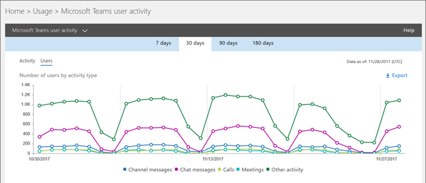
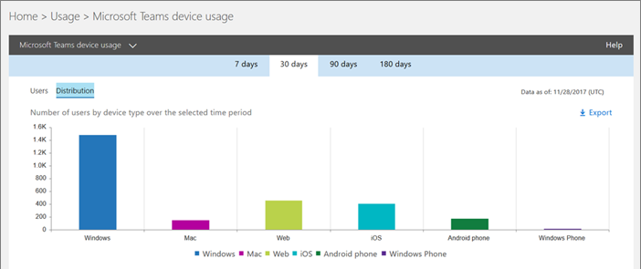

# Monitor usage and feedback in Microsoft Teams
It's important to know how users are using Teams and what their experience is with Teams. Usage reports can help you better understand usage patterns, and along with user feedback, give you insights to inform your wider rollout and where to prioritize training and communication efforts.

## Monitor usage
For your first set of teams, we recommend you review reports twice a week to understand emerging trends. 

For example, usage reports show that most users are only using the Teams web client. This may indicate that users aren't sure how to install other clients. Posting step-by-step installation instructions in a channel may help drive usage of a wider range of clients. Or, usage reports show that users are primarily using Teams for private chats. In this example, you may want to review your team scenarios because users are chatting outside the initial teams and channels that were set up. 

Here's two ways to get reports to view Teams usage. 

### Teams activity reports 
Teams activity reports in the Office 365 admin center give you insights into user activity and device usage. 

To view these reports, you must be a global admin in Office 365, Teams service admin, or reports reader. Go to the Office 365 admin center, click **Reports** > **Usage**. Under **Select a report**, click **Microsoft Teams**. From here, choose the report you want to view.

- **Teams user activity report**: This report shows you the types of communication activities users engage in, such as how many people chat in a channel and how many people communicate through private chat.  

     
- **Teams device usage report**: This report shows you how users connect to Teams, including how many people use Teams when on-the-go.

       

### Microsoft 365 usage analytics

You can use Microsoft 365 usage analytics in Power BI to view and analyze usage data for Teams and other Office 365 products and services. Microsoft 365 usage analytics is a content pack that includes a pre-built dashboard and a number of pre-built reports. Each report gives you specific usage data and insights. To connect to the content pack, you need Power BI and must be a global admin in Office 365 or reports reader. If you don't already have Power BI, [sign up for the free Power BI service](https://powerbi.microsoft.com). 

To learn more, see [Microsoft 365 usage analytics](https://support.office.com/article/Microsoft-365-usage-analytics-77ff780d-ab19-4553-adea-09cb65ad0f1f). 

## Gather feedback
The adoption of a new collaboration experience is about changing the behavior of users. Enabling change requires training, encouragement, and positive examples. It's important for users to have a voice during the transition to Teams and to be able to openly share their experiences. We recommend using the Feedback channel in the "Get to know Teams" team you created to collect and address feedback from users on their experiences with Teams. 

## Next steps
Go to [Get resources to plan your organization-wide rollout of Teams](get-started-with-teams-resources-for-org-wide-rollout.md).
