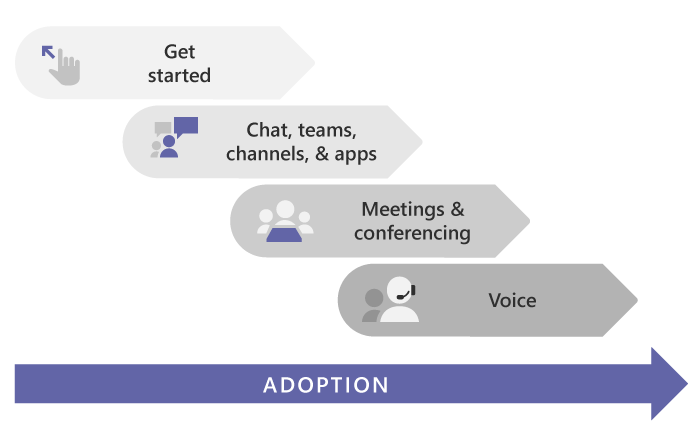

# Get started with Microsoft Teams

> [!TIP]
> Are you looking for information on how to install the Teams client on your PC or mobile device? Go here: [Download Microsoft Teams](https://www.microsoft.com/microsoft-teams/download-app).

## Start here

Whether you're a small business or a multi-national, this is the place to start rolling out Teams. These articles will guide you through a small-scale Teams rollout, which may be all you need if you're a small business or if you're rolling out Teams quickly as your first Microsoft 365 workload to support **remote workers**.

If you're a larger organization, use these articles to pilot Teams with a small group of early adopters so you can learn about Teams and start planning your org-wide deployment. Later, use the guidance on the [Microsoft Teams Adoption](https://adoption.microsoft.com/microsoft-teams/#get-started) site to help you roll out Teams across your organization.

We recommend rolling out Teams in stages, workload by workload, as your organization is ready. **You don't have to wait until you've completed one step before you move to the next.** Some organizations may want to roll out all Teams features at once, while others may prefer a phased approach. Here are the Teams workloads, in the order we recommend rolling them out:

- [Chat, teams, channels, & apps](deploy-chat-teams-channels-microsoft-teams-landing-page.md)
- [Meetings & conferencing](deploy-meetings-microsoft-teams-landing-page.md)
- [Cloud voice](cloud-voice-landing-page.md)

If you have a medium or large organization, [use Advisor for Teams to help you roll out Microsoft Teams](use-advisor-teams-roll-out.md) to help you plan the rollout of these workloads across your organization. The Advisor uses Teams itself to create a plan tasks and assign them to owners, share documents, and enable discussions amongst your deployment team.

## Make sure you're ready

To get ready for your Teams rollout, here's what you need to do, whether Teams is your first workload ("Teams First") or the next workload in an existing Microsoft 365 or Office 365 deployment:

- [Prepare your organization's network for Teams](prepare-network.md)
  - This includes configuring your Microsoft 365 or Office 365 domain, SharePoint Online, Exchange Online, and OneDrive for Business.

- Get Teams licenses for everybody. Check out [Teams plans](https://www.microsoft.com/microsoft-365/microsoft-teams/compare-microsoft-teams-options) and [Microsoft Teams service description](/office365/servicedescriptions/teams-service-description).

- [Learn about the benefits of installing the desktop, web, and mobile clients](get-clients.md)

## Get familiar with Teams

If you're new to Teams, the best way to get familiar with it is to start using it right away. The great thing about Teams is that what you set up now won't get in the way of any upgrades or migrations you might need to do later.

> [!TIP]
> Check out the learning paths and modules available in [Microsoft Learn for Teams](/learn/teams/). You can get a tour of the [Teams admin center](/learn/modules/m365-teams-navigate-admin-portal/), learn how to [configure your network for Teams](/learn/modules/m365-teams-connectivity/), get ideas on how to best [onboard your users to Teams](/learn/modules/m365-teams-onboard-users/), and more!

Use the steps below to set up a couple teams and onboard a few early adopters to help you get familiar with Teams.

- Step 1: [Create your first teams and channels](get-started-with-teams-create-your-first-teams-and-channels.md)
- Step 2: [Onboard early adopters](get-started-with-teams-onboard-early-adopters.md)
- Step 3: [Monitor usage and feedback](get-started-with-teams-monitor-usage-and-feedback.md)
- Step 4: [Start your organization-wide rollout](get-started-with-teams-resources-for-org-wide-rollout.md)

## Upgrade or migrate from Skype for Business

If you're coming to Teams from Skype for Business (online or on premises), or if you need a hybrid configuration, you still want to follow the recommended path above for a Teams deployment, but first you need to do some extra planning. Start by reviewing the guidance in the table below that applies to your organization's profile.

|&nbsp;|Your organization's profile|Guidance  |
|---------|---------|---------|
||I'm currently using Skype for Business Online, and I'm ready to move to Teams. |Go to [Upgrade to Teams](upgrade-start-here.md). |
||My organization is running Skype for Business Server, and I want to roll out Teams. |For a full-scale Teams rollout, first you need to configure hybrid connectivity between your on-premises environment and Microsoft 365. Start by reading [Plan hybrid connectivity between Skype for Business Server and Microsoft 365 or Office 365](/skypeforbusiness/hybrid/plan-hybrid-connectivity).   You should also review [Upgrade to Teams](upgrade-start-here.md).   |
||I don't have Skype for Business Server, but I do have an on-premises Public Switched Telephone Network (PSTN) solution. I want to roll out Teams, but I want to keep my on-premises PSTN solution. |Roll out Teams following  the suggestions in this article.  Then read [Plan Direct Routing](direct-routing-plan.md) to learn about using Phone System Direct Routing to hook up your on-premises PSTN solution with Teams.|
