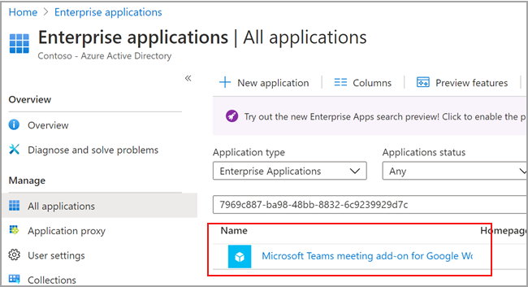
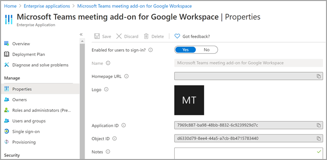

# Set up Microsoft Teams meeting add-on for Google Workspace

Using the Microsoft Teams meeting add-on lets Google calendar users schedule and join a Microsoft Teams meeting directly from Google Workspace. Users will get access to Teams meetings features including video and audio conferencing, screen sharing, meeting chat, digital whiteboards, and more. Stay connected and organized to get more done together across work, school, and life.

The Microsoft Teams meeting add-on for Google Workspace must be enabled by a Teams admin before tenant users can access the app.

## Enable or disable Microsoft Teams meeting add-on for Google Workspace in the Azure portal

As a tenant administrator, you can enable or disable a Microsoft Teams meeting add-on for Google Workspace from your organization's admin account using the Azure portal.

The add-on is enabled by default.

1. Sign in to the Azure portal.

2. Select **Enterprise applications** > **All applications**.

3. Search for **Microsoft Teams meeting add-on for Google Workspace**.

   

4. Select **Yes**.

   

5. (Optional) To disable the add-on, select **No** instead of **Yes** in Step 4.

## Disable Microsoft Teams meeting add-on for Google Workspace using PowerShell

```powershell
Connect-AzureAD

$displayName = 'Microsoft Teams meeting add-on for Google Workspace'
$appId = '7969c887-ba98-48bb-8832-6c9239929d7c'

# Check if a service principal already exists for the app
$servicePrincipal = Get-AzureADServicePrincipal -Filter "appId eq '$appId'"
if ($servicePrincipal) {
    # Service principal exists already, disable it
    Set-AzureADServicePrincipal -ObjectId $servicePrincipal.ObjectId -AccountEnabled $false
    Write-Host "Disabled existing Service Principal \n"
} else {
    # Service principal does not yet exist, create it and disable it at the same time
    New-AzureADServicePrincipal -AppId $appId -DisplayName $displayName
    Get-AzureADServicePrincipal -Filter "appId eq '$appId'" | Set-AzureADServicePrincipal -AccountEnabled:$false
    Write-Host "Created and disabled the Service Principal \n"
}
```

For more information, see [Create an Azure service principal with Azure PowerShell](/powershell/azure/create-azure-service-principal-azureps?view=azps-5.0.0).

## Delete the Microsoft Teams meeting add-on for Google Workspace

See the Google documentation [Delete a Google Workspace Marketplace app](https://support.google.com/a/answer/6216211?hl=en) for instructions.

## Create the Microsoft Teams meeting add-on for Google Workspace using PowerShell

In case the Microsoft Teams meeting add-on is not present in your tenant, you can create it using PowerShell: 

```powershell
Connect-AzureAD

$displayName = 'Microsoft Teams meeting add-on for Google Workspace'
$appId = '7969c887-ba98-48bb-8832-6c9239929d7c'

# Check if a service principal already exists for the app
$servicePrincipal = Get-AzureADServicePrincipal -Filter "appId eq '$appId'"
if ($servicePrincipal) {
    # Service principal exists already
    Write-Host "The Service principal already exists"
} else {
    # Service principal does not yet exist, create it
    New-AzureADServicePrincipal -AppId $appId -DisplayName $displayName
    Write-Host "Created the Service Principal"
}
```
