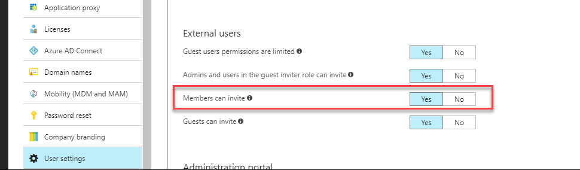
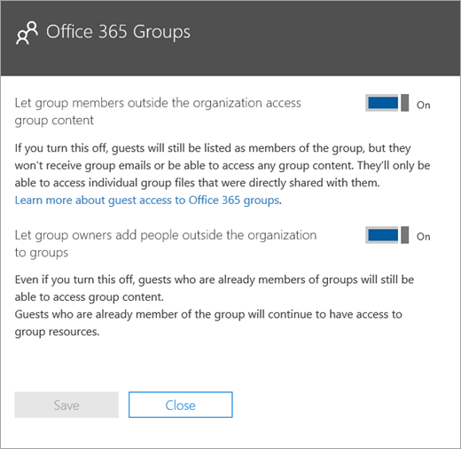
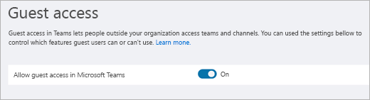
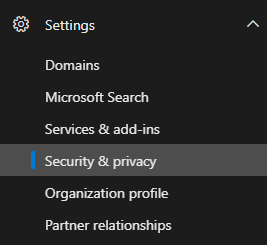
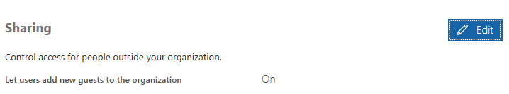
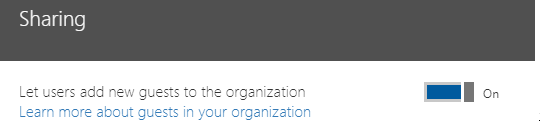
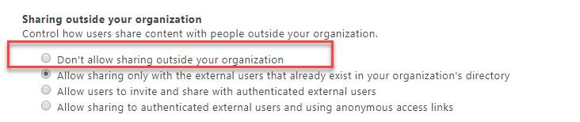
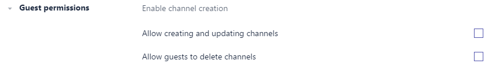

Teams guest access checklist
==========================================

Use this checklist to help you enable and configure the guest access feature in Microsoft Teams according to the preferences of your organization.

## Understand the limitations for guests

The guest experience has limitations by design. Make sure you understand the guest experience so you don't try to fix something that isn't a problem. For example, here's a list of some of the functionality that isn't available to a guest in Microsoft Teams:

- OneDrive for Business
- People search outside of Teams
- Calendar, Scheduled Meetings, or Meeting Details
- PSTN
- Organization chart
- Create or revise a team
- Browse for a team
- Upload files to a person-to-person chat
- Guests can still search and find users (outside their team) if they know the user's full email ID. To prevent this, IT admins can use patterns like [scoped directory search](https://docs.microsoft.com/en-us/MicrosoftTeams/teams-scoped-directory-search) that have the ability to restrict Guests into their own virtual GAL.

For more details, see [What the guest experience is like](guest-experience.md) and [Guest access in Office 365 groups](https://support.office.com/article/guest-access-in-office-365-groups-bfc7a840-868f-4fd6-a390-f347bf51aff6).

### Guest access vs. external access (federation)

[!INCLUDE [guest-vs-external-access](includes/guest-vs-external-access.md)]

## If your guests are seeing license errors

Guest access in Microsoft Teams uses Azure Active Directory (Azure AD) Business to Business (B2B) and its licensing model. If you’re seeing licensing errors, make sure to read the [B2B licensing guidance](https://docs.microsoft.com/azure/active-directory/b2b/licensing-guidance) to understand the licensing requirements your organization has so that your users are able to invite guests to your organization.

A few things to remember:

- For each paid Azure AD license that you assign to a user, your users can invite up to five guest users under the External User Allowance.
- Guests are users outside your organization. Your employees, onsite contractors, onsite agents, and so on can't be added as guests. The same applies to your affiliates.
- Guest licenses are counted against the inviting organization. Consider this when you calculate the number of licenses you need.
- Licenses are counted against your organization whether the invited guests come from another Office 365 tenant or are using their personal email addresses.

## □  Step 1: Configure settings in Azure AD business-to-business

1. Sign in to https://portal.azure.com.
2. Click **Azure Active Directory** in the left pane.
3. Under **Manage**, click **User settings**.
4. Under **External users**, click **Manage external collaboration settings**.
5. On the **External collaboration settings** page make sure **Members can invite** is set to **Yes**.

      

    To support guests, **Members can invite** must be set to **Yes**.

    > [!NOTE] 
    > If you set **Members can invite** to **No** and then enable guest access in Office 365 Groups and Microsoft Teams, admins can control guest invitations to your directory. After guests are in the directory, they can be added to teams by non-admin members who are team owners.

For more information, see [Authorize guest access in Microsoft Teams](Teams-dependencies.md).

## □ Step 2: Configure Office 365 Groups

1. In the Microsoft 365 admin center, go to **Settings** > **Services & Add-ins** > **Office 365 Groups**.
2. Make sure **Let group members outside the organization access group content** is set to **On**. If this setting is turned off, guests won't be able to access any group content.
3. Make sure **Let group owners add people outside the organization to groups** is set to **On**. If this setting is turned off, Team owners won't be able to add new guests. At a minimum, this setting must be On to support guest access.

     

For detailed instructions about configuring these settings, see [Manage guest access in Office 365 groups](https://support.office.com/en-us/article/manage-guest-access-in-office-365-groups-9de497a9-2f5c-43d6-ae18-767f2e6fe6e0?appver=MOE150) and [Authorize guest access in Microsoft Teams](Teams-dependencies.md#control-guest-access-in-office-365-groups).
 

## □ Step 3: Enable guest access at the tenant level

At a minimum, you must turn on guest access for Microsoft Teams under the **Microsoft Teams admin center**. 

1. In the Teams admin center, select **Org-Wide settings** > **Guest access**.
2. Set the **Allow guest access in Microsoft Teams** switch to **On**.

    

3. On this same page, configure any other guest settings that you require.
4. Click **Save**.

For detailed instructions, see [Turn on or off guest access to Microsoft Teams](set-up-guests.md).

## □  Step 4: Configure sharing in Office 365 

Make sure that users can add guests. Here's how:

1. In the Microsoft 365 admin center, go to **Settings** > **Security & privacy**.

     

2. In **Sharing**, select **Edit**.

     
 
3. Set **Let users add new guests to this organization** to **On**, and then click **Save**.

     
 
> [!NOTE]
> This setting is equivalent to the **Members can invite** setting in  **User settings** > **External users**  in Azure AD.  

## □ Step 5: Verify sharing setting in SharePoint

1. Sign in to the Microsoft 365 admin center.
2. Click **Admin center**, and then select **SharePoint**.
3. In the SharePoint admin center, select **Sharing**.
4. Make sure the option for **Don’t allow sharing outside your organization** is *not* selected.
 
     

## □ Step 6: Enable specific settings for channels 

In the Teams application, at the individual team level, configure guest permissions so that guests can create, update, and delete channels. In addition to admins,  team owners can configure this setting.

For more information, including how-to videos, see [Guest access in Microsoft Teams](guest-access.md).

## Troubleshooting

If you have problems with adding guests in Microsoft Teams, see the [Guest Access Troubleshooting Guide](https://techcommunity.microsoft.com/t5/Microsoft-Teams/Guest-Access-Troubleshooting-Guide/td-p/119797).

