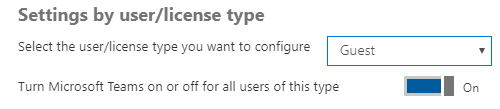
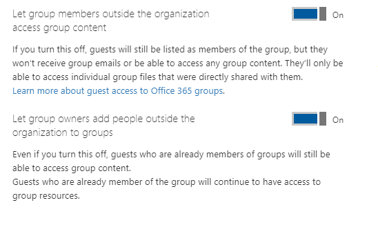
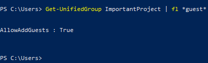

---
title: Teams Guest Checklist
author: romanma
ms.author: romanma
manager: serdars
ms.date: 2/15/18
ms.topic: article
ms.service: msteams
ms.reviewer: laal
description: Setup Microsoft Teams Guest Access step by step.
MS.collection: Strat_MT_TeamsAdmin
appliesto: 
- Microsoft Teams
---

# Teams Guest Checklist

To ensure Guest Access is enabled/configured according to the preferences of your company, review and configure the following:

## Teams Settings

□  Guest access enabled at tenant level:

► At minimum to support Guests, this must be "on".

	1. Login to O3565 admin center 

	2. Click on Settings and then Services & add-ins

	3. Select Microsoft Teams

	4. Click on drop down Settings by User/License type and select guest

	5. Ensure “Turn Microsoft Teams on or off for all users of this type” is enabled

□ Team/Channel specific Settings:

[Relevant documents to review](guest-access.md)

 ## Configuration Options Outside Teams admin center/client:

[Review Teams Dependencies](teams-dependencies.md)

## □ Office 365 Settings

Security and Privacy

□  Sharing

This setting is equal to Members can invite. Must be set to ON. 

Note - toggling this is same as toggling Yes/No for Members can Invite in Azure AD User Settings\External users section
    

Services and Add Ins
□ Office 365 Groups
1. Login to O3565 admin center 
2. Click on Settings and then Services & add-ins
3. Select Office365 groups
4. Ensure “Let group owners add people outside the organization to groups” is enabled
	If this setting is turned off it will block Team owners to add new guests but can add guests accounts that already exist in AAD.
	► At minimum to support Guests, this must be "on".

Let Group members outside the organization access group content. If Off, Teams Guests won't be able to access any Group Content. 

Let Group owners add people outside the organization to Groups. If this is Off, Owners of Teams will not be able to add new Guest users. If a guest user is already added to Azure AD by and administrator, then they would be able to add that user to the Team. 

□ Azure AD business-to-business (B2B)
	1. Login to https://portal.azure.com 
	2. Click on Azure Active directory on the left pane
	3. Click on Users and Groups under manage
	4. Click on User Settings
	5. Ensure that Members can Invite is set to YES

► At minimum to support Guests, "Members can invite" must be "Yes".

Explanation of all External user settings:

	• Guest users permission are limited: Get guest become scope administrator of the tenant or application level  - Delegated access to user or group to perform administrative functions to user or OU. Can you delegate  - Groups/Teams don’t use this

	• Admins and users in the guest inviter role can invite - PowerShell AAD or Portal try to add guest - that won't impact Teams

	• Members can invite - Teams Owners - No owners of Team or groups (developers working on this setting and user feedback to make errors clearer.) 

	• Guests can invite – not used in Groups/Teams at this time.

□ SharePoint Specific Settings
	1. Login to O365 admin center 
	2. Click on Admin Center and select SharePoint.
	3. From within the SharePoint admin center, select ‘Sharing’.
	4. Ensure that ‘Don’t allow sharing outside of your organization’ isn’t enabled:

□ Unified Groups
PowerShell cmdlet to set whether or not Guests are allowed:
AllowAddGuests: True (or False)
► At minimum to support Guests, this must be "True".

Get-UnifiedGroup <name> | fl AllowAddGuests

[To modify this setting in powershell - Set-UnifiedGroup](https://technet.microsoft.com/en-us/library/mt238274(v=exchg.160).aspx)

Accounts:
• Account must be licensed for Teams
• Accounts must be O365 school or work accounts
• [Support for MSA (Non O365 school or work accounts) on the roadmap](https://products.office.com/en-us/business/office-365-roadmap?filters=%26freeformsearch=guest)

Environment:
• Guests required to use MFA if the hosting tenant requires it.

Limitations:
[Review Guest Limitations](guest-experience.md)
[Review other Guest considerations](https://support.office.com/en-us/article/guest-access-in-office-365-groups-bfc7a840-868f-4fd6-a390-f347bf51aff6)
• No OneDrive for Business
• No people search outside of Team
• Meetings
	• No Calendar
	• No Scheduling Meetings
	• No Meeting Details
• No PSTN
• No org chart
• Teams
	• No editing teams
	• No create/browse teams
• No ability to upload files to p2p chat

## Now, go try to add a Guest!  [If you run into any difficulties, give this document a try..](https://techcommunity.microsoft.com/t5/Microsoft-Teams/Guest-Access-Troubleshooting-Guide/td-p/119797)

