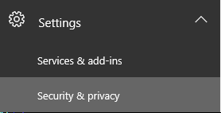
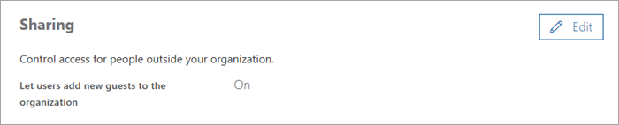

# Teams Guest Checklist

Use this checklist to help you enable and configure the Guest Access feature in Microsoft Teams according to the preferences of your organization.

## Configuration settings in the Teams admin center

□  Enable guest access at the tenant level.

At a minimum, you must turn on Microsoft Teams for all users of the license type **Guest**. Here's how:
*Comment: This procedure is a dupe of the procedure found in "Turn on or off guest access to Microsoft Teams", with the exception of a different screenshot for the user/license type in step 4. This screenshot is better; suggest adding it to the Turn on/Turn off topic. Then, link to that topic from here and delete the procedure here so as to have a 'single source of truth'.*
1. Sign in to the Office 365 Admin center with an account that has Global Administrator privileges.
2. Go to **Settings** > **Services & Add-ins**.
3. On the Services & Add-ins page, select **Microsoft Teams**.
4. Use the license drop-down list and select the **Guest** license type.
5. Set the toggle to **On** for **Turn Microsoft Teams on or off for all users** of this type, and then click **Save**.

□ Enable specific settings for channels. *Comment: What can you tell the user about these settings? How do they get to "Guest permissions"?*

For more information, including how-to videos, see [Guest access in Microsoft Teams](guest-access.md).

 ## Configuration settings outside the Teams admin center and client:

For more information about dependencies of Microsoft Teams, see [Authorize guest access in Microsoft Teams](teams-dependencies.md).

## □ Configure Office 365 settings

In the Office 365 admin center, go to **Settings** > **Services & Add-ins** > **Security & privacy**.

□  Sharing

Set **Let users add new guests to this organization** to **On**. 

 > [!NOTE]
> This setting is equivalent to the **Members can invite" setting in the User settings/External users section in Azure AD.  

□ Office 365 Groups

In the Office 365 admin center, go to **Settings** > **Services & Add-ins** > **Office 365 Groups**.

□ Make sure **Let group members outside the organization access group content" is set to **On**. If this setting is turned off, guests won't be able to access any group content.

□ Make sure **Let group owners add people outside the organization to groups** is set to **On**. If this setting is turned off, Team owners won't be able to add new guests. (However, if an admin had added a guest user to Azure AD, then the Team owner would be able to add that user to the Team.) At a minimum,  this setting must be "on" to support guest access.

For detailed instructions about configuring these settings, see the section "Office 365 Groups" in [Authorize guest access in Microsoft Teams](Teams-dependencies.md).
 

□ Configure settings in Azure AD business-to-business (B2B)
1. Sign in to https://portal.azure.com.
2. Click **Azure Active directory** in the left pane.
3. Click **Users and Groups** under **Manage**. *Is this required, or can you just click User settings?
4. Click **User settings**.
5. In **External users", make sure **Members can invite** is set to **Yes**.
	

► At minimum to support Guests, "Members can invite" must be "Yes".

*Comment: Suggest adding this level of detail about external user settings to the "Azure Active Directory" section of https://docs.microsoft.com/en-us/MicrosoftTeams/teams-dependencies and then linking from here. Also, some of descriptions below are unclear. *

Azure AD includes the following settings to configure external users:
- **Guest user permissions are limited**: Get guest become scope administrator of the tenant or application level. Delegated access to user or group to perform administrative functions to user or OU. Can you delegate  - Groups/Teams don’t use this.
- **Admins and users in the guest inviter role can invite**: PowerShell AAD or Portal try to add guest - that won't impact Teams.
- **Members can invite**: Teams Owners - No owners of Team or groups (developers working on this setting and user feedback to make errors clearer.) 
- **Guests can invite**: Not used in Groups/Teams at this time.

□ Configure settings in SharePoint
1. Sign in to the Office 365 admin center.
2. Click **Admin center**, and then select **SharePoint**.
3. In the SharePoint admin center, select **Sharing**.
4. Make sure the option for **Don’t allow sharing outside your organization** is not selected.

□ Configure AllowAddGuests parameter in PowerShell

Use the Get-UnifiedGroup cmdlet in PowerShell to see the current setting for the AllowAddGuests parameter, which indicates whether guests are allowed (True) or not allowed (False). 

*Comment: AllowAddGuests parameter is not shown on the cmdlet page at https://technet.microsoft.com/en-us/library/mt238274(v=exchg.160).aspx. Does the page need updating?*

Use the Set-UnifiedGroup cmdlet in PowerShell to change the value of this parameter.

► At a minimum to support Guests, this parameter must be set to "True".

Get-UnifiedGroup <name> | fl AllowAddGuests

For more details about the cmdlet, see [Set-UnifiedGroup](https://technet.microsoft.com/library/mt238274(v=exchg.160).aspx).

□ Verify account licenses and types

- **Account must be licensed for Teams**: *Comment: What does "account" refer to? *
- **Accounts must be Office 365 school or work accounts**: Currently, only users who have an email address corresponding to an Azure Active Directory or Office 365 work or school account can be added as a guest user. We know that support for other types of accounts is a much-requested capability, and it's on the [Office 365 Roadmap (Non O365 school or work accounts) on the roadmap](https://products.office.com/en-us/business/office-365-roadmap?filters=%26freeformsearch=guest).
 
□ Environment
*Comment: Why is this part of the checklist? What are you asking the user to do here? Is this for awareness?*

Guests are required to use multi-factor authentication (MFA) if the hosting tenant requires it.
For more details, see [Identity models and authentication in Microsoft Teams](identify-models-authentication.md).

□ Limitations for guests

A guest may be configured correctly in Teams; however, the guest experience does have limitations by design. Make sure you understand the guest experience so you don't try to fix something that isn't a problem.
For example, here's a list of some of the functionality that isn't available to a guest in Microsoft Teams:

- OneDrive for Business
- People search outside of Teams
- Calendar, Scheduled Meetings, or Meeting Details
- PSTN
- Organization chart
- Create or revise a team
- Browse for a team
- Upload files to a person-to-person chat

For more details, see [What the guest experience is like](guest-experience.md) and [Guest access in Office 365 groups](https://support.office.com/article/guest-access-in-office-365-groups-bfc7a840-868f-4fd6-a390-f347bf51aff6).

## Troubleshooting

If you have problems with adding guests in Microsoft Teams, see the [Guest Access Troubleshooting Guide](https://techcommunity.microsoft.com/t5/Microsoft-Teams/Guest-Access-Troubleshooting-Guide/td-p/119797).

