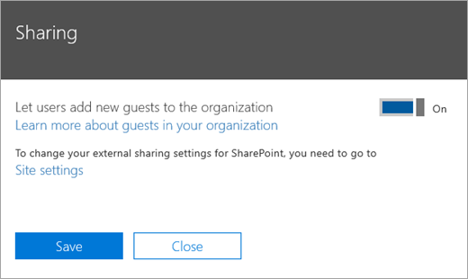

Microsoft Teams guest access checklist
==========================================

Use this checklist to help you turn on and configure guest access in Microsoft Teams.

> [!IMPORTANT]
> You may have to wait up to 24 hours for your changes to take effect. 

## Step 1: Turn on guest access at the Teams org-wide level

To turn on guest access, go to the **Microsoft Teams admin center**. 

1. In the Teams admin center, select **Org-Wide settings** > **Guest access**.
2. Set the **Allow guest access in Microsoft Teams** switch to **On**.

    

3. On this same page, turn on or turn off **Calling**, **Meeting**, and **Messaging** settings for guests.
4. Click **Save**.

> [!TIP]
> If you're using default settings in Azure Active Directory, SharePoint Online, and Office 365 Groups, you may be done configuring guest access. In this case, you can skip the rest of the steps. If you're not sure, or if you're using custom settings for AAD, SharePoint Online, or Office 365 Groups, continue with the rest of the steps in this checklist.

## Step 2: Configure Azure AD business-to-business settings

1. Sign in to the [Azure portal](https://portal.azure.com) as a tenant administrator.
2. Select **Azure Active Directory** > **Users** > **User settings**.
3. Under **External users**, select **Manage external collaboration settings**.
   > [!NOTE]
   > The **External collaboration settings** are also available from the **Organizational relationships** page. In Azure Active Directory, under **Manage**, go to **Organizational relationships** > **Settings**.
4. On the **External collaboration settings** page, choose the policies you want to enable.

  - **Guest users permissions are limited**: This policy determines permissions for guests in your directory. Select **Yes** to block guests from certain directory tasks, like enumerating users, groups, or other directory resources. Select **No** to give guests the same access to directory data as  regular users in your directory.
   - **Admins and users in the guest inviter role can invite**: To allow admins and users in the "Guest Inviter" role to invite guests, set this policy to **Yes**.
   - **Members can invite**: To allow non-admin members of your directory to invite guests, set this policy to **Yes**.
   
       > [!NOTE]
       > If you set **Members can invite** to **No** and then enable guest access in Office 365 Groups and Microsoft Teams, admins can control guest invitations to your directory. After guests are in the directory, they can be added to teams by non-admin members who are team owners. For more information, see [Authorize guest access in Microsoft Teams](Teams-dependencies.md).
       > [!IMPORTANT]
       > For guest access to work at all in Teams, you must set **Members can invite** to **Yes**.   
   - **Guests can invite**: To allow guests to invite other guests, set this policy to **Yes**.
       > [!IMPORTANT]
       > Currently, Teams doesn't support the guest inviter role, so even if you set **Guests can invite** to **Yes**, guests can't invite other guests in Teams.
   - **Enable email one-time passcode for guests (Preview)**: For more information about the one-time passcode feature, see [Email one-time passcode authentication (preview)](https://docs.microsoft.com/azure/active-directory/b2b/one-time-passcode).
   - **Collaboration restrictions**: For more information about allowing or blocking invitations to specific domains, see [Allow or block invitations to B2B users from specific organizations](https://docs.microsoft.com/azure/active-directory/b2b/allow-deny-list).
      > [!NOTE]
      > For collaboration restrictions, see [Enable B2B external collaboration and manage who can invite guests](https://docs.microsoft.com/azure/active-directory/b2b/delegate-invitations).
      
 
For more information about controlling who can invite guests, see [Delegate invitations for Azure Active Directory B2B collaboration](https://docs.microsoft.com/azure/active-directory/b2b/delegate-invitations).

## Step 3: Configure Office 365 Groups

1. In the Microsoft 365 admin center, go to **Settings** > **Services & add-ins**, and then select **Office 365 Groups**.

     
2. Make sure that the **Let group members outside the organization access group content** check box is selected. If this setting is not selected, guests won't be able to access any group content.
3. Make sure that the **Let group owners add people outside the organization to groups** check box is selected. If this setting is not selected, team owners won't be able to add new guests. At a minimum, this setting must be on to support guest access.

For detailed instructions about configuring these settings, see [Manage guest access in Office 365 Groups](https://support.office.com/article/manage-guest-access-in-office-365-groups-9de497a9-2f5c-43d6-ae18-767f2e6fe6e0?appver=MOE150) and [Control guest access in Office 365 Groups](Teams-dependencies.md#control-guest-access-in-office-365-groups).
 

## Step 4: Configure sharing in Office 365 

Make sure that users can add guests. Here's how:

1. In the Microsoft 365 admin center, go to **Settings** > **Security & privacy**.

     

2. In **Sharing**, select **Edit**.

     
 
3. Set **Let users add new guests to this organization** to **On**, and then click **Save**.

     
 
> [!NOTE]
> This setting is equivalent to the **Members can invite** setting in **User settings** > **External users** in Azure AD.  

## Step 5: Verify sharing setting in SharePoint

This one's a bit of a brain teaser. Guest access in Teams doesn't work if the **Don't allow sharing outside your organization** setting is selected in the SharePoint admin center.

1. Sign in to the Microsoft 365 admin center.
2. Under **Admin centers**, select  **SharePoint**.
3. In the SharePoint admin center,  under **Sites**, select **Active sites**.

    

3. Select the site, and then click **Sharing**.

    

4. Make sure the option is set to **Anyone** or **New and existing guests**.
 
     

## Step 6: Set up guest user permissions

In the Teams application, at the individual team level, configure guest permissions that control whether guests can create, update, or delete channels. Teams admins as well as team owners can configure these settings.

To learn more about guest access, see [Guest access in Teams](guest-access.md) and [Turn on or turn off guest access to Microsoft Teams](set-up-guests.md).

## Troubleshooting

If you have problems setting up guest access or adding guests in Teams, use these resources to help you:

[Troubleshoot problems with guest access in Microsoft Teams](troubleshoot-guest-access.md)

[Teams troubleshooting](https://docs.microsoft.com/MicrosoftTeams/troubleshoot/)

