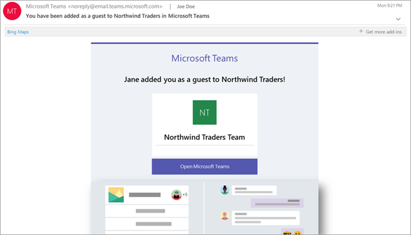
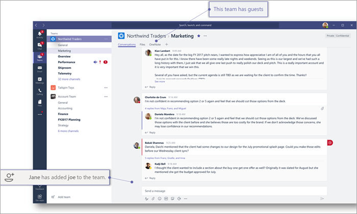

What the guest experience is like
=================================

When a guest is invited to join a team, they receive a welcome email message that includes some information about the team and what to expect now that they're a member. The guest must redeem the invitation in the email message before they can access the team and its channels.
    

    
All team members see a message in the channel thread announcing that the team owner has added a guest and providing the guest's name. Everyone on the team can identify easily who is a guest. As shown in the following screenshot of a sample team, a banner indicates "This team has guests" and a "GUEST" label appears next to each guest's name.
    

The following table compares the Microsoft Teams functionality available for an organization's team members to the functionality available for a guest user on the team.

|**Capability in Teams**|**Teams user in the organization**|**Guest user**|
|:-----|:-----|:-----|
|Create a channel     *Team owners control this setting.*    |||
|Participate in a private chat    |||
|Participate in a channel conversation    |||
|Post, delete, and edit messages    |||
|Share a channel file    |||
|Share a chat file    |||
|Add apps (tabs, bots, or connectors)    |||
|Create meetings or access schedules    |||
|Access OneDrive for Business storage    |||
|Create tenant-wide and teams/channels guest access policies    |||
|Invite a user outside the Office 365 tenant's domain    *Team owners control this setting.*      |||
|Create a team    |||
|Discover and join a public team    |||
|View organization chart    |||
   
The following table shows the calling and meeting features available to guests.

| Calling feature | Guest | E1 and E3 user | E5 and EV user |
| --------------- | ----- | -------------- | -------------- |
| VOIP calling | Yes | Yes | Yes |
| Group calling | Yes | Yes | Yes |
| Core call controls supported (hold, mute, video on/off, screen sharing) | Yes | Yes | Yes |
| Transfer target | Yes | Yes | Yes |
| Can transfer a call | Yes | Yes | Yes |
| Can consultative transfer | Yes | Yes | Yes |
| Can add other users to a call via VOIP | Yes | Yes | Yes |
| Can add users by phone number to a call | No | No | Yes |
| Forward target | No | Yes | Yes |
| Call group target | No | Yes | Yes |
| Unanswered target | No | Yes | Yes |
| Can be the target of a federated call | No | Yes | Yes |
| Can make a federated call | No | Yes | Yes |
| Can immediately forward their calls | No | No | Yes |
| Can simultaneously ring their calls | No | No | Yes |
| Can route their unanswered calls | No | No | Yes |
| Missed calls can go to voicemail | No | No1 |Yes |
| Have a phone number that can receive calls | No | No | Yes |
| Can dial phone numbers | No | No | Yes |
| Can access call settings | No | No | Yes |
| Can change voicemail greeting | No | No1 | Yes |
| Can change ringtones | No | No  | Yes |
| Supports TTY | No | No | Yes |
| Can have delegates | No | No | Yes |
|  Can be a delegate | No | No | Yes |

1 This feature will be available soon.

> [!NOTE]
> Office 365 admins control the features available to guests. 
 
## Guest access vs. external access (federation)

[!INCLUDE [guest-vs-external-access](includes/guest-vs-external-access.md)]
 
## Frequently asked questions

Q. How do I leave an organization that I've been invited to? 
A. If you have been invited to an organization, that you don't want to be a guest of, you can self-service leave the organization. For more information, go to [Leave an organization as a guest user](https://docs.microsoft.com/en-us/azure/active-directory/b2b/leave-the-organization). Alternatively, you can also ask the admin of the organization to remove you from their tenant. Note that in either case you'll need to be re-invited to the tenant if you want to access the organization in future.

Q. Do guests have the same capabilities as team members? 
A. No. For more information about what a guest can and cannot do, go to [Guest capabilities in Teams](https://support.office.com/article/guest-capabilities-in-teams-d03fdf5b-1a6e-48e4-8e07-b13e1350ec7b).

Q. How many guests can I invite? 
A. You can add up to 5 guests per licensed user.

Q. Do guests have access to OneDrive for Business? 
A. No.

Q. Do guests have access to SharePoint files? 
A. Yes.

Q. Can guests search within files? 
A. No.

Q. Can guests attach files? 
A. Yes, a guest can attach files in these two ways:
•	Select Files in the left pane, and then browse to the file location.
•	Upload from their computer.

Q. Can a guest download a file in a private chat? 
A. Yes, they can receive a file from a member in a private chat, and then download it to their desktop.
