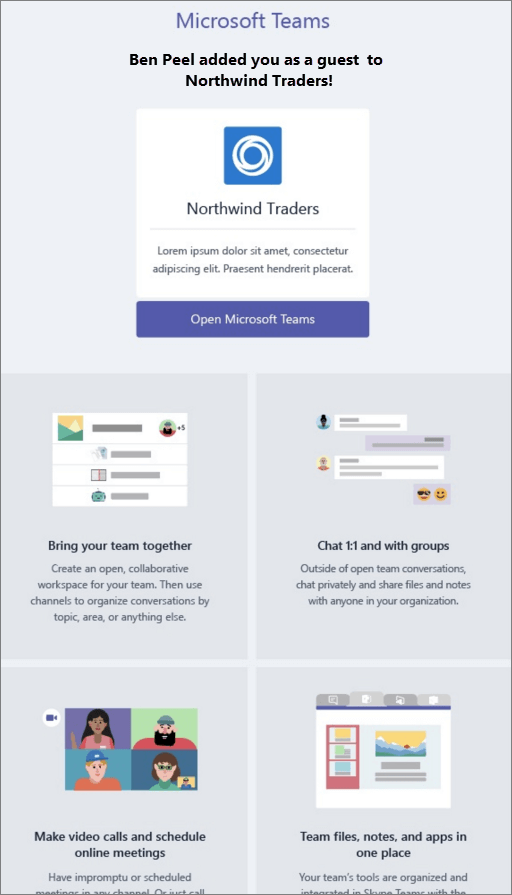
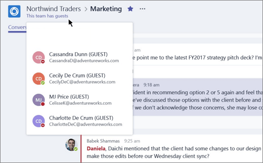

What the guest experience is like
=================================

When a guest is invited to join a team, they receive a welcome email message that includes some information about the team and what to expect now that they're a member. The guest must redeem the invitation in the email message before they can access the team and its channels.
  
    
    

  
    
    

  
    
    
All team members see a message in the channel thread announcing that the team owner has added a guest and providing the guest's name. Everyone on the team can identify easily who is a guest. As shown in the following screenshot of a sample team, a banner indicates "This team has guests" and a "GUEST" label appears next to each guest's name.
  
    
    

  
    
    

  
    
    
The following table compares the Microsoft Teams functionality available for an organization's team members to the functionality available for a guest user on the team.
  
    
    

|**Capability in Teams**|**Teams user in the organization**|**Guest user**|
|:-----|:-----|:-----|
|Create a channel     *Team owners control this setting.*    |||
|Participate in a private chat    |||
|Participate in a channel conversation    |||
|Post, delete, and edit messages    |||
|Share a channel file    |||
|Share a chat file    |||
|Add apps (tabs, bots, or connectors)    |||
|Create tenant-wide and teams/channels guest access policies    |||
|Invite a user outside the Office 365 tenant's domain    |||
|Create a team    |||
|Discover and join a public team    |||
|View organization chart    |||
   

    
> [!NOTE]
> Office 365 admins control the features available to guests. 
  