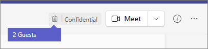

# Guest experience in Teams

When a guest is invited to join a team, they receive a welcome email message. This message includes some information about the team and what to expect now that they're a member. The guest must accept the invitation by selecting **Open Microsoft Teams** in the email message before they can access the team and its channels.

> [!NOTE]
> After a guest is added to a team, it may take a few hours before they have access.
    

    
All team members see a message in the channel thread announcing that the team owner has added a guest and providing the guest's name. Everyone on the team can identify easily who is a guest. A tag in the upper-right corner of the channel thread indicates the number of guests on the team and a **(Guest)** label appears next to each guest's name.

Check out these videos about the guest experience in Teams:
- [Join a Teams meeting as a guest](https://support.microsoft.com/office/join-a-teams-meeting-078e9868-f1aa-4414-8bb9-ee88e9236ee4)
- [Work with external guests in a Teams meeting](https://support.microsoft.com/office/work-with-external-guests-180ed260-d3ef-4247-9f24-1984fc76d5f0)

## Comparison of team member and guest capabilities

The following table compares the Teams functionality available for an organization's team members and its guests. Teams admins control the features available to guests.

| Capability in Teams | Teams user in the organization | Guest |
|:-----|:-----|:-----|
|Create a channel     *Team owners control this setting.*    |&#x2713;|&#x2713;|
|Participate in a private chat    |&#x2713;|&#x2713;|
|Participate in a channel conversation    |&#x2713;|&#x2713;|
|Post, delete, and edit messages    |&#x2713;|&#x2713;|
|Share a channel file    |&#x2713;|&#x2713;|
|Access SharePoint files  |&#x2713;|&#x2713;|
|Attach files  |&#x2713;|Channel posts only|
|Download private chat files  |&#x2713;|&#x2713;|
|Search within files  |&#x2713;||
|Share a chat file    |&#x2713;||
|Add apps (tabs, bots, or connectors)    |&#x2713;||
|Create meetings or access schedules    |&#x2713;||
|Access OneDrive for Business storage    |&#x2713;||
|Create tenant-wide and teams/channels guest access policies    |&#x2713;||
|Invite a user outside the Microsoft 365 or Office 365 organization's domain    *Team owners control this setting.*      |&#x2713;||
|Create a team    |&#x2713;||
|Discover and join a public team    |&#x2713;||
|View organization chart    |&#x2713;||
|Use inline translation    |&#x2713;||
|Become team owner    |&#x2713;||

The following table shows the calling and meeting features available to guests, compared to other types of users.

| Calling feature | Guest | E1 and E3 user | E5 and Enterprise Voice user |
| --------------- | ----- | -------------- | -------------- |
| VOIP calling | Yes | Yes | Yes |
| Group calling | Yes | Yes | Yes |
| Core call controls supported (hold, mute, video on/off, screen sharing) | Yes | Yes | Yes |
| Transfer target | Yes | Yes | Yes |
| Can transfer a call | Yes | Yes | Yes |
| Can consultative transfer | Yes | Yes | Yes |
| Can add other users to a call via VOIP | Yes | Yes | Yes |
| Can add users by phone number to a call | No | No | Yes |
| Forward target | No | Yes | Yes |
| Call group target | No | Yes | Yes |
| Unanswered target | No | Yes | Yes |
| Can be the target of a federated call | No | Yes | Yes |
| Can make a federated call | No | Yes | Yes |
| Can immediately forward their calls | No | No | Yes |
| Can simultaneously ring their calls | No | No | Yes |
| Can route their unanswered calls | No | No | Yes |
| Missed calls can go to voicemail | No | No1 |Yes |
| Have a phone number that can receive calls | No | No | Yes |
| Can dial phone numbers | No | No | Yes |
| Can access call settings | No | No | Yes |
| Can change voicemail greeting | No | No1 | Yes |
| Can change ringtones | No | No  | Yes |
| Supports TTY | No | No | Yes |
| Can have delegates | No | No | Yes |
|  Can be a delegate | No | No | Yes |

1 This feature will be available soon.

> [!NOTE]
> The **Guest user access restrictions** policy in Azure Active Directory (Azure AD) determines permissions for guests in your directory. There are three policy options.
>  - The **Guest users have the same access as members (most inclusive)** setting means guests have the same access to directory data as regular users in your directory.
>  - The **Guest users have limited access to properties and membership of directory objects** settings means that guests don't have permissions for certain directory tasks, such as enumerating users, groups, or other directory resources using Microsoft Graph.
>  - The **Guest user access is restricted to properties and memberships of their own directory objects (most restrictive)** setting means guests can only access their own directory objects.
>
>To learn more, see [What are the default user permissions in Azure Active Directory?](/azure/active-directory/fundamentals/users-default-permissions)

## Related topics

[Leave an organization as a guest](/azure/active-directory/b2b/leave-the-organization)

[Use guest access and external access to collaborate with people outside your organization](communicate-with-users-from-other-organizations.md)
