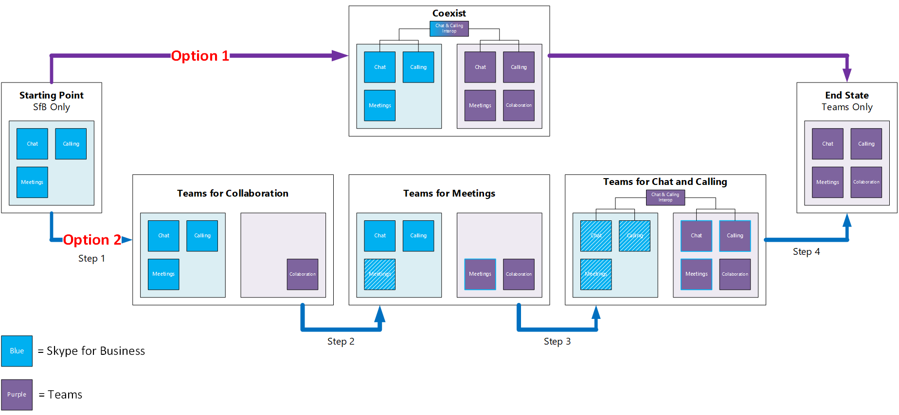
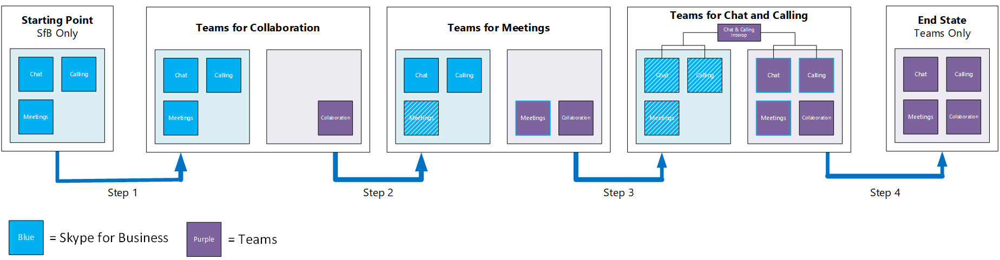

Enable Microsoft Teams side-by-side with Skype for Business 
=============================================================

For organizations with existing deployments of Skype for Business Online, the recent introduction of Microsoft Teams presents an opportunity to evaluate the potential of Teams as a sole, communications and collaboration solution, and a challenge to tip the scale between the two solutions and how they can coexist in your environment.

If Teams can meet your business requirements today, you can start adopting Teams to become your single communications and collaboration solution for your organization.

Teams is enabled by default, on all eligible tenants. Therefore, you need to decide on how to manage Teams side-by-side with Skype for Business, and continue to meet user expectations.

In general, there are two major side-by-side customer journeys. They are:

-   **Option 1:** Unmanaged side-by-side customer journey.

    IT does not actively control the side-by-side experience, and users are empowered to make the choice of preferred app.

-   **Option 2:** Managed side-by-side customer journey.

    IT controls the side-by-side experience, taking users through a journey of gradually introducing Teams to first introduce a new chat-based collaboration workspace with private chat, then meeting experiences, and finally the calling experiences in Teams.

Side-by-side benefits and considerations
----------------------------------------

Each journey has benefits and considerations to evaluate when determining the right path forward based on your organization's profile. The table below provides the comparisons between managed and unmanaged side-by-side customer journeys.

<table>
<thead>
<tr class="header">
<th align="left">Migration Paths</th>
<th align="left">Unmanaged Side-by-Side</th>
<th align="left">Managed Side-by-Side</th>
</tr>
</thead>
<tbody>
<tr class="odd">
<td align="left"><strong>Organization profile</strong></td>
<td align="left"><ul>
<li>Typically, smaller organizations with no dedicated IT resources</li>
<li>IT allows user discretion in selecting right tools for their work</li>
<li>Primary Skype for Business usage is IM/P and meetings</li>
</ul></td>
<td align="left"><ul><li>Typically, mid-size to larger organizations</li>
<li>IT wants to control roll out of new tools more rigorously</li>
<li>Deeper adoption of Skype for Business today</li>
<li>Increased complexity in network and infrastructure</li>
<li>Multiple locations

<li>Preference for single app with unique UC capabilities</li></ul></td>
</tr>
<tr class="even">
<td align="left"><strong>Benefits</strong></td>
<td align="left"><ul>
<li>Leverage capabilities in Teams that are not available in Skype for Business</li>
<li>Enhanced modern workplace within Office 365</li>
<li>Increased user flexibility</li>
<li>Enable all capabilities at once</li>
</ul></td>
<td align="left"><ul><li>Leverage capabilities in Teams that are not available in Skype for Business</li>
<li>Enhanced modern workplace within Office 365</li>
<li>Minimize user productivity impact</li>
<li>Reduce capability overlap</li>
<li>Streamline tool choice for UC scenarios</li>
<li>Empower IT and business to enable capabilities as appropriate in organization</li>
<li>Control the pace of change for users</li></ul></td>
</tr>
<tr class="odd">
<td align="left"><strong>Considerations</strong></td>
<td align="left"><ul>
<li>Multiple apps with similar, overlapping capabilities</li>
<li>Increased potential for user confusion which can lead to increased support calls, shadow IT, impacted productivity</li>
<li>Network planning and monitoring must take usage of two services into consideration</li>
<li>Increased and immediate change management efforts required: awareness, training, and support</li>
<li>Users may experience interoperability limitations between apps</li>
</ul></td>
<td align="left"><ul><li>IT has granular control, from licensing to user experiences, requiring additional cycles of planning and implementation</li>
<li>User education and action required to disable select capabilities in Teams</li>
<li>Change management efforts required to disable select capabilities in Teams</li>
<li>Network planning and monitoring must take usage of two services into consideration</li>
<li>Users may experience interoperability limitations between apps</li></ul></td>
</tr>
</tbody>
</table>

Unmanaged side-by-side customer journey
---------------------------------------

In an unmanaged side-by-side customer journey, Teams is introduced as a collaboration solution (chat-based workspace, channels, apps, integration with other Office 365 workloads, etc.) that involves client software and web client on desktop computers (PC or Mac) and mobile devices.

By default, Teams also presents overlapping capabilities with Skype for Business, these include private chat and calling, and scheduled meetings. This means Teams ends up providing complete communications and collaboration for the organization, while at the same time Skype for Business provides similar capabilities.

Teams supports interoperability with Skype for Business Online users, and users will be given an opportunity to choose their preferred chat and calling app when they launch Teams. If one user picks Teams as the preferred app, and another user hasn’t installed Teams or picked Skype for Business as the preferred chat and calling app, they can continue to chat and call each other through the interop capabilities that are part of Teams.

Microsoft is continuously improving the interop experiences. In the beginning, there may be some cases whereby the interop experiences are not meeting user expectations. Since Skype for Business is still available to users, they can switch to Skype for Business for the capabilities that currently cannot be served by Teams.

Scheduled meetings in Teams is another overlapping capability that lets users schedule Teams meetings, or Skype for Business meetings. Each has its own advantages, and over time, when Teams meeting experience meets business requirements or surpasses the functionalities of Skype for Business meetings, we expect users to naturally switch to Teams meetings.

In this unmanaged side-by-side customer journey, prepare your helpdesk team to handle support calls from users when facing issues with interop capabilities. Or advise users when to choose Teams meetings over Skype for Business meetings, and vice versa.

This side-by-side customer journey may be applicable to your organization, whereby the users are more receptive to the nature of the unmanaged side-by-side experience, and the organization openly allows the users to pick the best communications and collaboration tools that suit their requirements.

Managed side-by-side customer journey
-------------------------------------

A managed side-by-side customer journey starts with organization wanting more control over how Teams is introduced.

-   The **first step** of this journey is a limited pilot of Teams scoped to modern collaboration requirements (chat-based workspace, channels, apps, integration with other Office 365 workloads, etc.). Ad-hoc channel meetings and private chat in Teams is also enabled to provide a chance for pilot users to evaluate the Teams meetings experience and private chat experiences. Scheduled meetings and private calling capabilities in Teams are disabled at this stage. To get started with a pilot, go to [Pilot Teams with Skype for Business](pilot-essentials.md).
    
-   The **second step** of this journey is extending the rollout of Teams for modern collaboration with private chat throughout the organization. Scheduled meetings, and private calling continue to be disabled in Teams to reduce the overlap  with with Skype for Business capabilities.

    At this stage, you may need to consider whether preferred chat application should be set to Teams or Skype for Business for the entire organization.

    - If set to Teams, prepare your users to handle early interoperability challenges when communicating with other parties within and across the organization.
    
    - If set to Skype for Business, private chats within Teams will remain in Teams, and end users can immediately take advantage of the cross-platform persistent nature of chat capabilities within Teams, and they will continue to use Skype for Business for private chats among Skype for Business users, within the organization and across the organization.

<table>
<thead>
<tr class="header">
<td align="center">

Note
</td>
<td align="left"> Currently the preferred chat application setting is available only at the client level. User training and adoption campaign will be required to drive the intended organization-wide configuration.</td>
</tr>
</thead>
<tbody>
</tbody>
</table>

The **third step** of the managed side-by-side customer journey starts when the organization decides that Teams meeting experience and capabilities meet their business requirements. By enabling private and channel meetings in Teams, users are presented with options to schedule both Teams meetings and Skype for Business meetings. Therefore, it is expected that over time users will naturally switch to Teams meetings given the continued innovations in Teams. To be successful in steering usage from Skype for Business to Teams, implement a robust change management program inclusive of training, support and communications that explains the value-add that Teams offers to the user, with clear guidance on how to get started with Teams. Leverage our [User Readiness](http://aka.ms/UserReadiness) resources to help design your awareness campaign.

-   The **fourth step** of the managed side-by-side customer journey begins with the enablement of private chat and calling in Teams. Teams interoperability capabilities will feature heavily in this step to ensure a seamless side-by-side experience. Ideally, to enforce the use of Teams for private calling, Teams is set as the default calling app. 

Over time, potentially the whole organization can rely solely on Teams to meet communications and collaboration requirements and take the **fifth step**. To see when new features are coming in Teams, see the [Office 365 Roadmap](http://aka.ms/TeamsRoadmap). 

Managing side-by-side experience
--------------------------------

By default, for organizations with eligible Office 365 subscriptions, Microsoft Teams is enabled. If your organization fits the profile for unmanaged side-by-side customer journey, we highly recommend you keep it as-is to foster organic adoption of Microsoft Teams.

Teams is accessible via modern Web browser desktop clients which require no IT administrative privilege (for installation, currently applicable to PC only) and mobile clients.

All capabilities in Teams, from private chat and calling, ad-hoc and scheduled meetings, and apps are enabled by default, allowing users to experiment and use the capabilities that suit their needs. A first-run experience in Teams guides users to pick their preferred chat and calling application (Microsoft Teams or Skype for Business).

Should your organization require a more controlled release of new tools such as Teams, the following options can be considered for your managed side-by-side customer journey, they are:

-   Pilot and rollout of Teams for collaboration. See [Pilot Teams with Skype for Business](pilot-essentials.md).

-   Rollout of Teams for meetings

-   Rollout of Teams for calling

### Teams pilot and rollout for collaboration

At its core, Microsoft Teams was built around persistent chat and integration with Office 365 by enhancing Office 365 Groups.

Since by default users in your organization with an eligible Office 365 subscription license are enabled for Teams, a limited Teams pilot will involve disabling the Teams license for all users who are outside of the pilot group.

To focus the Teams release as a collaboration and private chat solution, and to reduce user confusion due to overlapping capabilities with Skype for Business, the following settings can be configured at the Tenant level from their default values.

<table>
<thead>
<tr class="header">
<th align="left">Section</th>
<th align="left">Setting</th>
<th align="left">Description</th>
</tr>
</thead>
<tbody>
<tr class="odd">
<td align="left"><strong> Calls and meetings</strong></td>
<td align="left">
Allow scheduling for private meetings: <strong>Off</strong>

Allow scheduling for channel meetings: <strong>Off</strong>

Allow private calling: <strong>Off</strong>
</td>
<td align="left">
Disabling this setting prevents users from scheduling private meetings

Disabling this setting prevents users from scheduling channel meetings

Disabling this setting prevents users from making private calls (audio and video)
</td>
</tr>
</tbody>
</table>

<table>
<thead>
<tr class="header">
<td align="center">

Note
</td>
<td align="left"> You must disable Private Calling to both Business and Enterprise users, and Guest users (if Guest Access is applicable to your organization).</td>
</tr>
</thead>
<tbody>
</tbody>
</table>

With this configuration, users can be introduced to how meetings work in Teams by advocating the use of ad-hoc channel meetup, enabling the use of voice, video, and screen sharing as part of the modern collaboration experience. End users can also benefit from Teams persistent, cross-platform, private chat capabilities.

A successful Teams pilot for collaboration and private chat can be followed up with broad rollout throughout the organization by enabling Teams license for all users.

<table>
<thead>
<tr class="header">
<td align="center">

Note
</td>
<td align="left"> During the pilot, we recommend you allow users to pick their preferred chat application (Teams or Skype for Business), and then assess the most suitable application to be advocated across the organization.</td>
</tr>
</thead>
<tbody>
</tbody>
</table>

### Rollout of Teams for meetings

As users are getting accustomed to collaborating using Microsoft Teams, scheduled meetings can be considered as the next capability to enable in the organization.

<table>
<thead>
<tr class="header">
<td align="center">

Note
</td>
<td align="left"> The organizers of scheduled meetings must have their mailboxes in Exchange Online multi-tenant (or Exchange Online Dedicated vNext).</td>
</tr>
</thead>
<tbody>
</tbody>
</table>

The following settings can be configured at the tenant level to enable scheduled meetings in Teams, and the settings are applicable to Business and Enterprise users only.

<table>
<thead>
<tr class="header">
<th align="left">Section</th>
<th align="left">Setting</th>
<th align="left">Description</th>
</tr>
</thead>
<tbody>
<tr class="odd">
<td align="left"><strong>Calls and meetings</strong></td>
<td align="left">
Allow scheduling for private meetings: <strong>On</strong>

Allow scheduling for channel meetings: <strong>On</strong>
</td>
<td align="left">
Enabling this setting allows users to schedule private meetings

Enabling this setting allows users to schedule channel meetings
</td>
</tr>
</tbody>
</table>

Scheduled meetings can be organized via the Teams desktop client, a browser, or via Microsoft Outlook using the meeting add-in for Microsoft Teams. Once scheduled meetings in Teams is enabled, we recommend you start educating users to create new Teams meetings or update existing Skype for Business meetings to Teams meetings.

### Rollout of Teams for calling

Private calling is the Teams capability that will be continuously developed, and over time provide a compelling replacement to Skype for Business. When your organization considers that Teams private calling capabilities meet key business requirements, the following settings can be configured at the tenant level to enable private calling in Teams. 

<table>
<thead>
<tr class="header">
<th align="left">Section</th>
<th align="left">Setting</th>
<th align="left">Description</th>
</tr>
</thead>
<tbody>
<tr class="odd">
<td align="left"><strong> Calls and meetings</strong></td>
<td align="left">
Allow private calling: <strong>On</strong>
</td>
<td align="left">
Enabling this setting allows users to place private calls (audio and video)
</td>
</tr>
</tbody>
</table>

<table>
<thead>
<tr class="header">
<td align="center">

Note
</td>
<td align="left"> Allow users to chat privately: Enabling this setting allows users to chat with other users privately.</td>
</tr>
</thead>
<tbody>
</tbody>
</table>

At this stage, all users must be instructed to choose Teams as the preferred calling app.

With the enablement of private calling, Teams will deliver all capabilities currently provided by Skype for Business, and users can start using Teams to fulfill their communications and collaboration requirements.

<table>
<thead>
<tr class="header">
<td align="left">

</td>
<td align="left">

<strong>Next Action:</strong> Once Teams is up and running side-by-side with Skype for Business, [Drive Value through user adoption of Teams](continue-journey.md), while continuing your journey from Skype for Business to Teams.</td>
</tr>
</thead>
<tbody>
</tbody>
</table>