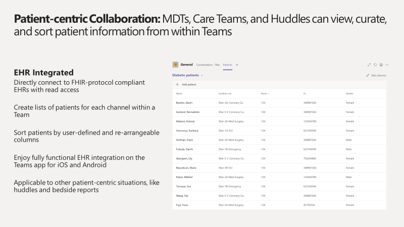
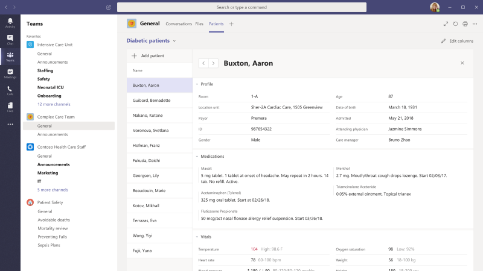
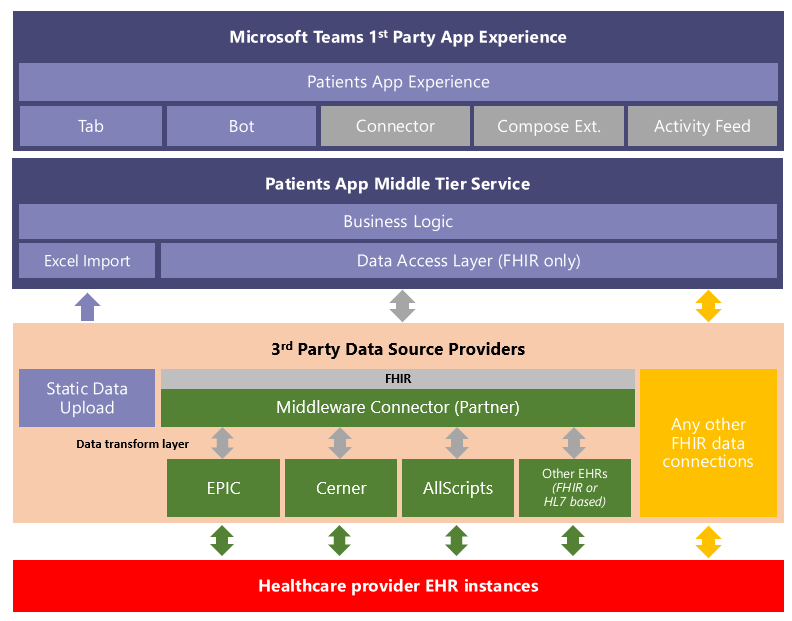

# Microsoft Teams Patient App EMR integration

Microsoft Teams is developing features specific to the healthcare market. One of the scenarios we’re tackling as part of vertical focused effort is enabling care-coordination and specifically IDT (inter-disciplinary) or MDT (multi-disciplinary) teams to coordinate care for a set of high-risk patients. Microsoft Teams enables these physicians, clinicians, nurses and other staff to collaborate by: 
-	Being part of a single Team to work and collaborate on Office documents as well as have persistent conversations about different patients needing attention. 
-	Using channels with tabs as a mean to structure their work with additional help from Tabs to which they can pin information sources
-	Use channel meetings/meetups with the power of Teams Audio/Video/Screensharing/Recording and transcription to manage their daily MDT meetings
-	Using the Microsoft Teams Patient App to curate and run through a list of high-risk patients that must be monitored. 

Below are some screenshots of the Patient App (for now this is a Tab app only and gets installed in the general channel of the team. In the future we will have other extensibility areas such as a bot, messaging extension, connectors and 

The goal of this document is to describe the as-is interface of the Microsoft Teams Patient App (which is a 1st party Microsoft Teams app. Click [here](https://docs.microsoft.com/en-us/microsoftteams/platform/concepts/apps/apps-overview) to learn more about Microsoft Teams Apps). The audience of this document is an interested EMR Integration/Interop Partner that will aim to partner with Microsoft Teams Healthcare Engineering and an interested Microsoft customer (a healthcare provider organization) to serve up the patient record data required for the functioning of the Patient app by integrating with the provider organization’s EMR system(s), transforming the data into the FHIR standard and integrating with the Patient app interface, thereby playing the role of a middleware interop partner. 

This document will aim to educate the Middleware Partner on our requirements to integrate with the Patient App: 

- Describe the functional and technical requirements of the integration interface
- Expectations around User Authentication
- Expectations around Performance and Reliability
- Expectations around FHIR Resources to be supported for the Patient App
- Describe the process for integration and the expected engagement model
- Describe the future requirements or asks for the next iteration of the Patient App.

## DSTU2 interface specifications

The FHIR Server will need to support POST Transactions using bundles for all resources listed below:

1. Patient
2. Observation
3. Condition
4. Encounter
5. Allergy Intolerance
6. Coverage
7. Medication Order
8. Location

Queries from the Patient App for more than 1 resource shall post a bundle (BATCH) of requests to the FHIR server's URL. The server shall process each request and return a bundle of the resources matched by each request. See https://www.hl7.org/fhir/DSTU2/http.html#transaction for references and examples.

All the following FHIR resources should be accessible by direct resource reference. (e.g. /Patient/id)

### Conformance Minimum required field set

See https://www.hl7.org/fhir/dstu2/conformance.html

1. Rest
   1. Mode
   2. Interaction
   3. Resource: Type
   4. Security: [Extension for OAuth URIs](http://hl7.org/fhir/extension-oauth-uris.html)
2. FhirVersion - our code requires this to understand which version we should pivot to.

###	Patient

See https://www.hl7.org/fhir/DSTU2/Patient.html 

Minimum required fields, subset of the [Argonaut patient profile](http://www.fhir.org/guides/argonaut/r2/StructureDefinition-argo-patient.html) fields:

1. Name.Family
2. Name.Given
3. Gender
4. BirthDate
5. MRN (Identifier)

In addition to the Argonaut fields, for a great user experience we can also read the following field(s):

1. Name.Use
2. Name.Prefix
3. CareProvider. This reference on the Patient resource should include the display field [**Patient_with_careProvider.saz**](https://github.com/MicrosoftDocs/OfficeDocs-SkypeForBusiness/blob/live/Teams/downloads/DSTUsaz/Patient_with_careProvider.saz?raw=true)

Resource search using POST method at /Patient/_search and the following parameters:

1. id
2. family:contains= (searches for all patients whose Family name contains the value)
3. given:contains= \<substring>
4. name:contains = \<substring>
5. birthdate= (exact match)
6. _count (max no. of results that should be returned) Note: The response should contain Total count of records returned as a result of the search, and _count will be used by the PatientsApp to limit the number of records returned. 
7. identifier=\<mrn>

Note: The goal is to be able to search/filter for a patient by ID (the Resource ID which every Resource in FHIR has), MRN (the actual identifier for the Patient which clinical staff would know, we understand this is MRN based on the type of identifier inside the identifier resource in FHIR), name and birthdate. See examples of a sample call using parameters above: [**PatientResource.saz**](https://github.com/MicrosoftDocs/OfficeDocs-SkypeForBusiness/blob/live/Teams/downloads/DSTUsaz/PatientResource.saz?raw=true)

### Observation

See https://www.hl7.org/fhir/DSTU2/Observation.html

Minimum required fields (subset of the Argonaut vital signs profile)

 1. Effective (date time or period)
 2. Code.Coding.Code
 3. ValueQuantity.Value

In addition to the Argonaut fields, for a great user experience we can also read the following field(s):

 1.	Code.Coding.Display
 2. ValueQuantity.Unit

If using component observations, same logic applies for each component observation.

Resource search using GET method and the following parameters:

1. patient=\<patient id\>
2. sort:desc=\<field ex. date\>
3. Note: The Goal is to be able to retrieve the latest Vital signs for a patient: [**VitalSigns.DSTU.saz**](https://github.com/MicrosoftDocs/OfficeDocs-SkypeForBusiness/blob/live/Teams/downloads/DSTUsaz/VitalSigns.DSTU.saz?raw=true)

### Condition

See https://www.hl7.org/fhir/DSTU2/Condition.html 

Minimum required fields, subset of the [Argonaut condition profile](http://www.fhir.org/guides/argonaut/r2/StructureDefinition-argo-condition.html):

1. Code.Coding[0].Display

In addition to the Argonaut fields, for a great user experience we can also read the following field(s):

1. Date Recorded
2. Severity

Resource search using GET method and the following parameters: 

1. patient=\<patient id>
2. _count=\<max results>
3. Note: Here is an example for the call: [**Condition.saz**](https://github.com/MicrosoftDocs/OfficeDocs-SkypeForBusiness/blob/live/Teams/downloads/DSTUsaz/Condition.saz?raw=true)

### Encounter

See https://www.hl7.org/fhir/DSTU2/Encounter.html

Minimum required fields (subset of the US Core Encounter profile “must have” fields)

1. Status
2. Type[0].Coding[0].Display

In addition, the following fields from US Core Encounter profile’s “must support” fields

1. Period.Start
2. Location[0].Location.Display

Resource search using GET method and the following parameters:

1. patient=\<patient id>
2. _sort:desc=\<field ex. date>
3. _count=\<max results>
4. Note: The goal is to be able to retrieve the patient’ last known location. Each encounter references a location resource. The reference shall also include the location’s display field. See call example: [**Encounter.saz**](https://github.com/MicrosoftDocs/OfficeDocs-SkypeForBusiness/blob/live/Teams/downloads/DSTUsaz/Encounter.saz?raw=true)

### AllergyIntolerance

See https://www.hl7.org/fhir/DSTU2/AllergyIntolerance.html

Minimum required fields (subset of the Argonaut AllergyIntolerance profile)

1. Code.Text
2. Code.Coding[0].Display
3. Status

In addition to the Argonaut fields, for a great user experience we can also read the following field(s):

1. RecordedDate
2. Note.Text
3. Reaction[..].Substance.Text
4. Reaction[..].Manifestation[..].Text
5. Text.Div

Resource search using GET method and the following parameters:

1. Patient =  \<patient id>
2. Example of call: [**AllergyIntolerance.saz**](https://github.com/MicrosoftDocs/OfficeDocs-SkypeForBusiness/blob/live/Teams/downloads/DSTUsaz/AllergyIntolerance.saz?raw=true)

### Medication Order

https://www.hl7.org/fhir/DSTU2/MedicationOrder.html

Minimum required fields (subset of the Argonaut MedicationOrder profile)

1. DateWritten
2. Prescriber.Display
3. Medication.Display (if reference)
4. Medication.Text (if concept)

In addition to the Argonaut fields, for a great user experience we can also read the following field(s):

1. DateEnded
2. DosageInstruction.Text
3. Text.Div

Resource search using GET method and the following parameters:

1. patient=\<patient id>
2. _count=\<max results>
3. Example of calls (Fiddler trace): [**MedicationOrder.saz**](https://github.com/MicrosoftDocs/OfficeDocs-SkypeForBusiness/blob/live/Teams/downloads/DSTUsaz/MedicationOrder.saz?raw=true)

### Coverage

See https://www.hl7.org/fhir/DSTU2/Coverage.html

Minimum required field set (this is not covered by either US Core or Argonaut profiles)

1. Payor

Resource search using GET method and the following parameters: 

1. Patient = \<patient id>
2. Example of Call: [**Coverage.saz**](https://github.com/MicrosoftDocs/OfficeDocs-SkypeForBusiness/blob/live/Teams/downloads/DSTUsaz/Coverage.saz?raw=true)

### Location

See https://www.hl7.org/fhir/DSTU2/Location.html

Note: This resource is only being used as a reference on the Encounter resource (see [Encounter](#encounter) above)

## STU3 interface

The FHIR Server will need to support POST Transactions using bundles for all resources listed below:

1. Patient
2. Observation
3. Condition
4. Encounter
5. Allergy Intolerance
6. Coverage
7. Medication Statement (to replace the MedicationOrder in DSTU2 version of the PatientsApp)
8. Location (the information needed from this resource can be included in Encounter)
 
Queries from the Patient App for more than 1 resource shall post a bundle (BATCH) of requests to the FHIR server's URL. The server shall process each request and return a bundle of the resources matched by each request. See https://www.hl7.org/fhir/STU3/http.html#transaction for references and examples.

### Capability Statement (STU3)

See https://www.hl7.org/fhir/stu3/capabilitystatement.html

Minimum required field set:
1. Rest
   1. Mode
   2. Interaction
   3. Resource: Type
   4. Security: [Extension for OAuth URIs](http://hl7.org/fhir/extension-oauth-uris.html)
2. FhirVersion - our code requires this to understand which version we should pivot to.

### Patient

see http://hl7.org/fhir/stu3/patient.html

Minimum required fields (subset of the Argonaut patient profile fields)

1. Name.Given
2. Name.Family
3. Gender
4. BirthDate
5. MRN (Identifier)

In addition to the [Argonaut fields](http://www.fhir.org/guides/argonaut/r2/StructureDefinition-argo-patient.html), for a great user experience we can also read the following field(s):

1. Name.Use
2. Name.Prefix
3. [GeneralPractitioner] - see item 3.b.iv

Resource search using POST method at /Patient/_search and the following parameters:

1. id
2. family= (searches for all patients whose Family name contains the value)
3. given= \<substring>
4. birthdate= (exact match)
5. gender=(values being one of the administrative-gender) 
6. _count (max no. of results that should be returned) Note: The response should contain Total count of records returned as a result of the search, and _count will be used by the PatientsApp to limit the number of records returned. 
7. identifier=\<mrn>

    Note: The goal is to be able to search/filter for a patient by ID (the Resource ID which every Resource in FHIR has), MRN (the actual identifier for the Patient which clinical staff would know, we understand this is MRN based on the type of identifier inside the identifier resource in FHIR), name and birthdate.

GeneralPractitioner reference should be included in the Patient resource (display field only) [**Patient.saz**](https://github.com/MicrosoftDocs/OfficeDocs-SkypeForBusiness/blob/live/Teams/downloads/STU3saz/Patient.saz?raw=true)
 
### Observation

see https://www.hl7.org/fhir/stu3/observation.html 

Minimum required fields (subset of the [Argonaut Vital-Signs profile](https://www.fhir.org/guides/argonaut/r2/StructureDefinition-argo-vitalsigns.html))

1. Effective (date time or period)
2. Code.Coding.Code
3. ValueQuantity.Value

In addition to the Argonaut fields, for a great user experience we can also read the following field(s):

1. Code.Coding.Display
2. ValueQuantity.Unit

Resource search using GET method and the following parameters: 

1. patient=\<patient id>
2. _sort=-date
3. category (we will query for “category=vital-signs”) to retrieve the list of vital signs. 
[**Observation.saz**](https://github.com/MicrosoftDocs/OfficeDocs-SkypeForBusiness/blob/live/Teams/downloads/STU3saz/Observation.saz?raw=true)

### Condition

See http://hl7.org/fhir/stu3/condition.html 

Minimum required fields (subset of the [Argonaut condition profile](http://www.fhir.org/guides/argonaut/r2/StructureDefinition-argo-condition.html))

1. Code.Coding[0].Display

In addition to the Argonaut fields, for a great user experience we can also read the following field(s):

1. AssertedDate
2. Severity

Resource search using GET method and the following parameters: 

1. patient=\<patient id>
2. _count=\<max results>

[**Condition.saz**](https://github.com/MicrosoftDocs/OfficeDocs-SkypeForBusiness/blob/live/Teams/downloads/STU3saz/Condition.saz?raw=true)

### Encounter

see http://hl7.org/fhir/stu3/encounter.html 

Minimum required fields (subset of the [US Core Encounter profile](http://hl7.org/fhir/us/core/2018Jan/StructureDefinition-us-core-encounter.html) “must have” fields)

1. Status
2. Type[0].Coding[0].Display

In addition, the following fields from US Core Encounter profile’s “must support” fields

1. Period.Start
2. Location[0].Location.Display

Resource search using GET method and the following parameters:

1. patient=<patient id>
2. _sort:desc=<field ex. date>
3. _count=<max results>
4. 	Note: The goal is to be able to retrieve the patient’ last known location. Each encounter references a location resource. The reference shall also include the location’s display field. 

\* We do not have a sample fiddler trace for Encounter, as it is not available on any open sandbox. However, it should work in a fashion similar to the other resources.

### AllergyIntolerance

see http://hl7.org/fhir/stu3/allergyintolerance.html 

Minimum required fields (subset of the [Argonaut AllergyIntolerance](https://www.fhir.org/guides/argonaut/r2/StructureDefinition-argo-allergyintolerance.html) profile.)

1. Code.Text
2. Code.Coding[0].Display
3. ClinicalStatus/VerificationStatus (we’ll read both)

In addition to the Argonaut fields, for a great user experience we can also read the following field(s):

1. AssertedDate
2. Note.Text
3. Reaction
    1. Substance (one coding element)
    2. Manifestation (one coding element)

Resource search using GET method and the following parameters:

1. Patient =  \<patient id> 

[AllergyIntolerance.saz](https://github.com/MicrosoftDocs/OfficeDocs-SkypeForBusiness/blob/live/Teams/downloads/STU3saz/AllergyIntolerance.saz?raw=true)

### Medication Request

see https://www.hl7.org/fhir/medicationrequest.html 

Minimum required fields (subset of the [US Core Medication Request profile](http://www.hl7.org/fhir/us/core/StructureDefinition-us-core-medicationrequest.html))

1. Medication.Display (if Reference)
2. Medication.Text (if CodableConcept)
3. AuthoredOn
4. Requester.Agent.Display

In addition to the US Core fields, for a great user experience we can also read the following field(s):

1. DosageInstruction[..].Text
2. Text

Resource search using GET method and the following parameters:

1. patient=\<patient id>
2. _count=\<max results>

### Coverage

See http://hl7.org/fhir/stu3/coverage.html 

Minimum required field set (this is not covered by either US Core or Argonaut profiles)

1. Grouping, at least one element with
    1. GroupDisplay
    2. PlanDisplay
2. Period
3. SubscriberId

Resource search using GET method and the following parameters: 

1.	Patient = \<patient id>

\* We do not have a sample fiddler trace for Coverage, as it is not available on any open sandbox. However, it should work in a fashion similar to the other resources.

## Sequence Diagram

## Authentication and Authorization

Based on our understanding of working with Interop vendors that perform data transformations, the more commonly supported form of authorization is an app level authorization with no support for user level authorization even though the EMR system might implement user level authorization. The interop apps get a “God-Mode” level of access to the EMR data. The Interop Service (Partner) gets a “God-Mode” level of access to the EMR data. When they expose the same data as the appropriate FHIR resources there is no authorization context passed on to the ISVs who are integrating with the interop product or platform. When they expose the same data as the appropriate FHIR resources there is no authorization context passed on to the Interop Service Consumer (Ex: Microsoft Teams Patient App) who are integrating with the Interop Service or Platform. Hence, in such a case, Microsoft Teams patient app will not be able to enforce user level authorization. We will rely on auditing to track actions of clinicians on auditing of ePHI data within the Patient App. 

In that model, we will support application to application authentication between the Microsoft Teams 1st Party Patient App and the Interop partner’s service. 

Authentication: Application to Application authentication model is described below: 

Service to service authentication should be done through oAuth 2.0 [Client Credential flow](https://www.oauth.com/oauth2-servers/access-tokens/client-credentials/). Partner service needs to provide the following: 

1. Partner service will enable Microsoft Teams Patient App to create an account with Partner, which will enable us to generate and own client_id and client_secret for Microsoft Teams Patient App, managed via an Auth registration portal on the partner’s Authentication server.
2. Partner service will own Authentication/Authorization system, which will accept and verify (authenticate) the client credentials provided and give back an access token with tenant hint in scope, as described below.
3. For security reasons or in a case of secret breach, Microsoft should be able to:
   1. Re-generate the secret
   2. Invalidate or delete the old secret (Example of the same is available in Azure Portal - AAD App Registration)
4. The metadata endpoint hosting the conformance statement should be un-authenticated, it should be accessible without authentication token.
5. Partner service will provide the token endpoint for Microsoft Teams Patient App to request an access token using client credential flow. The token url as per authorization server should be part of the FHIR conformance (capability) statement fetched from metadata on the FHIR server:
 

A request for access token consists of the following parameters:

    POST /token HTTP/1.1
    Host: authorization-server.com 
    
    grant-type=client_credentials
    &client_id=xxxxxxxxxx
    &client_secret-xxxxxxxxxx

Partner service will provide client_id and client_secret for Microsoft Teams Patient App, managed via an Auth registration portal on the partner’s side. Partner service will provide the endpoint to request access token using client credential flow. Example:

Successful response must include token_type, access_token and expires_in. 

## Routing: Mapping AAD Tenant to the Provider endpoint

Microsoft Teams Patient app will connect to partner service through a single endpoint. Partner service will have to own and maintain a mechanism to map Microsoft customer (AAD Tenant ID) to respective healthcare Provider (FHIR server) that Partner service is working with.

Mapping of AAD tenant to a provider endpoint should be done through AAD Tenant ID (GUID). Microsoft Teams Patient app will pass Tenant ID in scope, while requesting access-token for each request. Partner service will keep the mapping of Tenant ID to Provider endpoint and redirect request to a provider endpoint based on Tenant ID. To do this partner must support configuration on their end (manually or via a portal as part of onboarding of provider organizations to their Interop Platform).

Authentication and Routing work-flow is shown below:

## Performance and Reliability

