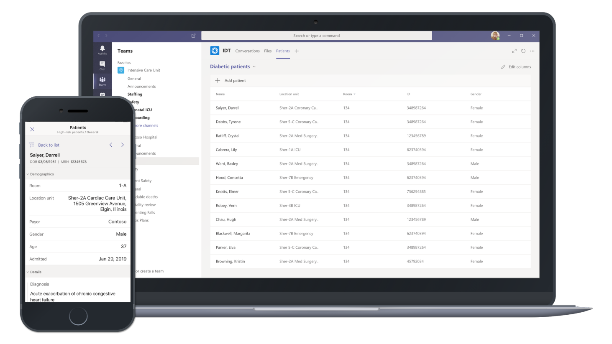
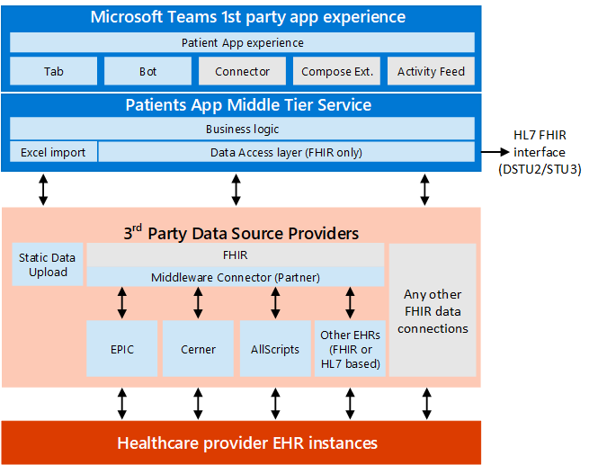
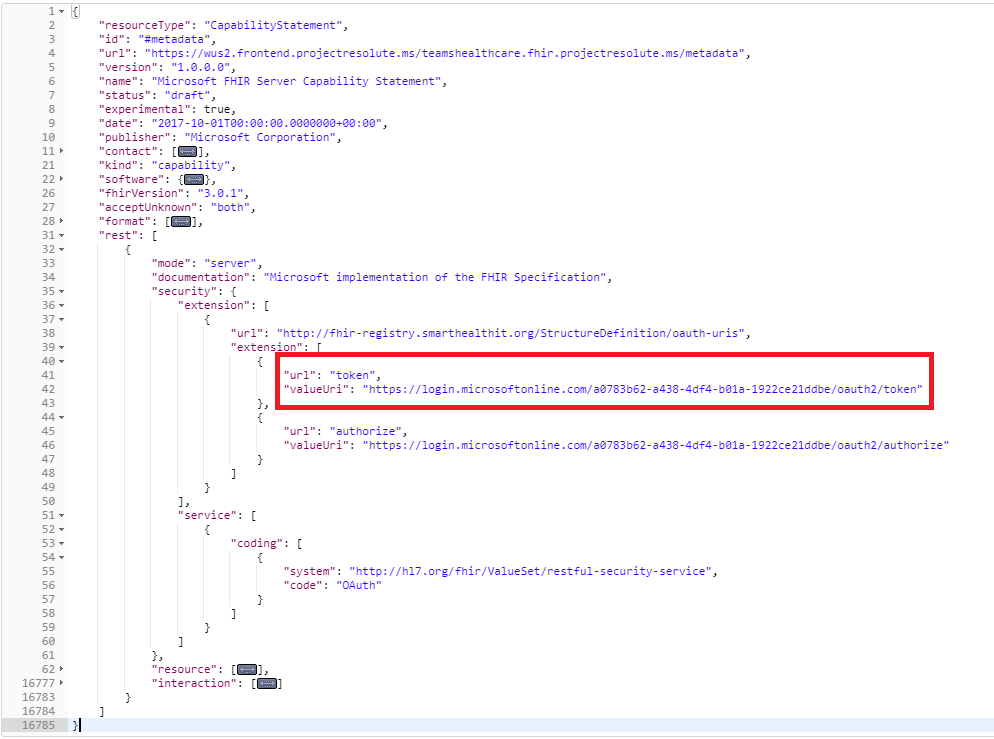
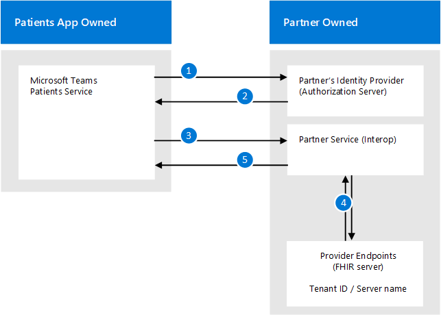
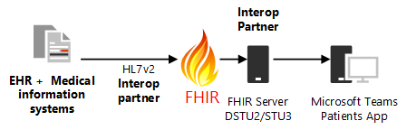
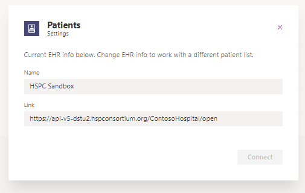

# Understand the Patients App and EHR integration interface

## Patients App overview

Microsoft Teams is developing a Patients app specific to healthcare organizations to help them meet their ultimate goal of providing the best patient care. The Microsoft Teams Patient App is a first party tab app that integrates with electronic health record (EHR) systems using a Fast Healthcare Interoperability Resources ([FHIR](https://www.hl7.org/fhir/)) interface to bring valuable medical information into Microsoft Teams. This enables clinical workers to collaborate and communicate across the care continuum. The care coordination solution can interface with leading Independent Software Vendors (ISVs) that can connect the Patients App to your EHR systems using existing health data standards like HL7v2 and FHIR. Microsoft partners with the following industry leaders to establish electronic health record integration with Teams:

- Datica (through their [CMI](https://datica.com/compliant-managed-integration/) offering)
- Infor Cloverleaf (through the [Infor FHIR Bridge](https://pages.infor.com/hcl-infor-fhir-bridge-brochure.html))
- Redox (through the [R^FHIR server](https://www.redoxengine.com/fhir/))
- Dapasoft (through [Corolar on FHIR](https://www.dapasoft.com/corolar-fhir-server-for-microsoft-teams/))

An EHR integration and interop partner trying to implement Microsoft Teams for a healthcare provider organization needs to provide the Patients App a secure and authenticated connection with the healthcare provider organization's EHR systems. This enables the one-directional (Read only) flow of the relevant patient records into to the Microsoft Teams Patients App. The Microsoft Teams Patients App understands the FHIR format, so the partner is also responsible for transforming the aggregated data from various other formats like HL7v2, etc. into FHIR DSTU2 or STU3.

Microsoft Teams is bringing new healthcare-specific features to market in the care team collaboration and coordination space. Healthcare teams need a secure hub for coordinating care across multiple patients. The Patients app integrates with electronic health records (EHR) systems and enables care providers to communicate about patient care in real-time within Teams’ secure platform. The Patients app addresses the following challenges that are commonly observe in today's healthcare industry in the care coordination area:

- Low efficiency in hand-offs and critical communication through the patient experience
- Siloed information that creates administrative burdens
- Dissatisfaction among clinicians with complex and fragmented collaboration tools
- Inefficient in-person care coordination that can burn too much expensive clinical time

Microsoft Teams enables physicians, clinicians, nurses, and other staff to collaborate efficiently by:

- Being part of a single virtualized team that works and collaborates on Office documents
- Having persistent conversations about different patients needing attention
- Using channels with tabs as a way to structure their work, with additional help from tabs to which they can pin information sources
- Using channel meetings with the power of Teams audio, video, screen sharing, recording, and transcription features to manage daily meetings
- Using the Microsoft Teams Patient App to curate a list of high-risk patients that must be monitored, and pulls their latest details from the EHR system.

The Patients App adds the following features to Microsoft Teams:

- Ability to fetch latest patient data from the EHRs and other medical information systems through FHIR
- Ability to create multiple patient lists within a single channel.
- Ability to view and sort information displayed about patients through configurable columns.
- Ability to auto-provision the app through a team template.
- Available on the Teams App for iOS and Android for mobile first healthcare workers as well as Microsoft Teams web and desktop client.
- Support for FHIR DSTU2 and STU3 versions via parsing of conformance statement.

The Microsoft Teams Patients app is built on the Teams extensibility platform and takes advantage of the Tabs framework to display rich patient content within a channel. To learn more about other Teams apps and the platform itself, please see [Apps for Microsoft Teams](https://docs.microsoft.com/microsoftteams/platform/concepts/apps/apps-overview).  

Planned Patients app features include:

- Support for patient [messaging extensions](https://docs.microsoft.com/en-us/microsoftteams/platform/concepts/messaging-extensions/messaging-extensions-overview) in channels and chat messages
- Support for notifications from Lab results, and Admit, Discharge & Transfer events.

> [!NOTE]
> The Microsoft Teams Patient App is in private preview and the FHIR interface is in beta. Released versions are not expected to be backward compatible.

This article is for you if you're a general healthcare IT developer that is interested in using FHIR APIs on top of your medical information system to connect to Microsoft Teams to enable the above mentioned care coordination scenarios. This article documents the FHIR interface specifications for the Patients App. The article will also guide you through the step-by-step process of setting up FHIR server and connecting to the Patients App in your development environment\tenant. **Note: There are no steps in this process that use the Microsoft Teams admin center or PowerShell cmdlets to enable features.**

The following sections explain the requirements of the FHIR only data access layer for the Patients app that a FHIR server must meet in order to integrate with the Patients App, including the following:

- Expectations around user authentication
- Functional and technical requirements of the integration interface
- Expectations around performance and reliability
- Expectations around FHIR resources to be supported for the Patients App
- Process for integration and the expected engagement model
- How to enroll yourself and your customer in the private preview of the Patients App
- How to get started with FHIR and some common challenges faced with the Patients App
- Future requirements for the next iteration of the Patient App

Note: In the sections below, the word "partner" or "Interop partner" is used to refer to any 3rd party Organization that enables integration to EHR systems for the Microsoft Teams Patients app through FHIR and is implementing a FHIR Server to match the specifications listed below.

## Functional and technical requirements of the integration interface

### Authentication for the FHIR Endpoint with the Microsoft Teams Patients app

First, a quick note about the current state of the industry:

Based on our understanding of working with Interop vendors that perform data transformations and expose connections to EHR data through FHIR, the more commonly supported form of authorization is an app level authorization with no support for user level authorization even though the EHR system might implement user level authorization. The Interop Service (Partner) gets a “God-Mode” level of access to the EHR data. When they expose the same data as the appropriate FHIR resources there is no authorization context passed on to the Interop Service Consumer (Ex: Microsoft Teams Patient App) that is integrating with the Interop Service or Platform. Hence, in such a case, Microsoft Teams Patients app will not be able to enforce user level authorization. In that model, we will support application to application authentication between the Microsoft Teams 1st Party Patient App and the Interop partner’s service.

Authentication: Application to Application authentication model is described below:

Service to service authentication should be done through OAuth 2.0 [Client Credential flow](https://www.oauth.com/oauth2-servers/access-tokens/client-credentials/). Partner service needs to provide the following:

1. Partner service will enable Microsoft Teams Patient App to create an account with Partner, which will enable us to generate and own client_id and client_secret for Microsoft Teams Patient App, managed via an Auth registration portal on the partner’s Authentication server.
2. Partner service will own Authentication/Authorization system, which will accept and verify (authenticate) the client credentials provided and give back an access token with tenant hint in scope, as described below.
3. For security reasons or in a case of secret breach, Microsoft should be able to:
   1. Re-generate the secret
   2. Invalidate or delete the old secret (Example of the same is available in Azure Portal - AAD App Registration)
4. The metadata endpoint hosting the conformance statement should be un-authenticated, it should be accessible without authentication token.
5. Partner service will provide the token endpoint for Microsoft Teams Patient App to request an access token using client credential flow. The token url as per authorization server should be part of the FHIR conformance (capability) statement fetched from metadata on the FHIR server:

A request for access token consists of the following parameters:

    POST /token HTTP/1.1
    Host: authorization-server.com

    grant-type=client_credentials
    &client_id=xxxxxxxxxx
    &client_secret=xxxxxxxxxx

Partner service will provide client_id and client_secret for Microsoft Teams Patient App, managed via an Auth registration portal on the partner’s side. Partner service will provide the endpoint to request access token using client credential flow. A successful response must include token_type, access_token and expires_in parameters. 

### Routing: Mapping AAD Tenant to the Provider endpoint

Microsoft Teams Patient app will connect to partner service through a single endpoint. Partner service will have to own and maintain a mechanism to map Microsoft customer (AAD Tenant ID) to respective healthcare Provider (FHIR server) that Partner service is working with.

Mapping of AAD tenant to a provider endpoint should be done through AAD Tenant ID (GUID). Microsoft Teams Patient app will pass Tenant ID in scope, while requesting access-token for each request. Partner service will keep the mapping of Tenant ID to Provider endpoint and redirect request to a provider endpoint based on Tenant ID. To do this partner must support configuration on their end (manually or via a portal as part of onboarding of provider organizations to their Interop Platform).

Authentication and Routing work-flow is shown below:

## DSTU2 interface specification

The FHIR server must support POST requests using bundles for the following resources:

- [Patient](#patient)
- [Observation](#observation)
- [Condition](#condition)
- [Encounter](#encounter)
- [Allergy intolerance](#allergyintolerance)
- [Coverage](#coverage)
- [Medication order](#allergyintolerance)
- [Location](#location)

Note: The Patient resource is the only mandatory resource (without which the app will not load at all); However, it is recommended that the Partner implement support for all the above mentioned resources per specifications provided below for the best end-user experience with the Microsoft Teams Patients App. 

Queries from the Patient App for more than one resource shall post a bundle (BATCH) of requests to the FHIR server's URL. The server shall process each request and return a bundle of the resources matched by each request. For more information and examples, see [https://www.hl7.org/fhir/DSTU2/http.html#transaction](https://www.hl7.org/fhir/DSTU2/http.html#transaction).

All the following FHIR resources should be accessible by direct resource reference. For example, /Patient/id.

### Conformance minimum required field set

See [https://www.hl7.org/fhir/dstu2/conformance.html](https://www.hl7.org/fhir/dstu2/conformance.html). The FHIR Server must implement the conformance statement for us to have a factual summary of its capabilities. We expect the below parameters in a DSTU2 FHIR Server:

1. Rest
   1. Mode
   2. Interaction
   3. Resource: Type
   4. Security: [Extension for OAuth URIs](http://hl7.org/fhir/extension-oauth-uris.html)
2. FhirVersion (Our code requires this to understand which version we should pivot to as we support multiple versions.)

### Patient

See [https://www.hl7.org/fhir/DSTU2/Patient.html](https://www.hl7.org/fhir/DSTU2/Patient.html).

These are the minimum required fields, a subset of the [Argonaut patient profile](http://www.fhir.org/guides/argonaut/r2/StructureDefinition-argo-patient.html) fields:

1. Name.Family
2. Name.Given
3. Gender
4. BirthDate
5. MRN (Identifier)

In addition to the Argonaut fields, for a great user experience, we can also read the following fields:

1. Name.Use
2. Name.Prefix
3. CareProvider (This reference on the Patient resource should include the display fields shown in the following example.)

* * *
    Request:
    GET <fhir-server>/Patient/<patient-id>

    Response:
    {
      "resourceType": "Patient",
      "id": "<patient-id>",
      "meta": {
      "versionId": "1",
        "lastUpdated": "2018-09-18T01:28:26.000+00:00"
      },
      "text": {
        "status": "generated",
        "div": "

Hugh <b>CHAU </b>
<table><tbody><tr><td>Date of birth</td><td>05 June 1957</td></tr></tbody></table>
"
      },
      "active": true,
      "name": [
        {
          "text": "Hugh Chau",
          "family": [
            "Chau"
          ],
          "given": [
            "Hugh"
          ]
        }
      ],
      "gender": "male",
      "birthDate": "1957-06-05",
      "careProvider": [{ "display": "Jane Doe" }],
    }
* * * 

Resource search using POST method at /Patient/_search and the following parameters:

1. id
2. family:contains=(searches for all patients whose family name contains the value.)
3. given=\<substring>
4. name=\<substring>
5. birthdate=(exact match)
6. \_count (maximum number of results that should be returned)   The response should contain the total count of records returned as a result of the search, and \_count will be used by the PatientsApp to limit the number of records returned.
7. identifier=\<mrn>

The goal is to be able to search and filter for a patient by the following:

- ID: This is the resource ID that every resource in FHIR has.
- MRN: This is the actual identifier for the patient that clinical staff would know. We understand this MRN is based on the type of identifier inside the identifier resource in FHIR
- Name
- Birthdate

For an example of what the call returns, see the following reply example .

* * * 
    Request:
    POST <fhir-server>/Patient/_search
    Request Body:
    given=hugh&family=chau
    
    Response:
    {
      "resourceType": "Bundle",
      "id": "<bundle-id>",
      "meta": {
        "lastUpdated": "2018-10-30T00:21:34.943+00:00"
      },
      "type": "searchset",
      "total": 1,
      "link": [
        {
          "relation": "self",
          "url": "<fhir-server>/Patient/_search"
        }
      ],
      "entry": [
        {
          "fullUrl": "<fhir-server>/Patient/<patient-id>",
          "resource": {
            "resourceType": "Patient",
            "id": "<patient-id>",
            "meta": {
              "versionId": "1",
              "lastUpdated": "2018-09-18T01:28:26.000+00:00"
            },
            "text": {
              "status": "generated",
              "div": "

Hugh <b>CHAU </b>
<table><tbody><tr><td>Date of birth</td><td>05 June 1957</td></tr></tbody></table>
"
            },
            "active": true,
            "name": [
              {
                "text": "Hugh Chau",
                "family": [
                  "Chau"
                ],
                "given": [
                  "Hugh"
                ]
              }
            ],
            "gender": "male",
            "birthDate": "1957-06-05"
          },
          "search": {
            "mode": "match"
          }
        }
      ]
    }
* * *

### Observation

See [https://www.hl7.org/fhir/DSTU2/Observation.html](https://www.hl7.org/fhir/DSTU2/Observation.html).

These are the minimum required fields, a subset of the Argonaut vital signs profile:

 1. Effective (date time or period)
 2. Code.Coding.Code
 3. ValueQuantity.Value

In addition to the Argonaut fields, for a great user experience, we can also read the following fields:

 1. Code.Coding.Display
 2. ValueQuantity.Unit

If using component observations, the same logic applies for each component observation.

Resource search using GET method and the following parameters:

1. patient=\<patient id\>
2. sort:desc=\<field ex. date\>

The goal is to be able to retrieve the latest vital signs for a patient, [VitalSigns.DSTU.saz]  (observation?).

* * * 
    Request:
    GET <fhir-server>/Observation?patient=<patient-id>&_sort:desc=date&    category=vital-signs
    
    Response:
    {
      "resourceType": "Bundle",
      "id": "<bundle-id>",
      "meta": {
        "lastUpdated": "2019-04-01T15:41:53.598+00:00"
      },
      "type": "searchset",
      "total": 20,
      "link": [
        {
          "relation": "self",
          "url": "<fhir-server>/Observation?_sort%3Adesc=date&category=vital-signs&patient=<patient-id>"
        }
      ],
      "entry": [
        {
          "fullUrl": "<fhir-server>/Observation/<resource-id>",
          "resource": {
            "resourceType": "Observation",
            "id": "<resource-id>",
            "meta": {
              "versionId": "3",
              "lastUpdated": "2018-01-31T22:43:25.000+00:00"
            },
            "text": {
              "status": "generated",
              "div": "
2009-12-01: bmi = 34.4 kg/m2
"
            },
            "status": "final",
            "category": {
              "coding": [
                {
                  "system": "http://hl7.org/fhir/observation-category",
                  "code": "vital-signs",
                  "display": "Vital Signs"
                }
              ],
              "text": "Vital Signs"
            },
            "code": {
              "coding": [
                {
                  "system": "http://loinc.org",
                  "code": "39156-5",
                  "display": "bmi"
                }
              ],
              "text": "bmi"
            },
            "subject": {
              "reference": "Patient/<patient-id>"
            },
            "encounter": {
              "reference": "Encounter/<resource-id>"
            },
            "effectiveDateTime": "2009-12-01",
            "valueQuantity": {
              "value": 34.4,
              "unit": "kg/m2",
              "system": "http://unitsofmeasure.org",
              "code": "kg/m2"
            }
          },
          "search": {
            "mode": "match"
          }
        },
        {
          "fullUrl": "<fhir-server>/Observation/<resource-id>",
          "resource": {
            "resourceType": "Observation",
            "id": "<resource-id>",
            "meta": {
              "versionId": "3",
              "lastUpdated": "2018-01-31T22:43:25.000+00:00"
            },
            "text": {
              "status": "generated",
              "div": "
2009-12-01: Blood pressure 100/60 mmHg
"
            },
            "status": "final",
            "category": {
              "coding": [
                {
                  "system": "http://hl7.org/fhir/observation-category",
                  "code": "vital-signs",
                  "display": "Vital Signs"
                }
              ],
              "text": "Vital Signs"
            },
            "code": {
              "coding": [
                {
                  "system": "http://loinc.org",
                  "code": "55284-4",
                  "display": "Blood pressure systolic and diastolic"
                }
              ],
              "text": "Blood pressure systolic and diastolic"
            },
            "subject": {
              "reference": "Patient/<patient-id>"
            },
            "encounter": {
              "reference": "Encounter/<resource-id>"
            },
            "effectiveDateTime": "2009-12-01",
            "component": [
              {
                "code": {
                  "coding": [
                    {
                      "system": "http://loinc.org",
                      "code": "8480-6",
                      "display": "Systolic blood pressure"
                    }
                  ],
                  "text": "Systolic blood pressure"
                },
                "valueQuantity": {
                  "value": 100,
                  "unit": "mmHg",
                  "system": "http://unitsofmeasure.org",
                  "code": "mm[Hg]"
                }
              },
              {
                "code": {
                  "coding": [
                    {
                      "system": "http://loinc.org",
                      "code": "8462-4",
                      "display": "Diastolic blood pressure"
                    }
                  ],
                  "text": "Diastolic blood pressure"
                },
                "valueQuantity": {
                  "value": 60,
                  "unit": "mmHg",
                  "system": "http://unitsofmeasure.org",
                  "code": "mm[Hg]"
                }
              }
            ]
          },
          "search": {
            "mode": "match"
          }
        },
        {
          "fullUrl": "<fhir-server>/Observation/<resource-id>",
          "resource": {
            "resourceType": "Observation",
            "id": "<resource-id>",
            "meta": {
              "versionId": "3",
              "lastUpdated": "2018-01-31T22:43:25.000+00:00"
            },
            "text": {
              "status": "generated",
              "div": "
2009-12-01: respiratory_rate = 20.0     {breaths}/min
"
            },
            "status": "final",
            "category": {
              "coding": [
                {
                  "system": "http://hl7.org/fhir/observation-category",
                  "code": "vital-signs",
                  "display": "Vital Signs"
                }
              ],
              "text": "Vital Signs"
            },
            "code": {
              "coding": [
                {
                  "system": "http://loinc.org",
                  "code": "9279-1",
                  "display": "respiratory_rate"
                }
              ],
              "text": "respiratory_rate"
            },
            "subject": {
          "reference": "Patient/<patient-id>"
            },
            "encounter": {
              "reference": "Encounter/<resource-id>"
            },
            "effectiveDateTime": "2009-12-01",
            "valueQuantity": {
              "value": 20.0,
              "unit": "{breaths}/min",
              "system": "http://unitsofmeasure.org",
              "code": "{breaths}/min"
            }
          },
          "search": {
            "mode": "match"
          }
        },
        .....
      ]
    }
* * *

### Condition

See [https://www.hl7.org/fhir/DSTU2/Condition.html](https://www.hl7.org/fhir/DSTU2/Condition.html).

These are the minimum required fields, a subset of the [Argonaut condition profile](http://www.fhir.org/guides/argonaut/r2/StructureDefinition-argo-condition.html):

1. Code.Coding[0].Display

In addition to the Argonaut fields, for a great user experience, we can also read the following field(s):

1. Date Recorded
2. Severity

Resource search using GET method and the following parameters:

1. patient=\<patient id>
2. _count=\<max results>

For an example of  the call, see the following sample:

* * *
    Request:
    GET <fhir-server>/Condition?patient=<patient-id>&_count=10
    
    Response:
    {
      "resourceType": "Bundle",
      "id": "<bundle-id>",
      "meta": {
        "lastUpdated": "2018-10-30T01:12:09.182+00:00"
      },
      "type": "searchset",
      "total": 1,
      "link": [
        {
          "relation": "self",
          "url": "<fhir-server>/Condition?_count=10&    patient=<patient-id>"
        }
      ],
      "entry": [
        {
          "fullUrl": "<fhir-server>/Condition/<resource-id>",
          "resource": {
            "resourceType": "Condition",
            "id": "<resource-id>",
            "meta": {
              "versionId": "1",
              "lastUpdated": "2018-09-18T01:17:24.000+00:00"
            },
            "patient": {
              "reference": "Patient/<patient-id>"
            },
            "code": {
              "coding": [
                {
                  "system": "http://snomed.info/sct",
                  "code": "386033004",
                  "display": "Neuropathy (nerve damage)"
                }
              ],
              "text": "Neuropathy (nerve damage)"
            },
            "clinicalStatus": "active",
            "verificationStatus": "confirmed",
            "onsetDateTime": "2018-09-17T07:00:00.000Z"
          },
          "search": {
            "mode": "match"
          }
        }
      ]
    }
* * *

### Encounter

See [https://www.hl7.org/fhir/DSTU2/Encounter.htm](https://www.hl7.org/fhir/DSTU2/Encounter.htm).

These are the minimum required fields, a subset of the US Core Encounter profile “must have” fields:

1. Status
2. Type[0].Coding[0].Display

In addition, the following fields from US Core Encounter profile’s “must support” fields

1. Period.Start
2. Location[0].Location.Display

Resource search using GET method and the following parameters:

1. patient=\<patient id>
2. _sort:desc=\<field ex. date>
3. _count=\<max results>

The goal is to be able to retrieve the patient’s last known location. Each encounter references a location resource. The reference shall also include the location’s display field. For an example of the call, see the following sample.
* * *
    Request:
    GET <fhir-server>/Encounter?patient=<patient-id>&_sort:desc=date&_count=1
    
    Response:
    {
      "resourceType": "Bundle",
      "type": "searchset",
      "total": 1,
      "entry": [
        {
          "resource": {
            "resourceType": "Encounter",
            "id": "<resource-id>",
            "identifier": [{ "use": "official", "value": "<id>" }],
            "status": "arrived",
            "class": "outpatient",
            "type": [
              {
                "coding": [
                  {
                    "code": "Appointment",
                    "display": "Appointment"
                  }
                ],
                "text": "Visit Type"
              }
            ],
            "patient": { "reference": "Patient/<patient-id>" },
            "participant": [
              {
                "individual": {
                  "reference": "Practitioner/<practitioner-id>",
                  "display": "John Doe"
                }
              }
            ],
            "period": { "start": "09/17/2018 1:00:00 PM" },
            "location": [
              {
                "location": { "display": "Clinic - ENT" },
                "status": "active"
              }
            ]
          }
        }
      ]
    }
* * *

### AllergyIntolerance

See [https://www.hl7.org/fhir/DSTU2/AllergyIntolerance.html](https://www.hl7.org/fhir/DSTU2/AllergyIntolerance.html).

These are the minimum required fields, a subset of the Argonaut AllergyIntolerance profile:

1. Code.Text
2. Code.Coding[0].Display
3. Status

In addition to the Argonaut fields, for a great user experience, we can also read the following fields:

1. RecordedDate
2. Note.Text
3. Reaction[..].Substance.Text
4. Reaction[..].Manifestation[..].Text
5. Text.Div

Resource search using GET method and the following parameters:

1. Patient =  \<patient id>

For an example of the call, see the following example.

* * *
    Request:
    GET <fhir-server>/AllergyIntolerance?patient=<patient-id>
    
    Response:
    {
      "resourceType": "Bundle",
      "id": "<bundle-id>",
      "meta": {
        "lastUpdated": "2018-10-30T01:37:08.819+00:00"
      },
      "type": "searchset",
      "total": 1,
      "link": [
        {
          "relation": "self",
          "url": "<fhir-server>/AllergyIntolerance?patient=<patient-id>"
        }
      ],
      "entry": [
        {
          "fullUrl": "<fhir-server>/AllergyIntolerance/<resource-id>",
          "resource": {
            "resourceType": "AllergyIntolerance",
            "id": "8",
            "meta": {
              "versionId": "1",
              "lastUpdated": "2018-09-17T21:00:31.000+00:00"
            },
            "onset": "2018-09-17T07:00:00.000Z",
            "recordedDate": "2018-09-17T07:00:00.000Z",
            "patient": {
              "reference": "Patient/<patient-id>"
            },
            "substance": {
              "coding": [
                {
                  "code": "N0000175503",
                  "display": "sulfonamide antibacterial"
                }
              ],
              "text": "sulfonamide antibacterial"
            },
            "status": "confirmed",
            "criticality": "CRITL",
            "type": "allergy",
            "category": "medication"
          },
          "search": {
            "mode": "match"
          }
        }
      ]
    }
* * *

### Medication Order

See [https://www.hl7.org/fhir/DSTU2/MedicationOrder.html](https://www.hl7.org/fhir/DSTU2/MedicationOrder.html).

These are the minimum required fields, a subset of the Argonaut MedicationOrder profile:

1. DateWritten
2. Prescriber.Display
3. Medication.Display (if reference)
4. Medication.Text (if concept)

In addition to the Argonaut fields, for a great user experience, we can also read the following fields:

1. DateEnded
2. DosageInstruction.Text
3. Text.Div

Resource search using GET method and the following parameters:

1. patient=\<patient id>
2. _count=\<max results>

For an example of the call (Fiddle trace), see the following

* * *
    Request:
    GET <fhir-server>/MedicationOrder?patient=<patient-id>&_count=10
    
    Response:
    {
      "resourceType": "Bundle",
      "id": "<bundle-id>",
      "meta": {
        "lastUpdated": "2018-10-30T02:01:31.148+00:00"
      },
      "type": "searchset",
      "total": 1,
      "link": [
        {
          "relation": "self",
          "url": "<fhir-server>/MedicationOrder?_count=10&patient=<patient-id>"
        }
      ],
      "entry": [
        {
          "fullUrl": "<fhir-server>/MedicationOrder/<resource-id>",
          "resource": {
            "resourceType": "MedicationOrder",
            "id": "<resource-id>",
            "meta": {
              "versionId": "1",
              "lastUpdated": "2018-09-17T20:59:17.000+00:00"
            },
            "dateWritten": "2018-09-17T07:00:00.000Z",
            "status": "active",
            "dateEnded": "2018-09-17T07:00:00.000Z",
            "patient": {
              "reference": "Patient/<patient-id>"
            },
            "medicationCodeableConcept": {
              "coding": [
                {
                  "code": "314077",
                  "display": "Lisinopril 20 MG Oral Tablet"
                }
              ],
              "text": "Lisinopril 20 MG Oral Tablet"
            },
            "dosageInstruction": [
              {
                "text": "1 daily",
                "timing": {
                  "repeat": {
                    "frequency": 1,
                    "period": 1,
                    "periodUnits": "d"
                  }
                }
              }
            ]
          },
          "search": {
            "mode": "match"
          }
        }
      ]
    }
* * *  

### Coverage

See [https://www.hl7.org/fhir/DSTU2/Coverage.html](https://www.hl7.org/fhir/DSTU2/Coverage.html).

These are the minimum required fields, not covered by either US Core or Argonaut profiles:

1. Payor

Resource search using GET method and the following parameters:

1. patient=\<patient id>

For an example of the call, see the following example:

* * *
    Request:
    GET <fhir-server>/Coverage?patient=<patient-id>
    
    Response:
    {
      "resourceType": "Bundle",
      "type": "searchset",
      "total": 1,
      "entry": [
        {
          "resource": {
            "resourceType": "Coverage",
            "id": "<resource-id>",
            "plan": "No Primary Insurance",
            "subscriber": { "reference": "Patient/<patient-id>" }
          }
        }
      ]
    }
* * *

### Location

See [https://www.hl7.org/fhir/DSTU2/Location.html](https://www.hl7.org/fhir/DSTU2/Location.html).

This resource is only being used as a reference on the [Encounter](#encounter) resource.

## STU3 interface

The FHIR server must support POST requests using bundles for the following resources:

- [Patient](#patient-stu3)
- [Observation](#observation-stu3)
- [Condition](#condition-stu3)
- [Encounter](#encounter-stu3)
- [Allergy Intolerance](#allergyintolerance-stu3)
- [Coverage](#coverage-stu3)
- [Medication Statement](#medication-request-stu3) (to replace the MedicationOrder in DSTU2 version of the PatientsApp)
- Location (the information needed from this resource can be included in Encounter)

Note: The Patient resource is the only mandatory resource (without which the app will not load at all); However, it is recommended that the Partner implement support for all the above mentioned resources per specifications provided below for the best end-user experience with the Microsoft Teams Patients App.

Queries from the Patient App for more than one resource shall post a bundle (BATCH) of requests to the FHIR server's URL. The server shall process each request and return a bundle of the resources matched by each request. For more information and examples, see [https://www.hl7.org/fhir/STU3/http.html#transaction](https://www.hl7.org/fhir/STU3/http.html#transaction).

### Capability Statement

See [https://www.hl7.org/fhir/stu3/capabilitystatement.html](https://www.hl7.org/fhir/stu3/capabilitystatement.html).

These are the minimum required fields:

1. Rest
   1. Mode
   2. Interaction
   3. Resource: Type
   4. Security: [Extension for OAuth URIs](http://hl7.org/fhir/extension-oauth-uris.html)
2. FhirVersion (Our code requires this to understand which version we should pivot to.)

### Patient (STU3)

See [http://hl7.org/fhir/stu3/patient.html](http://hl7.org/fhir/stu3/patient.html).

Here are the minimum required fields, a subset of the Argonaut patient profile fields:

1. Name.Given
2. Name.Family
3. Gender
4. BirthDate
5. MRN (Identifier)

In addition to the [Argonaut fields](http://www.fhir.org/guides/argonaut/r2/StructureDefinition-argo-patient.html), for a great user experience, we can also read the following field(s):

1. Name.Use
2. Name.Prefix
3. [GeneralPractitioner] - The GeneralPractitioner reference should be included in the Patient resource (display field only)

Resource search using POST method at /Patient/_search and the following parameters:

1. id
2. family=(searches for all patients whose family name contains the value)
3. given=\<substring>
4. birthdate=(exact match)
5. gender=(values being one of the administrative-gender)
6. \_count (maximum number of results that should be returned)   The response should contain the total count of records returned as a result of the search and \_count will be used by the PatientsApp to limit the number of records returned.
7. identifier=\<mrn>

The goal is to be able to search and filter for a patient by the following:

- ID: This is the resource ID that every resource in FHIR has.
- MRN: This is the actual identifier for the patient that clinical staff would know. We understand this MRN is based on the type of identifier inside the identifier resource in FHIR
- Name
- Birthdate

See the following example call.

* * *
    Request:
    GET <fhir-server>/Patient/<patient-id>
    
    Response:
    {
      "resourceType": "Patient",
      "id": "<patient-id>",
      "meta": {
        "versionId": "2",
        "lastUpdated": "2019-01-08T17:52:48.000+00:00"
      },
      "text": {
        "status": "generated",
        "div": "
\n        
Daniel Adams
\n      
"
      },
      "identifier": [
        {
          "use": "usual",
          "type": {
            "coding": [
              {
                "system": "http://hl7.org/fhir/v2/0203",
                "code": "MR",
                "display": "Medical record number",
                "userSelected": false
              }
            ],
            "text": "Medical record number"
          },
          "system": "http://hospital.smarthealthit.org",
          "value": "1234567"
        }
      ],
      "active": true,
      "name": [
        {
          "use": "official",
          "family": "Adams",
          "given": [
            "Daniel",
            "X."
          ]
        }
      ],
      "telecom": [
        {
          "system": "email",
          "value": "daniel.adams@example.com"
        }
      ],
      "gender": "male",
      "birthDate": "1925-12-23",
      "address": [
        {
          "use": "home",
          "line": [
            "1 Hill AveApt 14"
          ],
          "city": "Tulsa",
          "state": "OK",
          "postalCode": "74117",
          "country": "USA"
        }
      ]
    }
* * *

### Observation (STU3)

See [https://www.hl7.org/fhir/stu3/observation.html](https://www.hl7.org/fhir/stu3/observation.html).

These are the minimum required fields, a subset of the [Argonaut Vital-Signs profile](https://www.fhir.org/guides/argonaut/r2/StructureDefinition-argo-vitalsigns.html).

1. Effective (date time or period)
2. Code.Coding.Code
3. ValueQuantity.Value

In addition to the Argonaut fields, for a great user experience, we can also read the following fields:

1. Code.Coding.Display
2. ValueQuantity.Unit

Resource search using GET method and the following parameters:

1. patient=\<patient id>
2. _sort=-date
3. category (we will query for “category=vital-signs”) to retrieve the list of vital signs.

Refer to this example of the call.

* * *
    Request:
    GET <fhir-server>/Observation?patient=<patient-id>&category=vital-signs
    
    Response:
    {
      "resourceType": "Bundle",
      "id": "<bundle-id>",
      "meta": {
        "lastUpdated": "2019-01-14T23:03:41.849+00:00"
      },
      "type": "searchset",
      "total": 20,
      "link": [
        {
          "relation": "self",
          "url": "<fhir-server>/Observation?category=vital-signs&patient=<patient-id>"
        }
      ],
      "entry": [
        {
          "fullUrl": "<fhir-server>/Observation/<resource-id>",
          "resource": {
            "resourceType": "Observation",
            "id": "<resource-id>",
            "meta": {
              "versionId": "1",
              "lastUpdated": "2017-10-18T18:14:11.000+00:00"
            },
            "text": {
              "status": "generated",
              "div": "
2009-04-08: heart_rate = 72.0 {beats}/min
"
            },
            "status": "final",
            "category": [
              {
                "coding": [
                  {
                    "system": "http://hl7.org/fhir/observation-category",
                    "code": "vital-signs",
                    "display": "Vital Signs",
                    "userSelected": false
                  }
                ],
                "text": "Vital Signs"
              }
            ],
            "code": {
              "coding": [
                {
                  "system": "http://loinc.org",
                  "code": "8867-4",
                  "display": "heart_rate",
                  "userSelected": false
                }
              ],
              "text": "heart_rate"
            },
            "subject": {
              "reference": "Patient/<patient-id>"
            },
            "context": {
              "reference": "Encounter/<resource-id>"
            },
            "effectiveDateTime": "2009-04-08T00:00:00-06:00",
            "valueQuantity": {
              "value": 72.0,
              "unit": "{beats}/min",
              "system": "http://unitsofmeasure.org",
              "code": "{beats}/min"
            }
          },
          "search": {
            "mode": "match"
          }
        },
        {
          "fullUrl": "<fhir-server>/Observation/<resource-id>",
          "resource": {
            "resourceType": "Observation",
            "id": "<resource-id>",
            "meta": {
              "versionId": "1",
              "lastUpdated": "2017-10-18T18:14:11.000+00:00"
            },
            "text": {
              "status": "generated",
              "div": "
2009-04-23: Blood pressure 63/38 mmHg
"
            },
            "status": "final",
            "category": [
              {
                "coding": [
                  {
                    "system": "http://hl7.org/fhir/observation-category",
                    "code": "vital-signs",
                    "display": "Vital Signs",
                    "userSelected": false
                  }
                ],
                "text": "Vital Signs"
              }
            ],
            "code": {
              "coding": [
                {
                  "system": "http://loinc.org",
                  "code": "55284-4",
                  "display": "Blood pressure systolic and diastolic",
                  "userSelected": false
                }
              ],
              "text": "Blood pressure systolic and diastolic"
            },
            "subject": {
              "reference": "Patient/<patient-id>"
            },
            "context": {
              "reference": "Encounter/<resource-id>"
            },
            "effectiveDateTime": "2009-04-23T00:00:00-06:00",
            "component": [
              {
                "code": {
                  "coding": [
                    {
                      "system": "http://loinc.org",
                      "code": "8480-6",
                      "display": "Systolic blood pressure",
                      "userSelected": false
                    }
                  ],
                  "text": "Systolic blood pressure"
                },
                "valueQuantity": {
                  "value": 63,
                  "unit": "mmHg",
                  "system": "http://unitsofmeasure.org",
                  "code": "mm[Hg]"
                }
              },
              {
                "code": {
                  "coding": [
                    {
                      "system": "http://loinc.org",
                      "code": "8462-4",
                      "display": "Diastolic blood pressure",
                      "userSelected": false
                    }
                  ],
                  "text": "Diastolic blood pressure"
                },
                "valueQuantity": {
                  "value": 38,
                  "unit": "mmHg",
                  "system": "http://unitsofmeasure.org",
                  "code": "mm[Hg]"
                }
              }
            ]
          },
          "search": {
            "mode": "match"
          }
        },
        {
          "fullUrl": "<fhir-server>/Observation/<resource-id>",
          "resource": {
            "resourceType": "Observation",
            "id": "<resource-id>",
            "meta": {
              "versionId": "1",
              "lastUpdated": "2017-10-18T18:14:11.000+00:00"
            },
            "text": {
              "status": "generated",
              "div": "
2001-11-05: heart_rate = 82.0 {beats}/min
"
            },
            "status": "final",
            "category": [
              {
                "coding": [
                  {
                    "system": "http://hl7.org/fhir/observation-category",
                    "code": "vital-signs",
                    "display": "Vital Signs",
                    "userSelected": false
                  }
                ],
                "text": "Vital Signs"
              }
            ],
            "code": {
              "coding": [
                {
                  "system": "http://loinc.org",
                  "code": "8867-4",
                  "display": "heart_rate",
                  "userSelected": false
                }
              ],
              "text": "heart_rate"
            },
            "subject": {
              "reference": "Patient/<patient-id>"
            },
            "context": {
              "reference": "Encounter/<resource-id>"
            },
            "effectiveDateTime": "2001-11-05T00:00:00-07:00",
            "valueQuantity": {
              "value": 82.0,
              "unit": "{beats}/min",
              "system": "http://unitsofmeasure.org",
              "code": "{beats}/min"
            }
          },
          "search": {
            "mode": "match"
          }
        }
        .......
      ]
* * *

* * *

    Request:
    GET <fhir-server>/Observation?patient=<patient-id>&category=vital-signs
    
    Response:
    {
      "resourceType": "Bundle",
      "id": "<bundle-id>",
      "meta": {
        "lastUpdated": "2019-01-14T23:03:41.849+00:00"
      },
      "type": "searchset",
      "total": 20,
      "link": [
        {
          "relation": "self",
          "url": "<fhir-server>/Observation?category=vital-signs&    patient=<patient-id>"
        }
      ],
      "entry": [
        {
          "fullUrl": "<fhir-server>/Observation/<resource-id>",
          "resource": {
            "resourceType": "Observation",
            "id": "<resource-id>",
            "meta": {
              "versionId": "1",
              "lastUpdated": "2017-10-18T18:14:11.000+00:00"
            },
            "text": {
              "status": "generated",
              "div": "
2009-04-08: heart_rate = 72.0 {beats}/min
"
            },
            "status": "final",
            "category": [
              {
                "coding": [
                  {
                    "system": "http://hl7.org/fhir/observation-category",
                    "code": "vital-signs",
                    "display": "Vital Signs",
                    "userSelected": false
                  }
                ],
                "text": "Vital Signs"
              }
            ],
            "code": {
              "coding": [
                {
                  "system": "http://loinc.org",
                  "code": "8867-4",
                  "display": "heart_rate",
                  "userSelected": false
                }
              ],
              "text": "heart_rate"
            },
            "subject": {
              "reference": "Patient/<patient-id>"
            },
            "context": {
              "reference": "Encounter/<resource-id>"
            },
            "effectiveDateTime": "2009-04-08T00:00:00-06:00",
            "valueQuantity": {
              "value": 72.0,
              "unit": "{beats}/min",
              "system": "http://unitsofmeasure.org",
              "code": "{beats}/min"
            }
          },
          "search": {
            "mode": "match"
          }
        },
        {
          "fullUrl": "<fhir-server>/Observation/<resource-id>",
          "resource": {
            "resourceType": "Observation",
            "id": "<resource-id>",
            "meta": {
              "versionId": "1",
              "lastUpdated": "2017-10-18T18:14:11.000+00:00"
            },
            "text": {
              "status": "generated",
              "div": "
2009-04-23: Blood pressure 63/38 mmHg
"
            },
            "status": "final",
            "category": [
              {
                "coding": [
                  {
                    "system": "http://hl7.org/fhir/observation-category",
                    "code": "vital-signs",
                    "display": "Vital Signs",
                    "userSelected": false
                  }
                ],
                "text": "Vital Signs"
              }
            ],
            "code": {
              "coding": [
                {
                  "system": "http://loinc.org",
                  "code": "55284-4",
                  "display": "Blood pressure systolic and diastolic",
                  "userSelected": false
                }
              ],
              "text": "Blood pressure systolic and diastolic"
            },
            "subject": {
              "reference": "Patient/<patient-id>"
            },
            "context": {
              "reference": "Encounter/<resource-id>"
            },
            "effectiveDateTime": "2009-04-23T00:00:00-06:00",
            "component": [
              {
                "code": {
                  "coding": [
                    {
                      "system": "http://loinc.org",
                      "code": "8480-6",
                      "display": "Systolic blood pressure",
                      "userSelected": false
                    }
                  ],
                  "text": "Systolic blood pressure"
                },
                "valueQuantity": {
                  "value": 63,
                  "unit": "mmHg",
                  "system": "http://unitsofmeasure.org",
                  "code": "mm[Hg]"
                }
              },
              {
                "code": {
                  "coding": [
                    {
                      "system": "http://loinc.org",
                      "code": "8462-4",
                      "display": "Diastolic blood pressure",
                      "userSelected": false
                    }
                  ],
                  "text": "Diastolic blood pressure"
                },
                "valueQuantity": {
                  "value": 38,
                  "unit": "mmHg",
                  "system": "http://unitsofmeasure.org",
                  "code": "mm[Hg]"
                }
              }
            ]
          },
          "search": {
            "mode": "match"
          }
        },
        {
          "fullUrl": "<fhir-server>/Observation/<resource-id>",
          "resource": {
            "resourceType": "Observation",
            "id": "<resource-id>",
            "meta": {
              "versionId": "1",
              "lastUpdated": "2017-10-18T18:14:11.000+00:00"
            },
            "text": {
              "status": "generated",
              "div": "
2001-11-05: heart_rate = 82.0 {beats}/min
"
            },
            "status": "final",
            "category": [
              {
                "coding": [
                  {
                    "system": "http://hl7.org/fhir/observation-category",
                    "code": "vital-signs",
                    "display": "Vital Signs",
                    "userSelected": false
                  }
                ],
                "text": "Vital Signs"
              }
            ],
            "code": {
              "coding": [
                {
                  "system": "http://loinc.org",
                  "code": "8867-4",
                  "display": "heart_rate",
                  "userSelected": false
                }
              ],
              "text": "heart_rate"
            },
            "subject": {
              "reference": "Patient/<patient-id>"
            },
            "context": {
              "reference": "Encounter/<resource-id>"
            },
            "effectiveDateTime": "2001-11-05T00:00:00-07:00",
            "valueQuantity": {
              "value": 82.0,
              "unit": "{beats}/min",
              "system": "http://unitsofmeasure.org",
              "code": "{beats}/min"
            }
          },
          "search": {
            "mode": "match"
          }
        }
        .......
      ]
    }
* * *

### Condition (STU3)

See [http://hl7.org/fhir/stu3/condition.html](http://hl7.org/fhir/stu3/condition.html).

Here's the minimum required fields, a subset of the [Argonaut condition profile](http://www.fhir.org/guides/argonaut/r2/StructureDefinition-argo-condition.html).

1. Code.Coding[0].Display

In addition to the Argonaut fields, for a great user experience, we can also read the following fields:

1. AssertedDate
2. Severity

Resource search using GET method and the following parameters:

1. patient=\<patient id>
2. _count=\<max results>

See the following example of this call.

* * *
    Request:
    GET <fhir-server>/Condition?patient=<patient-id>&_count=10
    
    Response:
    {
      "resourceType": "Bundle",
      "id": "<bundle-id>",
      "meta": {
        "lastUpdated": "2019-01-14T23:10:43.884+00:00"
      },
      "type": "searchset",
      "total": 2,
      "link": [
        {
          "relation": "self",
          "url": "<fhir-server>/Condition?_count=10&patient=<patient-id>"
        }
      ],
      "entry": [
        {
          "fullUrl": "<fhir-server>/Condition/<resource-id>",
          "resource": {
            "resourceType": "Condition",
            "id": "<resource-id>",
            "meta": {
              "versionId": "1",
              "lastUpdated": "2017-10-18T18:14:11.000+00:00"
            },
            "text": {
              "status": "generated",
              "div": "
Needs influenza immunization
"
            },
            "clinicalStatus": "active",
            "verificationStatus": "confirmed",
            "code": {
              "coding": [
                {
                  "system": "http://snomed.info/sct",
                  "code": "185903001",
                  "display": "Needs influenza immunization",
                  "userSelected": false
                }
              ],
              "text": "Needs influenza immunization"
            },
            "subject": {
              "reference": "Patient/<patient-id>"
            },
            "onsetDateTime": "2008-08-08T00:00:00-06:00"
          },
          "search": {
            "mode": "match"
          }
        },
        {
          "fullUrl": "<fhir-server>/Condition/<resource-id>",
          "resource": {
            "resourceType": "Condition",
            "id": "<resource-id>",
            "meta": {
              "versionId": "1",
              "lastUpdated": "2017-10-18T18:14:11.000+00:00"
            },
            "text": {
              "status": "generated",
              "div": "
Thiopurine methyltransferase deficiency
"
            },
            "clinicalStatus": "active",
            "verificationStatus": "confirmed",
            "code": {
              "coding": [
                {
                  "system": "http://snomed.info/sct",
                  "code": "356744012",
                  "display": "Thiopurine methyltransferase deficiency",
                  "userSelected": false
                }
              ],
              "text": "Thiopurine methyltransferase deficiency"
            },
            "subject": {
              "reference": "Patient/<patient-id>"
            },
            "onsetDateTime": "2009-07-18T00:00:00-06:00"
          },
          "search": {
            "mode": "match"
          }
        }
      ]
    }
* * *

### Encounter (STU3)

See [http://hl7.org/fhir/stu3/encounter.html](http://hl7.org/fhir/stu3/encounter.html).

These are the minimum required fields, a subset of the [US Core Encounter profile](http://hl7.org/fhir/us/core/2018Jan/StructureDefinition-us-core-encounter.html) “must have” fields).

1. Status
2. Type[0].Coding[0].Display

In addition, the following fields from US Core Encounter profile’s “must support” fields:

1. Period.Start
2. Location[0].Location.Display

Resource search using GET method and the following parameters:

1. patient=\<patient id>
2. _sort:desc=\<field ex. date>
3. _count=\<max results>

The goal is to be able to retrieve the patient’s last known location. Each encounter references a location resource. The reference shall also include the location’s display field.

### AllergyIntolerance (STU3)

See [http://hl7.org/fhir/stu3/allergyintolerance.html](http://hl7.org/fhir/stu3/allergyintolerance.html).

These are the minimum required fields, a subset of the [Argonaut AllergyIntolerance](https://www.fhir.org/guides/argonaut/r2/StructureDefinition-argo-allergyintolerance.html) profile:

1. Code.Text
2. Code.Coding[0].Display
3. ClinicalStatus/VerificationStatus (we read both)

In addition to the Argonaut fields, for a great user experience, we can also read the following field:

1. AssertedDate
2. Note.Text
3. Reaction
    1. Substance (one coding element)
    2. Manifestation (one coding element)

Resource search using GET method and the following parameters:

1. Patient =  \<patient id>

For an example of the call, see the following.

* * *
    Request:
    GET <fhir-server>/AllergyIntolerance?patient=<patient-id>
    
    Response:
    {
      "resourceType": "Bundle",
      "id": "<bundle-id>",
      "meta": {
        "lastUpdated": "2019-01-14T23:16:37.690+00:00"
      },
      "type": "searchset",
      "total": 1,
      "link": [
        {
          "relation": "self",
          "url": "<fhir-server>/AllergyIntolerance?patient=<patient-id>"
        }
      ],
      "entry": [
        {
          "fullUrl": "<fhir-server>/AllergyIntolerance/<resource-id>",
          "resource": {
            "resourceType": "AllergyIntolerance",
            "id": "<resource-id>",
            "meta": {
              "versionId": "2",
              "lastUpdated": "2019-01-08T08:43:16.000+00:00"
            },
            "text": {
              "status": "generated",
              "div": "
Sensitivity to sulfonamide antibacterial
"
            },
            "clinicalStatus": "active",
            "criticality": "low",
            "code": {
              "coding": [
                {
                  "system": "http://rxnav.nlm.nih.gov/REST/Ndfrt",
                  "code": "N0000175503",
                  "display": "sulfonamide antibacterial",
                  "userSelected": false
                }
              ],
              "text": "sulfonamide antibacterial - STU3 works"
            },
            "patient": {
              "reference": "Patient/<patient-id>"
            },
            "assertedDate": "2000-01-01T00:00:00-07:00",
            "reaction": [
              {
                "manifestation": [
                  {
                    "coding": [
                      {
                        "system": "http://snomed.info/sct",
                        "code": "271807003",
                        "display": "skin rash",
                        "userSelected": false
                      }
                    ],
                    "text": "skin rash"
                  }
                ],
                "severity": "mild"
              }
            ]
          },
          "search": {
            "mode": "match"
          }
        }
      ]
    }
* * *

### Medication Request (STU3)

See [https://www.hl7.org/fhir/medicationrequest.html](https://www.hl7.org/fhir/medicationrequest.html).

These are the minimum required fields, a subset of the [US Core Medication Request profile](http://www.hl7.org/fhir/us/core/StructureDefinition-us-core-medicationrequest.html):

1. Medication.Display (if Reference)
2. Medication.Text (if CodableConcept)
3. AuthoredOn
4. Requester.Agent.Display

In addition to the US Core fields, for a great user experience, we can also read the following fields:

1. DosageInstruction[..].Text
2. Text

Resource search using GET method and the following parameters:

1. patient=\<patient id>
2. _count=\<max results>

### Coverage (STU3)

See [http://hl7.org/fhir/stu3/coverage.html](https://www.hl7.org/fhir/medicationrequest.html).

These are the minimum required fields, not covered by either US Core or Argonaut profiles:

1. Grouping, at least one element with
    1. GroupDisplay
    2. PlanDisplay
2. Period
3. SubscriberId

Resource search using GET method and the following parameters:

1. Patient = \<patient id>

\* We don't have a sample for Coverage, as it's not available on any open sandbox. However, it should work in a way that's similar to the other resources.

## Performance and Reliability

While the Patients app is in private preview, we cannot make any guarantees on the end-to-end performance. Factors in performance include the relative latencies of all the hops involved in the workflow, starting from the EHR in the health system's environment, to the Interop partner and their infra, including the FHIR Server and across to the Office 365 ecosystem and Microsoft Teams Patients app.

## Get started with FHIR - How to create a FHIR Server?

If you're new to FHIR and need easy access to a FHIR Server that you can expose to the Microsoft Teams EHR integration interface, please follow instructions from here. Microsoft has an open-source FHIR Server available for all developers to use. Please see [What is FHIR Server for Azure](https://docs.microsoft.com/en-us/azure/healthcare-apis/overview-open-source-server) article to learn more about the open source FHIR Server available from Microsoft and deploy it for your organizations.

You can also use the HSPC Open sandbox EHR environment to create an open FHIR Server and use this to play around with the Patients app. We recommend that you read through the documentation [here](https://healthservices.atlassian.net/wiki/spaces/HSPC/pages/64585866/HSPC+Sandbox). Not only does the sandbox provide an easy, UI oriented, and user friendly way of creating, adding and editing Patients, it also gives you several samples to get started.  

## Enroll in the private preview and get access to the Microsoft Teams Patients app and try it out with your own tenant or your customer's tenant

Once you've created the open source FHIR Server, it's really easy to connect to the Patients app inside of your tenant by following the steps mentioned below:

1. Please [drop us a note](mailto:Teamsforhealthcare@service.microsoft.com?subject=Microsoft%20Teams%20Patients%20App%20private%20preview) with the following initial details - Your Name, Your Position, The company or organization you represent and why you are interested in the Microsoft Teams Patients app for EHR integration. We will get back to you as soon as possible with more questions and guide you through a process to get setup for the private preview.

2. Ensure that sideloading of custom apps is enabled in the tenant where you are going to try out the Microsoft Teams Patients app. Please refer to documentation [here](https://docs.microsoft.com/en-us/microsoftteams/admin-settings) on how to turn this on from the Teams Admin center for your or your customer's tenant.

3. Sideload the Microsoft Teams Patients app manifest that you will get from Microsoft (after we process your email to us) into a team in the tenant that is going to be used for care-coordination and patient rounding scenarios. Detailed instructions around how to side-load an app are [here](https://docs.microsoft.com/en-us/microsoftteams/platform/concepts/apps/apps-upload)

4. Navigate to the general channel as the Team owner and then click on the Patients tab. You should see a first run experience that will present two options i.e. EHR Mode and Manual Mode. Please select the EHR mode and drop the FHIR Server endpoint (that you've just setup earlier with all the required data and resources per the specifications above) into the URL and give the connection a name that well represents the FHIR Server. Hit Save, and everything should be ready to go.

    

5. Start using the app to search for Patients from the FHIR Server/EHR and add them to list and please give us feedback if something doesn't work. Also, to establish a fully authenticated version of the Patient App -> FHIR Server flow, please engage in offline dialogue with Microsoft Teams for healthcare product engineering, through the email request mentioned in Step 1 to clarify requirements and we will help enable this for you per the Authentication requirements described above in the FHIR Interface document. This part of the process will become more self-serve in the future. Stay tuned for more updates to this article!
