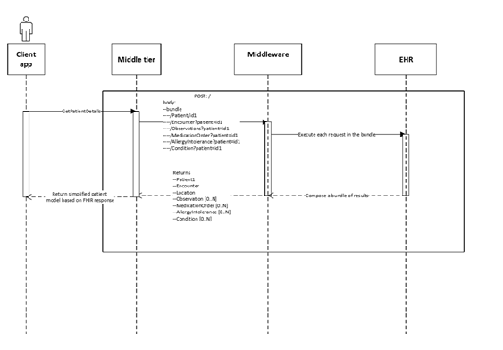

# Integrating Electronic health record systems with Microsoft Teams Patients application through FHIR

Microsoft Teams is developing features specific to healthcare organizations to help healthcare organizations and providers meet their ultimate goal of providing the best patient care. 

<Insert image of all 3 areas powered by security and compliance and EHR integration>

One of the major areas of focus for Microsoft Teams in healthcare is care team collaboration and coordination. Care coordination and collaboration is one of the key pillars for our investments in Microsoft Teams in healthcare. The solution gives healthcare teams a secure hub for coordinating care across multiple patients. It provides for integration with electronic health records (EHR) systems and enables care providers to communicate about patient care in real-time within Teams’ secure platform. The key challenges that we aim to address are:

- Low efficiency in hand-offs and communication critical throughout the care continuum 
- Siloed information that creates administrative burden in the healthcare system 
- Growing dissatisfaction among clinicians with complex and fragmented collaboration tools 
- Inefficient and in person care coordination that can burn too much clinical time and cost

Microsoft Teams for healthcare enables physicians, clinicians, nurses, and other staff to collaborate by:

- Being part of a single team to work and collaborate on Office documents and have persistent conversations about different patients needing attention
- Using channels with tabs as a way to structure their work with additional help from tabs to which they can pin information sources
- Using channel meetings with the power of Teams audio, video, screen sharing, recording, and transcription features to manage daily meetings
- Using the Microsoft Teams Patient App to curate and run through a list of high-risk patients that must be monitored by pulling their latest details from the EHR system. 

The care coordination solution in Microsoft Teams involves a first party tab app that integrates with electronic health record (EHR) systems via a FHIR (Fast Healthcare Interoperability Resources) interface to bring valuable medical information from the systems of record into Microsoft Teams. This enables clinical workers to collaborate and communicate across the care continuum. The care coordination solution can be enabled through partnerships with leading healthcare Independent Software Vendors (ISVs) that can connect the care coordination solution to your EHR systems and bridge the gap between existing health data standards like HL7v2 and FHIR.

Currently Microsoft Teams has partnerships with the following healthcare partners to establish electronic health record integration: 
- Datica (through their [CMI](https://datica.com/compliant-managed-integration/) offering)
- Infor Cloverleaf (through the [Infor FHIR Bridge](https://pages.infor.com/hcl-infor-fhir-bridge-brochure.html))
- Redox (through the [R^FHIR server](https://www.redoxengine.com/fhir/))
- Dapasoft (through [Corolar on FHIR](https://www.dapasoft.com/corolar-fhir-server-for-microsoft-teams/))

<insert good quality, high-res images of the Microsoft Teams patients app>

This article describes the as-is FHIR integration interface of the Microsoft Teams Patients App, a first-party app built by Microsoft to enable Inter-disciplinary team meetings (IDTs), multi-disciplinary team meetings (MDTs) and other patient rounding scenarios within the broader care coordination and collaboration space. To learn more about Teams apps and the extensibility platform, see [App for Microsoft Teams](https://docs.microsoft.com/microsoftteams/platform/concepts/apps/apps-overview). 

This article is for you if you're an EHR integration or interop partner who is interested in partnering with Microsoft Teams and a Microsoft customer (a healthcare provider organization) as the connecting layer between their electronic health record system, e.g. Epic and the Microsoft Teams Patients app. In this role, you'll establish a secure and authenticated connection with the healthcare provider organization's (e.g. a large health system) EHR systems to serve up the patient record data required for the Microsoft Teams Patients App while transforming the aggregated data from various other formats like HL7v2, etc. into the FHIR DSTU2 or STU3 standard. This article is also for you if you're a general healthcare IT developer that is interested in using FHIR APIs on top of your medical information system to connect to Microsoft Teams to enable the above mentioned care coordination scenarios. 

In this article, you'll learn about the requirements to integrate with the Patients App, including the following:

- Functional and technical requirements of the integration interface
- Expectations around user authentication
- Expectations around performance and reliability
- Expectations around FHIR resources to be supported for the Patient App
- Process for integration and the expected engagement model
- How to enroll yourself and your customer in the private preview of the Patients App
- Future requirements or asks for the next iteration of the Patient App

## DSTU2 interface specifications

The FHIR server must support POST transactions using bundles for the following resources:

- [Patient](#patient)
- [Observation](#observation)
- [Condition](#observation)
- [Encounter](#encounter)
- [Allergy intolerance](#allergyintolerance)
- [Coverage](#coverage)
- [Medication order](#allergyintolerance)
- [Location](#location)

Queries from the Patient App for more than one resource shall post a bundle (BATCH) of requests to the FHIR server's URL. The server shall process each request and return a bundle of the resources matched by each request. For more information and examples, see [https://www.hl7.org/fhir/DSTU2/http.html#transaction](https://www.hl7.org/fhir/DSTU2/http.html#transaction).

All the following FHIR resources should be accessible by direct resource reference. For example, /Patient/id.

### Conformance minimum required field set

See [https://www.hl7.org/fhir/dstu2/conformance.html](https://www.hl7.org/fhir/dstu2/conformance.html).

1. Rest
   1. Mode
   2. Interaction
   3. Resource: Type
   4. Security: [Extension for OAuth URIs](http://hl7.org/fhir/extension-oauth-uris.html)
2. FhirVersion (Our code requires this to understand which version we should pivot to.)

### Patient

See [https://www.hl7.org/fhir/DSTU2/Patient.html](https://www.hl7.org/fhir/DSTU2/Patient.html). 

These are the minimum required fields, a subset of the [Argonaut patient profile](http://www.fhir.org/guides/argonaut/r2/StructureDefinition-argo-patient.html) fields:

1. Name.Family
2. Name.Given
3. Gender
4. BirthDate
5. MRN (Identifier)

In addition to the Argonaut fields, for a great user experience, we can also read the following fields:

1. Name.Use
2. Name.Prefix
3. CareProvider (This reference on the Patient resource should include the display field [**Patient_with_careProvider.saz**](https://github.com/MicrosoftDocs/OfficeDocs-SkypeForBusiness/blob/live/Teams/downloads/DSTUsaz/Patient_with_careProvider.saz?raw=true).)

Resource search using POST method at /Patient/_search and the following parameters:

1. id
2. family:contains=(searches for all patients whose family name contains the value.)
3. given:contains=\<substring>
4. name:contains=\<substring>
5. birthdate=(exact match)
6. _count (maximum number of results that should be returned) The response should contain the total count of records returned as a result of the search, and _count will be used by the PatientsApp to limit the number of records returned.
7. identifier=\<mrn>

The goal is to be able to search and filter for a patient by the following:

- ID: This is the resource ID that every resource in FHIR has.
- MRN: This is the actual identifier for the patient that clinical staff would know. We understand this MRN is based on the type of identifier inside the identifier resource in FHIR
- Name
- Birthdate

For an example of the call, see [PatientResource.saz](https://github.com/MicrosoftDocs/OfficeDocs-SkypeForBusiness/blob/live/Teams/downloads/DSTUsaz/PatientResource.saz?raw=true).

### Observation

See [https://www.hl7.org/fhir/DSTU2/Observation.html](https://www.hl7.org/fhir/DSTU2/Observation.html).

These are the minimum required fields, a subset of the Argonaut vital signs profile:

 1. Effective (date time or period)
 2. Code.Coding.Code
 3. ValueQuantity.Value

In addition to the Argonaut fields, for a great user experience, we can also read the following fields:

 1.	Code.Coding.Display
 2. ValueQuantity.Unit

If using component observations, the same logic applies for each component observation.

Resource search using GET method and the following parameters:

1. patient=\<patient id\>
2. sort:desc=\<field ex. date\>

The goal is to be able to retrieve the latest vital signs for a patient, [VitalSigns.DSTU.saz](https://github.com/MicrosoftDocs/OfficeDocs-SkypeForBusiness/blob/live/Teams/downloads/DSTUsaz/VitalSigns.DSTU.saz?raw=true).

### Condition

See [https://www.hl7.org/fhir/DSTU2/Condition.html](https://www.hl7.org/fhir/DSTU2/Condition.html). 

These are the minimum required fields, a subset of the [Argonaut condition profile](http://www.fhir.org/guides/argonaut/r2/StructureDefinition-argo-condition.html):

1. Code.Coding[0].Display

In addition to the Argonaut fields, for a great user experience, we can also read the following field(s):

1. Date Recorded
2. Severity

Resource search using GET method and the following parameters: 

1. patient=\<patient id>
2. _count=\<max results>

For an example of the call, see [Condition.saz](https://github.com/MicrosoftDocs/OfficeDocs-SkypeForBusiness/blob/live/Teams/downloads/DSTUsaz/Condition.saz?raw=true).

### Encounter

See [https://www.hl7.org/fhir/DSTU2/Encounter.htm](https://www.hl7.org/fhir/DSTU2/Encounter.htm).

These are the minimum required fields, a subset of the US Core Encounter profile “must have” fields:

1. Status
2. Type[0].Coding[0].Display

In addition, the following fields from US Core Encounter profile’s “must support” fields

1. Period.Start
2. Location[0].Location.Display

Resource search using GET method and the following parameters:

1. patient=\<patient id>
2. _sort:desc=\<field ex. date>
3. _count=\<max results>

The goal is to be able to retrieve the patient’s last known location. Each encounter references a location resource. The reference shall also include the location’s display field. For an example of the call, see [Encounter.saz](https://github.com/MicrosoftDocs/OfficeDocs-SkypeForBusiness/blob/live/Teams/downloads/DSTUsaz/Encounter.saz?raw=true).

### AllergyIntolerance

See [https://www.hl7.org/fhir/DSTU2/AllergyIntolerance.html](https://www.hl7.org/fhir/DSTU2/AllergyIntolerance.html).

These are the minimum required fields, a subset of the Argonaut AllergyIntolerance profile:

1. Code.Text
2. Code.Coding[0].Display
3. Status

In addition to the Argonaut fields, for a great user experience, we can also read the following fields:

1. RecordedDate
2. Note.Text
3. Reaction[..].Substance.Text
4. Reaction[..].Manifestation[..].Text
5. Text.Div

Resource search using GET method and the following parameters:

1. Patient =  \<patient id>

For an example of the call, see [AllergyIntolerance.saz](https://github.com/MicrosoftDocs/OfficeDocs-SkypeForBusiness/blob/live/Teams/downloads/DSTUsaz/AllergyIntolerance.saz?raw=true).

### Medication Order

See [https://www.hl7.org/fhir/DSTU2/MedicationOrder.html](https://www.hl7.org/fhir/DSTU2/MedicationOrder.html).

These are the minimum required fields, a subset of the Argonaut MedicationOrder profile:

1. DateWritten
2. Prescriber.Display
3. Medication.Display (if reference)
4. Medication.Text (if concept)

In addition to the Argonaut fields, for a great user experience, we can also read the following fields:

1. DateEnded
2. DosageInstruction.Text
3. Text.Div

Resource search using GET method and the following parameters:

1. patient=\<patient id>
2. _count=\<max results>

For an example of the call (Fiddle trace), see [MedicationOrder.saz](https://github.com/MicrosoftDocs/OfficeDocs-SkypeForBusiness/blob/live/Teams/downloads/DSTUsaz/MedicationOrder.saz?raw=true)

### Coverage

See [https://www.hl7.org/fhir/DSTU2/Coverage.html](https://www.hl7.org/fhir/DSTU2/Coverage.html). 

These are the minimum required fields, not covered by either US Core or Argonaut profiles:

1. Payor

Resource search using GET method and the following parameters: 

1. patient=\<patient id>

For an example of the call, see [Coverage.saz](https://github.com/MicrosoftDocs/OfficeDocs-SkypeForBusiness/blob/live/Teams/downloads/DSTUsaz/Coverage.saz?raw=true).

### Location

See [https://www.hl7.org/fhir/DSTU2/Location.html](https://www.hl7.org/fhir/DSTU2/Location.html).

This resource is only being used as a reference on the [Encounter](#encounter) resource.

## STU3 interface

The FHIR server must support POST transactions using bundles for the following resources:

- [Patient](#patient-1)
- [Observation](#observation-1)
- [Condition](#condition-1)
- [Encounter](#encounter-1)
- [Allergy Intolerance](#allergyintolerance-1)
- [Coverage](#coverage-1)
- [Medication Statement](#medication-request) (to replace the MedicationOrder in DSTU2 version of the PatientsApp)
- Location (the information needed from this resource can be included in Encounter)
 
Queries from the Patient App for more than one resource shall post a bundle (BATCH) of requests to the FHIR server's URL. The server shall process each request and return a bundle of the resources matched by each request. For more information and examples, see [https://www.hl7.org/fhir/STU3/http.html#transaction](https://www.hl7.org/fhir/STU3/http.html#transaction).

### Capability Statement (STU3)

See [https://www.hl7.org/fhir/stu3/capabilitystatement.html](https://www.hl7.org/fhir/stu3/capabilitystatement.html).

These are the minimum required fields:

1. Rest
   1. Mode
   2. Interaction
   3. Resource: Type
   4. Security: [Extension for OAuth URIs](http://hl7.org/fhir/extension-oauth-uris.html)
2. FhirVersion (Our code requires this to understand which version we should pivot to.)

### Patient

See [http://hl7.org/fhir/stu3/patient.html](http://hl7.org/fhir/stu3/patient.html).

Here are the minimum required fields, a subset of the Argonaut patient profile fields:

1. Name.Given
2. Name.Family
3. Gender
4. BirthDate
5. MRN (Identifier)

In addition to the [Argonaut fields](http://www.fhir.org/guides/argonaut/r2/StructureDefinition-argo-patient.html), for a great user experience, we can also read the following field(s):

1. Name.Use
2. Name.Prefix
3. [GeneralPractitioner] - see item 3.b.iv

Resource search using POST method at /Patient/_search and the following parameters:

1. id
2. family=(searches for all patients whose family name contains the value)
3. given=\<substring>
4. birthdate=(exact match)
5. gender=(values being one of the administrative-gender) 
6. _count (maximum number of results that should be returned)  The response should contain the total count of records returned as a result of the search and _count will be used by the PatientsApp to limit the number of records returned. 
7. identifier=\<mrn>

The goal is to be able to search and filter for a patient by the following:

- ID: This is the resource ID that every resource in FHIR has.
- MRN: This is the actual identifier for the patient that clinical staff would know. We understand this MRN is based on the type of identifier inside the identifier resource in FHIR
- Name
- Birthdate

The GeneralPractitioner reference should be included in the Patient resource (display field only), [Patient.saz](https://github.com/MicrosoftDocs/OfficeDocs-SkypeForBusiness/blob/live/Teams/downloads/STU3saz/Patient.saz?raw=true).
 
### Observation

See [https://www.hl7.org/fhir/stu3/observation.html](https://www.hl7.org/fhir/stu3/observation.html). 

These are the minimum required fields, a subset of the [Argonaut Vital-Signs profile](https://www.fhir.org/guides/argonaut/r2/StructureDefinition-argo-vitalsigns.html).

1. Effective (date time or period)
2. Code.Coding.Code
3. ValueQuantity.Value

In addition to the Argonaut fields, for a great user experience, we can also read the following fields:

1. Code.Coding.Display
2. ValueQuantity.Unit

Resource search using GET method and the following parameters: 

1. patient=\<patient id>
2. _sort=-date
3. category (we will query for “category=vital-signs”) to retrieve the list of vital signs. 

For an example of the call, see [Observation.saz](https://github.com/MicrosoftDocs/OfficeDocs-SkypeForBusiness/blob/live/Teams/downloads/STU3saz/Observation.saz?raw=true).

### Condition

See [http://hl7.org/fhir/stu3/condition.html](http://hl7.org/fhir/stu3/condition.html).

Here's the minimum required fields, a subset of the [Argonaut condition profile](http://www.fhir.org/guides/argonaut/r2/StructureDefinition-argo-condition.html).

1. Code.Coding[0].Display

In addition to the Argonaut fields, for a great user experience, we can also read the following fields:

1. AssertedDate
2. Severity

Resource search using GET method and the following parameters: 

1. patient=\<patient id>
2. _count=\<max results>

For an example of the call, see [Condition.saz](https://github.com/MicrosoftDocs/OfficeDocs-SkypeForBusiness/blob/live/Teams/downloads/STU3saz/Condition.saz?raw=true).

### Encounter

See [http://hl7.org/fhir/stu3/encounter.html](http://hl7.org/fhir/stu3/encounter.html).

These are the minimum required fields, a subset of the [US Core Encounter profile](http://hl7.org/fhir/us/core/2018Jan/StructureDefinition-us-core-encounter.html) “must have” fields).

1. Status
2. Type[0].Coding[0].Display

In addition, the following fields from US Core Encounter profile’s “must support” fields:

1. Period.Start
2. Location[0].Location.Display

Resource search using GET method and the following parameters:

1. patient=<patient id>
2. _sort:desc=<field ex. date>
3. _count=<max results>

The goal is to be able to retrieve the patient’s last known location. Each encounter references a location resource. The reference shall also include the location’s display field.

\* We don't have a sample Fiddler trace for Encounter, as it's not available on any open sandbox. However, it should work in a way that's similar to the other resources.

### AllergyIntolerance

See [http://hl7.org/fhir/stu3/allergyintolerance.html](http://hl7.org/fhir/stu3/allergyintolerance.html). 

These are the minimum required fields, a subset of the [Argonaut AllergyIntolerance](https://www.fhir.org/guides/argonaut/r2/StructureDefinition-argo-allergyintolerance.html) profile:

1. Code.Text
2. Code.Coding[0].Display
3. ClinicalStatus/VerificationStatus (we read both)

In addition to the Argonaut fields, for a great user experience, we can also read the following field:

1. AssertedDate
2. Note.Text
3. Reaction
    1. Substance (one coding element)
    2. Manifestation (one coding element)

Resource search using GET method and the following parameters:

1. Patient =  \<patient id> 

For an example of the call, see [AllergyIntolerance.saz](https://github.com/MicrosoftDocs/OfficeDocs-SkypeForBusiness/blob/live/Teams/downloads/STU3saz/AllergyIntolerance.saz?raw=true).

### Medication Request

See [https://www.hl7.org/fhir/medicationrequest.html](https://www.hl7.org/fhir/medicationrequest.html). 

These are the minimum required fields, a subset of the [US Core Medication Request profile](http://www.hl7.org/fhir/us/core/StructureDefinition-us-core-medicationrequest.html):

1. Medication.Display (if Reference)
2. Medication.Text (if CodableConcept)
3. AuthoredOn
4. Requester.Agent.Display

In addition to the US Core fields, for a great user experience, we can also read the following fields:

1. DosageInstruction[..].Text
2. Text

Resource search using GET method and the following parameters:

1. patient=\<patient id>
2. _count=\<max results>

### Coverage

See [http://hl7.org/fhir/stu3/coverage.html](https://www.hl7.org/fhir/medicationrequest.html). 

These are the minimum required fields, not covered by either US Core or Argonaut profiles:

1. Grouping, at least one element with
    1. GroupDisplay
    2. PlanDisplay
2. Period
3. SubscriberId

Resource search using GET method and the following parameters: 

1.	Patient = \<patient id>

\* We don't have a sample Fiddler trace for Coverage, as it's not available on any open sandbox. However, it should work in a way that's similar to the other resources.

## Sequence diagram

## Authentication and Authorization

Based on our understanding of working with Interop vendors that perform data transformations, the more commonly supported form of authorization is an app level authorization with no support for user level authorization even though the EMR system might implement user level authorization. The interop apps get a “God-Mode” level of access to the EMR data. The Interop Service (Partner) gets a “God-Mode” level of access to the EMR data. When they expose the same data as the appropriate FHIR resources there is no authorization context passed on to the ISVs who are integrating with the interop product or platform. When they expose the same data as the appropriate FHIR resources there is no authorization context passed on to the Interop Service Consumer (Ex: Microsoft Teams Patient App) who are integrating with the Interop Service or Platform. Hence, in such a case, Microsoft Teams patient app will not be able to enforce user level authorization. We will rely on auditing to track actions of clinicians on auditing of ePHI data within the Patient App. 

In that model, we will support application to application authentication between the Microsoft Teams 1st Party Patient App and the Interop partner’s service. 

Authentication: Application to Application authentication model is described below: 

Service to service authentication should be done through oAuth 2.0 [Client Credential flow](https://www.oauth.com/oauth2-servers/access-tokens/client-credentials/). Partner service needs to provide the following: 

1. Partner service will enable Microsoft Teams Patient App to create an account with Partner, which will enable us to generate and own client_id and client_secret for Microsoft Teams Patient App, managed via an Auth registration portal on the partner’s Authentication server.
2. Partner service will own Authentication/Authorization system, which will accept and verify (authenticate) the client credentials provided and give back an access token with tenant hint in scope, as described below.
3. For security reasons or in a case of secret breach, Microsoft should be able to:
   1. Re-generate the secret
   2. Invalidate or delete the old secret (Example of the same is available in Azure Portal - AAD App Registration)
4. The metadata endpoint hosting the conformance statement should be un-authenticated, it should be accessible without authentication token.
5. Partner service will provide the token endpoint for Microsoft Teams Patient App to request an access token using client credential flow. The token url as per authorization server should be part of the FHIR conformance (capability) statement fetched from metadata on the FHIR server:
 

A request for access token consists of the following parameters:

    POST /token HTTP/1.1
    Host: authorization-server.com 
    
    grant-type=client_credentials
    &client_id=xxxxxxxxxx
    &client_secret-xxxxxxxxxx

Partner service will provide client_id and client_secret for Microsoft Teams Patient App, managed via an Auth registration portal on the partner’s side. Partner service will provide the endpoint to request access token using client credential flow. Example:

Successful response must include token_type, access_token and expires_in. 

## Routing: Mapping AAD Tenant to the Provider endpoint

Microsoft Teams Patient app will connect to partner service through a single endpoint. Partner service will have to own and maintain a mechanism to map Microsoft customer (AAD Tenant ID) to respective healthcare Provider (FHIR server) that Partner service is working with.

Mapping of AAD tenant to a provider endpoint should be done through AAD Tenant ID (GUID). Microsoft Teams Patient app will pass Tenant ID in scope, while requesting access-token for each request. Partner service will keep the mapping of Tenant ID to Provider endpoint and redirect request to a provider endpoint based on Tenant ID. To do this partner must support configuration on their end (manually or via a portal as part of onboarding of provider organizations to their Interop Platform).

Authentication and Routing work-flow is shown below:

## Performance and Reliability

