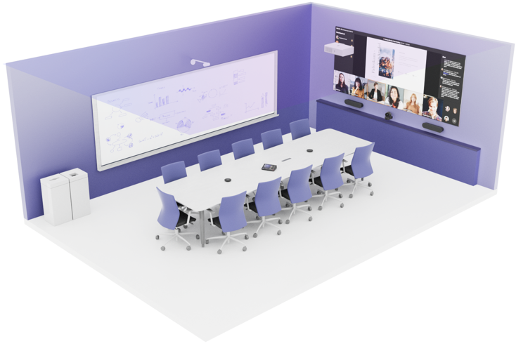
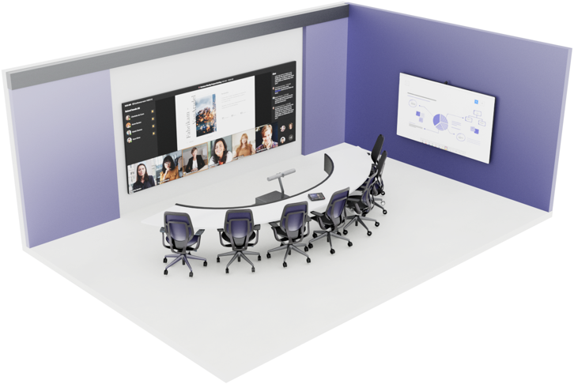
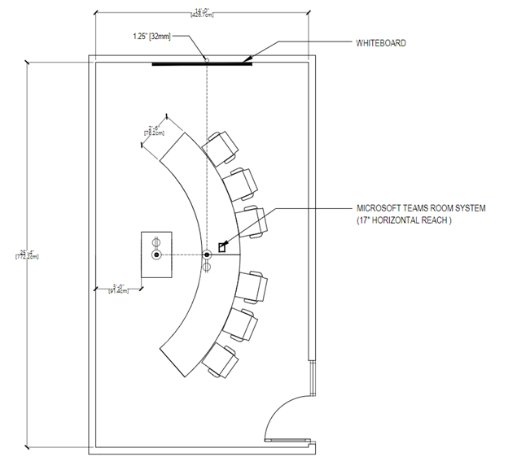

# Step 3 - Design a new meeting space or update an existing space

This article is intended to guide users on how to optimize meeting spaces with Microsoft Teams Rooms solutions and devices. It includes information on Teams Rooms device and solution uses, layouts, and specifications.

Select whether you want to design and build a hybrid-optimized meeting space optimized for hybrid meetings or if you want to update an existing, traditional, space that already has some components, such as a conference table, displays, and so on.

# [Traditional](#tab/traditional)

Microsoft Teams Rooms can be deployed to any existing meeting space. These spaces typically have a conference table, whiteboard, corkboard, and a projection system to present content from a device. By integrating with your existing furniture and audio-visual hardware, Teams Rooms can simplify the pre-meeting setup for presenters and make remote users equal participants in the meeting.

## Traditional room size and capacity

:::image type="content" source="media/hybrid-audience-facilities-small.png" alt-text="Facilities audience" border="false":::

This space will comfortably fit up to 10 people. You'll need a space that's approximately 25 feet wide by 14 feet deep.

:::image type="content" source="media/hybrid-standard-room-blueprint.png" alt-text="Blueprint of traditional meeting room design":::

## Traditional room furniture

:::image type="content" source="media/hybrid-audience-facilities-small.png" alt-text="Facilities audience" border="false":::

This room incorporates a rectangle conference table that's common in many meeting spaces. Participants can sit on either side of the table with a clear view of the front-of-room display.

## Traditional equipment mounting

:::image type="content" source="media/hybrid-audience-audiovisual-small.png" alt-text="Audio visual audience" border="false"::: :::image type="content" source="media/hybrid-audience-facilities-small.png" alt-text="Facilities audience" border="false":::

Selecting a location for hardware is typically driven by the selection of Teams Room-certified hardware used within a given meeting space.

| Component      | Recommendations                                                                                                                                                                                                                                                                                                                                                             |
|----------------|-----------------------------------------------------------------------------------------------------------------------------------------------------------------------------------------------------------------------------------------------------------------------------------------------------------------------------------------------------------------------------|
| Console        | Place the touch console in the center of the conference table. If participants on both sides of the table need to operate the console, consider a console that will swivel. Make sure the console doesn't impede the use of personal devices and documents.                                                                                                                 |
| Compute        | Some Teams Rooms devices have separate touch console and compute components. If yours has a separate compute component, locate the component in a location where cabling from the console and all room peripherals (display, microphones, speakers, and so on) can reach the component.                                                                                     |
| Primary camera | Mount the camera in a location that allows it to view the entire room. Below the display and centered horizontally is often a good location to get a view of all participants. If you choose a soundbar with integrated camera, your placement options may be limited to beneath the display. Keep camera field of view in mind when placing the camera.                    |
| Content camera | If you have a whiteboard and plan to use a content camera, make sure the camera is placed where it doesn't interfere with your display. The camera needs to be placed at least a couple feet out from the wall so it can see the whiteboard. If you're using a projector, make sure the camera doesn't cast a shadow on the projector screen.                               |
| Microphones    | Place at least two microphones on the conference table so that no participants are more than a few feet from one (exact distances depend on the microphone you use). Make sure microphone coverage overlaps so that all participants can be heard. Placing microphones in the ceiling can be an alternative depending on how the room is constructed.                       |
| Display        | Mount your display so that all participants can easy see it. Make sure the wall it's located on has enough strength to support the weight of the display and that you can run cabling from the display to the Teams Rooms console or compute device.                                                                                                                        |
| Speakers       | If you didn't choose a soundbar with integrated camera, place speakers to either side of the display to get the most benefit out of stereo audio. You can also place speakers in the ceiling but keep left and right channel placement in mind for spatial audio. Also try to maintain separation between speakers and microphones that also may be placed in the ceiling. |

We recommend that you mount the Microsoft Teams Rooms compute and touch console at the table, with an integrated camera and soundbar device (with discrete left and right-channel audio for spatial audio) mounted below the front-of-room display. It's important to keep the console within reach of participants without impeding their use of the table for personal devices and/or documents.

Most participants will choose to share content within this type of meeting room by joining the Teams meeting via a personal device. However, in-room local video presentation should also be made available at the table in an easily accessible manner for those who are unable to join the meeting call.

# [Hybrid-optimized](#tab/hybrid)

Hybrid-optimized Microsoft Teams Rooms are not meant to be a replacement for all other meeting spaces inside your organization, but rather to act as a supplement to existing meeting spaces that utilize Microsoft Teams. They should be deployed strategically within your organization to the spaces and locations where face-to-face interactions with remote meeting participants will be most valued.

## Hybrid-optimized room size and capacity

:::image type="content" source="media/hybrid-audience-facilities-small.png" alt-text="Facilities audience" border="false":::

This space will comfortably fit six to eight people. You'll need a space that's approximately 25 feet wide by 14 feet deep.

## Hybrid-optimized room furniture

:::image type="content" source="media/hybrid-audience-facilities-small.png" alt-text="Facilities audience" border="false":::

This room features a curved table with participants seated on one side, allowing in-room participants to retain visibility of each other and be positioned face to face with remote participants.

This room features a traditional meeting room table with a height of 30 in or 76 cm.

## Hybrid-optimized equipment mounting

:::image type="content" source="media/hybrid-audience-audiovisual-small.png" alt-text="Audio visual audience" border="false"::: :::image type="content" source="media/hybrid-audience-facilities-small.png" alt-text="Facilities audience" border="false":::

The hybrid-optimized meeting room shown in the images above requires specific placement of Teams Rooms devices to create the best hybrid meeting experience.

| Component      | Recommendations                                                                                                                                                                                                                                                                                                                                                             |
|----------------|-----------------------------------------------------------------------------------------------------------------------------------------------------------------------------------------------------------------------------------------------------------------------------------------------------------------------------------------------------------------------------|
| Console        | Place the touch console in the center of the conference table. Make sure the console doesn't impede the use of personal devices and documents.                                                                                                                 |
| Compute        | Some Teams Rooms devices have separate touch console and compute components. If yours has a separate compute component, locate the component in a location where cabling from the console and all room peripherals (display, microphones, speakers, and so on) can reach the component.                                                                                     |
| Primary camera | We recommend that you use a soundbar with an integrated camera mounted on specialized furniture. Place the sound bar and furniture between the front edges of the curved table and the display at a height that doesn't interfere with participants' view of the display. Take the camera's field of view into account when determining the correct location for the soundbar and furniture.                    |
| Content camera | If you have a whiteboard and plan to use a content camera, make sure the camera is placed where it doesn't interfere with your display. The camera needs to be placed at least a couple feet out from the wall so it can see the whiteboard. If you're using a projector, make sure the camera doesn't cast a shadow on the projector screen.                               |
| Microphones    | The microphones in the soundbar should provide adequate coverage for all participants seated at the conference table.                        |
| Display        | Mount your display so that all participants can easy see it. Make sure the wall it's located on has enough strength to support the weight of the display and that you can run cabling from the display to the Teams Rooms console or compute device.                                                                                                                        |
| Speakers       | If you didn't choose a soundbar with integrated camera, place speakers to either side of the display to get the most benefit out of stereo audio. You can also place speakers in the ceiling but keep left and right channel placement in mind for spatial audio. Also try to maintain separation between speakers and microphones that also may be placed in the ceiling. |

---

## Local video presentation

:::image type="content" source="media/hybrid-audience-audiovisual-small.png" alt-text="Audio visual audience" border="false":::

Though many participants may choose to share content within this type of meeting room by joining the Teams meeting via a personal device to the Teams call, in-room local video presentation should also be made available at the table in an easily accessible manner.

## Infrastructure

:::image type="content" source="media/hybrid-audience-facilities-small.png" alt-text="Facilities audience" border="false":::

| Component         | Recommendations                                                                                                                                                                                                                                                                                                                          |
|-------------------|------------------------------------------------------------------------------------------------------------------------------------------------------------------------------------------------------------------------------------------------------------------------------------------------------------------------------------------|
| Electrical        | At a minimum, electrical power connections should be provided at both the table (for end users) and at the equipment mounting location. If co-create devices are used in the space, electrical power connections may also be required at their location(s).                                                                              |
| Network drops     | Networking connections should be provided at both the table (for end users) and at the equipment mounting location (for the main network for the Teams Rooms solution). If co-create devices are used in the space, network connections will also be required that connect to the main network for the Teams Rooms solution.             |
| Wall treatments   | At least two walls in a room of this type should be acoustically treated to prevent echo and ambient noise issues during meetings.                                                                                                                                                                                                       |
| Window treatments | Light from windows in a room of this type may negatively affect the lighting and introduce glare and shadows to both the camera image and the front-of-room display. Any space featuring windows should also feature window treatments that allow for external light to be blocked during meetings.                                      |
| Floor treatments  | The floor in a room of this type should be carpeted or otherwise acoustically treated to prevent echo and ambient noise issues during meetings.                                                                                                                                                                                          |
| Lighting          | Overhead lights should be provided to illuminate the space evenly, with meeting room participants not appearing to be washed out or sitting in a dark space. Efforts to minimize direct lighting on front-of-room displays, co-create devices, or other reflective surfaces within the space should be taken to avoid introducing glare. |
