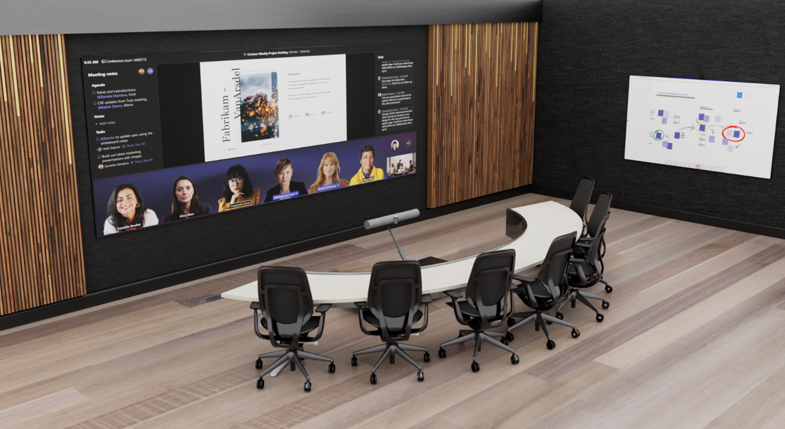

# Step 3 - Design a new meeting space or update an existing space

This article is intended to guide users on how to optimize meeting spaces with Microsoft Teams Rooms solutions and devices. It includes information on Teams Rooms device and solution uses, layouts, and specifications.

Select whether you want to design and build a new meeting space from scratch or if you want to update an existing space that already has some components, such as a conference table, displays, and so on.

# [Design a new space](#tab/new-room)

## Room size and capacity

To comfortably fit six to eight people, you'll need a space that's approximately 25 feet wide by 14 feet deep.

## Room furniture

This room features a curved table with participants seated on one side, allowing in-room participants to retain visibility of each other and be positioned face to face with remote participants.

This room features a standard meeting room table with a height of 30 in or 76 cm.

## Equipment mounting

Selecting a location for hardware is typically driven by the selection of Teams Room-certified hardware used within a given meeting space.

For the initial deployments of enhanced rooms within our Microsoft facilities, we have chosen to mount the Microsoft Teams Rooms compute and touch console at the table, with an integrated camera and soundbar device (with discrete left- and right-channel audio for spatial audio) mounted on specialized furniture, located below the displayed image as well as between the front-of-room projection and the table. It's important to keep the console within reach of participants without impeding their use of the table for personal devices and/or documents. For the display, a short-throw high-resolution projector is used.

Most participants will choose to share content within this type of meeting room by joining the Teams meeting via a personal device. However, in-room local video presentation should also be made available at the table in an easily accessible manner for those who are unable to join the meeting call.

## Touch console placement

The Microsoft Teams Rooms touch console should be mounted in the center of the table within easy reach of meeting participants without blocking usage of the table for personal devices or documents.

## Local video presentation

Though many participants may choose to share content within this type of meeting room by joining the Teams meeting via a personal device to the Teams call, in-room local video presentation should also be made available at the table in an easily accessible manner.

## Infrastructure

| Component         | Recommendations                                                                                                                                                                                                                                                                                                                          |
|-------------------|------------------------------------------------------------------------------------------------------------------------------------------------------------------------------------------------------------------------------------------------------------------------------------------------------------------------------------------|
| Electrical        | At a minimum, electrical power connections should be provided at both the table (for end users) and at the equipment mounting location. If co-create devices are used in the space, electrical power connections may also be required at their location(s).                                                                              |
| Network drops     | Networking connections should be provided at both the table (for end users) and at the equipment mounting location (for the main network for the Teams Rooms solution). If co-create devices are used in the space, network connections will also be required that connect to the main network for the Teams Rooms solution.             |
| Wall treatments   | At least two walls in a room of this type should be acoustically treated to prevent echo and ambient noise issues during meetings.                                                                                                                                                                                                       |
| Window treatments | Light from windows in a room of this type may negatively affect the lighting and introduce glare and shadows to both the camera image and the front-of-room display. Any space featuring windows should also feature window treatments that allow for external light to be blocked during meetings.                                      |
| Floor treatments  | The floor in a room of this type should be carpeted or otherwise acoustically treated to prevent echo and ambient noise issues during meetings.                                                                                                                                                                                          |
| Lighting          | Overhead lights should be provided to illuminate the space evenly, with meeting room participants not appearing to be washed out or sitting in a dark space. Efforts to minimize direct lighting on front-of-room displays, co-create devices, or other reflective surfaces within the space should be taken to avoid introducing glare. |

# [Update an existing space](#tab/updated-room)

