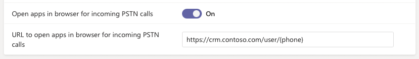

# Routing inbound calls

This article describes how to route incoming calls that come from the Public Switched Telephone Network (PSTN) or calls that are federated.

Federated calls are calls that don't originate from the PSTN and that are outside your tenant. For example, a call from Teams or Skype for Business that is from another tenant would be considered federated. However, a Teams or Skype for Business (Online or on premises) call made within the same tenant wouldn't be considered a federated call.

As an admin, you can create policies that help prevent your users from getting unwanted calls from external parties. You can control whether these external calls should always be sent to voicemail, sent to unanswered settings, or use normal call routing. For PSTN calls, you can also allow your users within the policy to decide.

This article applies to Microsoft Calling Plans, Operator Connect, Teams Phone Mobile, and Direct Routing. These policy settings are also available for GCCH & DoD use.

Calls that come from the PSTN or are federated can be routed in the following ways:

- **Use default settings** The call is routed using your default inbound call routing settings. This is the default setting for PSTN and federated calls.
- **Use unanswered settings** The call is routed according to the unanswered call forwarding settings set for that user.
- **Send to voicemail** The call is routed directly to voicemail and isn't shown to the user. If the called user doesn't have voicemail enabled, the call will be disconnected. For more information on voicemail, see [Set up Cloud Voicemail](set-up-phone-system-voicemail.md).
- **Let users decide** (PSTN calls only) Users can determine their PSTN call routing choice from call settings in the Teams app.

For information on busy options, see [Configure busy options](#configure-busy-options).

## Routing for PSTN calls

This policy setting controls how inbound PSTN calls should be routed. These PSTN calls can be sent to voicemail, sent to unanswered settings, use default call routing, or you can allow your users to decide.

You can configure this setting by using the Teams admin center or PowerShell.

If **Use unanswered settings** or **Send to voicemail** is used, either of these settings will have precedence over other call forwarding settings like call forwarding with simultaneous ringing to delegate, call groups, or call forwarding.

### Using the Teams admin center

1. In the left navigation of the Microsoft Teams admin center, select **Voice** > **Calling policies**.

1. Choose the policy you would like to update or select **Add** to create a new policy.

1. Select an option for **Routing for PSTN calls**.

1. Select **Save**.

### Using PowerShell

For example, this script sets `-InboundPstnCallRoutingTreatment` to route inbound PSTN calls according to the unanswered call forwarding settings for users in the Global (default) Teams Calling Policy instance:

```powershell
Set-CsTeamsCallingPolicy -Identity Global -InboundPstnCallRoutingTreatment Unanswered
```

For more information, see [Set-CsTeamsCallingPolicy](/powershell/module/teams/set-csteamscallingpolicy).

## Routing for federated calls

This policy setting controls how inbound federated calls should be routed. These federated calls can be sent to voicemail, sent to unanswered settings, or use default call routing.

You can configure this setting by using the Teams admin center or PowerShell.

If **Unanswered** or **Send to voicemail** is used, either of these settings will have precedence over other call forwarding settings like call forwarding with simultaneous ringing to delegate, call groups, or call forwarding.

### Using the Teams admin center

1. In the left navigation of the Microsoft Teams admin center, select **Voice** > **Calling policies**.

1. Select the policy you would like to update or select **Add** to create a new policy.

1. Choose an option for **Routing for federated calls**.

1. Select **Save**.

### Using PowerShell

For example, this script sets `-InboundFederatedCallRoutingTreatment` to route inbound federated calls directly to voicemail for users in the Global (default) Teams Calling Policy instance:

```powershell
Set-CsTeamsCallingPolicy -Identity Global -InboundFederatedCallRoutingTreatment Voicemail
```

For more information, see [Set-CsTeamsCallingPolicy](/powershell/module/teams/set-csteamscallingpolicy).

## Open apps in browser for incoming PSTN calls

The **Open apps in browser for incoming PSTN calls** setting, located in the Teams admin center at **Voice** > **Calling policies**, controls whether apps are automatically opened in the browser for incoming PSTN calls to your users. This can be used to pass the phone number of an inbound caller to an app to find the associated customer record while the call is taking place. This setting is off by default.

If turned on, a link to the app needs to be given in the **URL to open apps in browser for incoming PSTN calls** box. You can use the {phone} placeholder to pass the phone number (in E.164 format) to the provided URL. Or, you can give a generic URL without any placeholder. This setting simply launches the listed URL.



This setting can also be configured using PowerShell with the `-PopoutForIncomingPstnCalls`and `-PopoutAppPathForIncomingPstnCalls` parameters in [Set-CsTeamsCallingPolicy](/powershell/module/teams/set-csteamscallingpolicy).

## Configure busy options

**Busy on busy during calls** (also called "busy options") lets you configure how incoming calls are handled when a user is already in a call or conference or has a call placed on hold. New or incoming calls can be rejected with a busy signal or can be routed accordingly to the user's unanswered settings. Regardless of how their busy options are configured, users in a call or conference or those with a call on hold are not prevented from initiating new calls or conferences. This setting is set to **Off** by default. This setting does not apply to incoming group calls or meeting join requests.

### Using the Teams admin center

1. In the left navigation of the Microsoft Teams admin center, select **Voice** > **Calling policies**.

1. Select the policy you would like to update or select **Add** to create a new policy.

1. Choose an option for **Busy on busy during calls**:

    - **Off** No busy option is enabled and new or incoming calls can still go to the user while the user is already in a call.
    - **On** New or incoming calls will be rejected with a busy signal.
    - **Use unanswered settings** The user's unanswered settings will be used, such as routing to voicemail or forwarding to another user.
    - **Let users decide** Users can determine their busy options choice from call settings in the Teams app.

1. Select **Save**.

### Using PowerShell

With PowerShell, you can configure the `-BusyOnBusyEnabledType` parameter with [Set-CsTeamsCallingPolicy](/powershell/module/teams/set-csteamscallingpolicy).

For example, this script allows users to choose their busy options for users in the global policy instance:

```powershell
Set-CsTeamsCallingPolicy -Identity Global -BusyOnBusyEnabledType UserOverride
```

This example sets the busy options to the user's unanswered settings for users in the global policy instance:

```powershell
Set-CsTeamsCallingPolicy -Identity Global -BusyOnBusyEnabledType Unanswered
```

For more information, see [Set-CsTeamsCallingPolicy](/powershell/module/teams/set-csteamscallingpolicy).

## Related articles

[Set-CsTeamsCallingPolicy](/powershell/module/teams/set-csteamscallingpolicy)

[Configure calling policies in Microsoft Teams](teams-calling-policy.md)

[Block inbound calls in Microsoft Teams](block-inbound-calls.md)

[Configure call forwarding and delegation settings](user-call-settings.md)

[Voice policies reference](settings-policies-reference.md#voice)
