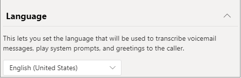

Call queues provide:

- A greeting message.
- Music while people are waiting on hold in a queue.
- Call routing - in *First In, First Out* (FIFO) order - to agents.
- Handling options for queue overflow and timeout.

Be sure you have read [Plan for Teams auto attendants and call queues](../plan-auto-attendant-call-queue.md) and followed the [getting started steps](../plan-auto-attendant-call-queue.md#getting-started) before you follow the procedures in this article.

**See the [Call Queue Feature Compatibility](../create-a-phone-system-call-queue.md#call-queue-feature-compatibility) matrix below for more information.**

## Video demonstration

This video shows a basic example of how to create a call queue in Teams.

> [!VIDEO https://www.microsoft.com/videoplayer/embed/RWCF23?autoplay=false]

## How to set up your call queue

### [Step 1: Create the call queue](#tab/create-queue)

## Step 1: Create the call queue

To set up a call queue, in the Teams admin center, expand **Voice**, click **Call queues**, and then click **Add**.

Type a name for the call queue.

### [Step 2 - Resource accounts](#tab/resource-account)

## Step 2: Add resource accounts

Click **Add accounts**, search for the resource account that you want to use with this call queue, click **Add**, and then click **Add**.

Agents will see the resource account name when they receive an incoming call.

For more information, see [Manage Teams resource accounts](../manage-resource-accounts.md).

### [Step 3 - Dynamic Caller ID](#tab/dynamic-caller-id)

## Dynamic Caller ID

**Available for Teams channel/collaborative calling desktop users and Teams mobile client users with standard call queues**

You can assign outbound caller ID numbers for the agents by specifying one or more resource accounts with a phone number. Agents can select which outbound caller ID number to use with each outbound call they make.

Click **Add**, search for the resource accounts that you want to allow agents to use for caller ID purposes when making outbound calls, click **Add**, and then click **Add**.

**Standard Call Queues**

For Teams desktop users and standard call queues consider directly setting the caller ID for members of the call queue to the service number of the call queue or appropriate auto attendant. For more information, see [Manage caller ID policies in Microsoft Teams](../caller-id-policies.md).

> [!NOTE]
> The resource account used for calling ID purposes must have a **Microsoft Teams Phone Resource Account** license and one of the following assigned:
>
> - A Calling Plan license and a phone number assigned
> - An Operator Connect phone number assigned
> - An online voice routing policy (phone number assignment is optional when using Direct Routing)

### [Step 4 - Language](#tab/language)

## Choose a language

Choose a [supported language](../create-a-phone-system-call-queue-languages.md).

This language will be used for system-generated voice prompts and voicemail transcription (if you enable them).

### [Step 5 - Greetings and music](#tab/greetings)

## Greetings and music on hold in queue

Specify if you want to play a greeting to callers when they arrive in the queue. You must upload an MP3, WAV, or WMA file containing the greeting that you want to play. The uploaded recording can be no larger than 5 MB.

Teams provides default music to callers while they are on hold in a queue. The default music supplied in Teams call queues is free of any royalties payable by your organization. If you want to play a specific audio file, choose **Play an audio file** and upload an MP3, WAV, or WMA file.

> [!NOTE]
> You are responsible for independently clearing and securing all necessary rights and permissions to use any music or audio file with your Microsoft Teams service, which may include intellectual property and other rights in any music, sound effects, audio, brands, names, and other content in the audio file from all relevant rights holders, which may include artists, actors, performers, musicians, songwriters, composers, record labels, music publishers, unions, guilds, rights societies, collective management organizations and any other parties who own, control or license the music copyrights, sound effects, audio and other intellectual property rights.

### [Step 6 - Call agents](#tab/call-agents)

## Call agents

Review the [prerequisites for adding agents to a call queue](../plan-auto-attendant-call-queue.md#prerequisites).

### Teams channel

You can add up to 200 agents via a Teams channel. You must be a member of the team or the creator or an owner of the channel to add a channel to the queue.

If you want to [use a Teams channel to manage the queue](https://support.microsoft.com/office/9f07dabe-91c6-4a9b-a545-8ffdddd2504e), select the **Choose a team** option and click **Add a channel**. Search for the team that you want to use, select it, and click **Add**. Select the channel that you want to use (only standard channels are supported) and click **Apply**.

The following clients are supported when using a Teams channel for call queues:

- Microsoft Teams Windows client
- Microsoft Teams Mac client

> [!NOTE]
> If you use this option, it can take up to 24 hours for the call queue to be fully operational.

### Users and groups

You can add up to 20 agents individually and up to 200 agents via groups.

If you want to add individual users or groups to the queue, select the **Choose users and groups** option.

To add a user to the queue, click **Add users**, search for the user, click **Add**, and then click **Add**.

To add a group to the queue, click **Add groups**, search for the group, click **Add**, and then click **Add**. You can use distribution lists, security groups, and Microsoft 365 groups or Microsoft Teams teams.

> [!NOTE]
> New users added to a group can take up to eight hours for their first call to arrive.

### [Step 7 - Call routing](#tab/call-routing)

## Call routing

**Conference mode** significantly reduces the amount of time it takes for a caller to be connected to an agent, after the agent accepts the call. For conference mode to work, agents in the call queue must use one of the following clients:

- The latest version of the Microsoft Teams desktop client, Android app, or iOS app
- Microsoft Teams Phone version 1449/1.0.94.2020051601 or later
  
Agents' Teams accounts must be set to Teams-only mode. Agents who don't meet the requirements aren't included in the call routing list. We recommend enabling conference mode for your call queues if your agents are all using compatible clients.

> [!NOTE]
> Conference mode is not supported if phone calls are routed to the queue from a Direct Routing gateway that is enabled for Location Based Routing.

> [!TIP]
> Setting **Conference mode** to **On** is the recommended setting.

**Routing method** determines the order in which agents receive calls from the queue. Choose from these options:

- **Attendant routing** rings all agents in the queue at the same time. The first call agent to pick up the call gets the call.

- **Serial routing** rings all call agents one by one in the order specified in the **Call agents** list. If an agent dismisses or does not pick up a call, the call will ring the next agent. This will repeat until the call is picked up or times out.

- **Round robin** balances the routing of incoming calls so that each call agent gets the same number of calls from the queue. This routing method may be desirable in an inbound sales environment to assure equal opportunity among all the call agents.

- **Longest idle** routes each call to the agent who has been idle the longest time. An agent is considered idle if their presence state is Available. Agents whose presence state is not Available will not be eligible to receive calls until they change their presence to Available.

> [!TIP]
> Setting **Routing Method** to **Round robin** or **Longest idle** is the recommended setting.

> [!NOTE]
> If [Compliance recording](../teams-recording-policy.md) is enabled on the agents, the combination of **Conference mode** and **Attendant routing** is not supported. If you need to use **Conference mode**, select **Serial Routing**, **Round robin**, or **Longest idle** as the **Routing method**. If you need to use **Attendant routing**, set **Conference mode** to **Off**.
>
> When using **Longest idle** and when there are less calls in queue than available agents, only the first two longest idle agents will be presented with calls from the queue.
>
> When using **Longest idle** there may be times when an agent receives a call from the queue shortly after becoming unavailable or a short delay in receiving a call from the queue after becoming available.
>
> Call Queue call presentation to agents may conflict with Location Based Routing restrictions. In this case, the agent will receive a call toast but will not be able to answer the call. This condition will continue until another agent is available to answer the call, the caller hangs up or the call queue timeout condition occurs.  

**Presence-based routing** uses the availability status of call agents to determine whether an agent should be included in the call routing list for the selected routing method. Call agents whose availability status is set to **Available** are included in the call routing list and can receive calls. Agents whose availability status is set to any other status are excluded from the call routing list and won't receive calls until their availability status changes back to **Available**.

You can enable presence-based call routing with any of the routing methods.

If an agent opts out of getting calls, they won't be included in the call routing list regardless of what their availability status is set to.

> [!NOTE]
> When **Longest idle** is selected as the routing method, presence-based routing is required and automatically enabled even though the Presence-based routing toggle will be **Off** and grayed out.
>
> If presence-based routing is not enabled and there are multiple calls in the queue, the system will present these calls simultaneously to the agents regardless of their presence status. This will result in multiple call notifications to agents, particularly if some agents don’t answer the initial call presented to them.
>
> When using **Presence-based routing** there may be times when an agent receives a call from the queue shortly after becoming unavailable or a short delay in receiving a call from the queue after becoming available.
>
> Agents who use the Skype for Business client aren't included in the call routing list when presence-based routing is enabled. If you have agents who use Skype for Business, don't enable presence-based call routing.

> [!TIP]
> Setting **Presence-based routing** to **On** is the recommended setting.

**Agent alert time** specifies how long an agent's phone will ring before the queue redirects the call to the next agent.

> [!TIP]
> Setting **Agent alert time** to **20 seconds** is the recommended setting.

### [Step 8 - Call overflow](#tab/call-overflow)

## Call overflow handling

**Maximum calls in the queue** specifies the maximum number of calls that can wait in the queue at any given time. The default is 50, but it can range from 0 to 200. When this limit is reached, the call is handled as specified by the **When the maximum number of calls is reached** setting.

You can choose to disconnect the call or redirect it to any of the call routing destinations. For example, you might have the caller leave a voicemail for the agents in the queue. For external transfers, see [Prerequisites](../plan-auto-attendant-call-queue.md#prerequisites) and the [external phone number transfers - technical details](../create-a-phone-system-auto-attendant.md#external-phone-number-transfers---technical-details) for number formatting.

> [!NOTE]
> If the maximum number of calls is set to 0 then the greeting message will not play.

### [Step 9 - Call timeout](#tab/call-timeout)

## Call timeout handling

**Call Timeout: maximum wait time** specifies the maximum time a call can be on hold in the queue before it is redirected or disconnected. You can specify a value from 0 seconds to 45 minutes.

You can choose to disconnect the call or redirect it to one of the call routing destinations. For example, you might have the caller leave a voicemail for the agents in the queue. For external transfers, refer to [Prerequisites](../plan-auto-attendant-call-queue.md#prerequisites) and the [external phone number transfers - technical details](../create-a-phone-system-auto-attendant.md#external-phone-number-transfers---technical-details) for number formatting.

When you have selected your call timeout options, click **Save**.

---
