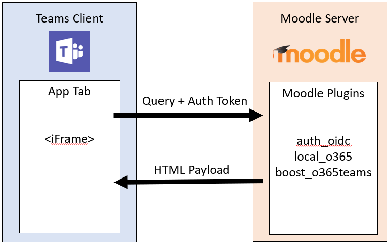
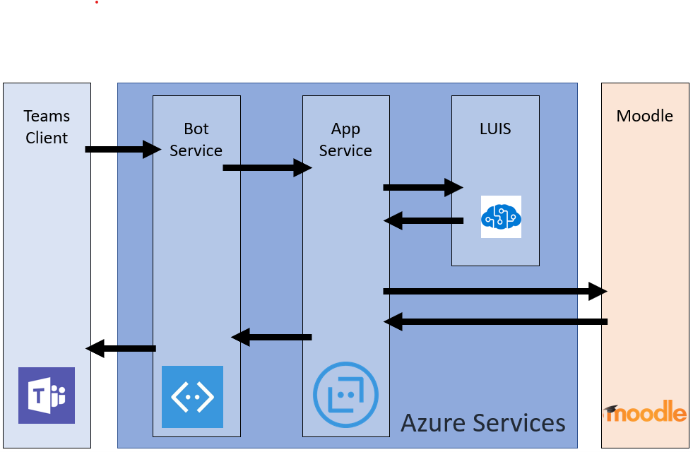

# Installing the Moodle integration with Microsoft Teams

> [!VIDEO https://www.youtube.com/embed/OHlPt22nKoE]

[Moodle](https://moodle.org/), the most popular and open-source Learning Management System (LMS) in the world, is now integrated with Microsoft Teams! This integration helps educators and teachers collaborate around Moodle courses, ask questions about their grades and assignments and stay updated with notifications -- right within Teams!

To help IT admins easily set this integration up, we have updated our open-source Office 365 Moodle Plugin with the following capabilities:

* Auto-registration of your Moodle server with Azure AD.
* One-click deployment of your Moodle Assistant bot to Azure.
* Auto-provisioning of teams and auto-synchronization of team enrollments for all or select Moodle courses.
* Auto-installation of the Moodle tab and the Moodle Assistant bot into each synchronized team. (Coming soon)
* One-click publishing of the Moodle app into your private Teams App Store. (Coming soon)

To learn more about the functionality this integration provides, go [here](https://education.microsoft.com/courses-and-resources/resources/microsoft-teams-moodle).

## Prerequisites

In order to install and configure this application you'll need:

1. Moodle administrator credentials
2. Azure AD administrator credentials
3. An Azure subscription you can create new resources in

## Step 1: Install the Office 365 Moodle Plugin

> [!VIDEO https://www.youtube.com/embed/SETEC5nzMgk]

The Moodle integration in Microsoft Teams is powered by the open source [Office 365 Moodle plugin set](https://github.com/Microsoft/o365-moodle). To install the plugin in your Moodle server:

1. First, download the [Office 365 plugin set](https://moodle.org/plugins/pluginversions.php?plugin=local_o365) and save it to your local computer. You'll need to use version 3.5 or newer.
    * Installing the local_o365 plugin will also install the [auth_oidc](https://moodle.org/plugins/auth_oidc) and [boost_o365Teams](https://moodle.org/plugins/pluginversions.php?plugin=theme_boost_o365teams) plugins.
1. Login to your Moodle server as an administrator, and select **Site administration** from the left navigation panel.
1. Select the **Plugins** tab, and then click **Install plugins**.
1. Under the **Install plugin from ZIP file** section click the **Choose a file** button.
1. Select the **Upload a file** options from the left navigation, browse for the file you downloaded above and click **Upload this file**.
1. Select the **Site administration** option from the left navigation panel again to return to your admin dashboard. Scroll down to the **Local plugins** and click the **Microsoft Office 365 Integration** link. Keep this configuration page open in a separate browser tab as you'll be using it throughout the rest of this process.

You can find more information on how to install Moodle plugins in the [Moodle documentation](https://docs.moodle.org/34/en/Installing_plugins).

**Important Note:** Keep your Office 365 Moodle Plugin configuration page open in a separate browser tab as you will be returning to this set of pages throughout this process.

*Don't have a Moodle site already?* You might want to check out our Moodle on Azure [repo](https://github.com/azure/moodle) where you can quickly deploy a Moodle instance on Azure and customize it to your needs.

## Step 2: Configure the connection between the Office 365 plugin and Azure Active Directory

> [!VIDEO https://www.youtube.com/embed/FpGEezaJ3SA]

Next you'll need to register Moodle as an application in your Azure Active Directory. We've provided a PowerShell script to help you complete this process. The PowerShell Script provisions a new Azure AD application for your Office 365 tenant, which will be used by the Office 365 Moodle Plugin. The script will provision the app for your O365 tenant, set up all the required Reply URLs and Permissions for the provisioned app and return the AppID and Key. You can use the generated AppID and Key in your O365 Moodle Plugin Setup Page to configure your Moodle server with Azure AD. If you want to see the detailed manual steps that the PowerShell script is automating, you can find them in the full [documentation for the plugin](https://docs.moodle.org/34/en/Office365#Register_your_Moodle_instance_as_an_Application).

### Moodle tab for Microsoft Teams information flow

1. From the Microsoft Office 365 Integration plugin page slect the **Setup** tab.
1. Click the **Download PowerShell Script** button and save it to your local computer.
1. You'll need to prepare the PowerShell script from the ZIP file. To do so:
    * Download and extract the `Moodle-AzureAD-Powershell.zip` file.
    * Open the extracted folder.
    * Right-click on the `Moodle-AzureAD-Script.ps1` file and select **Properties**.
    * Under the **General** tab of the Properties window, check the `Unblock` box next to the **Security** attribute at the bottom.
    * Click **OK**.
    * Copy the directory path of the extracted folder.
1. Next you'll run PowerShell as an administrator:
    * Click Start.
    * Type PowerShell.
    * Right-click Windows PowerShell.
    * Click "Run as Administrator".
1. Navigate to the unzipped directory by typing `cd ...\...\Moodle-AzureAD-Powershell` where `...\...` is the path to the directory.
1. Execute the PowerShell script by:
    * Enter `Set-ExecutionPolicy -ExecutionPolicy RemoteSigned -Scope CurrentUser`.
    * Enter `.\Moodle-AzureAD-Script.ps1`.
    * Login to your O365 Administrator account in the pop-up window.
    * Enter the name of the Azure AD Application (Ex. Moodle/Moodle plugin).
    * Enter the URL of your Moodle server.
    * Copy the **Application ID** and **Application Key** generated by the script and save them.
1. Next you'll need to add the Id and Key to the Office 365 Moodle Plugin. Return to the plugin administration page (Site administration > Plugins > Microsoft Office 365 Integration).
1. On the **Setup** tab add the **Application Id** and **Application Key** you copied previously, then click **Save changes**.
1. Once the page refreshes you should now see a new section **Choose connection method**. Click the checkbox labeled **Default** and then click **Save changes** again.
1. Once the page refreshes you will see another new section **Admin consent & additional information**.
    * Click the **Provide Admin Consent** link, enter your Office3 365 Global Administrator credentials, then **Accept** to grant the permissions.
    * Next to the **Azure AD Tenant** field click the **Detect** button.
    * Next to the **OneDrive for Business URL** click the **Detect** button.
    * Once the fields populate, click the **Save changes** button again.
1. Click the **Update** button to verify the installation, then **Save changes**.
1. Next you'll need to synchronize users between your Moodle server and Azure Active Directory. Depending on your environment, you may select different options during this stage. Note that the configuration you set here will run with each Moodle cron run (typically once a day) to keep everything in sync. To get started:
    * Switch to the **Sync Settings tab**
    * In the **Sync users with Azure AD** section, select the checkboxes that apply to your environment. Typically you would select at least:
        * Create accounts in Moodle for users in Azure AD
        * Update all accounts in Moodle for users in Azure AD
    * In the **User Creation Restriction** section you can setup a filter to limit the Azure AD users that will by synced to Moodle.
    * The **User Field Mapping** section will allow you to customize the Azure AD to Moodle User Profile field mapping.
    * In the **Teams Sync** section you can choose to automatically create Groups (i.e. Teams) for some, or all, of your existing Moodle courses.
1. To validate the cron jobs (and run them manually if you wish to for the first run) click the **Scheduled tasks management page** link in the **Sync users with Azure AD** section. This will take you to the **Scheduled Tasks** page.
    * Scroll down and find the job **Sync users with Azure AD** job and click **Run now**.
    * If you chose to create Groups based on existing courses, you can also run the **Create user groups in Office 365** job.
1. Return to the plugin administration page (Site administration > Plugins > Microsoft Office 365 Integration) and select the **Teams Settings** page. You'll need to configure some security settings to enable the Teams app integration.
    * To enable OpenID Connect, click the **Manage Authentication** link, and click the eye icon on the **OpenId Connect** line if it is greyed out.
    * Next you'll need to enable frame embedding. Click the **HTTP Security** link, then click the checkbox next to **Allow frame embedding**.
    * The next step is to enable web services which will enable the Moodle API features. Click the **Advanced Features** link, then make sure the checkbox next to **Enable web services** is checked.
    * Finally you'll need to enabled the external services for Office 365. Click the **External services** link then:
        * Click **Edit** on the **Moodle Office 365 Webservices** row.
        * Mark the checkbox next to **Enabled**, then click **Save Changes**
    * Next you'll need to edit your authenticated user permissions to allow them to create web service tokens. Click the **Editing role 'Authenticated user'** link. Scroll down and find the **Create a web service token** capability and mark the **Allow** checkbox.

## Step 3: Deploy the Moodle Assistant Bot to Azure

> [!VIDEO https://www.youtube.com/embed/gbkJxf8FlfY]

The free Moodle Assistant Bot for Microsoft Teams helps teachers and students answer questions about their courses, assignments, grades and other information in Moodle. The bot also sends Moodle notifications to students and teachers right within Teams. This bot is an open source project maintained by Microsoft, and is [available on GitHub](https://github.com/microsoft/Moodle-Teams-Bot).

> [!NOTE]
> In this section you will deploy resources to your Azure subscription, and all resources will be configured using the **free** tier. Depending on the usage of your bot, you may need to scale these resources.
> If you want to just use the Moodle tab without the bot, skip to [step 4](#step-4-deploy-your-microsoft-teams-app).

### Moodle bot information flow

To install the bot, you'll first need to register it on the [Microsoft Identity Platform](https://identity.microsoft.com/Landing). This allows your Bot to authenticate against your Microsoft endpoints. To register your bot:

1. Return to the plugin administration page (Site administration > Plugins > Microsoft Office 365 Integration) and select the **Teams Settings** tab.
1. Click the **Microsoft Application Registration Portal** link and login with your Microsoft Id.
1. Enter a name for you app (Eg. MoodleBot) and click the **Create** button.
1. Copy the **Application Id** and paste it into the **Bot Application ID** field on the **Team Settings** page.
1. Click the **Generate New Password** button. Copy the generated password and and paste it into the **Bot Application Password** field on the **Team Settings** page.
1. Scroll to the bottom of the form and click **Save Changes**.

Now that you've generated your Application Id and Password, it's time to deploy your bot to Azure. Click on the **Deploy to Azure** button and fill out the form with the necessary information (the Bot Application Id, Bot Application Password and the Moodle Secret are on the **Team Settings** page, and the Azure information is on the **Setup** page). Once you've got the form filled out, click the check box to agree to the terms and conditions then click the **Purchase** button (all Azure resources are deployed to the free tier).

Once the resources are finished deploying to Azure, you'll need to configure the Office 365 Moodle plugin with it's messaging endpoint. First, you'll need to get the endpoint from you Bot in Azure. To do that:

1. If you aren't already, log into the [Azure portal](https://portal.azure.com).
2. In the left pane select **Resource groups**.
3. From the list select the resource group you just used (or created) while deploying your Bot.
4. Select the **WebApp Bot** resource from the list of resources in the group.
5. Copy the **Messaging Endpoint** from the **Overview** section.
6. In Moodle, open the **Team Settings** page of your Office 365 Moodle Plugin.
7. In the **Bot Endpoint** field paste the URL you just copied and change the word *messages* to *webhook*. The URL should now look like `https://botname.azurewebsites.net/api/webhook`
8. Click **Save Changes**
9. Once your changes have saved, go back to the **Team Settings** tab, click the **Download manifest file** button and save the manifest package to your computer (you'll use it in the next section).

## Step 4: Deploy your Microsoft Teams app

> [!VIDEO https://www.youtube.com/embed/2rMb7gtM_ZM]

Now that you have your Bot deployed to Azure and configured to talk to your Moodle server, it's time to deploy your Microsoft Teams app. To do this you'll load the manifest file you downloaded from the Office 365 Moodle Plugin Team Settings page in the previous step.

Before you can install the app you'll need to make sure external apps and sideloading of apps is enabled. To do so you can follow [these steps](https://docs.microsoft.com/en-us/MicrosoftTeams/admin-settings). Once you've ensured that external apps are enabled, you can follow the steps below to deploy your app.

1. Open Microsoft Teams.
2. Click the **Store** icon on the lower-left of the navigation bar.
3. Click the **Upload a custom app** link from the list of options. *Note:* If you're logged in as a global administer you'll have the option of uploading the app to your organization's app store, otherwise you'll only be able to load the app for Teams you're a part of ("sideloading").
4. Select the `manifest.zip` package you downloaded previously and click **Save**. If you haven't yet downloaded the manifest package, you can do so from the **Team Settings** tab of the plugin configuration page in Moodle.

Now that you have the app installed you can add the tab to any channel that you have access to. To do so navigate to the channel, click the **+** symbol and select your app from the list. Follow the prompts to finish adding your Moodle course tab to a channel.

That's it! You and your team, can now start working with your Moodle courses directly from Microsoft Teams.

To share any feature requests or feedback with us, please visit our [User Voice page](https://microsoftteams.uservoice.com/forums/916759-moodle).