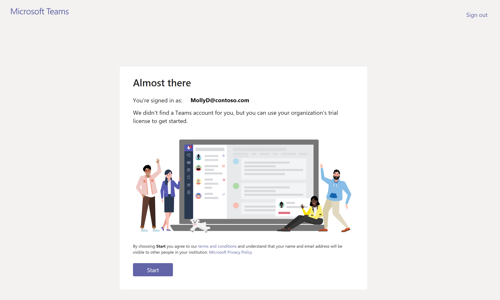
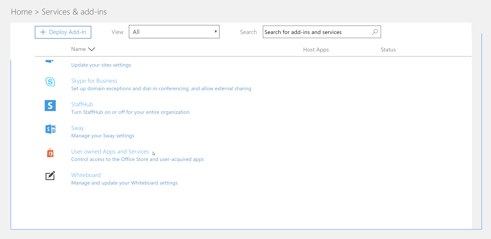
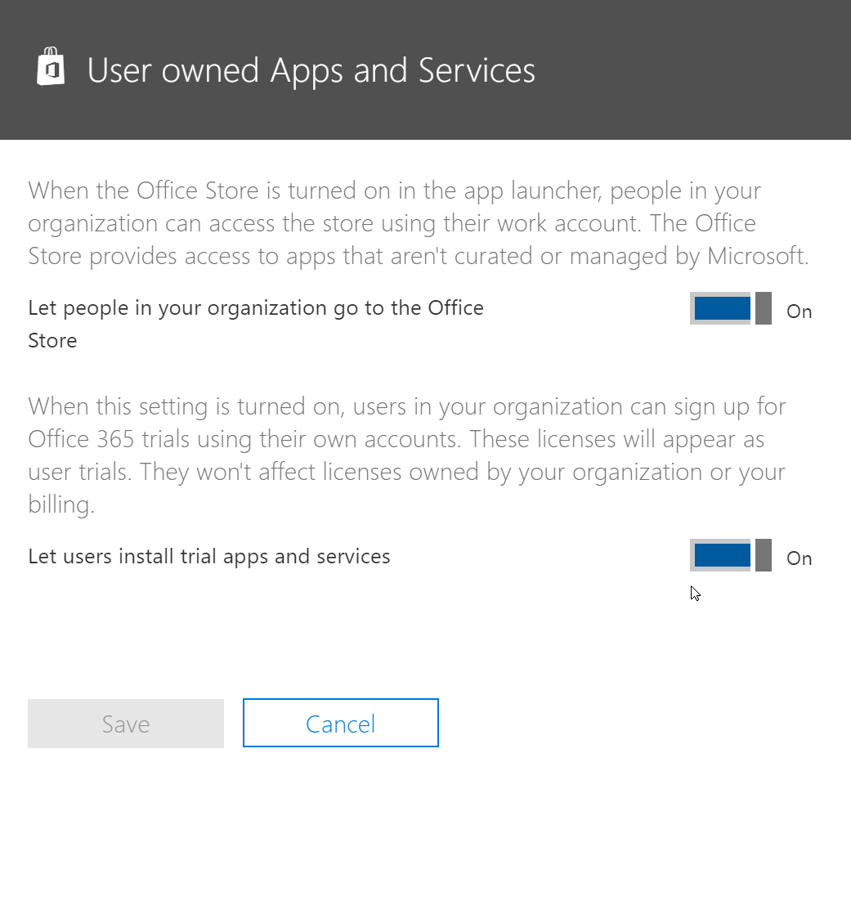
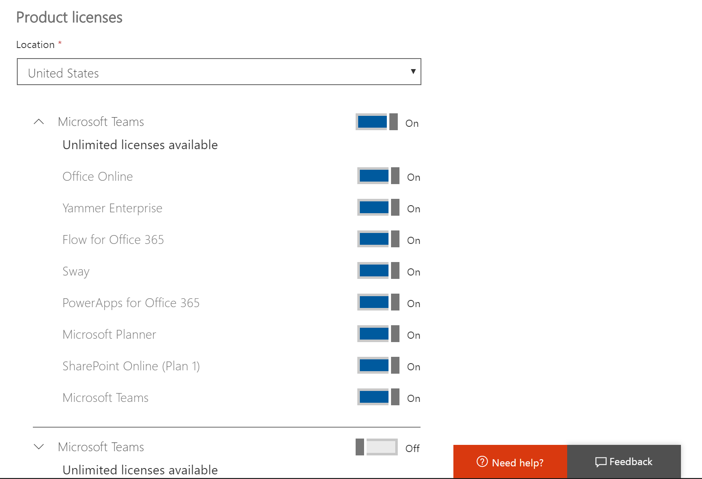

Manage the Microsoft Teams Commercial Cloud Trial offer
=======================================================

Microsoft Teams is a great collaborative tool for your organization. It empowers people and teams to discuss, innovate, and share ideas using the power of Office 365. The Microsoft Teams Commercial Cloud Trial offers existing Office 365 users in your organization who are not licensed for Microsoft Teams to initiate a 1-year trial of the product. Admins can switch this feature on or off for users in their organization. 

> [!IMPORTANT]
> The Microsoft Teams Commercial Cloud Trial has been updated to include additional service plans for increased Teams functionality and is now owned and controlled by your organization's billing admin. This makes the trial easier to manage and makes it consistent with all other Microsoft 365 offers. 

## What's in the offer

The service plans included in this offer are:

- Exchange Foundation
- Flow for Office 365 Plan 1
- Forms
- Microsoft Planner
- Microsoft Teams (Teams1, Teams IW)
- Office Online
- PowerApps for Office 365 Plan 1
- SharePoint Online Kiosk
- Stream
- Sway
- Whiteboard
- Yammer Enterprise 

The trial grants a one-year trial subscription to your entire organization. The trial makes 500,000 licenses available for assignment. For each license assigned, the trial allocates 2 GB of SharePoint Online storage. 

## Who is eligible

Users must be enabled to sign up for apps and trials (in the Microsoft 365 admin center). For more information, see [Manage the trial](#manage-the-trial), later in this article. 

Users who do not have an Office 365 license that includes Teams can initiate the Microsoft Teams Commercial Cloud Trial offer. For example, if a user has Office 365 Business (which doesn't include Teams), they are eligible for the trial.

## Who is not eligible

Your organization is not eligible for the trial if you are a Syndication Partner Customer or if you are a GCC, GCC High, DoD, or EDU customer.

If your organization is ineligible for the Microsoft Teams Commercial Cloud Trial offer, you will not see the **Let users install trial apps and services** switch.

## How users sign up for the trial

Eligible users can sign up for the trial offer by signing in to Teams ([teams.microsoft.com](https://teams.microsoft.com)). They will see the following screen to start the trial. 

All trials within your organization share the same start and end dates, which is the date the first user signed up for the trial. For example, if user A starts the first trial on January 25, 2019 and user B starts a trial on June 3, 2019, both users' trial will expire on January 25, 2020.

## Manage the trial

Trial licenses are assigned the same way any other subscription acquired by an admin is assigned. For more information, see [Assign licenses to users in Office 365 for business](https://docs.microsoft.com/office365/admin/subscriptions-and-billing/assign-licenses-to-users?view=o365-worldwide). 

In addition, admins can disable the ability for end users to claim trial apps and services within their organization. Currently, the trial described in this article is the only trial in this category, but it might apply to other similar programs in the future. 

### Prevent users from installing trial apps and services

You can turn off a user’s ability to install trial apps and services.

1. From the [Microsoft 365 admin center](https://portal.office.com/adminportal/home), go to **Settings** > **Services & add-ins** > **User owned Apps and Services**.

    

2. Turn off **Let users install trial apps and services**.

    

### Manage trial availability for a user with a license that includes Teams

A user who is assigned a license that includes Teams is not eligible for the trial. When the Teams service plan is enabled, the user can sign in and use Teams. If the service plan is disabled, the user cannot sign in and is not presented with the trial option either.

To turn off access to Teams:

1. In the Microsoft 365 admin center, select **Users** > **Active users**.

2. Select the box next to the name of the user.

3. On the right, in the **Product licenses** row, choose **Edit**.

4. In the **Product licenses** pane, switch the toggle to **Off**.

    

### Manage Teams availability for users who already claimed the trial

If a user has claimed a Teams trial license, you can remove it by removing the license or service plan.

To turn off the trial license:

1. In the Microsoft 365 admin center, select **Users** > **Active users**.

2. Select the box next to the name of the user.

3. On the right, in the **Product licenses** row, choose **Edit**.

4. In the **Product licenses** pane, switch the toggle to **Off**.

    
    
>[!Note]
>The Microsoft Teams Trial toggle switch will appear after the first user in the organization signs up for the trial.

### Manage Teams for users who have the trial license

You can manage users who have a trial license just like you manage users who have a regular paid license. For more information, see [Manage Microsoft Teams settings for your organization](enable-features-office-365.md).

### Upgrade users from the trial license

To upgrade users from the trial license, do the following:

1. Purchase a subscription that includes Teams.

2. Remove the Teams trial subscription from the user.

3. Assign the newly purchased license.

For more information, see [Office 365 licensing for Microsoft Teams](Office-365-licensing.md).

> [!NOTE]
> If the trial ends and a user is not immediately upgraded to a subscription that includes teams, the user data is not removed. The user still exists in Azure Active Directory and all data within Teams still remains. Once a new license is assigned to the user to enable Teams functionality again, all content will still exist. 

### Remove a legacy Microsoft Teams Trial license

As of April 22, 2019, users can begin claiming the latest Microsoft Teams Commercial Cloud Trial license. If you would like to move users in your organization off of the legacy trial license and onto the latest one, you will need to first remove the legacy Microsoft Teams Trial license from each user. Once the legacy license is removed, each affected user can claim the updated Microsoft Teams Commercial Cloud Trial license.

- If you would like to remove this license via PowerShell, see:
[Remove licenses from user accounts with Office 365 PowerShell](https://docs.microsoft.com/en-us/office365/enterprise/powershell/remove-licenses-from-user-accounts-with-office-365-powershell)

- If you would like to remove this license through the admin portal, see:
[Remove licenses from users in Office 365 for business](https://docs.microsoft.com/en-us/office365/admin/subscriptions-and-billing/remove-licenses-from-users?view=o365-worldwide)