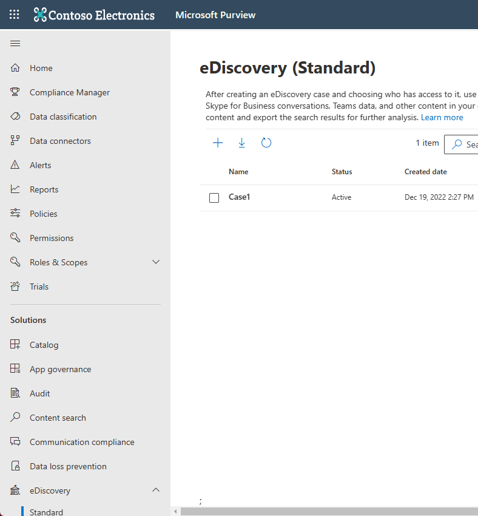
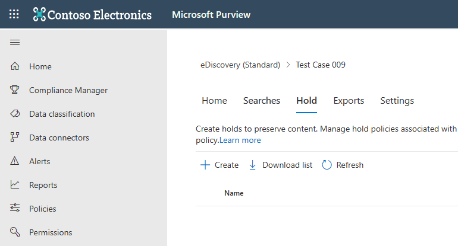
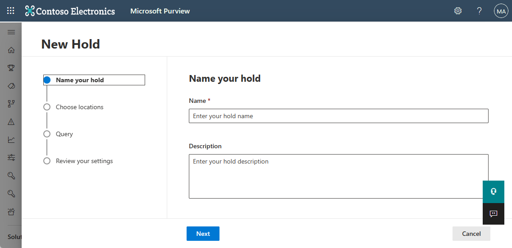

# Place a Microsoft Teams user or team on legal hold

When a reasonable expectation of litigation exists, organizations are required to preserve electronically stored information (ESI), including Teams chat messages that are relevant to the case. Organizations may need to preserve all messages related to a specific investigation or for a specific person. This article will discuss using a legal hold to preserve content in Microsoft Teams. To preserve content in other services in Microsoft 365, see [Create an eDiscovery hold](/microsoft-365/compliance/create-ediscovery-holds).

> [!NOTE]
> In February 2020, we turned on legal hold for private channels. Private channel chats are stored in user mailboxes, while standard channel chats are stored in the mailbox associated with the parent team. If there is already a legal hold in place for a user mailbox, the hold policy will now automatically apply to private channel messages stored in that mailbox. There is no further action needed for an admin to turn this on. Legal hold of files shared in private channels is also supported.

Within Microsoft Teams, an entire team or select users can be put on legal hold. Doing that will make sure that all messages that were exchanged in those teams (including private and shared channels) or messages exchanged by those individuals are discoverable by the organization's compliance managers or Teams Admins.

> [!NOTE]
> Placing a user on hold does not automatically place a group on hold or vice-versa.
> Notifications sent in activity feeds can't be placed on hold.

To put a user or a team on legal hold in a eDiscovery (Standard) case:

1. Go to the [Microsoft Purview compliance portal](https://compliance.microsoft.com). When you create a new case, you're presented with the option to place mailboxes or sites on hold.

2. Go to **eDiscovery** > **Core** and create a case by clicking **Create a case**. After the case is created, open it.
  
   

   > [!NOTE]
   > You can also place a user on a hold that's associated with an eDiscovery (Premium) case. For more information, see [Manage holds in eDiscovery (Premium)](/microsoft-365/compliance/managing-holds).

3. Go to the **Holds** tab on the top menu and click **Create** to create a hold. Placing a user or a team on hold preserves all the messages exchanged by those users. When you create a new case, you're presented with the option to place mailboxes or sites on hold.

   

   1. **Name your hold**. Select a descriptive and unique name for the hold you're going to create.
  
       

   2. **Choose location**. Choose whether you want the hold to be applied on a user or on an entire Team (a hold can't be applied on individual channels for now). If a user is on hold, all their messages are preserved, including messages in 1:1 chats, group chats, and private channels. Messages in standard and shared channels are preserved when the parent team is placed on hold.

      

   3. **Create query**. You can customize the hold if you want more granularity in the hold policy. For example, you can specify keywords to look for, or you can add more conditions, that would need to be satisfied for the hold to take effect.

   4. **Review your settings** before creating the hold.

After the hold is created, you can search the content retained by the hold policy. For more information, see [Conduct an eDiscovery investigation in Teams](eDiscovery-investigation.md).

> [!IMPORTANT]
> When a user or group is placed on hold, all compliance copies of messages are preserved. For example, if a user posts a message in a channel and then modifies the message, both copies of the message are preserved. Without the hold, only the latest message is preserved.

## Content locations to place on hold to preserve Teams content

As a helpful guide, use the following table to understand what content locations (such as a mailbox or a site) to place on hold to preserve different types of Teams content.

|Scenario  |Content location  |
|---------|---------|
|Chat messages for a user (for example, 1:1 chats, 1:N group chats, and private channel conversations)     |User mailbox         |
|Chat messages in standard and shared channels    |Mailbox associated with the parent team         |
|Files in standard channels (for example, Wiki content and files)     |SharePoint site associated with the parent team        |
|Files in private and shared channels     |Dedicated SharePoint site associated with the channel
|User's private content     |The user's OneDrive for Business account       |
|Card content in chats|User mailbox for 1:1 chats, 1:N group chats, and private channel conversations; the parent team mailbox for card content in standard and shared channel messages. For more information, see the "Preserve card content" section in [Create an eDiscovery hold](/microsoft-365/compliance/create-ediscovery-holds#preserve-card-content).|
|||

> [!NOTE]
> To retain message content in private channels, you need to put the user mailboxes (of the members of a private channel) on hold. and when using eDiscovery tool to search private channel messages, you have to search the user's mailbox. As was stated earlier, private channel chats are stored in user mailboxes, not in the group mailbox associated with the parent team.
