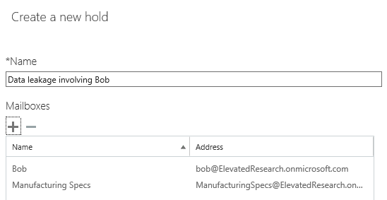

Place a Microsoft Teams user or team on legal hold
==================================================

To put a user or a team on Legal Hold, navigate to the [Security & Compliance Center](https://go.microsoft.com/fwlink/?linkid=854628). When you create a new case, you are presented with the option to place mailboxes or sites on hold.

> [!NOTE]
> Placing a user on hold does not automatically place a group on hold or vice-versa.

> [!IMPORTANT]
> When a user or group is placed on hold, all message copies will be retained. Example: Clay posted a message in a channel and then modified the message. In a hold scenario, both copies of the message are retained. Without Legal Hold, only the latest message is retained.

In the figure below, there is an investigation involving Clay. Clay is a member of the Brokers-Dealers team.

If we needed to Legal Hold all the places Clay could have discussed Brokering plans, ensure that the team’s SharePoint site is added to the Legal Hold site list, as well as Clay’s OneDrive for Business site.

To recap, use the table below to understand what needs to be placed on Legal Hold based on data requirements:

|Scenario  |What to place on hold  |
|---------|---------|
|**Microsoft Teams Private Chats**     |User mailbox         |
|**Microsoft Teams Channel Chats**    |Group mailbox used for the team         |
|**Microsoft Teams Content (e.g. Wiki, Files)**     |SharePoint site used by the team         |
|**Private Content**     |OneDrive for Business site of the user         |
