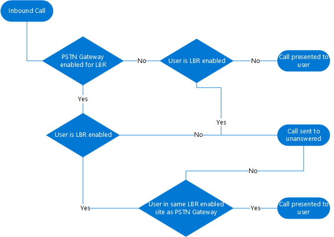
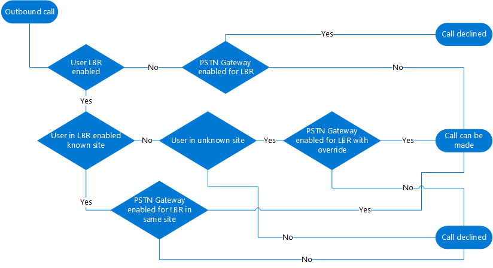

# Plan Location-Based Routing for Direct Routing

In some countries and regions, it's illegal to bypass the Public Switched Telephone Network (PSTN) provider to decrease long-distance calling costs. 

This article describes what you need to know to use Location-Based Routing to restrict toll bypass for Microsoft Teams users based on their geographic location. This article applies only to Direct Routing. Location-Based Routing doesn't apply to Calling Plan or Operator Connect.

When you're ready to enable Location-Based Routing, see:

- [Configure network settings for Location-Based Routing](location-based-routing-configure-network-settings.md)
- [Deploy network settings for Location-Based Routing](location-based-routing-configure-network-settings.md)
- [Enable Location-Based Routing for Direct Routing](location-based-routing-enable.md)

> [!NOTE]
> You should not use Location-Based Routing to dynamically route PSTN calls based on the location of the user. To do so may cause unintended results.

## Overview

Location-Based Routing lets you restrict toll bypass for a user based on policy and the user's geographic location at the time of an inbound or outbound PSTN call. 

Location-Based Routing uses the network topology you define for network region, site, and subnet. When toll bypass is restricted for a location, you associate each IP subnet and each PSTN gateway for that location to a network site. 

At the time of a PSTN call, a user’s location is determined by the IP subnet that the user’s Teams endpoints are connected to. If a user has multiple Teams clients located at different sites, Location-Based Routing enforces each client’s routing separately depending on the location of the Teams endpoints.

For more information about network settings, see [Network settings for cloud voice features in Teams](cloud-voice-network-settings.md).

This article assumes that a network site can be in one of the following states:

- **Enabled** - A site configured using tenant network subnets and sites and enabled for Location-Based Routing.

- **Not enabled** - A site configured using tenant network subnets and sites, but not enabled for Location-Based Routing.

- **Unknown** - A site not configured using tenant network subnets and sites. Typically, such sites are either internal to the corporate network, but by design not configured, or external to the corporate network. In any case, these sites aren't enabled for Location-Based Routing. 

### Toll bypass evaluation and outcome

When Location-Based Routing is used, a call between a Teams user and the PSTN is evaluated to determine if toll bypass is restricted. Depending on the results, the call will or won't complete. 

If a user is enabled for Location-Based Routing and the user is located at a site where Location-Based Routing restrictions are in effect, then toll bypass is restricted for that user. Teams uses the following information to determine whether toll bypass is restricted: 

- Whether the Teams user is enabled for Location-Based Routing as defined in the user's Teams Calling policy.

- The Teams user’s endpoint network site location and whether the site is enabled or not enabled for Location-Based Routing.

- The network site location of the PSTN gateway being used by the call.

- Whether the PSTN gateway being used by the call has been enabled for Location-Based Routing.

- For transfer scenarios, the route of the PSTN call is based on the routing settings of the person transferring the call, and on the Location-Based Routing settings of the Teams user to which the call is being transferred.  

- For conferencing and group call scenarios, whether a Teams user for whom toll bypass is restricted is or has been part of the call.

If a call can't complete, the Teams user is notified as follows:

- For outbound PSTN calls, the following message appears in the call window: Call not allowed due to your organization’s settings.

- For inbound PSTN calls, the call is routed based on the called Teams user’s unanswered call forwarding settings, typically to voicemail. If the Teams user doesn’t have unanswered call settings configured, the call will disconnect.

## Apply Location-Based Routing

You must apply Location-Based Routing to the following:

- [Users](#apply-location-based-routing-at-the-user-location)
- [Network sites](#apply-location-based-routing-at-the-network-site)
- [PSTN gateways](#apply-location-based-routing-at-the-pstn-gateway)

Keep the following best practices in mind:

- The PSTN gateway and network site associated with the gateway must both be enabled for Location-Based Routing.

- To place calls through a PSTN gateway that is enabled for Location-Based Routing, users must also be enabled for Location-Based Routing.

- To allow users who are enabled for Location-Based Routing to place outbound PSTN calls from an unknown network site, the following must be true:

  - The call needs to egress from a PSTN gateway that is enabled for Location-Based Routing.
  - The PSTN gateway must be configured with the flag GatewayLbrEnabledUserOverride set to True.

### Apply Location-Based Routing at the user location

Toll bypass restriction controls the conditions in which a user can make and receive PSTN calls and the PSTN gateway that can be used. 

If a user is under toll bypass restriction, that user must be enabled for Location-Based Routing. When the enabled user is located at a site that's enabled for Location-Based Routing, the user must make calls through a gateway that is both connected to the site and enabled for Location-Based Routing. 

Location-Based Routing works by determining the user’s current location based on the IP address of the user’s Teams endpoint and applies the rules accordingly. The location of a user who is enabled for Location-Based Routing can be categorized as follows: 

- **The user is located at the same Location-Based Routing enabled site associated to the PSTN gateway where their DID is assigned.** In this scenario, the user is located in a configured network site that's enabled for Location-Based Routing and the user's Direct Inward Dial (DID) number terminates on a PSTN gateway that's in the same network site. For example, the user is at their office. 

- **The user is located at a different Location-Based Routing enabled site not associated to PSTN gateway where their DID is assigned.** In this scenario, the user is located in a configured network site that’s enabled for Location-Based Routing, and that site isn't associated with the PSTN gateway where the user’s DID number is assigned. For example, the user travels to another office.  

- **The user is located at an internal site that's not enabled for Location-Based Routing.**  In this scenario, the user is located in a configured network site that's not enabled for Location-Based Routing. 

- **The user is located at an unknown site.** 
    - The user is located within the internal network that's not defined as a network site. 
    - The user is located outside the internal network. For example, the user is on the Internet at home or in a coffee shop. 

### Apply Location-Based Routing at the network site 

When users who are enabled for Location-Based Routing are roaming, network sites enabled for Location-Based Routing will help determine which gateways to use. For example:

- If a user who is enabled for Location-Based Routing roams to a site that's enabled for Location-Based Routing, only the PSTN gateway that's enabled for Location-Based Routing at that site can be used for outbound calls. 

- If a user who is enabled for Location-Based Routing roams to a site that's not enabled for Location-Based Routing, any gateway that's not enabled for Location-Based Routing can be used for outbound calls.  

### Apply Location-Based Routing at the PSTN gateway  

To apply Location-Based Routing at the PSTN gateway, you must do the following:

- Enable the gateway for Location-Based Routing. (The gateways must be enabled for Location-Based Routing to ensure that they can’t be used by users who aren't enabled for Location-Based Routing.)

- Assign a network site to the gateway.

The system then determines if a given user in a given site is allowed to use the gateway. 

In addition, if you set the GatewayLbrEnabledUserOverride to True, Location-Based-Routing enabled users in unknown sites--for example, users working at home--can make outbound PSTN calls.

## Restriction rules

Restriction rules depend on whether a Teams user is or is not enabled for Location-Based Routing.

### User is enabled for Location-Based Routing

When a user is enabled for Location-Based Routing, the following applies:

- **To make an outbound PSTN call**, one of the following must be true:

  - The user's endpoint is located at a site enabled for Location-Based Routing and calls egress through a PSTN gateway that is enabled for Location-Based Routing in the same site.  

  - The user's endpoint is located at an unknown site and calls egress through a PSTN gateway that is enabled for Location-Based Routing. The PSTN gateway is configured with the GatewayLbrEnabledUserOverride parameter set to True.

  - The user's endpoint is located at a site that is not enabled for Location-Based Routing and calls egress through a PSTN gateway that's not enabled for Location-Based Routing.

- **To receive an inbound PSTN call**, one of the following must be true: 

   - The user's answering endpoint and the PSTN gateway the call ingress through must be located at the same site that is enabled for Location-Based Routing. The PSTN gateway must be enabled for Location-Based Routing.

   - The user's answering endpoint and the PSTN gateway the call ingress through must be located at the same site that is not enabled for Location-Based Routing. The PSTN gateway must not be enabled for Location-Based Routing.  (This scenario involves re-routing the incoming PSTN call to ingress though another PSTN gateway than the one normally used for incoming calls to the user’s phone number.)

   - In any other scenario, such as if the user is roaming, the call isn’t allowed and is routed to the user’s unanswered call forwarding settings (typically voicemail).  
   
- **For a 1:1 Teams VoIP call and transfer to PSTN**, note the following:

  - The routing of the call--that is, which PSTN gateway to egress the call at--is based on the routing settings of the user transferring the call.

  - Whether the transfer will be permitted is based on the following:
  
    - The Location-Based Routing settings of the user being transferred to PSTN.
    - The endpoint network site location.
    - Whether the location is enabled for Location-Based Routing.

    The transfer will be permitted if the user being transferred is able to make that PSTN call at their current location using the same PSTN gateway.

- **For an incoming or outgoing PSTN call and transfer to another Teams user**, whether the transfer is permitted depends on the following:

   - The routing settings of the user who is receiving the transferred call. 
   - The endpoint network site location.
   - Whether the location is enabled for Location-Based Routing.

   The transfer will be permitted if the person receiving the transferred call is able to make or receive that PSTN call at their current location using the PSTN gateway used by the ongoing PSTN call.

### User is not enabled for Location-Based Routing

When a Teams user is not enabled for Location-Based Routing, all calls to and from that user must route through a PSTN gateway that is not enabled for Location-Based Routing. An inbound call to such a user routed through a PSTN gateway enabled for Location-Based Routing will route to the user’s unanswered call forwarding settings (typically voicemail).

### Decision flows for inbound and outbound calls

The following diagrams show the decision flows for inbound and outbound calls.

**Inbound calls**

**Outbound calls**

## Scenarios for Location-Based Routing

This section describes different scenarios for restricting toll bypass by using Location-Based Routing. The scenarios compare how calls are routed for users who aren't enabled for Location-Based Routing with users who are enabled for Location-Based Routing.

- [Teams user places an outbound call to the PSTN](#teams-user-places-an-outbound-call-to-the-pstn)
- [Teams user receives an inbound call from the PSTN](#teams-user-receives-an-inbound-call-from-the-pstn)
- [Teams user transfers or forwards call to another Teams user](#teams-user-transfers-or-forwards-call-to-another-teams-user)
- [Teams user transfers or forwards call to PSTN endpoint](#teams-user-transfers-or-forwards-call-to-pstn-endpoint)
- [Simultaneous ringing](#simultaneous-ringing)
- [Delegation](#delegation)

The following diagram shows the restrictions enabled by Location-Based Routing in each scenario. Users, network sites, and gateways that are enabled for Location-Based Routing have a border around them. Use the diagram as a guide to help you understand how Location-Based Routing works in each scenario.  

### Teams user places an outbound call to the PSTN

#### User not enabled for Location-Based Routing

A user who isn't enabled for Location-Based Routing can make outbound calls using any gateway at any site that’s not enabled for Location-Based Routing through their assigned voice routing policy. However, if a gateway is enabled for Location-Based Routing, the user can't make outbound calls through the gateway even if it’s assigned to their voice routing policy. If the user roams to a site that's enabled for Location-Based Routing, they can only make calls through their normal routing gateways that aren't enabled for Location-Based Routing.
 
#### User enabled for Location-Based Routing

In comparison, the routing of outbound calls for users who are enabled for Location-Based Routing is affected by the network location of the user’s endpoint. The following table shows how Location-Based Routing affects the routing of outbound calls of User1, depending on the location of User1. 

|User1 endpoint location  |Routing of outbound calls for User1  |
|---------|---------|
|Same site where user's DID is assigned, site enabled for Location-Based Routing (Site1)      |Call routed through gateway that's enabled for Location-Based Routing (GW1) at Site1, based on the user’s voice routing policy         |
|Different site than where user's DID is assigned, site enabled for Location-Based Routing (Site2)    |Call routed through gateway that's enabled for Location-Based Routing (GW2) at roam Site2, based on user's voice routing policy        |
|Different site than where user's DID is assigned, site not enabled for Location-Based Routing (Site3)  |Call routed through gateway that's not enabled for Location-Based Routing at site that's not enabled for Location-Based Routing (GW3), based on user's voice routing policy       |
|Unknown internal network (Location4)    |  PSTN calling not allowed unless gateway has GatewayLbrEnabledUserOverride set to True       |
|Unknown external network (Location5)    | PSTN calling not allowed unless gateway has GatewayLbrEnabledUserOverride set to True       |

### Teams user receives an inbound call from the PSTN

#### User not enabled for Location-Based Routing

A user who isn't enabled for Location-Based Routing can receive an inbound call from the gateway that's not enabled for Location-Based Routing from which their assigned DID number ingresses. If the user roams to a site that's not enabled for Location-Based Routing, they can still receive calls through their normal PSTN gateways.
  
#### User enabled for Location-Based Routing

In comparison, users enabled for Location-Based Routing can only receive inbound calls from the PSTN gateway their DID is assigned to when they are located at the same site. The following table shows how User1 receives inbound calls when User1 moves to different network locations. If the call isn't routed to the endpoint of the user, it goes to the user’s unanswered call forwarding settings, if the settings are configured. Typically, calls are forwarded to voicemail.  

|User1 endpoint location  |Routing of inbound calls to User1  |
|---------|---------|
|Same site as where user's DID is assigned, site enabled for Location-Based Routing (Site1)   | Calls routed to User1's endpoint in Site1        |
|Different site than where user's DID is assigned, site enabled for Location-Based Routing (Site2)    | Calls not routed to endpoints in Site2        |
|Different site than where user's DID is assigned, site not enabled for Location-Based Routing (Site3)    | Calls not routed to endpoints in Site3        |
|Unknown internal network (Location4)   | Calls not routed to endpoints in Location4        |
|Unknown external network (Location5)     | Calls not routed to endpoints in Location5        |

### Teams user transfers or forwards call to another Teams user

When a PSTN endpoint is involved, Location-Based Routing analyzes whether one or both users are enabled for Location-Based Routing and determines whether the call should be transferred or forwarded depending on the location of both endpoints. 
 
Call transfer requires the initiating user to pick up the call while call forwarding doesn't require the initial call to be answered. Calls can be forwarded even if User1 isn't at a location to receive inbound calls (see the table in the [Teams user receives an inbound call from the PSTN](#teams-user-receives-an-inbound-call-from-the-pstn) section) and calls can't be transferred if User1 is unable to receive the inbound call. 

#### User not enabled for Location-Based Routing

A user who isn't enabled for Location-Based Routing can transfer or forward PSTN calls to other users who aren't enabled for Location-Based Routing. Users who are enabled for Location-Based Routing are generally co-located at Location-Based Routing enabled gateways for PSTN calls. Consequently, users who are not enabled are not allowed to transfer or forward a PSTN call to a user who is enabled for Location-Based Routing. The exception is when a Location-Based Routing enabled user roams to a site that's not enabled for Location-Based Routing. In this scenario, the transferred call is allowed.  

Likewise, a user who isn't enabled for Location-Based Routing can only receive a transfer or forwarded PSTN call from another user who isn't enabled for Location-Based Routing. 

#### User enabled for Location-Based Routing

Transferring and forwarding inbound PSTN calls from a gateway that's enabled for Location-Based Routing is allowed only if the target user is enabled for Location-Based Routing and is located at the same site. Otherwise, transferring and forwarding calls isn't allowed. 

The following table shows whether call forwarding and call transfers are allowed, depending on the location of the target user. In this table, User1, located in Site1, initiates the transfer or forward to other Teams users who are also enabled for Location-Based Routing and who are in different locations.  

|Target user endpoint location|User1 initiates call transfer |User1 initiates call forward|
|---------|---------|---------|
|Same network site as initiator (User2)|Allowed|Allowed|
|Different network site, site enabled for Location-Based Routing (User3)|Not allowed|Not allowed|
|Different network site, site not enabled for Location-Based Routing (User4)|Not allowed|Not allowed|
|Unknown internal network (User5)| Not allowed|Not allowed|
|Unknown external network (User6)| Not allowed|Not allowed|

### Teams user transfers or forwards call to PSTN endpoint

#### User not enabled for Location-Based Routing

- Transferring and forwarding a PSTN call to another PSTN number is allowed. 

- Transferring and forwarding an inbound VOIP call to the PSTN must honor the caller’s toll bypass restrictions. 

    - If the caller isn't enabled for Location-Based Routing, they can be transferred to any PSTN gateway that's not enabled for Location-Based Routing.
    - If the caller is enabled for Location-Based Routing, they can only be transferred to a Location-Based Routing enabled gateway located at the same network site. 

#### User enabled for Location-Based Routing

- Transferring and forwarding inbound a PSTN call to another PSTN number must be routed out the same Location-Based Routing enabled gateway that the inbound call arrived on.

- Transferring and forwarding an inbound VOIP call to the PSTN must honor both the caller and called user’s toll bypass restrictions. 

    - If the caller isn't enabled for Location-Based Routing, they can be transferred to any PSTN gateway that's not enabled for Location-Based Routing.

    - If the caller is enabled for Location-Based Routing, they can be transferred only to a Location-Based Routing enabled gateway located at the same network site.
 
The following table shows how Location-Based Routing affects routing of a VOIP call from Location-Based Routing enabled User1 at Site1 to users in different locations who transfer or forward the call to a PSTN endpoint.  

|User initiating call transfer or forward  |Transfer or forward to PSTN  |
|---------|---------|
|Same network site, site enabled for Location-Based Routing (User2)   |The resulting PSTN call will be permitted only if the calculated route based on User2's voice routing policy results in a route through Location-Based Routing enabled Gateway1 at Site1         |
|Different network site, site enabled for Location-Based Routing (User3)    |The resulting PSTN call will be permitted only if the calculated route based on User3's voice routing policy results in a route through Location-Based Routing enabled Gateway1 at Site1 |
|Different network site, site not enabled for Location-Based Routing (User4)    |The resulting PSTN call will be permitted only if the calculated route based on User4's voice routing policy results in a route through Location-Based Routing enabled Gateway1 at Site1          |
|Unknown internal network (User5)     |The resulting PSTN call will be permitted only if the calculated route based on User5's voice routing policy results in a route through Location-Based Routing enabled Gateway1 at Site1          |
|Unknown external network (User6)   |The resulting PSTN call will be permitted only if the calculated route based on User6's voice routing policy results in a route through Location-Based Routing enabled Gateway1 at Site1          |

### Simultaneous ringing

When a user who's enabled for Location-Based Routing receives a call and has simultaneous ringing enabled, Location-Based Routing analyzes the location of the calling party and the endpoints of the called parties to determine whether the call should be routed. Simultaneous ringing follows the same Location-Based rules as call transfers and forwards. 

#### Simultaneous ringing for another Teams user

The following table shows whether Location-Based Routing allows simultaneous ringing to different users for an inbound PSTN call for User1.

|Target user endpoint location|Simultaneous ring  |
|---------|---------|
|Same network site as initiator (User2)   |Allowed         |
|Different roamed network site enabled for Location-Based Routing (User3)   |Not allowed         |
|Roamed network site not enabled for Location-Based Routing (User4)   |Not allowed        |
|Unknown internal network (User5)    | Not allowed        |
|Unknown external network (User6)    |Not allowed        |
|Target user is a PSTN number    |Call can only be routed through Location-Based Routing enabled Gateway1 at Site1, based on User1's voice routing policy      |

#### Simultaneous ringing to a PSTN endpoint

The following table shows Location-Based Routing behavior for an inbound VoIP call from Location-Based Routing enabled User1 located at Site1 to users in different locations with simultaneous ring set to a PSTN number. 

|Called user endpoint location  |Simultaneous ring target is PSTN endpoint |
|---------|---------|
|Same network site, site enabled for Location-Based Routing (User2)    |The resulting PSTN call will only be permitted, if the calculated route based on User2's voice routing policy results in a route through Location-Based Routing enabled Gateway1 at Site1        |
|Different network site enabled for Location-Based Routing (User3)    |The resulting PSTN call will only be permitted, if the calculated route based on User3's voice routing policy results in a route through Location-Based Routing enabled Gateway1 at Site1         |
|Different network site not enabled for Location-Based Routing (User4)    |The resulting PSTN call will only be permitted, if the calculated route based on User4's voice routing policy results in a route through Location-Based Routing enabled Gateway1 at Site1          |
|Unknown internal network (User5)    |The resulting PSTN call will only be permitted, if the calculated route based on User5's voice routing policy results in a route through Location-Based Routing enabled Gateway1 at Site1          |
|Unknown external network (User6)   |The resulting PSTN call will only be permitted, if the calculated route based on User6's voice routing policy results in a route through Location-Based Routing enabled Gateway1 at Site1          |

#### Inbound calls through voice apps (Auto Attendant or Call Queue)

Inbound PSTN calls from a Location-Based Routing enabled gateway are allowed to connect to an auto attendant or call queue. 

Users enabled for Location-Based Routing are supported to receive inbound call transfers for these applications when they are located at the same site the inbound PSTN call originates from.
 
Call forwarding and simultaneous ringing to users and PSTN is allowed for voice app transfers. Completing the call to the target is subject to the same Location-Based Routing rules listed earlier.  
 
Forwarding to voicemail is also allowed.  

### Delegation

A Teams user may choose delegates who can make and receive calls on their behalf. Delegation capabilities in Teams are affected by Location-Based Routing as follows: 

- For outbound calls from a Location-Based Routing enabled delegate on behalf of a delegator, the same rules apply. Call routing is based on the delegate’s call authorization policy, voice routing policy, and location. For more information, see [Teams user places an outbound call to the PSTN](#teams-user-places-an-outbound-call-to-the-pstn). 

- For inbound PSTN calls to a delegator, the same Location-Based Routing rules that apply for call forwarding or simultaneously ringing to other users also apply to delegates. For more information, see [Teams user transfers or forwards call to another Teams user](#teams-user-transfers-or-forwards-call-to-another-teams-user), [Teams user transfers or forwards call to PSTN endpoint](#teams-user-transfers-or-forwards-call-to-pstn-endpoint), and [Simultaneous ringing](#simultaneous-ringing). 
When a delegate sets a PSTN endpoint as a simultaneous ring target, the voice routing policy of the delegate is used to route the call to the PSTN. 

- For delegation, Microsoft recommends that the delegator and associated delegates be located in the same network site. 

## Other planning considerations

### Changes from an on-premises Location-Based Routing deployment

Network site voice routing policy is no longer used. Instead, we use the user’s voice routing policy. To allow users to roam to other sites, the voice routing policy must include the gateways of the roamed sites. 

### Technical considerations for Location-Based Routing

IPv4 and IPv6 subnets are supported, however, IPv6 takes precedence when checking for a match.

### Client support for Location-Based Routing

The following Teams clients are supported:
- Teams desktop clients (Windows and Mac)
- Teams mobile clients (iOS and Android)
- Teams IP phones

The Teams web client and Skype for Business clients aren't supported.

### Capabilities not supported by Location-Based Routing

Location-Based Routing doesn't apply to the following types of interactions. Location-Based Routing isn't enforced when Teams endpoints interact with PSTN endpoints in the following scenarios: 

- Call park or retrieval of PSTN calls through Call Park 

- An on-premises Skype for Business user or a Skype for Business Online user calls a Teams user  

### Location-Based Routing for conferencing

A Location-Based Routing enabled user on a PSTN call isn't allowed to start a conference with another user or PSTN number. Connecting to auto attendants or call queues is allowed.

If the user has an audio conferencing license, the user must start a conference with the relevant users and call the PSTN through the conference bridge to start a conference call.

In a conference call started by a user without an audio conferencing license, adding PSTN participants is not allowed if there is or has been at least one Location-Based Routing enabled user in the conference call. If at least one PSTN participant is or was part of such a conference call before any Location-Based Routing enabled participants was invited to join the call, such Location-Based Routing enabled participants can't be added to the call.

If the Location-Based Routing enabled user is joining the conference call from an internal site that is not enabled for Location-Based Routing, the restrictions in the above paragraph are not enforced. 

On-network conferencing for Audio Conferencing must NOT be deployed with any telephony equipment in India.

### Media bypass requirement for Location-Based Routing

If you're deploying Location-Based Routing in India, it's a requirement to also configure media bypass. To learn more, see [Plan for media bypass with Direct Routing](direct-routing-plan-media-bypass.md) and [Local Media Optimization for Direct Routing](direct-routing-media-optimization.md).

### Direct Voice over IP (VoIP)

Direct Voice over IP (VoIP) must not be deployed with any telephony equipment in India.

## Related articles

- [Enable Location-Based Routing for Direct Routing](location-based-routing-enable.md)
- [Network settings for cloud voice features in Teams](cloud-voice-network-settings.md)
