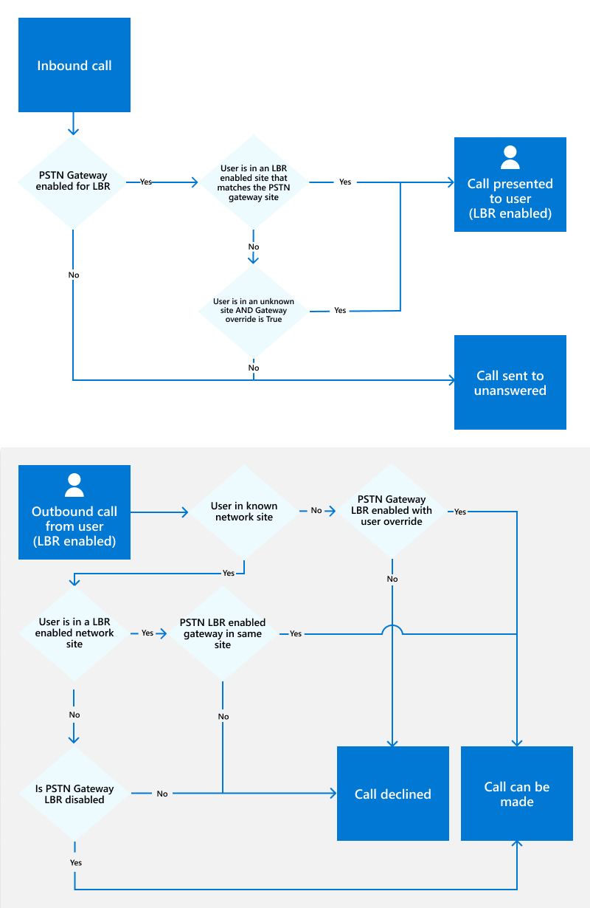
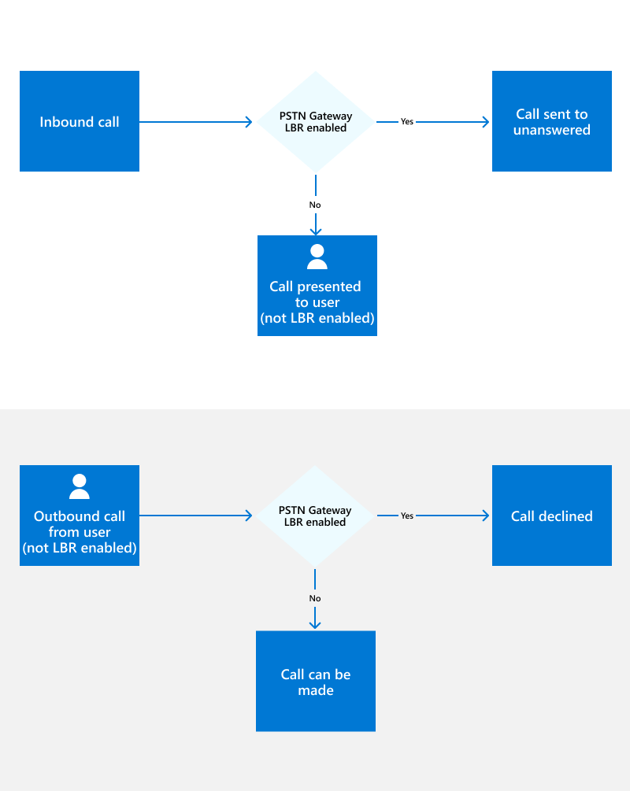

# Plan Location-Based Routing for Direct Routing

In some countries and regions, it's illegal to bypass the Public Switched Telephone Network (PSTN) provider to decrease long-distance calling costs. 

This article describes what you need to know to use Location-Based Routing to restrict toll bypass for Microsoft Teams users based on their geographic location. This article applies only to Direct Routing. (Location-Based Routing doesn't apply to Calling Plan or Operator Connect.)

> [!NOTE]
> You shouldn't use Location-Based Routing to dynamically route PSTN calls based on the location of the user. To do so may cause unintended results.

When you're ready to enable Location-Based Routing, see:

- [Configure network settings for Location-Based Routing](location-based-routing-configure-network-settings.md)
- [Enable Location-Based Routing for Direct Routing](location-based-routing-enable.md)

## Overview

Location-Based Routing lets you restrict toll bypass for a user based on policy and the user's geographic location at the time of an inbound or outbound PSTN call. 

Location-Based Routing uses the network topology you define for network region, site, and subnet. A **network site** represents a location where your organization has a physical venue, such as an office, a set of buildings or a campus. When toll bypass is restricted for a geographical location, you associate each IP network subnet and each PSTN gateway for that location to a network site. A **network region** is a collection of network sites. Each network site must be associated with a network region. Location-Based Routing can be applied to the user location, network sites and PSTN gateways. 

At the time of a PSTN call, a user’s location is determined by the IP subnet that the user’s Teams endpoints are connected to. If a user has multiple Teams clients located at different sites, Location-Based Routing enforces each client’s routing separately depending on the location of the Teams endpoints.

For more information about network settings, see [Network settings for cloud voice features in Teams](cloud-voice-network-settings.md).

### Toll bypass evaluation and outcome

When Location-Based Routing is used, a call between a Teams user and the PSTN is evaluated to determine if toll bypass is restricted. Depending on the results, the call will or will not complete. 

If a user is enabled for Location-Based Routing and the user is located at a site where Location-Based Routing restrictions are in effect, then toll bypass is restricted for that user. Teams uses the following information to determine whether toll bypass is restricted: 

- Whether the Teams user is enabled for Location-Based Routing as defined in the user's Teams Calling policy.

- The Teams user’s endpoint network site location and whether the site is enabled or not enabled for Location-Based Routing.

- The network site location of the PSTN gateway being used by the call.

- Whether the PSTN gateway being used by the call has been enabled for Location-Based Routing.

- For transfer scenarios, the route of the PSTN call is based on the routing settings of the person transferring the call, and on the Location-Based Routing settings of the Teams user to which the call is being transferred.  

- For conferencing and group call scenarios, whether a Teams user for whom toll bypass is restricted is or has been part of the call.

If a call can't complete, the Teams user is notified as follows:

- For outbound PSTN calls, the following message appears in the call window: *Call not allowed due to your organization’s settings.*

- For inbound PSTN calls, the call is routed based on the called Teams user’s unanswered call forwarding settings, typically to voicemail. If the Teams user doesn’t have unanswered call settings configured, the call will disconnect.

## Apply Location-Based Routing

You must apply Location-Based Routing to the following:

- [Users](#apply-location-based-routing-at-the-user-location)
- [Network sites](#apply-location-based-routing-at-the-network-site)
- [PSTN gateways](#apply-location-based-routing-at-the-network-site)

Keep the following best practices in mind:

- The PSTN gateway and network site associated with the gateway must both be enabled for Location-Based Routing.

- To place calls through a PSTN gateway that is enabled for Location-Based Routing, users must also be enabled for Location-Based Routing.

- To allow users who are enabled for Location-Based Routing to place outbound and receive inbound PSTN calls from an unknown network site, the following must be true:

  - The call needs to egress from a PSTN gateway that is enabled for Location-Based Routing.
  - The PSTN gateway must be configured with the flag GatewayLbrEnabledUserOverride set to True.

This article assumes that a network site can be in one of the following states: 

- Enabled - A site configured using tenant network subnets and sites and enabled for Location-Based Routing. 

- Not enabled - A site configured using tenant network subnets and sites, but not enabled for Location-Based Routing. 

- Unknown - A site not configured using tenant network subnets and sites. Typically, such sites are either internal to the corporate network, but by design not configured, or external to the corporate network. In any case, these sites aren't enabled for Location-Based Routing. 

### Apply Location-Based Routing at the user location

Location-Based Routing works by determining the user’s current location based on Teams Endpoint IP and Trusted IP (Public IP) addresses. Conditions are then applied to determine which user can make and receive PSTN calls and the PSTN gateway that can be used. 

When users are enabled for Location-Based Routing and roaming, the network site at the location of the user will help determine which PSTN gateways to use.  

The location of a user who is enabled for Location-Based Routing can be categorized as follows: 

- **The user is located at the same Location-Based Routing enabled site associated to the PSTN gateway where their DID is assigned. (Office location)** In this scenario, the user is located at a configured network site that's enabled for Location-Based Routing and the user's Direct Inward Dial (DID) number terminates on a PSTN gateway that's in the same network site. For example, the user is at their office. 

- **The user is located at a different Location-Based Routing enabled site than the gateway through which the PSTN call routes. (Remote location)** In this scenario, the user is located at a configured network site that's enabled for Location-Based Routing, and that site is not associated with the PSTN gateway through which the PSTN call routes. 

- **The user is located at a known site that's not enabled for Location-Based Routing.**  In this scenario, the user is located in a configured network site that's not enabled for Location-Based Routing. 

- **The user is located at an unknown site.** 
    - The user is located within the internal network that's not defined as a network site. 
    - The user is located outside the internal network. For example, the user is on the Internet at home or in a coffee shop. 

### Apply Location-Based Routing at the network site 

When users who are enabled for Location-Based Routing are roaming, network sites enabled for Location-Based Routing will help determine which gateways to use. The following sections describe specifics for the following: 

- [Users who ARE ENABLED for Location-Based Routing](#user-is-enabled-for-location-based-routing)
- [Users who ARE NOT ENABLED for Location-Based Routing](#user-is-not-enabled-for-location-based-routing)

For more scenarios, see [Location-Based Routing scenarios](location-based-routing-scenarios.md). 

#### User is enabled for Location-Based Routing

The following tables describe specifics for outbound and inbound PSTN calls for users who are enabled for Location-Based Routing:

**Outbound PSTN calls**

| User location | Network site where users are located  | PSTN Gateway ​ | Override flag status | Outbound call status |
| --------- | --------- | --------- | --------- | --------- |
| Office location​ | LBR enabled ​| LBR enabled ​| - | Allowed​ |
| Remote location | LBR enabled ​| LBR enabled ​| - | Not allowed​ |
| User at known site  | LBR disabled​ | LBR disabled | -  |  Allowed |
| User at unknown site  | -​ | LBR enabled​ | True  | Allowed |

Outbound PSTN calls are also allowed for users when all the following are true:

- The user is enabled for Location-Based Routing.
- The user's endpoint is located at a known site that is not enabled for Location-Based Routing.
- Calls egress through a PSTN gateway that's not enabled for Location-Based Routing.
- The user's Online Voice Routing Policy allows the call.

**Inbound PSTN calls**

| User location | Network site at which user is located | PSTN Gateway​ | Override flag status | Inbound call status |
| --------- | --------- | --------- | --------- | --------- |
| Office location​ | LBR enabled ​| LBR enabled ​| - | Allowed​ |
| Remote location​ | LBR enabled ​| LBR enabled ​| - | Not allowed​ |
| User at unknown site | - ​| LBR enabled ​| True | Allowed​ |
| User at non-PSTN Gateway Site | - | LBR enabled | True | Allowed |

**Decisions flows**

The following diagram shows the decision flows for inbound and outbound calls for users who are enabled for Location-Based Routing:

#### User is not enabled for Location-Based Routing

When a Teams user is not enabled for Location-Based Routing, all calls to and from that user must route through a PSTN gateway that is not enabled for Location-Based Routing. An inbound call to such a user routed through a PSTN gateway enabled for Location-Based Routing will route to the user’s unanswered call forwarding settings (typically voicemail).

**Decision flows**

The following diagram shows the decision flows for inbound and outbound calls for users who are not enabled for Location-Based Routing:

## Conditions for call transfers with Location-Based Routing 

When a user is enabled for Location-Based Routing and needs to transfer calls, the following applies: 

When a user enabled for Location-Based Routing transfers a call, the system will decide to deny or allow this action based on conditions applied to the PSTN gateway used to egress the call, the following are the two possible scenarios: 

- For a 1:1 Teams VoIP call and transfer to PSTN: The transfer will be permitted if the user being transferred is able to make that PSTN call at their location using the same PSTN Gateway as the user transferring the call. 

- For an incoming or outgoing PSTN call and transfer to another Teams user: The transfer will be permitted if the person receiving the transferred call is able to make or receive that PSTN call at their current location using the PSTN gateway used by the ongoing PSTN call.

When the GatewayLbrEnabledUserOverride flag is enabled, users can be allowed to connect from unknown or known site, even if it differs from the PSTN gateway's site.

## Media bypass requirement for Location-Based Routing

If you're deploying Location-Based Routing in India, you must also configure media bypass. For more information, see [Plan for media bypass with Direct Routing](direct-routing-plan-media-bypass.md) and [Local Media Optimization for Direct Routing](direct-routing-media-optimization.md).

## Direct Voice over IP (VoIP)

Direct Voice over IP (VoIP) must not be deployed with any telephony equipment in India.

## Location-Based Routing for conferencing

A user who is enabled for Location-Based Routing but who does not have an audio conferencing license on a PSTN call isn't allowed to start a conference with another user or PSTN number. Connecting to auto attendants is allowed.

If the user has an audio conferencing license, the user must start a conference with the relevant users and call the PSTN through the conference bridge to start a conference call. If the user is already on a 1:1 PSTN call, the *People* modality in the Teams client will be hidden, preventing the Teams LBR user from adding a participant or escalating the existing call to a conference.  In this scenario, the call must be ended. The Teams LBR user will then need to create a conference and use the conferencing bridge to dial out to the required PSTN numbers. 

In a conference call started by a user without an audio conferencing license, adding PSTN participants is not allowed if there is or has been at least one Location-Based Routing enabled user in the conference call. If at least one PSTN participant is or was part of such a conference call before any Location-Based Routing enabled participants was invited to join the call, such Location-Based Routing enabled participants can't be added to the call.

If the Location-Based Routing enabled user is joining the conference call from an internal site that is not enabled for Location-Based Routing, the restrictions in the above paragraph are not enforced. 

On-network conferencing for Audio Conferencing must NOT be deployed with any telephony equipment in India.

A Location-Based Routing enabled user on a PSTN call is not allowed to merge that call with another call. The following are not supported: recording the PSTN call and compliance recording of the PSTN call.

## Inbound calls through Auto attendants

Inbound PSTN calls from a Location-Based Routing enabled gateway are allowed to connect to an Auto attendant. (Calls to a Call queue are not supported.)

Users enabled for Location-Based Routing can receive inbound call transfers from Auto attendants as long as the inbound PSTN call is using the same Location-Based Routing rules listed earlier. 
 
Call forwarding and simultaneous ringing to users and PSTN is allowed for Auto attendant transfers. Completing the call to the target is subject to the same Location-Based Routing rules listed earlier. Forwarding to voicemail is also allowed.  

## Delegation

A Teams user may choose delegates who can make and receive calls on their behalf. Delegation capabilities in Teams are affected by Location-Based Routing as follows: 

- For outbound calls from a Location-Based Routing enabled delegate on behalf of a delegator, the same rules apply. Call routing is based on the delegate’s call authorization policy, voice routing policy, and location. For more information, see [Teams user places an outbound call to the PSTN](location-based-routing-scenarios.md#teams-user-places-an-outbound-call-to-the-pstn). 

- For inbound PSTN calls to a delegator, the same Location-Based Routing rules that apply for call forwarding or simultaneously ringing to other users also apply to delegates. For more information, see [Teams user transfers or forwards call to another Teams user](location-based-routing-scenarios.md#teams-user-transfers-or-forwards-call-to-another-teams-user), [Teams user transfers or forwards call to PSTN endpoint](location-based-routing-scenarios.md#teams-user-transfers-or-forwards-call-to-pstn-endpoint), and [Simultaneous ringing](location-based-routing-scenarios.md#simultaneous-ringing). 
When a delegate sets a PSTN endpoint as a simultaneous ring target, the voice routing policy of the delegate is used to route the call to the PSTN. 

- For delegation, Microsoft recommends that the delegator and associated delegates be located in the same network site. 

## Other planning considerations

The following sections describe other planning considerations for Location-Based-Routing.

### Changes from an on-premises Location-Based Routing deployment

Network site voice routing policy is no longer used. Instead, we use the user’s voice routing policy. To allow users to roam to other sites, the voice routing policy must include the gateways of the roamed sites. 

### Technical considerations for Location-Based Routing

IPv4 and IPv6 subnets are supported, however, IPv6 takes precedence when checking for a match.

### Client support for Location-Based Routing

The following Teams clients are supported:
- Teams desktop clients (Windows and Mac)
- Teams mobile clients (iOS and Android)
- Teams IP phones

The Teams web client and Skype for Business clients aren't supported.

### Capabilities not supported by Location-Based Routing

Location-Based Routing doesn't apply to the following types of interactions. Location-Based Routing isn't enforced when Teams endpoints interact with PSTN endpoints in the following scenarios: 

- Call park or retrieval of PSTN calls through Call Park 

- An on-premises Skype for Business user calls a Teams user  

- Call queue support

## Related articles

- [Enable Location-Based Routing for Direct Routing](location-based-routing-enable.md)
- [Network settings for cloud voice features in Teams](cloud-voice-network-settings.md)
