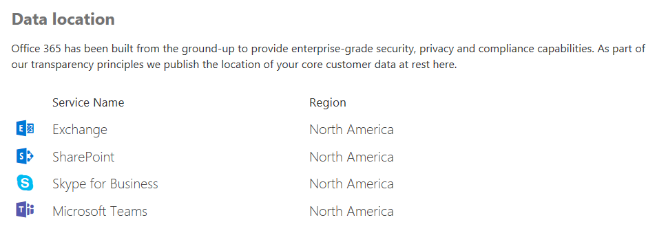

# Location of data in Microsoft Teams

Data in Teams resides in the geographic region associated with your Office 365 tenant. Currently, Teams supports the Australia, Canada, France, India, Japan, United Kingdom, Americas, APAC, and EMEA regions. 

> [!IMPORTANT]
> Teams currently offers data residency in Australia, Canada, France, India, Japan, and the United Kingdom for new tenants only. 
> A new tenant is defined as any tenant that hasn’t had a single user from the tenant sign in to Teams. Existing tenants from Australia, India, and Japan will 
> continue to have their Teams data stored in the APAC region. Existing tenants in Canada will continue to have their data stored in the Americas. France and the United Kingdom will have their data stored in the EMEA region.

To learn more about the launch of India and United Kingdom data residency for Teams, read Ansuman Acharya's blog post, [Microsoft Teams launches India Data Residency, other geos coming soon](https://techcommunity.microsoft.com/t5/Microsoft-Teams-Blog/Microsoft-Teams-Launches-Australia-and-Japan-Data-Residency/ba-p/237827). 

For more information on Canada data residency for Teams, read Varun Sagar's blog post, [Microsoft Teams Launches Canada Data Residency, Australia and Japan coming soon](https://techcommunity.microsoft.com/t5/Microsoft-Teams-Blog/Microsoft-Teams-Launches-Canada-Data-Residency-Australia-and/ba-p/227178). 

To learn more about the launch of Australia and Japan data residency for Teams, read Varun Sagar's blog post, [Microsoft Teams Launches Australia and Japan Data Residency](https://go.microsoft.com/fwlink/?linkid=867773). 

To learn more about the launch of France data residency for Teams, read Varun Sagar's blog post, [Microsoft Teams Launches France Data Residency](https://techcommunity.microsoft.com/t5/Microsoft-Teams-Blog/Microsoft-Teams-launches-France-Data-Residency/ba-p/364466). 

To see which region houses data for your tenant, go to the [Microsoft 365 admin center](https://portal.office.com/adminportal/home) > **Settings** > **Organization profile**. Scroll down to **Data location**. 

