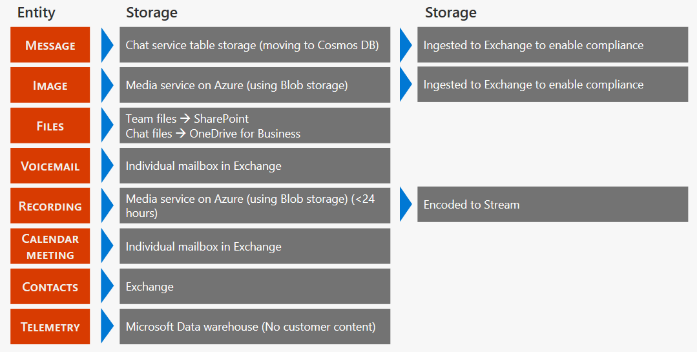

# Location of data in Microsoft Teams

Data in Teams resides in the geographic region associated with your Office 365 tenant. Currently, Teams supports the Australia, Canada, France, Germany, India, Japan, South Africa, South Korea, Switzerland (which includes Liechtenstein), the United Arab Emirates, United Kingdom, Americas, APAC, and EMEA regions. 

> [!IMPORTANT]
> Teams currently offers data residency in Australia, Canada, France, Germany, India, Japan, the United Arab Emirates, United Kingdom, South Korea, South Africa, and Switzerland (which includes Liechtenstein) for new tenants only.
> A new tenant is defined as any tenant that hasn’t had a single user from the tenant sign in to Teams. Existing tenants from Australia, India, Japan, and South Korea will continue to have their Teams data stored in the APAC region. Existing tenants in Canada will continue to have their data stored in the Americas. Existing tenants in France, Germany, Liechtenstein, the United Arab Emirates, the United Kingdom, South Africa, and Switzerland will have their data stored in the EMEA region.

## Where your Teams data is stored

To see which region houses data for your tenant, go to the [Microsoft 365 admin center](https://portal.office.com/adminportal/home) > **Settings** > **Organization profile**. Scroll down to **Data location**.

## Location of Teams data at rest

Your Teams data is stored differently depending on the content type. 

Check out the [Ignite breakout session on Microsoft Teams architecture](https://channel9.msdn.com/Events/Ignite/Microsoft-Ignite-Orlando-2017/BRK3071) for an in-depth discussion.

### Core Teams customer data

If your tenant is provisioned in Australia, Canada, the European Union, France, Germany, India, Japan, South Africa, South Korea, Switzerland (which includes Liechtenstein), the United Arab Emirates, the United Kingdom, or the United States, Microsoft stores the following customer data at rest only within that location:

- Teams chats, team and channel conversations, images, voicemail messages, and contacts
- SharePoint Online site content and the files stored within that site
- Files uploaded to OneDrive for Business

#### Chat, channel messages, team structure

Every team in Teams is backed by an Office 365 Group and its SharePoint site and Exchange mailbox. Private chats (including group chats), messages sent as part of a conversation in a channel, and the structure of teams and channels are stored in a chat service running in Azure. The data is also stored in a hidden folder in the user and group mailboxes to enable Information Protection features.

#### Voicemail and contacts

Voicemails are stored in Exchange. Contacts are stored in Exchange-based cloud data store. Exchange and the Exchange-based cloud store already provide data residency in each of the worldwide datacenter geos. For all teams, voicemail and contacts are stored in-country for Australia, Canada, France, Germany, India, Japan, the United Arab Emirates, the United Kingdom, South Africa, South Korea, Switzerland (includes Liechtenstein), and the United States. For all other countries, files are stored in the US, Europe, or Asia-Pacific location based on tenant affinity.

#### Images and media

Media used in chats (except for Giphy GIFs which aren't stored but are a reference link to the original Giphy service URL, Giphy is a non-Microsoft service) is stored in an Azure-based media service that is deployed to the same locations as the chat service.

#### Files

Files (including OneNote and Wiki) that somebody shares in a channel are stored in the team’s SharePoint site. Files shared in a private chat or a chat during a meeting or call are uploaded and stored in the OneDrive for the Business account of the user who shares the file. Exchange, SharePoint and OneDrive already provide data residency in each of the worldwide datacenter geos. So, for existing customers, all files, OneNote notebooks, Teams wiki content, and mailboxes that are part of the Teams experience are already stored in the location based on your tenant affinity. Files are stored in-country for Australia, Canada, France, Germany, India, Japan, the United Arab Emirates, the United Kingdom, South Africa, South Korea, and Switzerland (which includes Liechtenstein). For all other countries, files are stored in the US, Europe, or Asia Pacific location based on tenant affinity.

### Datacenter locations

The Teams services described in this section store data at rest in the following locations:

|Country or region  |Datacenter location |
|---------|---------|
|Australia   |New South Wales and Victoria         |
|Canada    |Quebec City and Toronto         |
|France    |Marseille and Paris         |
|Germany    |Berlin and Frankfurt      |
|India   |Chennai and Pune        |
|Japan    |Tokyo (Saitama) and Osaka         |
|Liechtenstein   |Geneva and Zurich       |
|South Africa     |Johannesburg and Cape Town         |
|South Korea     |Seoul and Busan         |
|Switzerland    |Geneva and Zurich       |
|United Arab Emirates     |Abu Dhabi and Dubai         |
|United Kingdom     | Cardiff and London        |
|Americas – North, and South (AMER) |Bay, CA and Boydton, VA       |
|Asia Pacific (APAC)  |Singapore and Hong Kong        |
|Europe, Middle East, and Asia (EMEA)   |Dublin and Amsterdam        |

> [!NOTE]
> For Liechtenstein, data is stored at rest in the Switzerland data centers in Geneva and Zurich.

### Data stored with a third-party storage provider

Organizations who allow users to store files with a third-party storage provider are dependent on the storage location of those services and should, therefore, review the location of data at rest for those services separately.

- **Tabs**: Tabs allow users to pin information from apps and services to a channel. Thus, it varies by type of the tab where the data is stored. The tab itself doesn't store any data. For example, a SharePoint tab will store data based on where the SharePoint site collection was provisioned. A tab that includes information from a partner will store the data directly in the system used by the partner and only present a view of it.
- **Other partner apps**: Microsoft doesn't provide any data residency support for apps and services from partners that you might be using within the Teams experience. Review information from those solutions directly to learn about where their data is being stored.

## See also

- [Microsoft Teams launches United Arab Emirates Data Residency](https://techcommunity.microsoft.com/t5/Microsoft-Teams-Blog/Microsoft-Teams-launches-United-Arab-Emirates-Data-Residency/ba-p/980330)

- [Microsoft Teams launches South Korean Data Residency](https://techcommunity.microsoft.com/t5/Microsoft-Teams-Blog/Microsoft-Teams-launches-South-Korea-Data-Residency/ba-p/789171)

- [Microsoft Teams launches South African Data Residency](https://techcommunity.microsoft.com/t5/Microsoft-Teams-Blog/Microsoft-Teams-launches-South-Africa-Data-Residency/ba-p/776611)

- [Microsoft Teams Launches France Data Residency](https://techcommunity.microsoft.com/t5/Microsoft-Teams-Blog/Microsoft-Teams-launches-France-Data-Residency/ba-p/364466)

- [Microsoft Teams launches India Data Residency, other geos coming soon](https://techcommunity.microsoft.com/t5/Microsoft-Teams-Blog/Microsoft-Teams-Launches-India-Data-Residency-other-geos-coming/ba-p/154083)

- [Microsoft Teams Launches Australia and Japan Data Residency](https://techcommunity.microsoft.com/t5/Microsoft-Teams-Blog/Microsoft-Teams-Launches-Australia-and-Japan-Data-Residency/ba-p/237827)

- [Microsoft Teams Launches Canada Data Residency, Australia and Japan coming soon](https://techcommunity.microsoft.com/t5/Microsoft-Teams-Blog/Microsoft-Teams-Launches-Canada-Data-Residency-Australia-and/ba-p/227178)
