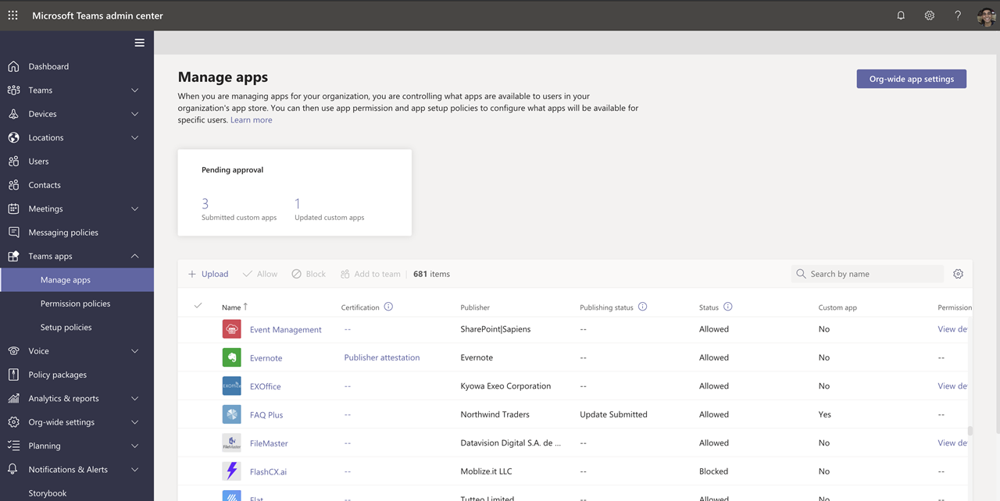
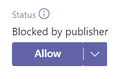
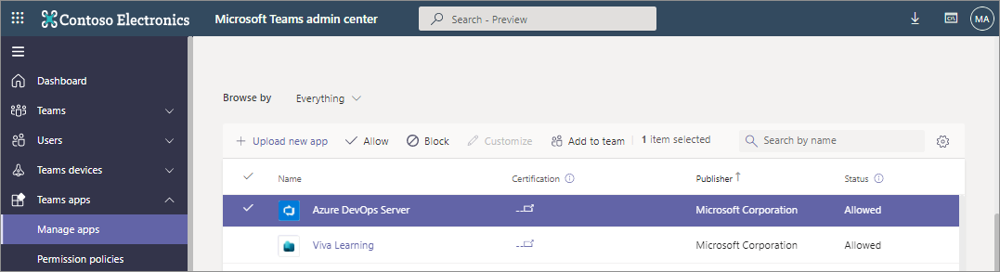

# Manage Teams apps in the Microsoft Teams admin center

You manage apps for your organization in **Teams apps** in the admin center. Use the [Manage apps](https://admin.teams.microsoft.com/policies/manage-apps) page to view and manage all Teams apps in your organization's app catalog. The Manage apps page gives you a view into all available apps in your tenant catalog, providing you with the information you need to decide which apps to allow or block across your organization. You can see the org-level status and properties of apps, block or allow apps at the org level, upload new custom apps to your tenant catalog, and manage org-wide app settings.

To use Teams admin center, you must be a global admin or Teams service admin. For details, see [Teams administrator roles](./using-admin-roles.md).

To manage apps, you use policies to control permissions for users, installation of apps, and upload of custom apps created within your organization. To understand policies, see [Overview of app policies](app-policies.md).

> [!NOTE]
> [!INCLUDE [new-teams-sfb-admin-center-notice](includes/new-teams-sfb-admin-center-notice.md)]

> [!NOTE]
> The Manage apps page isn't available in Microsoft 365 Government Community Cloud High (GCCH) or Department of Defense (DoD) deployments of Teams.

During the creation of an app, the developers create and add an app ID to the manifest file. You can view this external app ID on the Manage apps page after you enable the column `External app ID` from the column settings. You can also view it on the app details page of a custom app. The ID is applicable for custom apps only.

## Publish a custom app to your organization's app store

Use the Manage apps page to publish apps that are built specifically for your organization. After you publish a custom app, it's available to users in your organization's app store. There are two ways to publish a custom app to your organization's app store. The way that you use depends on how you get the app.

* [Approve a custom app](#approve-a-custom-app): Use this method if the developer submits the app directly to the Manage apps page using the Teams App Submission API. You can then review and publish (or reject) the app directly from the app details page.
* [Upload an app package](#upload-an-app-package): Use this method if the developer sends you the app package in .zip format. You publish the app by uploading the app package.

### Approve a custom app

The **Pending approvals** widget on the Manage apps page notifies you when a developer submits an app by using the Teams App Submission API. A newly submitted app is listed with a **Publishing status** of **Submitted** and an **Status** of **Blocked**. Go to the app details page to see more information about the app, and then to publish it, set **Publishing status** to **Publish**.

You're also notified when a developer submits an update to a custom app. You can then review and publish (or reject) the update on the app details page. All app permission policies and app setup policies remain enforced for the updated app.

To learn more, see [Publish a custom app submitted through the Teams App Submission API](submit-approve-custom-apps.md).

### Upload an app package

The developer creates a Teams app package using [Teams App Studio](/microsoftteams/platform/get-started/get-started-app-studio), and then sends it to you in .zip format. When you have the app package, you can upload it to your organization's app store.

To upload a new custom app, select **Upload** to upload the app package. The app isn't highlighted after it's uploaded so you'll need to search the list of apps on the Manage apps page to find it.

To update an app after it's uploaded, in the list of apps on the Manage apps page, select the app name, and then select **Update**. Doing this replaces the existing app and all app permission policies and app setup policies remain enforced for the updated app.

To learn more, see [Publish a custom app by uploading an app package](upload-custom-apps.md).

## Allow and block apps

The Manage apps page is where you allow or block individual apps at the org level. It shows every available app and its current org-level app status.

To allow or block an app:

1. Go to Teams admin center > Teams apps > Manage apps.
1. Select an app from the app list.
1. Select **Allow** or **Block**.

When you block or allow an app on the Manage apps page, that app is blocked or allowed for all users in your organization.  When you block or allow an app in a Teams app permission policy, it's blocked or allowed for users who are assigned that policy. For a user to be able to install and interact with any app, you must allow the app at the org level on the Manage apps page and in the app permission policy that's assigned to the user.

 > [!NOTE]
 > To uninstall an app, right-click the app, and then click **Uninstall** or use the **More apps** menu on the left side.

## Manage user requests to unblock apps

You can view requests to make a blocked app available for use. The request is sent to the IT admin, who can view and manage user requests in the Teams admin center.

  :::image type="content" source="media/user-request.png" alt-text="Place a request for blocked apps approval":::

### View a request

 1. Sign in to the Teams admin center and select [Manage apps](https://admin.teams.microsoft.com/policies/manage-apps)

    :::image type="content" source="media/requested-apps1.png" alt-text="Request by users" lightbox="media/requested-apps.png" border="true":::​

 1. To view and check the number of requests for each app, sort the requests in the **Requests by user** column.
 1. Select the name of the app that you want to unblock and it opens the app details page.
 1. Select **Manage requests** and complete the steps displayed in the popup dialog. The steps to approve an app vary based on the method used to block it.

    * If the app is blocked using permission policies, allow the app by modifying [permission policies](teams-app-permission-policies.md).
    * If the app is blocked for all users, [allow the app](#allow-and-block-apps).
    * If all apps are blocked for all users, modify [org-wide settings](#manage-org-wide-app-settings).

 If an admin allows an app then it doesn't inform the end-user that their request is acted upon. The user must visit app in the Store to check if the app is unblocked or not.

### Dismiss a user request

 1. Select the name of the app for which you want to dismiss the user requests.
 1. Select **Manage requests** and select **Dismiss all requests** on the dialog box.
 1. When a request is dismissed, it resets the user requests to zero.

  :::image type="content" source="media/reject.png" alt-text="blocked apps rejection."border="true":::​

If an admin dismisses a request, it doesn't inform the end-user that their request is acted upon. The user must visit app in the Store to check if the app is unblocked or not.

## Apps blocked by publishers

When an ISV publishes an app to the global app store, they might need admins to configure or customize the app experience. The admin can make it available to end-users when the app is completely set up.

For example, Contoso Electronics is an ISV that created a help desk app for Microsoft Teams. Contoso Electronics wants its customers to set up certain properties of the app so that when users interact with the app, it functions as expected. Before an admin can allow or block the application, it will show as **Blocked by publisher** in the Teams admin center and will be hidden from end-users by default. After following the publisher's guidance to set up the app, you can make it available to users by changing the status to **Allowed**, or block users from using the app by changing the status to **Blocked**.

## Add an app to a team

You use the **Add to team** button to install an app to a team. Keep in mind that this is only for apps that can be installed in a team scope. The **Add to team** button isn't available for apps that can only be installed in the personal scope.

1. Search for the app you want, and then select the app by clicking to the left of the app name.
1. Select **Add to team**.
1. In the **Add to team** pane, search for the team you want to add the app to, select the team, and then select **Apply**.

## Customize an app

You can now customize an app to include a specific look and feel according to your organization needs. See [Customize apps in Teams](customize-apps.md).

## Purchase services for third-party apps

You can search for and purchase licenses for services offered by third-party apps for users in your organization directly from the Manage apps page. The **Licenses** column in the table indicates whether an app offers a paid SaaS subscription. Select **Purchase now** to view plans and pricing information and buy licenses for your users. To learn more, see [Purchase services for Teams third-party apps in the Microsoft Teams admin center](purchase-third-party-apps.md).

## Grant admin consent to apps

You can review and grant consent to apps that request permissions on behalf of all users in your organization. You do this so that users don't have to review and accept the permissions requested by the app when they start the app. The **Permissions** column indicates whether an app has permissions that need consent. You'll see a **View details** link for each app registered in Azure AD that has permissions that need consent. To learn more, see [View app permissions and grant admin consent in the Microsoft Teams admin center](app-permissions-admin-center.md).

## View resource-specific consent permissions

Resource-specific consent (RSC) permissions let team owners grant consent for an app to access and modify a team's data. RSC permissions are granular, Teams-specific permissions that define what an app can do in a specific team. You can view RSC permissions on the **Permissions** tab of the app details page for an app. To learn more, see [View app permissions and grant admin consent in the Microsoft Teams admin center](app-permissions-admin-center.md).

## Manage org-wide app settings

Use org-wide app settings to control whether users with an [F license](https://www.microsoft.com/microsoft-365/enterprise/frontline#office-SKUChooser-0dbn8nt) get the tailored frontline app experience, whether users can install third-party apps, and whether users can upload or interact with custom apps in your organization. Org-wide app settings govern the behavior for all users and override any other app permission policies assigned to users. You can use them to control malicious or problematic apps.

> [!NOTE]
> To learn how to use org-wide app settings in Microsoft 365 Government - Government Community Cloud High GCCH and Department of Defense (DoD) deployments of Teams, see [Manage app permission policies in Teams](teams-app-permission-policies.md).

1. On the Manage apps page, select **Org-wide app settings**. You can then configure the settings you want in the pane.

    :::image type="content" source="media/manage-apps-org-wide-app-settings.png" alt-text="Screenshot of the Org-wide app settings pane on the Manage apps page":::

1. Under **Tailored apps**, turn off or turn on **Show tailored apps**. When this setting is on, users with an [F license](https://www.microsoft.com/microsoft-365/enterprise/frontline#office-SKUChooser-0dbn8nt) get the tailored frontline app experience. This experience pins the most relevant apps in Teams for frontline workers. To learn more, see [Tailor Teams apps for your frontline workers](pin-teams-apps-based-on-license.md).

    This feature is available for F licenses. Other license types will be supported in the future.
1. Under **Third-party apps**, turn off or turn on these settings to control access to third-party apps:

    * **Allow third-party apps**: This controls whether users can use third-party apps. If you turn off this setting, your users won't be able to install or use any third-party apps and the app status of these apps is displayed as **Blocked org-wide** in the table.

        > [!NOTE]
        > When **Allow third-party apps** is off, [outgoing webhooks](/microsoftteams/platform/webhooks-and-connectors/what-are-webhooks-and-connectors) are still enabled for all users, but you can control them at the user level by allowing or blocking the Outgoing Webhook app through [app permission policies](teams-app-permission-policies.md). Note that if you have existing [app permission policies](teams-app-permission-policies.md) for **Microsoft apps** that use the **Allow specific apps and block all others** setting, and you want to enable outgoing webhooks for users, add the Outgoing Webhook app to the list.

        > [!NOTE]
        > Teams users can add apps when they host meetings or chats with people from other organizations. They can also use apps shared by people in other organizations when they join meetings or chats hosted by those organizations. The data policies of the hosting user's organization, as well as the data sharing practices of any third-party apps shared by that user's organization, are applied.

    * **Allow any new third-party apps published to the store by default**: This controls whether new third-party apps that are published to the Teams app store become automatically available in Teams. You can only set this option if you allow third-party apps.

1. Under **Custom apps**, turn off or turn on **Allow interaction with custom apps**. This setting controls whether users can interact with custom apps. To learn more, see [Manage custom app policies and settings in Teams](teams-custom-app-policies-and-settings.md).
1. Select **Save** for org-wide app settings to take effect.
