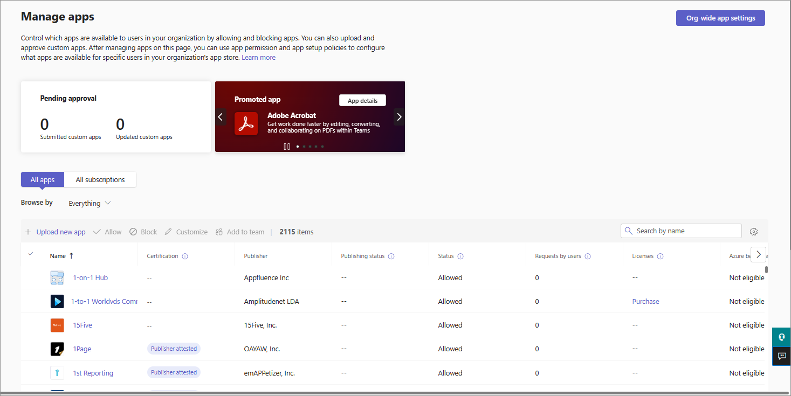
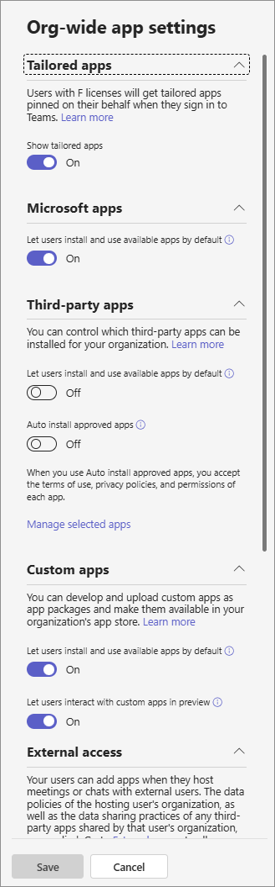

Manage your apps in the Microsoft Teams admin center
======================================================

As an admin, the Manage apps page in the Microsoft Teams admin center is where you view and manage all Teams apps for your organization. Here, you can see the org-level status and properties of apps, approve or upload new custom apps to your organization's app store, block or allow apps at the org level, add apps to teams, purchase services for third-party apps, view permissions requested by apps, grant admin consent to apps, and manage org-wide app settings.

The Manage apps page gives you a view into all available apps, providing you with the information you need to decide which apps to allow or block across your organization. You can then use [app permission policies](teams-app-permission-policies.md), [app setup policies](teams-app-setup-policies.md), and [custom app policies and settings](teams-custom-app-policies-and-settings.md) to configure the app experience for specific users in your organization.

In the left navigation of the Microsoft Teams admin center, go to **Teams apps** > **Manage apps**. You must be a global admin or Teams service admin to access the page.

> [!NOTE]
> The Manage apps page isn't available yet in Microsoft 365 Government Community Cloud (GCC) deployments of Teams.

## View apps

You can view every app including the following information about each app.

- **Name**: The app name. Click the app name to go to the app details page to see more information about the app. This includes a description of the app, whether it's allowed or blocked, version, privacy policy, terms of use, categories that apply to the app, certification status, supported capabilities, and app ID. Here's an example:

  
  
- **Certification**: If the app has gone through certification, you'll see either **Microsoft 365 certified** or **Publisher attestation**. Click the link to view certification details for the app. If you see "**--**", we don't have certification information for the app. To learn more about certified apps in Teams, read [Microsoft 365 App Certification program](https://docs.microsoft.com/teams-app-certification/all-apps).  
- **Publisher**: Name of the publisher.
- **Publishing status**: Publishing status of custom apps.
- **Status**: Status of the app at the org level, which can be one of the following:

    - **Allowed**: The app is available for all users in your organization.
    
    - **Blocked**: The app is blocked and not available for any users in your organization.
    
    - **Blocked org-wide**: The app is blocked in org-wide app settings.
    
      It's important to know that this column represents the allowed and blocked status of apps that were formerly on the **Org-wide settings** pane. You now view, block, and allow apps at the org-wide on the **Manage apps** page. 
- **Licenses**: Indicates whether an app offers a Software as a Service (SaaS) subscription for purchase. This column applies only to third-party apps. Each third-party app will have one of the following values:
    - **Purchase now**: The app offers a SaaS subscription and is available to purchase.  
    - **Purchased**: The app offers a SaaS subscription and you've purchased licenses for it.
    - **- -**: The app doesn't offer a SaaS subscription.
- **Custom app**: Whether the app is a custom app.
- **Permissions**: Indicates whether a third-party or custom app that's registered in Azure Active Directory (Azure AD) has permissions that need consent. You'll see one of the following values:
    - **View details**: The app has permissions that require consent before the app can access data. 
    - **- -**: The app doesn't have permissions that need consent.
- **Categories**: Categories that apply to the app.
- **Version**: App version.

To see the information that you want in the table, click **Edit Column** in the upper-right corner to add or remove columns to the table.

## Publish a custom app to your organization's app store

Use the Manage apps page to publish apps that are built specifically for your organization. After you publish a custom app, it's available to users in your organization's app store. There are two ways to publish a custom app to your organization's app store. The way that you use depends on how you get the app.

- [Approve a custom app](#approve-a-custom-app): Use this method if the developer submits the app directly to the Manage apps page using the Teams App Submission API. You can then review and publish (or reject) the app directly from the app details page.
- [Upload an app package](#upload-an-app-package): Use this method if the developer sends you the app package in .zip format. You publish the app by uploading the app package.

###  Approve a custom app

The **Pending approvals** widget on the Manage apps page notifies you when a developer submits an app by using the Teams App Submission API. A newly submitted app is listed with a **Publishing status** of **Submitted** and an **Status** of **Blocked**. Go to the app details page to see more information about the app, and then to publish it, set **Publishing status** to **Publish**.

You're also notified when a developer submits an update to a custom app. You can then review and publish (or reject) the update on the app details page. All app permission policies and app setup policies remain enforced for the updated app.

To learn more, see [Publish a custom app submitted through the Teams App Submission API](submit-approve-custom-apps.md).

### Upload an app package

The developer creates a Teams app package using [Teams App Studio](https://docs.microsoft.com/microsoftteams/platform/get-started/get-started-app-studio), and then sends it to you in .zip format. When you have the app package, you can upload it to your organization's app store.

To upload a new custom app, select **Upload** to upload the app package. The app isn't highlighted after it's uploaded so you'll need to search the list of apps on the Manage apps page to find it.

To update an app after it's uploaded, in the list of apps on the Manage apps page, click the app name, and then click **Update**. Doing this replaces the existing app and all app permission policies and app setup policies remain enforced for the updated app.

To learn more, see [Publish a custom app by uploading an app package](upload-custom-apps.md).

## Allow and block apps

The Manage apps page is where you allow or block individual apps at the org level. It shows every available app and its current org-level app status. (Blocking and allowing apps at the org level has moved from the **Org-wide app settings** pane to here.)

To allow or block an app, select it, and then click **Allow** or **Block**. When you block an app, all interactions with that app are disabled and the app doesn't appear in Teams for any users in your organization.

When you block or allow an app on the Manage apps page, that app is blocked or allowed for all users in your organization.  When you block or allow an app in a Teams app permission policy, it's blocked or allowed for users who are assigned that policy. For a user to be able to install and interact with any app, you must allow the app at the org level on the Manage apps page and in the app permission policy that's assigned to the user.

 > [!NOTE]
 > To uninstall an app, right-click the app, and then click **Uninstall** or use the **More apps** menu on the left side.

## Add an app to a team

You use the **Add to team** button to install an app to a team. Keep in mind that this is only for apps that can be installed in a team scope. The **Add to team** button isn't available for apps that can only be installed in the personal scope.

1. Search for the app you want, and then select the app by clicking to the left of the app name.
2. Select **Add to team**.
3. In the **Add to team** pane, search for the team you want to add the app to, select the team, and then select **Apply**.

## Purchase services for third-party apps

You can search for and purchase licenses for services offered by third-party apps for users in your organization directly from the Manage apps page. The **Licenses** column in the table indicates whether an app offers a paid SaaS subscription. Click **Purchase now** to view plans and pricing information and buy licenses for your users. To learn more, see [Purchase services for Teams third-party apps in the Microsoft Teams admin center](purchase-third-party-apps.md).

## Grant admin consent to apps

You can review and grant consent to apps that request permissions on behalf of all users in your organization. You do this so that users don't have to review and accept the permissions requested by the app when they start the app. The **Permissions** column indicates whether an app has permissions that need consent. You'll see a **View details** link for each app registered in Azure AD that has permissions that need consent. To learn more, see [View app permissions and grant admin consent in the Microsoft Teams admin center](app-permissions-admin-center.md).

## View resource-specific consent permissions

Resource-specific consent (RSC) permissions let team owners grant consent for an app to access and modify a team's data. RSC permissions are granular, Teams-specific permissions that define what an app can do in a specific team. You can view RSC permissions on the **Permissions** tab of the app details page for an app. To learn more, see [View app permissions and grant admin consent in the Microsoft Teams admin center](app-permissions-admin-center.md).

## Manage org-wide app settings

Use org-wide app settings to control whether users can install third-party apps and whether users can upload or interact with custom  apps in your organization. Org-wide app settings govern the behavior for all users and override any other app permission policies assigned to users. You can use them to control malicious or problematic apps.

> [!NOTE]
> To learn how to use org-wide app settings in Microsoft 365 Government - GCC deployments of Teams, see [Manage app permission policies in Teams](teams-app-permission-policies.md).

1. On the Manage apps page, select **Org-wide app settings**. You can then configure the settings you want in the panel.

    
    
2. Under **Third-party apps**, turn off or turn on these settings to control access to third-party apps:

    - **Allow third-party apps**: This controls whether users can use third-party apps. If you turn off this setting, your users won't be able to install or use any third-party apps and the app status of these apps is displayed as **Blocked org-wide** in the table.

        > [!NOTE]
        > When **Allow third-party apps** is off, [outgoing webhooks](https://docs.microsoft.com/microsoftteams/platform/webhooks-and-connectors/what-are-webhooks-and-connectors) are disabled, which means that users can't create them. When this setting is on, outgoing webhooks are enabled for all users and you can control them at the user level by allowing or blocking the Outgoing Webhook app through [app permission policies](teams-app-permission-policies.md).   Note that if you have existing [app permission policies](teams-app-permission-policies.md) for **Microsoft apps** that use the **Allow specific apps and block all others** setting, and you want to enable outgoing webhooks for users, add the Outgoing Webhook app to the list.
    - **Allow any new third-party apps published to the store by default**: This controls whether new third-party apps that are published to the Teams app store become automatically available in Teams. You can only set this option if you allow third-party apps.

3. Under **Custom apps**, turn off or turn on **Allow interaction with custom apps**. This setting controls whether users can interact with custom apps. To learn more, see [Manage custom app policies and settings in Teams](teams-custom-app-policies-and-settings.md).
4. Click **Save** for org-wide app settings to take effect.

## Related topics

- [Admin settings for apps in Teams](admin-settings.md)