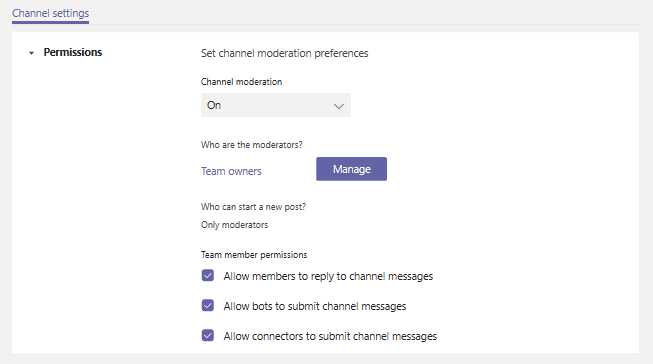

# Set up and manage channel moderation in Microsoft Teams

In Microsoft Teams, team owners can turn on moderation for a standard channel to control who can start new posts and reply to posts in that channel.

Team owners can also add team members as moderators. A team owner might not have the subject matter expertise at the channel level to best support channel moderation. By allowing specific team members to moderate a channel, the responsibility of managing content and context within a channel is shared between team owners and channel moderators. For example, a team owner can add business owners or content owners as moderators, which lets them control information sharing in that channel.

> [!NOTE]
> Channel moderation is available for standard channels. It's not available for the General channel or for private or shared channels.

## What can a channel moderator do?

Channel moderators can:

- Start new posts in the channel. When moderation is turned on for a channel, only moderators can start new posts in that channel.
- Add and remove team members as moderators to a channel. Keep in mind that by default, team owners are channel moderators and can't be removed.
- Control whether team members can reply to existing channel messages and whether bots and connectors can submit channel messages.

## Scenarios

Here's some examples of how your organization can use channel moderation in Teams.

### Use a channel as an announcement channel

The Marketing team uses a specific channel to share key project announcements and deliverables. Sometimes team members post content to the channel that more appropriately belongs in other channels. The team owner wants to restrict information sharing in the channel to only announcements so that team members can use that channel to stay on top of what's important.

In this scenario, the team owner adds Marketing leads as moderators so they can post announcements in the channel and turns off the ability for team members to reply to messages in that channel.

### Use a channel for class discussions in Teams for Education

In Teams for Education, a science teacher wants to use a channel to engage students in focused discussions on specific classroom topics.

In this scenario, the teacher allows their teaching assistants to moderate the channel. The teaching assistants can then create new posts to initiate and drive discussions with students.

## Manage channel moderation

In Teams, go to the channel, click **More options ...** > **Manage channel**. From here you can turn on and turn off moderation, add team members as moderators, and set preferences.

Channel moderation is a per-channel setting. There's no tenant-level setting for channel moderation. If you'd like us to add a tenant-level channel moderation setting, request it on [Teams Feedback portal](https://feedbackportal.microsoft.com/feedback/forum/ad198462-1c1c-ec11-b6e7-0022481f8472).

[!INCLUDE [uservoice-disclaimer-note](includes/uservoice-disclaimer-note.md)]

### Turn on or turn off moderation for a channel

By default, moderation is off, which means that the usual channel settings apply to team owners and team members. For example, you can restrict new posts to only team members or allow everyone, including guests, to start new posts.

To turn on moderation for a channel, under **Channel moderation**, click **On**. When channel moderation is on, only moderators can start new posts. 

### Add or remove channel moderators

Under **Who are the moderators?**, click **Manage**, and then add or remove team members as moderators. Team owners and moderators can add and remove other moderators.  

### Set team member permissions

Under **Team member permissions**, select the check boxes next to the activities  you want to allow.

## Related topics

- [Overview of teams and channels in Teams](teams-channels-overview.md)
