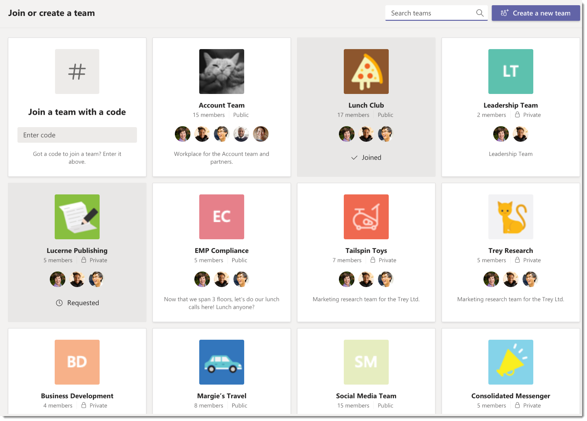
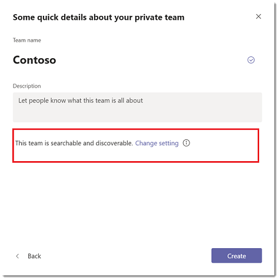

# Manage discovery of private teams in Microsoft Teams

> [!INCLUDE [feature coming soon](includes/new-feature-coming-soon-article.md)]

Admins and team owners can control whether private teams can be discovered by Microsoft Teams users in your organization. When a private team is discoverable, it shows up in search results and is included in suggestions in the team gallery alongside public teams in Teams. This makes it easy for users to search for and find the private teams that they want to join. Users can request to join a private team which a team owner can then approve or deny.

## Overview of public teams, private teams, and discovery in Teams

Most organizations have the following kinds of teams - public teams, discoverable private teams, and non-discoverable private teams.

### Public teams

Public teams are available for all users in your organization to join. Public teams are visible to everyone in the teams gallery and users can join a public team without having to get approval from the team owner. Examples of public teams include a team to discuss news in technology, a team to get dogfood feedback for your products, and a team for people carpooling to work.

### Discoverable private teams

Discoverable private teams can only be joined when the team owner adds users to them. When you make a private team discoverable, the team is included in the list of suggested teams and search results in the teams gallery. Use discoverable private teams for projects and groups in your organization that everyone is aware of and where access to conversations and files in the team need to be controlled. Examples include a team for your HR department, a team for all managers at your organization, and a team for a manager and their direct reports.

### Non-discoverable private teams

Non-discoverable private teams can only be joined when the team owner adds users to them. When you make a private team not discoverable, it's hidden from the list of suggested teams and removed from search results in the teams gallery. Use non-discoverable teams to collaborate on sensitive and highly confidential topics. Examples include a team to discuss an upcoming acquisition and a team to discuss a change in your organization's strategic direction.

## Set whether new private teams are discoverable

When a team owner creates a private team, they can choose to make it discoverable by configuring the team's discovery setting. By default, new private teams are searchable and discoverable. If the team owner doesn't want the private team to show up in search results and suggestions, they can turn off the setting by selecting **Change setting** next to **This team is searchable and discoverable**.

## Set whether existing private teams are discoverable

Team owners can set the discovery setting for an existing private team directly in the team settings and admins can do so by using PowerShell.

### In team settings

In Teams, go to the private team, click **More options ˙˙˙** > **Manage team**. On the **Settings** tab, expand **Team discovery**, and then clear or select the **Turn on discoverability** check box.

### Using PowerShell (coming soon)

Use the **Set-Team** cmdlet to turn off or turn on the discovery setting for an existing private team. Here's an example of how to make a team discoverable:

    Set-Team -GroupId 0abc123d-e4f5-67gh-i890-jk1m2n345o6p -ShowInSearchAndSuggestions $true
You can use this cmdlet in a script to set the discovery setting of existing private teams in bulk.

## Set whether users can discover private teams

As an admin, you can also control which users in your organization are allowed to discover private teams in search results and suggestions in Teams. Create a policy by using the **New-CsTeamsChannelsPolicy** cmdlet, and then assign the policy to users.
 
Set the **AllowPrivateTeamDiscovery** parameter to **true** to allow users who are assigned the policy to see discoverable private teams in search results and suggestions. Setting the **AllowPrivateTeamDiscovery** parameter to **false** removes all discoverable private teams from search results and suggestions for users who are assigned the policy.

By default, **AllowPrivateTeamDiscovery** is set to **true** for all users in an organization.

In this example, we create a policy named VendorPolicy that prevents users from discovering any private teams that are made discoverable, and then we assign the policy to a user named vendoruser1. 
   
     New-CsTeamsChannelsPolicy -Identity VendorPolicy -AllowPrivateTeamDiscovery $false
     Grant-CsTeamsChannelsPolicy -Identity vendoruser1@company.com -PolicyName VendorPolicy

> [!NOTE]
> Private teams that are not discoverable are never shown in search results and suggestions, regardless of the policy setting. For example, if you turn off the discovery setting for a private team, users are unable to discover the team, even though  the **AllowPrivateTeamDiscovery** parameter is set to **true** in the policy setting for those users.

## Related topics
- [Teams PowerShell Overview](teams-powershell-overview.md)