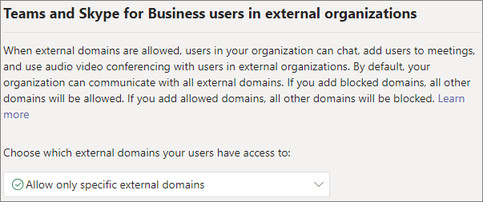
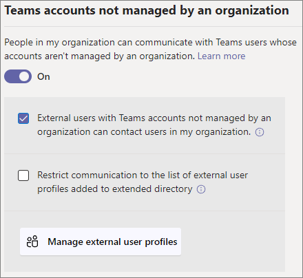
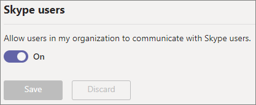

# Manage external meetings and chat in Microsoft Teams

You can configure external meetings and chat in Teams using the *external access* feature. External access is a way for Teams users from outside your organization to find, call, chat, and set up meetings with you in Teams. You can also use external access to communicate with people from other organizations who are still using Skype for Business (online and on-premises) and Skype.

If you want people from other organizations to have access to your teams and channels, use guest access instead. For more information about the differences between external access and guest access, see [Compare external and guest access](communicate-with-users-from-other-organizations.md#compare-external-and-guest-access). 

Use external access when:
  
- You have users in external domains who need to chat. For example, Rob@contoso.com and Ann@northwindtraders.com are working on a project together along with some others in the contoso.com and northwindtraders.com domains.

- You want the people in your organization to use Teams to contact people in specific businesses outside of your organization.

- You want anyone else in the world who uses Teams to be able to find and contact you, using your email address. 

## Plan for external meetings and chat

External access policies include controls for both the organization and user levels. Turning a policy off at the organization level turns it off for all users, regardless of their user level setting. All external access settings are enabled by default.

The Teams admin center controls external access at the organization level. Most options (except domain restrictions) are available at the user level by using PowerShell. See [Using PowerShell](#using-powershell) below for more information.

> [!NOTE]
> If you turn off external access in your organization, people outside your organization can still join meetings through anonymous join. To learn more, see [Manage meeting settings in Teams](meeting-settings-in-teams.md).

> [!NOTE]
> Teams users can add apps when they host meetings or chats with people from other organizations. They can also use apps shared by people in other organizations when they join meetings or chats hosted by those organizations. The data policies of the hosting user's organization, as well as the data sharing practices of any third-party apps shared by that user's organization, are applied.

## Allow or block domains

If you add blocked domains, all other domains will be allowed; and if you add allowed domains, all other domains will be blocked. The exception to this rule is if anonymous participants are allowed in meetings. There are four scenarios for setting up external access in the Teams admin center (**Users** > **External access**):

- **Allow all external domains**: This is the default setting in Teams, and it lets people in your organization find, call, chat, and set up meetings with people external to your organization in any domain.

    In this scenario, your users can communicate with all external domains that are running Teams or Skype for Business so long as the other tenant also supports external communications.
    
- **Allow only specific external domains**: By adding domains to an **Allow** list, you limit external access to only the allowed domains. Once you set up a list of allowed domains, all other domains will be blocked. 

- **Block specific domains** - By adding domains to a **Block** list, you can communicate with all external domains *except* the ones you've blocked.  Once you set up a list of blocked domains, all other domains will be allowed.

- **Block all external domains** - Prevents people in your organization from finding, calling, chatting, and setting up meetings with people external to your organization in any domain.

> [!NOTE]
> The allowed or blocked domains only apply to meetings if anonymous access to meetings is "off".



**Using the Microsoft Teams admin center**

To allow specific domains

1. In the Teams admin center, go to **Users** > **External access**.

2. Under **Choose which domains your users have access to**, choose **Allow only specific external domains**.

3. Select **Allow domains**.

4. In the **Domain** box, type the domain that you want to allow and then click **Done**.

5. If you want to allow another domain, click **Add a domain**.

6. Click **Save**.

To block specific domains

1. In the Teams admin center, go to **Users** > **External access**.

2. Under **Choose which domains your users have access to**, choose **Block only specific external domains**.

3. Select **Block domains**.

4. In the **Domain** box, type the domain that you want to allow and then click **Done**.

5. If you want to block another domain, click **Add a domain**.

6. Click **Save**.

To communicate with another tenant, they must either enable **Allow all external domains** or add your tenant to their list of allowed domains by following the same steps above.  

## Manage contact with external Teams users not managed by an organization

> [!NOTE]
> The Teams and Skype interop capabilities discussed in this article aren't available in GCC, GCC High, or DOD deployments, or in private cloud environments.

Admins can choose to enable or disable communications with external Teams users that are not managed by an organization (“unmanaged”). If enabled, they can also further control if people with unmanaged Teams accounts can initiate contact (see the following image). If **External users with Teams accounts not managed by an organization can contact users in my organization** is turned off, unmanaged Teams users will not be able to search the full email address to find organization contacts and all communications with unmanaged Teams users must be initiated by organization users.

In the Teams admin center, go to **Users** > **External access**.



To block Teams users in your organization from communicating with external Teams users whose accounts are not managed by an organization:
1. Turn off the **People in my organization can communicate with Teams users whose accounts aren't managed by an organization** setting.
2. Clear the **External users with Teams accounts not managed by an organization can contact users in my organization** checkbox.

To let Teams users in your organization communicate with external Teams users whose accounts are not managed by an organization if your Teams users have initiated the contact:
1. Turn on the **People in my organization can communicate with Teams users whose accounts aren't managed by an organization** setting.
2. Clear the **External users with Teams accounts not managed by an organization can contact users in my organization** checkbox.

To let Teams users in your organization communicate with external Teams users whose accounts are not managed by an organization and receive requests to communicate with those external Teams users:
1. Turn on the **People in my organization can communicate with Teams users whose accounts aren't managed by an organization** setting.
2. Select the **External users with Teams accounts not managed by an organization can contact users in my organization** checkbox.

## Communicate with Skype users

Follow these steps to let Teams users in your organization chat with and call Skype users. Teams users can then search for and start a one-on-one text-only conversation or an audio/video call with Skype users and vice versa.



**Using the Microsoft Teams admin center**

1. In the left navigation, go to **Users** > **External access**.

2. Turn on the **Allow users in my organization to communicate with Skype users** setting.

To learn more about the ways that Teams users and Skype users can communicate, including limitations that apply, see [Teams and Skype interoperability](teams-skype-interop.md).

## Using PowerShell

Organization level settings can be configured using [Set-CSTenantFederationConfiguration](/powershell/module/skype/set-cstenantfederationconfiguration) and user level settings can be configured using [Set-CsExternalAccessPolicy](/powershell/module/skype/set-csexternalaccesspolicy).

The following table shows the cmdlet parameters used for configuring federation.

|Configuration|Organization level (Set-CSTenantFederationConfiguration)|User level (Set-CsExternalAccessPolicy)|
|:-------|:--------|:------------------|
|Enable/disable federation with other Teams organizations and Skype for Business|`-AllowFederatedUsers`|`-EnableFederationAccess`|
|Enable federation with specific domains|`-AllowedDomains`|Not available|
|Disable federation with specific domains|`-BlockedDomains`|Not available|
|Enable/disable federation with Teams users that are not managed by an organization|`-AllowTeamsConsumer`|`-EnableTeamsConsumerAccess`|
|Enable/disable Teams users not managed by an organization from initiating conversations|`-AllowTeamsConsumerInbound`|`-EnableTeamsConsumerInbound`|
|Enable/disable federation with Skype|`-AllowPublicUsers`|`-EnablePublicCloudAccess`|

It's important to note that disabling a policy "rolls down" from tenant to users. For example:

```PowerShell
Set-CsTenantFederationConfiguration -AllowFederatedUsers $false
Set-CsExternalAccessPolicy -EnableFederationAccess $true
```

In this example, although the user level policy is enabled, users would not be able to communicate with managed Teams users or Skype for Business users because this type of federation was turned off at the organization level. Therefore, if you want to enable these controls for a subset of users you must turn on the control at an organization level and create two group policies – one that applies to the users that should have the control turned off, and one that applies to the users that should have the control turned on.

## Limit external access to specific people

If you've enabled any of the external access controls at an organization level, you can limit external access to specific users using PowerShell.

You can use the following example script, substituting *Control* for the control you want to change, *PolicyName* for the name you want to give the policy, and *UserName* for each user for whom you want to enable/disable external access.

Be sure you have installed the [Microsoft Teams PowerShell Module](/microsoftteams/teams-powershell-install) before running the script.

```PowerShell
Connect-MicrosoftTeams

# Disable external access globally
Set-CsExternalAccessPolicy -<Control> $false

# Create a new external access policy
New-CsExternalAccessPolicy -Identity <PolicyName> -<Control> $true

# Assign users to the policy
$users_ids = @("<UserName1>", "<UserName2>")
New-CsBatchPolicyAssignmentOperation -PolicyType ExternalAccessPolicy -PolicyName "<PolicyName>" -Identity $users_ids

```

For example, enable communications with external Teams users not managed by an organization:

```PowerShell
Connect-MicrosoftTeams

Set-CsExternalAccessPolicy -EnableTeamsConsumerAccess $false

New-CsExternalAccessPolicy -Identity ContosoExternalAccess -EnableTeamsConsumerAccess $true

$users_ids = @("MeganB@contoso.com", "AlexW@contoso.com")
New-CsBatchPolicyAssignmentOperation -PolicyType ExternalAccessPolicy -PolicyName "ContosoExternalAccess" -Identity $users_ids

```

See [New-CsBatchPolicyAssignmentOperation](/powershell/module/teams/new-csbatchpolicyassignmentoperation) for additional examples of how to compile a user list.

You can see the new policy by running `Get-CsExternalAccessPolicy`.

See also [New-CsExternalAccessPolicy](/powershell/module/skype/new-csexternalaccesspolicy) and [Set-CsExternalAccessPolicy](/powershell/module/skype/set-csexternalaccesspolicy).

## Common external access scenarios

The following sections describe how to enable federation for common external access scenarios, and how the TeamsUpgradePolicy determines delivery of incoming chats and calls.

### Enable federation between users in your organization and other organizations

To enable users in your organization to communicate with users in another organization, both organizations must enable federation. The steps to enable federation for a given organization depend on whether the organization is purely online, hybrid, or purely on-premises.

| If your organization is | Enable federation as follows |
|:---------|:-----------------------|
|Online with no Skype for Business on-premises. This includes organizations that have TeamsOnly users and/or Skype for Business Online users.| If using Teams Admin Center: <br>-	Make sure the domains that you want to communicate with are allowed for external access.<br><br>If using PowerShell:<br>- Ensure the tenant is enabled for federation: `Get-CsTenantFederationConfiguration` must show `AllowFederatedUsers=true`. <br>- Ensure the user's effective value of `CsExternalAccessPolicy` has `EnableFederationAccess=true`.<br>- If you are not using open federation, ensure the target domain is listed in `AllowedDomains` of `CsTenantFederationConfiguration`. |
|On-premises only| In on-premises tools: <br>- Ensure federation is enabled in `CsAccessEdgeConfiguration`.<br>- Ensure federation for the user is enabled through `ExternalAccessPolicy` (either through the global policy, site policy, or user assigned policy). <br> - If you are not using open federation, ensure the target domain is listed in `AllowedDomains`.|
|Hybrid with some users online (in either Skype for Business or Teams) and some users on-premises. | Follow above steps for both online and on-premises organizations. |

### Delivery of incoming chats and calls 

Incoming chats and calls from a federation organization will land in the user's Teams or Skype for Business client depending on the recipient user's mode in TeamsUpgradePolicy.

| If you want to | Do this: |
|:---------|:-----------------------|
|Ensure incoming federated chats and calls arrive in the user's Teams client|Configure your users to be TeamsOnly.
|Ensure incoming federated chats and calls arrive in the user's Skype for Business client|Configure your users to be in any mode other than TeamsOnly.|

### Enable federation between users in your organization and unmanaged Teams users

To enable federation between users in your organization and unmanaged Teams users:

| If your organization is | Enable federation as follows |
|:---------|:-----------------------|
|Online with no Skype for Business on-premises. This includes organizations that have Teams Only users and/or Skype for Business Online users.| If using Teams admin center:<br>-Make sure **People in my organization can communicate with Teams users whose accounts aren't managed by an organization** is enabled in **External Access**.<br>-If you want unmanaged Teams accounts to initiate chats, check the box for **External users with Teams accounts not managed by an organization can contact users in my organization**.<br><br>If using PowerShell:<br>-Ensure the tenant is enabled for federation: `Get-CsTenantFederationConfiguration` must show `AllowTeamsConsumer=true`.<br>-Ensure the user's effective value of `CsExternalAccessPolicy` has `EnableTeamsConsumerAccess=true`.<br>-Ensure the tenant is enabled for unmanaged users to initiate chats: `Get-CsTenantFederationConfiguration` must show `AllowTeamsConsumerInbound=true`.<br>-Ensure the user's effective value of `CsExternalAccessPolicy` has `EnableTeamsConsumerInbound=true`.|
|On-premises only| Chat with unmanaged Teams users is not supported for on-premises only organizations.|
|Hybrid with some users online (in either Skype for Business or Teams) and some users on-premises. | Follow the previously described steps for online organizations. Note that chat with unmanaged Teams users is not supported for on-premises users.|

> [!IMPORTANT]
> You don't have to add any **Teams domains** as allowed domains in order to enable Teams users to communicate with unmanaged Teams users outside your organization. All **unamanged Teams domains** are allowed.

### Enable federation between users in your organization and consumer users of Skype

To enable federation between users in your organization and consumer users of Skype:

| If your organization is | Enable consumer federation as follows |
|:---------|:-----------------------|
|Online only with no Skype for Business on-premises. This includes organizations that have TeamsOnly users and/or Skype for Business Online users. | If using Teams Admin Center: <br>-Make sure **Allow users in my organization to communicate with Skype users** is enabled in External Access.<br><br>If using PowerShell: <br>-Ensure the tenant is enabled for federation: `Get-CsTenantFederationConfiguration` must show `AllowPublicUsers=true`. <br> - Ensure the user's effective value of `CsExternalAccessPolicy` has `EnablePublicCloudAccess=true`. |
|On-premises only| In on-premises tools: <br> - Ensure Skype is enabled as a federated partner. <br> - Ensure `EnablePublicCloudAccess=true` for the user through `ExternalAccessPolicy` (either via global policy, site policy, or user assigned policy).|
| Hybrid with some users online (in either Skype for Business or Teams) and some users on-premises.| Follow above steps for both online and on-premises organizations.

> [!IMPORTANT]
> You don't have to add any **Skype domains** as allowed domains in order to enable Teams or Skype for Business Online users to communicate with Skype users inside or outside your organization. All **Skype domains** are allowed.

## Federation Diagnostic Tool

If you're an administrator, you can use the following diagnostic tool to validate a Teams user can communicate with a federated Teams user:

1. Select **Run Tests** below, which will populate the diagnostic in the Microsoft 365 Admin Center. 

   > [!div class="nextstepaction"]
   > [Run Tests: Teams Federation](https://aka.ms/TeamsFederationDiag)

2. In the Run diagnostic pane, enter the **Session Initiation Protocol (SIP) Address** and the **Federated tenant's domain name**, and then select **Run Tests**.

3. The tests will return the best next steps to address any tenant or policy configurations that are preventing communication with the federated user.


## Related topics

[Native chat experience for external (federated) users](native-chat-for-external-users.md)
