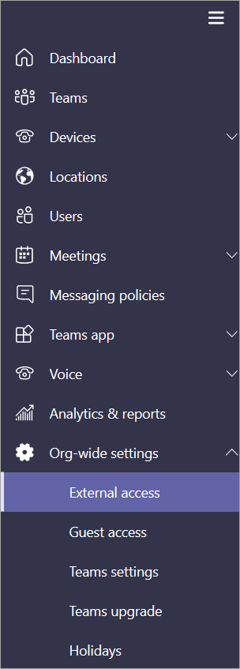
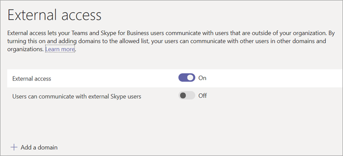
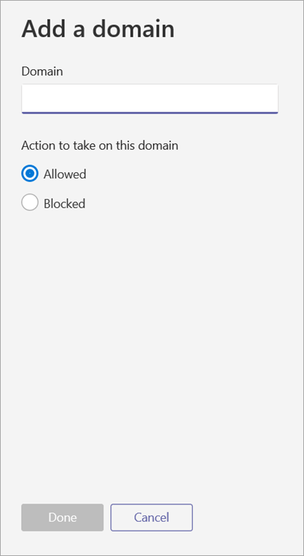

Manage external access (federation) in Microsoft Teams
======================================================

With Microsoft Teams external access, users from other domains can participate in your chats and calls. You can also allow external users who are still using Skype for Business Online or Skype for Business on-prem to participate. 

External access (federation) and guest access are different:

- Guest access gives access permission to an individual. External access gives access permission to an entire domain.

- Guest access, once granted by a team owner, allows a guest to [access resources](guest-experience.md), such as channel discussions and files, for a specific team, and chat with other users in the team they have been invited to. With external access (federated chat), the external chat participants have no access to the inviting organization’s teams or team resources. They can only participate in one-on-one federated chat. Tenant admins can choose between the two communication options depending on which level of collaboration is desirable with the external party. Admins can choose either approaches or both, depending on their organizational needs, but we recommend enabling guest access for a fuller, collaborative Teams experience. 

See the following table for a comparison of external and guest access features.

| Feature | External access users | Guest access users |
|---------|-----------------------|--------------------|
| User can chat with someone in another company | Yes |Yes |
| User can call someone in another company | Yes | Yes |
| User can see if someone from another company is available for call or chat | Yes | Yes1 |
| User can search for users across external tenants | Yes2 | No |
| User can share files | No | Yes |
| User can access Teams resources | No | Yes |
| User can be added to a group chat | No | Yes |
| User can be added to a meeting | Yes | Yes |
| Additional users can be added to a chat with an external user | No3 | N/A |
| User is identified as an external party | Yes | Yes |
| Presence is displayed | Yes | Yes |
| Out of office message is shown | No | Yes |
| Individual user can be blocked | No | Yes |
| @mentions are supported | No | Yes |
| Make Private Calls | Yes | Yes |
| Allow IP Video | Yes | Yes |
| Screen Sharing Mode | Yes | Yes |
| Allow Meet Now | No | Yes |
| Edit Sent Messages | Yes | Yes |
| Can Delete Sent Messages | Yes | Yes |
| Use Giphy In Conversation | Yes | Yes |
| Use Memes In Conversation | Yes | Yes |
| Use Stickers In Conversation | Yes | Yes |
||||

1 Provided that the user has been added as a guest and is signed in as a guest to the guest tenant. 
2 Only by email or Session Initiation Protocol (SIP) address. 
3 External (federated) chat is 1:1 only.

> [!NOTE]
> For more information on guest features and the guest experience, see [Turn on or off guest access to Microsoft Teams](https://docs.microsoft.com/microsoftteams/set-up-guests) and [What the guest experience is like](https://docs.microsoft.com/microsoftteams/guest-experience).

## Turn on or turn off external access (Users can communicate with Skype for Business and Teams users)

You can use the Microsoft Teams & Skype for Business Admin Center to manage external access.

1. In the Microsoft Teams & Skype for Business Admin Center, select **Org-wide settings** > **External access**.

     .

2. Toggle the **Users can communicate with Skype for Business and Teams users** switch to **On** or **Off**.

     .

3. Click **Save**. 

## Add or block a domain

Follow these steps to add a domain or turn off external access for a domain.

1. In the Microsoft Teams & Skype for Business Admin Center, select **Org-wide settings** > **External access**.

2. Select **Add a domain**. 
 
    .

   The **Add a domain** pane appears.

    .

3. Under **Add a domain**, type the name of the domain; for example, type Contoso.com.

4. Select **Allowed** or **Blocked**. You can change this setting at any time.

2. Select **Done**.

After you add a domain, you will see the domain name and status added to the list of domains on the External access page.

## More information

For information about guest access in Microsoft Teams, see [Manage guest access in Microsoft Teams](manage-guests.md).
