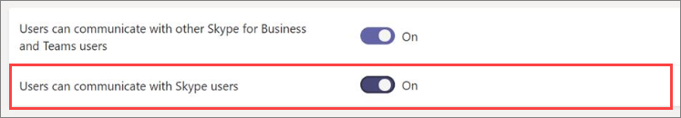

# Manage external access in Microsoft Teams

External access is a way for Teams users from an entire external domain to find, call, chat, and set up meetings with you in Teams. You can also use external access to communicate with people from other organizations who are still using Skype for Business (online and on-premises) and Skype (in preview).

If you want people from other organizations to have access to teams and channels, guest access might be a better way to go. For more information about the differences between external access and guest access, see [Compare external and guest access](communicate-with-users-from-other-organizations.md#compare-external-and-guest-access). 

Use external access when:
  
- You have users in different domains who need to collaborate. For example, Rob@contoso.com and Ann@northwindtraders.com are working on a project together along with some others in the contoso.com and northwindtraders.com domains.

- You want the people in your organization to use Teams to contact people in specific businesses outside of your organization.

- You want anyone else in the world who uses Teams to be able to find and contact you, using your email address. 

> [!IMPORTANT]
> To use the Teams client to communicate with an external user (whether that user is using Teams or Skype for Business), the Teams user must be homed in Skype for Business Online.

## Plan for external access

By default, external access is turned on in Teams, which means that your organization can communicate with all external domains. If you add blocked domains, all other domains will be allowed; and if you add allowed domains, all other domains will be blocked. The exception to this rule is if anonymous participants are allowed in meetings. There are three scenarios for setting up external access in the Teams admin center (**Org-wide settings** > **External access**):

> [!NOTE]
> Teams users can add apps when they host meetings or chats with people from other organizations. They can also use apps shared by people in other organizations when they join meetings or chats hosted by those organizations. The data policies of the hosting user's organization, as well as the data sharing practices of any third-party apps shared by that user's organization, are applied.

> [!NOTE]
> If you turn off external access in your organization, external users can still join meetings through anonymous join. To learn more, see [Manage meeting settings in Teams](./meeting-settings-in-teams.md).

- **Open federation**: This is the default setting in Teams, and it lets people in your organization find, call, chat, and set up meetings with people external to your organization in any domain.

    In this scenario, your users can communicate with all external domains that are running Teams or Skype for Business AND are using open federation OR have added your domain to their allow list.

- **Allow specific domains**: By adding domains to an **Allow** list, you limit external access to only the allowed domains. Once you set up a list of allowed domains, all other domains will be blocked. To allow specific domains, click **Add a domain**, add the domain name, click **Action to take on this domain**, and then select **Allowed**.

- **Block specific domains** - By adding domains to a **Block** list, you can communicate with all external domains *except* the ones you've blocked. To block specific domains, click **Add a domain**, add the domain name, click **Action to take on this domain**, and then select **Blocked**. Once you set up a list of blocked domains, all other domains will be allowed.

> [!NOTE]
> The allowed or blocked domains only apply to meetings if anonymous access to meetings is "off".

## Allow or block domains

### Step 1 - Enable your organization to communicate with another Teams or Skype for Business organizations

  **Using the Microsoft Teams admin center**

1. In the left navigation, go to **Org-wide settings** > **External access**.

2. Turn on the **Users can communicate with other Skype for Business and Teams users** setting.

     .

3. If you want to allow all Teams organizations to communicate with users in your organization, skip to step 5.

4. If you want to limit the organizations that can communicate with users in your organization, you can either allow all except some domains, or you can allow only specific domains. 

    - To allow all except some domains, add the domains you want to block by clicking **Add domain**. In the **Add a domain** pane, type the domain name, click **Blocked**, and then click **Done**. 
    - To limit communications to specific organizations, add those domains to the list with a status of **Allowed**. Once you have added any domain to the Allow list, communications with other organizations will be limited to only those organizations whose domains are in the Allow list. 

5. Click **Save**.

6. Make sure the admin in the other Teams organization completes these same steps. For example, in their **allowed domains** list, their admin needs to enter the domain for your business if they limit the organizations that can communicate with their users.

### Step 2 - Test it

To test your setup, you need a Teams user who's not behind your firewall.
  
1. After you and the admin from the organization have changed the **External access** settings, you should be good to go.

2. In the Teams app, search for the person by email address, and send a request to chat.

3. Ask your Teams contact to send you a request to chat. If you don't receive their request, the problem is your firewall settings (assuming they've already confirmed their firewall settings are correct).

4. Another way to test whether the problem is your firewall is to go to a WiFi location not behind your firewall. such as a coffee shop, and use Teams to send a request to your contact to chat. If the message goes through at the WiFi location, but does not when you're at work, then you know the problem is your firewall.

> [!NOTE]
> If you and another user both turn on external access and allow one another's domains, this will work. If it doesn't work, the other user should make sure their configuration isn't blocking your domain.

## Communicate with Skype users (in preview)

Follow these steps to let Teams users in your organization chat with and call Skype users. Teams users can then search for and start a one-on-one text-only conversation or an audio/video call with Skype users and vice versa.

  **Using the Microsoft Teams admin center**

1. In the left navigation, go to **Org-wide settings** > **External access**.

2. Turn on the **Users can communicate with Skype users** setting.

    .

To learn more about the ways that Teams users and Skype users can communicate, including limitations that apply, see [Teams and Skype interoperability](teams-skype-interop.md).

## Common external access scenarios

The following sections describe how to enable federation for common external access scenarios, and how the TeamsUpgradePolicy determines delivery of incoming chats and calls.

### Enable federation

To enable users in your organization to communicate with users in another organization, both organizations must enable federation. The steps to enable federation for a given organization depend on whether the organization is purely online, hybrid, or purely on-premises.

| If your organization is | Enable federation as follows |
|:---------|:-----------------------|
|Online with no Skype for Business on-premises. This includes organizations that have TeamsOnly users and/or Skype for Business Online users.| If using Teams Admin Center:  -	Make sure the **Users can communicate with other Skype for Business and Teams users** setting is enabled in External Access. - If you are not using open federation (which allows federation with any other domain), then add the external domain to the Allowed list.  If using PowerShell: - Ensure the tenant is enabled for federation: `Get-CsTenantFederationConfiguration` must show `AllowFederatedUsers=true`.  - Ensure the user’s effective value of `CsExternalAccessPolicy` has `EnableFederationAccess=true`. - If you are not using open federation, ensure the target domain is listed in `AllowedDomains` of `CsTenantFederationConfiguration`. |
|Pure on-premises | In on-premises tools:  - Ensure federation is enabled in `CsAccessEdgeConfiguration`. - Ensure federation for the user is enabled through `ExternalAccessPolicy` (either through the global policy, site policy, or user assigned policy).   - If you are not using open federation, ensure the target domain is listed in `AllowedDomains`. |
|Hybrid with some users online (in either Skype for Business or Teams) and some users on-premises. | Follow above steps for both online and on-premises organizations. |

### Delivery of incoming chats and calls 

Incoming chats and calls from a federation organization will land in the user’s Teams or Skype for Business client depending on the recipient user’s mode in TeamsUpgradePolicy.

| If you want to | Do this: |
|:---------|:-----------------------|
| Ensure incoming federated chats and calls arrive in the user’s Teams client: | Configure your users to be TeamsOnly.
| Ensure incoming federated chats and calls arrive in the user’s Skype for Business client | Configure your users to be in any mode other than TeamsOnly. |

### Enable federation between users in your organization and consumer users of Skype

To enable federation between users in your organization and consumer users of Skype:

| If your organization is | Enable consumer federation as follows |
|:---------|:-----------------------|
| Pure online with no Skype for Business on-premises.  This includes organizations that have TeamsOnly users and/or Skype for Business Online users. | If using Teams Admin Center:  -Make sure **Users can communicate with Skype users** is enabled in External Access.  If using PowerShell:  -Ensure the tenant is enabled for federation: `Get-CsTenantFederationConfiguration` must show `AllowPublicUsers=true`.   - Ensure the user’s effective value of `CsExternalAccessPolicy` has `EnablePublicCloudAccess=true`. |
| Pure on-premises | In on-premises tools:   - Ensure Skype is enabled as a federated partner.   - Ensure `EnablePublicCloudAccess=true` for the user through `ExternalAccessPolicy` (either via global policy, site policy, or user assigned policy).|
| Hybrid with some users online (in either Skype for Business or Teams) and some users on-premises.| Follow above steps for both online and on-premises organizations.

> [!IMPORTANT]
> You don't have to add any **Skype domains** as allowed domains in order to enable Teams or Skype for Business Online users to communicate with Skype users inside or outside your organization. All **Skype domains** are allowed.

## How does external access compare with guest access?

To learn about the difference between external access and guest access, read [Communicate with users from other organizations](communicate-with-users-from-other-organizations.md).

## Related topics

- [Native chat experience for external (federated) users](native-chat-for-external-users.md)
