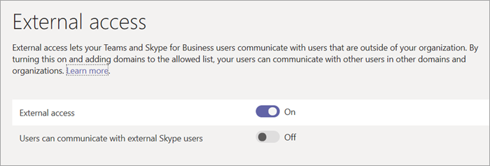

Manage external access (federation) in Microsoft Teams
======================================================

With Microsoft Teams external access, users from other domains can participate in your chats and calls. You can also allow external users who are still using Skype for Business Online or Skype for Business on-prem to participate.

Use the steps in this article when:
  
- You have users in different domains in your business: for example, Rob@ContosoEast.com and Ann@ContosoWest.com.

- You want the people in your organization to use Teams to contact people in specific businesses outside of your organization.

- You want anyone else in the world who uses Teams to be able to find and contact you, using your email address. If you and another user both enable external access and allow each other's domains, this will work. If it doesn't work, the other user should make sure his or her configuration isn't blocking your domain.

External access allows external users to find, call, and send you instant messages, as well as set up meetings with you. However, if you want external users to have access to teams and channels, guest access might be a better way to go. For more information about the differences between external access and guest access, see [External access vs. guest access](#external-access-vs-guest-access)), below. To turn on guest access, see [turn on guest access](set-up-guests.md) so that users can communicate.

> [!IMPORTANT]
> Currently, to federate within the Microsoft Teams client to an external user outside of your organization who's not currently a guest of your Azure Active Directory (Azure AD) or tenant, you must be correctly set up for hybrid and moved to Skype for Business Online. As of 2/25/2019, Teams doesn't support native federation without the user of the SIP profile being homed in Skype for Business Online. For more on setting up your account for hybrid and then moving to Teams, see [Upgrade Skype for Business hybrid deployment to Teams](https://docs.microsoft.com/en-us/microsoftteams/upgrade-to-teams-execute-skypeforbusinesshybrid).

## External access vs. guest access

External access (federation) and guest access are different:

- Guest access gives access permission to an individual. External access gives access permission to an entire domain.

- Guest access, once granted by a team owner, allows a guest to [access resources](guest-experience.md), such as channel discussions and files, for a specific team, and chat with other users in the team they have been invited to. With external access (federated chat), the external chat participants have no access to the inviting organization’s teams or team resources. They can only participate in one-on-one federated chat. Tenant admins can choose between the two communication options depending on which level of collaboration is desirable with the external party. Admins can choose either approaches or both, depending on their organizational needs, but we recommend enabling guest access for a fuller, collaborative Teams experience. 

See the following table for a comparison of external and guest access features.

| Feature | External access users | Guest access users |
|---------|-----------------------|--------------------|
| User can chat with someone in another company | Yes |Yes |
| User can call someone in another company | Yes | Yes |
| User can see if someone from another company is available for call or chat | Yes | Yes1 |
| User can search for users across external tenants | Yes2 | No |
| User can share files | No | Yes |
| User can access Teams resources | No | Yes |
| User can be added to a group chat | No | Yes |
| User can be added to a meeting | Yes | Yes |
| Additional users can be added to a chat with an external user | No3 | N/A |
| User is identified as an external party | Yes | Yes |
| Presence is displayed | Yes | Yes |
| Out of office message is shown | No | Yes |
| Individual user can be blocked | No | Yes |
| @mentions are supported | No | Yes |
| Make Private Calls | Yes | Yes |
| Allow IP Video | Yes | Yes |
| Screen Sharing Mode | Yes | Yes |
| Allow Meet Now | No | Yes |
| Edit Sent Messages | Yes | Yes |
| Can Delete Sent Messages | Yes | Yes |
| Use Giphy In Conversation | Yes | Yes |
| Use Memes In Conversation | Yes | Yes |
| Use Stickers In Conversation | Yes | Yes |
||||

1 Provided that the user has been added as a guest and is signed in as a guest to the guest tenant. 
2 Only by email or Session Initiation Protocol (SIP) address. 
3 External (federated) chat is 1:1 only.

> [!NOTE]
> For more information on guest features and the guest experience, see [Turn on or off guest access to Microsoft Teams](https://docs.microsoft.com/microsoftteams/set-up-guests) and [What the guest experience is like](https://docs.microsoft.com/microsoftteams/guest-experience).

## Let your Teams users chat and communicate with users in another organization

You can easily set up external access for your organization. Follow these steps.

### Step 1 - Make sure to set up the ports and URLs that are needed.

**The most common issue people encounter when setting up business-to-business communication is getting their [Office 365 URLs and IP address ranges](https://docs.microsoft.com/microsoftteams/office-365-urls-ip-address-ranges) right.**

### Step 2 - Enable your organization to communicate with another Teams organization

 **Using the Microsoft Teams admin center**

1. In the left navigation, go to **Org-wide settings** > **External access**.

2. Toggle the **Users can communicate with Skype for Business and Teams users** switch to **On**.

     .

3. If you want to allow all Teams organizations to communicate with users in your organization, skip to step 5.

4. If you want to limit the organizations that can communicate with users in your organization, you can either allow all except some domains, or you can allow only specific domains. 

    - To allow all except some domains, add the domains you want to block by clicking **Add domain**. In the **Add a domain** pane, type the domain name, click **Blocked**, and then clik **Done**. 
    - To limit communications to specific organizations, add those domains to the list with a status of **Allowed**. Once you have added any domain to the Allow list, communications with other organizations will be limited to only those organizations whose domains are in the Allow list. 

5. Click **Save**.

6. Make sure the admin in the other Teams organization completes these same steps. For example, in their **allowed domains** list, their admin needs to enter the domain for your business if they limit the organizations that can communicate with their users.

### Step 3 - Test it

To test your setup, you need a Teams user who's not behind your firewall.
  
1. After you and the admin from the organization have changed the **External access** settings, you should be good to go.

2. In the Teams app, search for the person by email address, and send a request to chat.

3. Ask your Teams contact to send you a request to chat. If you don't receive their request, the problem is your firewall settings (assuming they've already confirmed their firewall settings are correct).

4. Another way to test whether the problem is your firewall is to go to a wifi location not behind your firewall. such as a coffee shop, and use Teams to send a request to your contact to chat. If the message goes through at the wifi location, but does not when you're at work, then you know the problem is your firewall.

## Communicate with users in a Skype for Business Online organization

If you are setting up external access to let your Teams users find and contact users who are in a Skype for Business organization that limits who can contact their users, follow the steps to set up external access from your domain to the other organization's domain. Then ask the admin in the other organization to follow the steps below to configure external access for Skype for Business Online.

 **Using the Skype for Business admin center**

Have the admin in that organization do these steps:

1. In the Microsoft 365 admin center, go to **Admin Centers** > **Teams & Skype** > **Legacy portal**.
  
2. In the **Skype for Business admin center**, choose **Organization** > **External communications**.

3. To set up communication with a specific business or with users in another domain, in the drop-down box, choose **On only for allowed domains**.

    OR, if they want to enable communication with everyone else in the world who has open Skype for Business policies, choose **On except for blocked domains**. This is the default setting.

4. Under **Blocked or allowed domains**, choose **+**, and then add the name of the domain you want to allow.

## More information

For information about guest access in Microsoft Teams, see [Manage guest access in Microsoft Teams](manage-guests.md).
