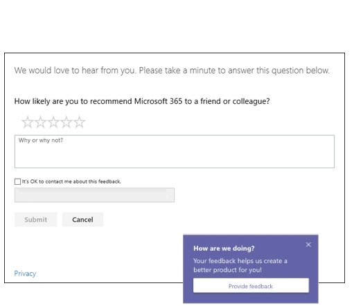

# Manage feedback policies in Microsoft Teams

[!INCLUDE [preview-feature](includes/preview-feature.md)]

Users in your organization can send feedback about Teams to Microsoft let us know how we're doing, directly from within the Teams clients. We're continually improving the Teams experience and we use this feedback to make Teams better.

**The Give feedback feature**

Users can send comments and suggestions about Teams to Microsoft by going to **Help** > **Give feedback** in the Teams clients. Data sent through **Give feedback** is considered as "Support Data" under your Office 365 agreement, including information that would otherwise be considered "Customer Data" or "Personal Data".


**User survey**

Users can also rate their experience with Teams and send us details about the rating they give. This pop-up survey is displayed to users from time-to-time in the Teams desktop client. When a user clicks **Provide feedback** in the notification, they survey form is displayed for them to complete.



## Set whether users can send feedback about Teams to Microsoft

As an admin, you can control whether users in your organization can send feedback about Teams to Microsoft through **Give feedback** and whether they receive the survey. By default, all users in your organization are automatically assigned the global (Org-wide default) policy and the **Give feedback** feature and survey are enabled in the policy. The exception is Teams for Education, where the features are enabled for teachers and disabled for students.

You can edit the global policy or create and assign a custom policy. If a user is assigned a custom policy, that policy applies to the user. If a user isn't assigned a custom policy, the global policy applies to the user. After you edit the global policy or assign a policy, it can take up to 24 hours for changes to take effect.

Say, for example, you want to allow all users in your organization to send feedback through **Give feedback** and receive surveys except for new hires in training. In this scenario, you create a custom policy to turn off both features and assign it to new hires. All other users in your organization get the global policy with the features turned on.  

You use the **New-CsTeamsFeedbackPolicy** cmdlet to create a custom policy and the **Grant-CsTeamsFeedbackPolicy** cmdlet to assign it to one or more users or groups of users, such as a security group or distribution group.

Set the following parameters:

 - **Give feedback**: Set the **userInitiatedMode** parameter to **enabled** to allow users who are assigned the policy to give feedback. Setting the parameter to **disabled** turns off the feature and users who are assigned the policy don't have the option to give feedback.
 - **Survey**: Set the **receiveSurveysMode** parameter to **enabled** to allow users who are assigned the policy to receive the survey. Setting the parameter to **disabled** turns off the feature and users who are assigned the policy won't receive the survey.

## Create a custom feedback policy

In this example, we create a feedback policy called New Hire Feedback Policy and we turn off the ability to give feedback and receive surveys.

```
New-CsTeamsFeedbackPolicy -identity "New Hire Feedback Policy" -userInitiatedMode disabled -receiveSurveysMode disabled
```

## Assign a custom feedback policy

### Assign a custom feedback policy to a user

In this example, we assign a custom policy named New Hire Feedback Policy to a user named user1.

```
Grant-CsTeamsFeedbackPolicy -Identity user1@contoso.com -PolicyName "New Hire Feedback Policy"
```
### Assign a custom feedback policy to users in a group

You may want to assign a custom feedback policy to multiple users that you’ve already identified. For example, you may want to assign a policy to all users in a security group.

In this example, we assign a custom feedback policy called New Hire Feedback Policy to all users in the Contoso New Hires group.  

Get the GroupObjectId of the particular group.
```
$group = Get-AzureADGroup -SearchString "Contoso New Hires"
```
Get the members of the specified group.
```
$members = Get-AzureADGroupMember -ObjectId $group.ObjectId -All $true | Where-Object {$_.ObjectType -eq "User"}
```
Assign all users in the group to a particular feedback policy. In this example, it's New Hire Feedback Policy.
```
$members | ForEach-Object { Grant-CsTeamsFeedbackPolicy -PolicyName "New Hire Feedback Policy" -Identity $_.EmailAddress}
``` 
Depending on the number of members in the group, this command may take several minutes to execute.

## Related topics

- [Teams PowerShell Overview](teams-powershell-overview.md)