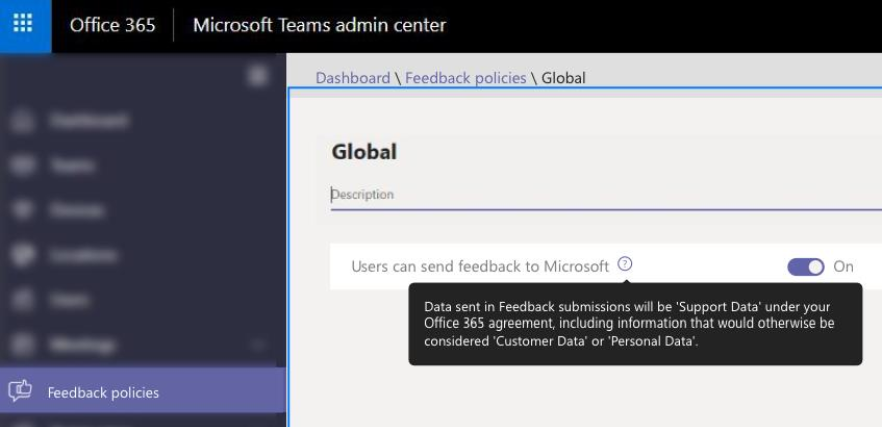

# Manage feedback policies in Microsoft Teams

Users can send comments and suggestions about Teams to Microsoft by going to **Help** > **Give feedback** in the Teams clients. We're continually improving the Teams experience and we use this feedback to make Teams better.

<placeholder only, will replace with a better screen shot, when available><br>


Data sent through **Give feedback** is considered as "Support Data" under your Office 365 agreement, including information that would otherwise be considered "Customer Data" or "Personal Data"

As an admin, you can use feedback policies in the Microsoft Teams admin center to control whether users in your organization can send feedback about Teams to Microsoft. By default, all users in your organization are automatically assigned the global (Org-wide default) policy and the feature is enabled in the policy. The exception is Teams for Education, where the feature is enabled for teachers and disabled for students in the global policy.

You can edit the global policy or create and assign a custom policy. If a user is assigned a custom policy, that policy applies to the user. If a user isn't assigned a custom policy, the global policy applies to the user. After you edit the global policy or assign a policy, it can take up to 24 hours for changes to take effect.

<placeholder only, will replace with a better screen shot, when available><br>


Say, for example, you want to allow all users in your organization to send feedback except for new hires in training. In this scenario, you create a custom policy to turn off the feature and assign it to new hires. All other users in your organization get the global policy with the feature turned on.  

## Create a custom feedback policy

1. In the left navigation of the Microsoft Teams admin center, go to **Feedback policies**.
2. Select **New policy**.
3. Enter a descriptive name for the policy.
4. Turn on or turn off **Users can send feedback to Microsoft**, and then click **Save**.

## Edit a feedback policy

You can edit the global policy or any custom policies that you create. 

1. In the left navigation of the Microsoft Teams admin center, go to **Feedback policies**. 
2. Select the policy you want to edit.
3. Turn on or turn off **Users can send feedback to Microsoft**, and then click **Save**.

## Assign a custom feedback policy to users

You can use the Microsoft Teams admin center to assign a custom policy to one or more users or the Skype for Business PowerShell module to assign a custom policy to groups of users, such as a security group or distribution group.

> [!IMPORTANT]
> We recommend using PowerShell only to assign policies to users. Use the Microsoft Teams admin center to create, edit, and manage policies.

### Assign a custom feedback policy to a user

1. In the left navigation of the Microsoft Teams admin center, go to **Users**, and then click  the user.
2. Next to **Assigned policies**, choose **Edit**.
3. Under **Feedback policy**, select the policy you want to assign, and then choose **Save**.

   <placeholder for screen shot>

### Assign a custom feedback policy to multiple users at a time

To assign a custom feedback policy to multiple users at a time, see [Edit Teams user settings in bulk](edit-user-settings-in-bulk.md).

Or, you can also do the following:

1. Go to **Microsoft Teams admin center** > **Teams apps** > **Feedback policies**.
2. Select the policy by clicking to the left of the policy name.
3. Select **Manage users**.
4. In the **Manage users** pane, search for the user by display name or by user name, select the name, and then select **Add**. Repeat this step for each user that you want to add.
5. When you're finished adding users, select **Save**.

### Assign a custom feedback policy to users in a group

You may want to assign a custom app setup policy to multiple users that you’ve already identified. For example, you may want to assign a policy to all users in a security group. You can do this by connecting to the Azure Active Directory PowerShell for Graph module and the Skype for Business PowerShell module. For more information about using PowerShell to manage Teams, see [Teams PowerShell Overview](teams-powershell-overview.md).

In this example, we assign a custom app setup policy called New Hire Feedback Policy to all users in the Contoso New Hires group.  

> [!NOTE]
> Make sure you first connect to the Azure Active Directory PowerShell for Graph module and Skype for Business PowerShell module by following the steps in [Connect to all Office 365 services in a single Windows PowerShell window](https://docs.microsoft.com/office365/enterprise/powershell/connect-to-all-office-365-services-in-a-single-windows-powershell-window).

Get the GroupObjectId of the particular group.
```
$group = Get-AzureADGroup -SearchString "Contoso New Hires"
```
Get the members of the specified group.
```
$members = Get-AzureADGroupMember -ObjectId $group.ObjectId -All $true | Where-Object {$_.ObjectType -eq "User"}
```
Assign all users in the group to a particular feedback policy. In this example, it's New Hire Feedback Policy.
```
$members | ForEach-Object { Grant-CsTeamsFeedbackPolicy -PolicyName "New Hire Feedback Policy" -Identity $_.EmailAddress}
``` 
Depending on the number of members in the group, this command may take several minutes to execute.

## Related topics

