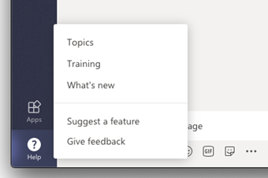

# Manage feedback policies in Microsoft Teams

Users can send comments and suggestions about Teams to Microsoft by going to **Help** > **Give feedback** in the Teams clients. We're continually improving the Teams experience and we use this feedback to make Teams better.

<placeholder only, will replace with a better screen shot, when available><br>


Data sent through **Give feedback** is considered as "Support Data" under your Office 365 agreement, including information that would otherwise be considered "Customer Data" or "Personal Data".

As an admin, you can control whether users in your organization can send feedback about Teams to Microsoft. By default, all users in your organization are automatically assigned the global (Org-wide default) policy and the feature is enabled in the policy. The exception is Teams for Education, where the feature is enabled for teachers and disabled for students.

You can edit the global policy or create and assign a custom policy. If a user is assigned a custom policy, that policy applies to the user. If a user isn't assigned a custom policy, the global policy applies to the user. After you edit the global policy or assign a policy, it can take up to 24 hours for changes to take effect.

Say, for example, you want to allow all users in your organization to send feedback except for new hires in training. In this scenario, you create a custom policy to turn off the feature and assign it to new hires. All other users in your organization get the global policy with the feature turned on.  

You can use the Skype for Business PowerShell module to assign a custom policy to one or more users or groups of users, such as a security group or distribution group.

## Create a custom feedback policy

Run the following.  In this example, we create a new feedback policy called New Hire Feedback Policy.

```
New-CsTeamsFeedbackPolicy -identity "New Hire Feedback Policy" -userInitiatedMode disabled
```

## Assign a custom feedback policy

Run the following. In this example, we assign the custom New Hire Feedback Policy to user1.

## Assign a custom feedback policy to a user

```
New-CsTeamsFeedbackPolicy -identity "New Hire Feedback Policy" -userInitiatedMode disabled
```


### Assign a custom feedback policy to users in a group

You may want to assign a custom app setup policy to multiple users that you’ve already identified. For example, you may want to assign a policy to all users in a security group. You can do this by connecting to the Azure Active Directory PowerShell for Graph module and the Skype for Business PowerShell module. For more information about using PowerShell to manage Teams, see [Teams PowerShell Overview](teams-powershell-overview.md).

In this example, we assign a custom app setup policy called New Hire Feedback Policy to all users in the Contoso New Hires group.  

> [!NOTE]
> Make sure you first connect to the Azure Active Directory PowerShell for Graph module and Skype for Business PowerShell module by following the steps in [Connect to all Office 365 services in a single Windows PowerShell window](https://docs.microsoft.com/office365/enterprise/powershell/connect-to-all-office-365-services-in-a-single-windows-powershell-window).

Get the GroupObjectId of the particular group.
```
$group = Get-AzureADGroup -SearchString "Contoso New Hires"
```
Get the members of the specified group.
```
$members = Get-AzureADGroupMember -ObjectId $group.ObjectId -All $true | Where-Object {$_.ObjectType -eq "User"}
```
Assign all users in the group to a particular feedback policy. In this example, it's New Hire Feedback Policy.
```
$members | ForEach-Object { Grant-CsTeamsFeedbackPolicy -PolicyName "New Hire Feedback Policy" -Identity $_.EmailAddress}
``` 
Depending on the number of members in the group, this command may take several minutes to execute.