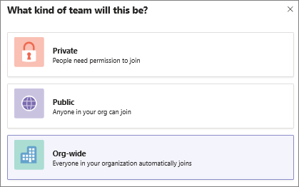

# Manage firstline workers in Microsoft Teams

> [!IMPORTANT]
> Effective October 1, 2019, Microsoft StaffHub will be retired. We're building StaffHub capabilities, including schedule and task management, into Microsoft Teams. Additional capabilities for firstline workers will roll out to Teams over time. To learn more, see [Microsoft StaffHub to be retired](https://support.office.com/article/microsoft-staffhub-to-be-retired-30ca17f3-5502-4bc9-bb0a-bed04bb362f0).  

## Overview of Shifts
The Shifts app in Teams is designed to connect firstline workers to their company. It's built mobile first for fast and effective time management and communication for teams. 
- Fast schedule creation and coordination 
- Communicate in the moment to keep everyone in the know, and connect the company to their firstline workers in Teams 
- Give your team quick access to information they need right in Office 365 
- Get the enterprise-level security and compliance features you expect from Office 365

 Shifts is built for the mobile needs of firstline workers on top of Office 365. Being part of Office 365 means Shifts comes with built-in integrations to Azure Active Directory, Microsoft Teams, and Office 365 Groups. This allows you to maximize your Office 365 investments, while providing a simple and secure user experience across tools. 

Shifts lets workers and their managers use their mobile devices to manage schedules and keep in touch. 

- Managers create, update, and manage shift schedules for the team. They can also send messages to one person ("there's a spill on the floor") or the entire team ("the regional GM is arriving in 20 minutes"). They can send policy documents, news bulletins, or videos. 
- Employees view their upcoming shifts at a glance, can see who else is scheduled for the day, and can request to swap a shift.

> [!NOTE]
> If you don't see the **Org-wide** option when creating a team and you're a global admin, the feature might still be rolling out or your organization might have more than the current size limit of 2,500 members. We're looking to increase this limit in future.

When an org-wide team is created, all global admins are added as team owners and all active users are added as team members. Users who are disabled for Teams, guest users, and most rooms aren't added to the team. As your organization's directory is updated to include new active users or if users no longer work at your company and their Teams license is disabled, changes are automatically synced and the users are added or removed from the team. Team members can't leave an org-wide team. As a team owner, you can manually add or remove users if needed.

> [!NOTE]
> Rooms that aren't a part of a room list, equipment, and resource accounts might be added or synced to the org-wide team. Team owners can easily remove these accounts from the team.

## Best practices
To get the most out of your org-wide team, we recommend team owners do the following.

### Allow only team owners to post to the General channel
Reduce channel noise by having only team owners post to the General channel. Go to the team and click **More options (…)** > **Manage Team**. On the **Settings** tab, click **Member permissions** > select **Only owners can post messages**.
### Turn off @team and @[team name] mentions
 Reduce @mentions to keep them from overloading the entire organization. Go to the team and click **More options (…)** > **Manage Team**. On the **Settings** tab, click **@mentions** > turn off **Show members the option to @team or @[team name]**. 
### Automatically favorite important channels
 Favorite important channels to ensure everyone in your organization engages in specific conversations. To learn more, see [Auto-favorite channels for the whole team](https://support.office.com/article/auto-favorite-channels-for-the-whole-team-a948272c-5aa5-429c-863c-4e1e1cd6b0f6).

### Remove accounts that might not belong
Even though members can’t leave an org-wide team, as a team owner, you can manage the team roster by removing accounts that don’t belong. Make sure you use Teams to remove users from your org-wide team.  If you use another way to remove a user, such as the Microsoft 365 admin center or from a group in Outlook, the user might be added back to the org-wide team. 

## FAQ

### Is there a way to create an org-wide team other than using the Teams client? 

Global admins can only create an org-wide team by using the Teams client. If your organization limits creating teams to using PowerShell, the recommended workaround is to add your global admins to the security group of users who can create a team. For more information, see [Manage who can create Office 365 Groups](https://docs.microsoft.com/office365/admin/create-groups/manage-creation-of-groups). 

If this isn't an option, you can create a public team using PowerShell and add a global admin as the team owner. Then, have the global admin click **˙˙˙ More options** next to the team name, click **Edit team**, and then change the privacy to **Org-wide - Everyone in your organization will be automatically added**. Note that only team owners can access the **Edit team** option and only global admins can see the **Org-wide** option.
