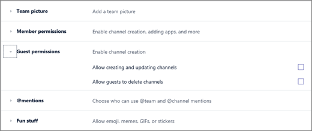

Manage guest access in Microsoft Teams
======================================

**Guest** is a user/license type in Microsoft Teams that is included with all Office 365 Business Premium, Office 365 Enterprise, and Office 365 Education subscriptions. No additional Office 365 license is necessary. Teams guest access is a tenant-level setting and is turned off by default. For details about how to enable guest access, see [Turn on or off guest access to Microsoft Teams](set-up-guests.md).

After the **Guest** user/license type is turned on, you can configure settings for guests via the controls described in [Manage Microsoft Teams features in your Office 365 organization](enable-features-office-365.md) and [Manage Teams during the transition to the new Microsoft Teams and Skype for Business Admin Center](manage-teams-skypeforbusiness-admin-center.md).     
    
IT admins can add guests at the tenant level, set and manage guest user policies and permissions, determine which users can invite guests, and pull reports on guest user activity. These controls are available through the Office 365 admin center. Guest user content and activities are under the same compliance and auditing protection as the rest of Office 365.

Team owners can invite new guests and add existing directory guest users to their teams. In addition, team owners can set channel-related capabilities for guests via **Manage teams** > **Guest permissions**, including allowing guests to create, update, and delete channels, as shown in the following screenshot:

  

In addition, you can use the Azure Active Directory portal to manage guests and their access to Office 365 and Teams resources. Teams guest access makes use of Azure Active Directory business-to-business (B2B) collaboration capabilities as the underlying infrastructure to store security principles information such as identity properties, memberships, and multi-factor authentication settings. To learn more about Azure Active Directory B2B, see [What is Azure AD B2B collaboration?](https://go.microsoft.com/fwlink/p/?linkid=853011) and [Azure Active Directory B2B collaboration FAQs](https://go.microsoft.com/fwlink/p/?linkid=853020).
> [!NOTE]
> Microsoft Teams always honors Azure Active Directory external settings to allow or prevent guest user addition to the tenant. For more details, see [Authorize guest access in Microsoft Teams](Teams-dependencies.md).
  
## Guest access latencies

The guest settings are set in Azure Active Directory. It takes 2 hours to 24 hours for the changes to be effective across your Office 365 organization. If a user sees the message "Contact your administrator" when they try to add a guest to their team, it's likely that either the guest feature hasn't been enabled or the settings aren't effective yet.