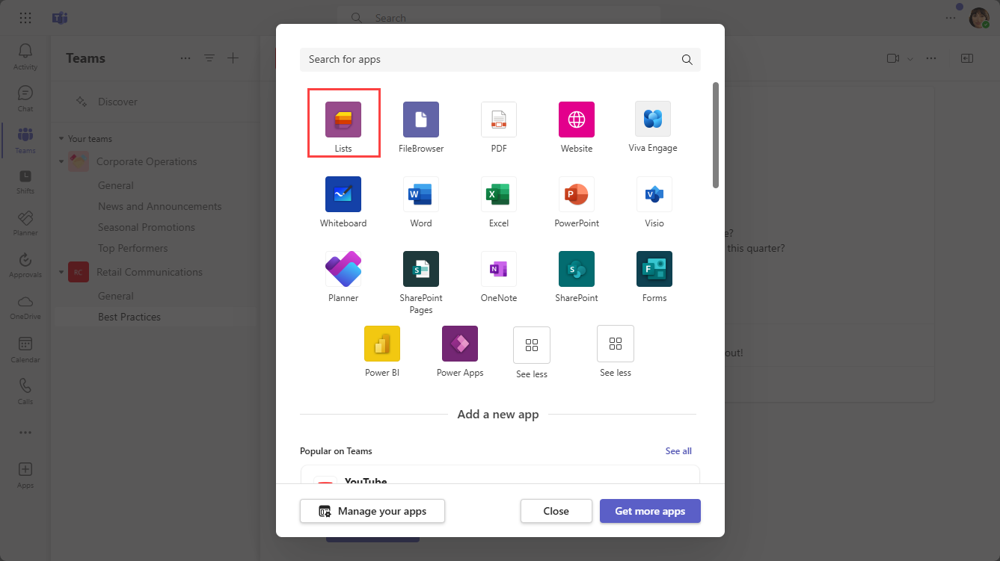
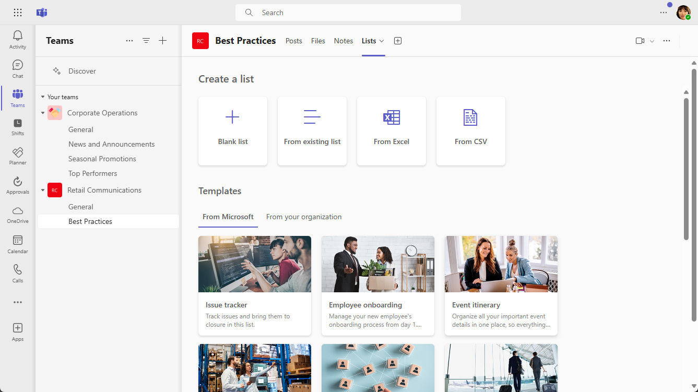

# Manage the Lists app for your organization in Microsoft Teams

## Overview of Lists

The Lists app in Microsoft Teams helps users in your organization track information, organize work, and manage workflows. With Lists, users can track data such as issues, assets, routines, contacts, inventory, incidents, loans, patients, and more using customizable views, rules, and alerts to keep everyone on the team in sync.

In Teams, users access Lists as a tab in a channel. Select **+** to open the tab gallery and add a new Lists app tab instance to a channel to get started.

Users can create new lists or pin existing lists from within the same team or from a different SharePoint site that they have access to. New lists can be created from scratch, from built-in templates, based on the structure of an existing list, or by importing data from an Excel workbook. The Lists app is available in Teams desktop, web, and mobile clients.

## Templates

Templates in Lists are tailored to common information tracking scenarios for users. Each template comes with a predefined list structure, form layouts, and formatting options at both a list view and a details view level to help users get started quickly. After selecting a template, users get a preview of what the list will look like, along with some sample data. Here's some examples of how teams in your organization can use the predefined templates in Lists:

- Track issues and bring them to closure using the Issue tracker template.
- Organize all your event details with the Event itinerary template.
- Use the Patients template to record the needs and status of patients for health teams in your healthcare organization to monitor and coordinate care.
- Track the status of loan applications with the Loans template.

## Example scenario

A local post office is responsible for sorting and delivering mail in their district. Each morning, the post office has a team huddle to review daily goals, share announcements, and discuss known incidents.

After the huddle, mail carriers pick up their mail and start their delivery route. Incidents can occur along a route, for example, a vehicle accident, dog-related issue, or social unrest protest. When mail carriers encounter an incident, they use Teams on their mobile devices to record the incident details, which are tracked in a list in the team channel. Everyone on the team, including mail carriers in the field, can see this information and stay informed.

Before moving to Teams, mail carriers had to go back to the post office to complete a hard-copy form to report an incident, which was then entered in an Excel spreadsheet. Teams gives mail carriers a mobile first, experience where they can use Lists to report incidents in the field as they happen, share incident details with team members, have conversations about them on the channel, and drive incidents to resolution.

## What you need to know about Lists

### Lists is available in every team and channel

Lists is pre-installed for all Teams users and is available directly in the tab gallery of every team and channel. This means that users don't have to go to the Teams app store to install it.

### Lists and SharePoint

Lists data is stored in the SharePoint Online team site. To learn more about how SharePoint Online interacts with Teams, see [How SharePoint Online and OneDrive for Business interact with Teams](SharePoint-OneDrive-interact.md).

Permissions set in SharePoint apply to lists created in the Lists app. By default, lists inherit permissions from the site to which they belong. These permissions govern the types of actions that users can do, such as whether they can create or edit lists. To learn more, see [Permission levels in SharePoint](/sharepoint/understanding-permission-levels) and [User permissions and permission levels in SharePoint Server](/sharepoint/sites/user-permissions-and-permission-levels).

In certain scenarios, you may want to restrict what actions users can do in lists. For example, a person on a team edits a list view, which changes it for all team members, and you want to allow only the team owner or certain team members to edit list views. To learn more, see [Customize permissions for a SharePoint list or library](https://support.microsoft.com/office/customize-permissions-for-a-sharepoint-list-or-library-02d770f3-59eb-4910-a608-5f84cc297782#ID0EAACAAA=Online,_2019,_2016,_2013).

> [!NOTE]
> At this point, owner and member permissions in a team aren't linked in any way to permissions in the team site that govern the behavior of lists or the Lists App. However, based on customer feedback and usage, this will be considered for a future iteration of the product.  

### Limitations

With Lists, users get a desktop, web, and mobile experience. It's important to know that users can't create new lists or pin existing lists using Lists on the Teams mobile client. To view or edit a list on the Teams mobile client, a list must first be created or added using Lists on the Teams desktop or web client.

Guests can't create or delete a list. They can add list items to existing lists, start new conversations about list items, and reply to existing conversations about list items.

### Lists and the SharePoint app

If users in your organization created lists using the SharePoint app, those lists will be automatically moved to Lists without any action needed from the user. To get the best and richest lists integration experience in Teams, use the Lists app and pin your existing lists.

## Set up Lists

### Enable or disable Lists in your organization

Lists is enabled by default for all Teams users in your organization. You can turn off or turn on the app at the org level on the [Manage apps](manage-apps.md) page in the Microsoft Teams admin center.

1. In the left pane of the Microsoft Teams admin center, go to **Teams apps** > **Manage apps**.
2. Do one of the following:

    - To turn off Lists for your organization, search for the Lists app, select it, and then select **Block**.
    - To turn on Lists for your organization, search for the Lists app, select it, and then select **Allow**.

### Enable or disable Lists for specific users in your organization

To allow or block specific users in your organization from using Lists, make sure Lists is turned on for your organization on the [Manage apps](manage-apps.md) page, and then create a custom app permission policy and assign it to those users. To learn more, see [Manage app permission policies in Teams](teams-app-permission-policies.md).

## Search the audit log for list events

Lists are enabled with enterprise level auditing so you can search for lists and list item events in the audit log in the Security & Compliance Center. To learn more, see [Search the audit log in the Security & Compliance Center](/microsoft-365/compliance/search-the-audit-log-in-security-and-compliance).

For a list of audit events that are relevant to the Lists app in Teams, see [SharePoint list activities](/microsoft-365/compliance/search-the-audit-log-in-security-and-compliance#sharepoint-list-activities).

Before you can search the audit log, you have to first turn on auditing in the [Security & Compliance Center](https://protection.office.com). Keep in mind that audit data is only available from the point at which you turned on auditing.

## Power Automate, Power Apps, and Graph API

Lists supports [Power Automate](/power-automate/flow-types) for workflows and [Power Apps](/powerapps/maker/canvas-apps/customize-list-form) for list forms. Developers can use the [Lists API](/sharepoint/dev/sp-add-ins/working-with-lists-and-list-items-with-rest) to connect list data as a source through Microsoft Graph.

## Give feedback or report an issue
  
To send us feedback or report an issue, select **Help** near the bottom of the left pane in Teams, and then select **Report a problem**. Select **Lists**, and then enter your feedback or details about the issue you're experiencing.

## Related articles

- [Lists help documentation](https://support.microsoft.com/office/apps-and-services-cc1fba57-9900-4634-8306-2360a40c665b#PickTab=Lists)
