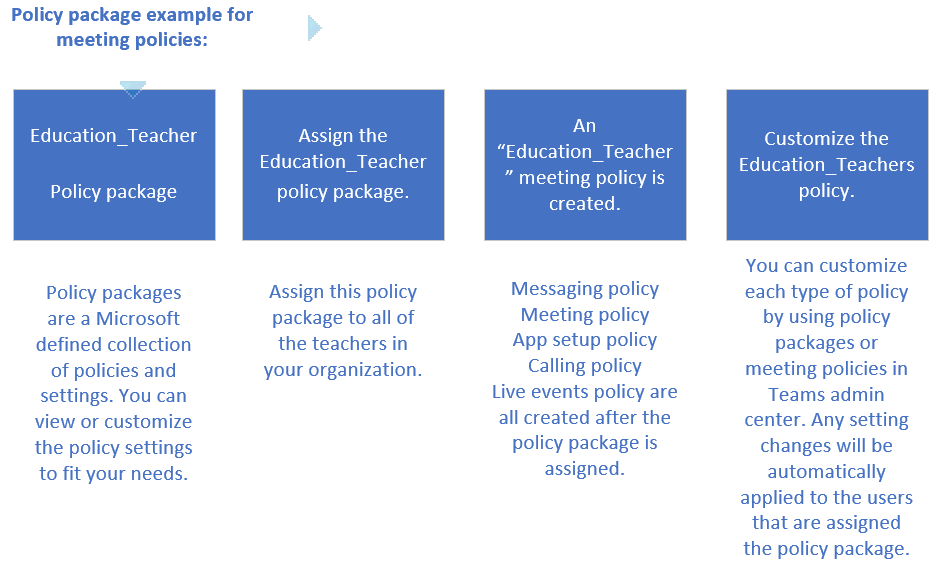

# Manage policy packages in Microsoft Teams
A policy package is a collection with a set predefined policies and settings that can be applied to users that have similar roles within your organization. When you assign a policy package to users, the policies defined within the policy package are created and you can then click on the policy package link to view and customize settings for each of the policies.

##What are policy packages?

Teams creates policy packages designed to simplify, streamline, and to help provide consistency when managing policies for groups of users across your organization.

There are four steps that you will go through as an admin in Teams to use policy packages in your organization. 

 

##View-only page
You can use this page to view the settings of a specific policy that is linked to this policy package. If you haven't assigned the policy package to a user or if the policy linked to the package policy has been deleted or renamed you won't be able to make changes to the settings of the policy. 

> [!IMPORTANT]
> When a policy is deleted or renamed but is linked to a policy package, and you can only view policy settings another 'new' policy with the right name will be created again.

##Types of policy packages

|**Package name**  |**Description** |
|---------|---------|
|Education_Teacher package     |This policy package is designed to create a set of policies and apply those settings to teachers within your organization.      |
|Education_PrimaryStudent package    |This policy package is designed to create a set of policies and apply those settings to primary students within your organization.|
|Education_SecondaryStudent package    |This policy package is designed to create a set of policies and apply those settings to secondary students within your organization.         |
|Education_HigherEducationStudent package    |This policy package is designed to create a set of policies and apply those settings to higher education students within your organization.|

##Policies included in policy packages
There are five different policies that are created when you assign users to a policy package. The policies include the name of policy package so you can easily identify the policy that is link to policy package. You can edit the settings of each policy using the Policy packages icon or in each individual policy type in the left navigation ofthe Teams admin center. Here are the individual policies that are created:

- **Messaging policy** - Messaging policies are used to control which chat and channel messaging features are available to users in Microsoft Teams. [Learn more](messaging-policies-in-teams.md)
- **Meeting policy** - Meeting policies are used to control the features that are available to meeting participants for meetings that are scheduled by users in your organization.  [Learn more](meeting-policies-in-teams.md)
- **App setup policy** - @Lana - Insert description and link. I cant find the correct doc.
- **Calling policy** - Calling policies control which calling and call forwarding features are available to users. [Learn more](teams-calling-policy.md)
- **Live events policy** - Live event policies are used to control what features such as transcriptions for attendees, allow scheduling and other features are available to users that are assigned the policy. [Learn more](teams-live-events/set-up-for-teams-live-events.md)

Policy packages in Microsoft Teams are predefined collections of policies and policy settings that you can assign to users in your organization. Policy packages let you control features that you want to allow or restrict for specific sets of people across your organization. You can customize the policy settings within each policy in a collection to meet your organization's needs.  

For example, you can use the Education_Teacher policy package to assign a collection of policies that apply to all teachers in your school.

You manage policy packages in the Microsoft Teams admin center.

## Assign a policy package

## 

## Related topics
