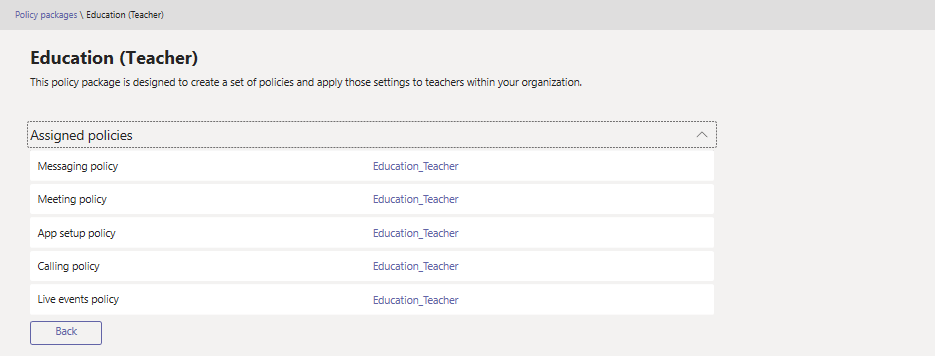

# Manage policy packages in Microsoft Teams

A policy package in Microsoft Teams is a collection of predefined policies and policy settings that you can assign to users who have similar roles in your organization. We built policy packages to simplify, streamline, and help provide consistency when managing policies for groups of users across your organization.  

When you assign a policy package to users, the policies in the package are created and you can then customize the settings of the policies in the package to meet your organization's needs.

## What is a policy package?

Policy packages let you control Teams features that you want to allow or restrict for specific sets of people across your organization. Each policy package in Teams is designed around a user role and includes predefined policies and policy settings that support the collaboration and communication activities that are typical for that role.

Teams currently includes the following policy packages.

|**Package name**  |**Description** |
|---------|---------|
|Education_Teacher package     |Creates a set of policies and policy settings that apply to teachers.      |
|Education_PrimaryStudent package    |Creates a set of policies and policy settings that apply to primary students.|
|Education_SecondaryStudent package    |Creates a set of policies and policy settings that apply to secondary students.         |
|Education_HigherEducationStudent package    |Creates a set of policies and policy settings that apply to higher education students.|

> [!NOTE]
> We'll be adding more policy packages in future releases of Teams, so check back for the most up-to-date information.  

Each individual policy is given the name of the policy package so you can easily identify the policies that are linked to a policy package. For example, when you assign the Education_Teacher policy package to teachers in your school, a policy that's named Education_Teacher is created for each policy in the package.

## How to use policy packages

The following outlines how to use a policy package in your organization.

It's important to know that policies in a policy package aren't created until you assign the package to users, after which you can change the settings of individual policies in the package. Any changes you make to policy settings are automatically applied to users who are assigned the package.

You can view the settings of policies in a policy package before you assign it but you won't be able to make changes to any settings until after you assign the package.

If a policy is deleted, you can still view the settings but you won't be able to change any settings. The deleted policy is re-created with the default settings when you assign the policy package.

### View the settings of a policy in a policy package

1. In the left navigation of the Microsoft Teams admin center, click **Policy packages**, and then select the policy package by clicking to the left of the package name.
2. Click the policy that you want to view. 

### Assign a policy package

1. In the left navigation of the Microsoft Teams admin center, go to **Policy packages**, and then select the policy package you want to assign by clicking to the left of the  package name.
2. Click **Manage users**.
3. In the **Manage users** pane, search for the user by display name or by user name, select the name, and then select **Add**. Repeat this step for each user that you want to add.
4. When you're finished adding users, select **Save**.

### Edit a policy in a policy package

You can edit the settings of each policy using the policy packages icon or by going to the policy page in the left navigation of the Teams admin center.

#### Using the policy packages icon

1.
2.

#### Using the policy page

1. In the left navigation of the Microsoft Teams admin center, click the policy type that you want to change. For example, **Messaging policies**. 
2. Click the policy that you want to edit.  For example, **Education_Teacher**.
3. Make the changes that you want, and then click **Save**.
