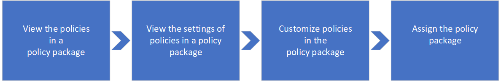

# Manage policy packages in Microsoft Teams

Policy packages in Microsoft Teams are collections of predefined policies and policy settings that you can assign to users who have similar roles in your organization. Policy packages are designed to simplify, streamline, and provide consistency when managing policies for specific groups of users across your organization.  

When you assign a policy package to users, the policies in the package are created and you can then customize the settings of the policies in the package to meet your organization's needs.

## Policy packages in Teams

Teams includes the following policy packages.

|**Package name**  |**Description** |
|---------|---------|
|Education_Teacher package     |Creates a set of policies and policy settings that apply to teachers.      |
|Education_PrimaryStudent package    |Creates a set of policies and policy settings that apply to primary students.|
|Education_SecondaryStudent package    |Creates a set of policies and policy settings that apply to secondary students.         |
|Education_HigherEducationStudent package    |Creates a set of policies and policy settings that apply to higher education students.|

> [!NOTE]
> We'll be adding more policy packages in future releases of Teams, so check back for the most up-to-date information.  

## Policies included in a policy package

The following policies are created when you assign a policy package to users. Each individual policy is configured with default settings and is given the name of the policy package so you can easily identify the policies that are linked to a policy package.

- **Messaging policy** - Messaging policies are used to control which chat and channel messaging features are available to users in Teams. [Learn more](messaging-policies-in-teams.md).
- **Meeting policy** - Meeting policies are used to control the features that are available to meeting participants for meetings that are scheduled by users in your organization.  [Learn more](meeting-policies-in-teams.md).
- **App setup policy** - App setup policies let you customize Teams to highlight the apps that are most important for your users. You choose the apps that you want to pin to the app bar in Teams clients. [Learn more](teams-app-setup-policies.md).
- **Calling policy** - Calling policies control which calling and call forwarding features are available to users. [Learn more](teams-calling-policy.md).
- **Live events policy** - Live event policies are used to control what features available to users who hold live events in your organization. [Learn more](teams-live-events/set-up-for-teams-live-events.md).

For example, when you assign the Education_Teacher policy package to teachers in your school, a policy that's named Education_Teacher is created for each policy type.

[placeholder for screen shot of Education_Teacher policy package and policies]

## How to use policy packages

Policy packages let you control Teams features that you want to allow or restrict for specific sets of people across your organization. The following outlines how to use a policy package in your organization.

It's important to know that the policies in a policy package aren't created until you assign the package to users, after which you can change the settings of individual policies in the package. Any changes you make to policy settings are automatically applied to users who are assigned the  package.

You can view the settings of policies in a policy package before you assign it but you won't be able to make changes to any settings until after you assign the package.

If a policy is deleted, you can still view the settings but you won't be able to change any settings. The deleted policy is re-created with the default settings when you assign the policy package.

### View the settings of a policy in a policy package

1. In the left navigation of the Microsoft Teams admin center, click **Policy package**, and then select a policy package.
2. Click the policy that you want to view.

### Assign a policy package

1. In the left navigation of the Microsoft Teams admin center, go to **Policy package**, and then select the policy package that you want to assign. 
2. Click **Manage users**.
3. 

### Edit a policy in a policy package

You can edit the settings of each policy using the policy packages icon or by going to the policy page in the left navigation of the Teams admin center.

#### Using the policy packages icon

1.
2.

#### Using the policy page

1. In the left navigation of the Microsoft Teams admin center, click the policy type that you want to change. For example, **Messaging policies**. 
2. Click the policy that you want to edit.  For example, **Education_Teacher**.
3. Make the changes that you want, and then click **Save**.
