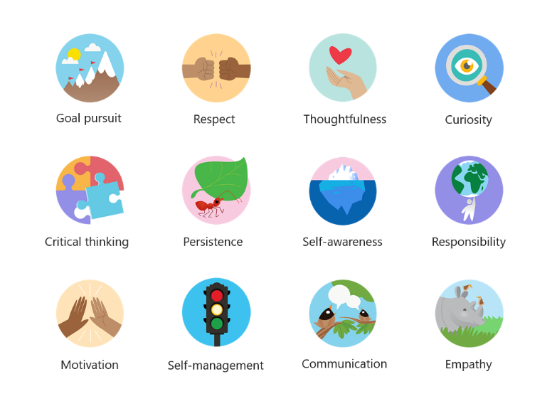

# Manage the Praise app the Teams admin center

The Praise app in Microsoft Teams helps users show appreciation to members of their organization. With a selection of badge sets to choose from and the option to create your own badges, Praise is designed to help recognize the effort that goes into the wide range of work that Teams users do, from educators to first line workers.

Admins can control what badges are available to their organization from the Teams admin center. In the left navigation, select **Teams apps > Manage apps**. Open Praise in the [tenant app catalog](/Teams/manage-apps.md#view-apps-in-your-tenant-app-catalog), and go to **Settings**.

## Use built-in badge sets

Built-in sets are collections of badges designed by Microsoft for the Praise app. These sets are not editable by admins.
<a name="default-badges"> </a>

### Default badges

The default badge set is designed to help Teams users recognize their peers for going above and beyond with their work.

<a name="sel-edu-badges"> </a>

### Social and emotional learning badges for education

Social and emotional learning badges for Teams for education: Educators can recognize individual students for social and emotional learning (SEL) achievements and behaviors with badges that illustrate these concepts.

The Default badges are already enabled and available in the Praise app. To change the availability of the default set or of any badges sets, switch the corresponding toggle to On or Off.

[ADD SCREENSHOT HERE]

<a name="create-your-own-badges"> </a>

## Create your own badges

To create your own badges, switch the **Custom badges** toggle to On and select **+ Create a custom badge**. From there, you can design a custom badge in the side panel.
To create your own badges, switch the Custom badges toggle to On and select Add badges. From there, you can design a custom badge in the panel.

1. Enter a badge name. This is the name that will appear on the badge when users send praise. 
2. Set your badge colors. To set the text and background colors of your badge, you need to enter the colors as hexadecimal (hex) values.

> [!TIP] If you’re new to hex values, this article includes a [quick introduction](#hex-colors-intro) to show you how to use them to  set the text and background colors of your badge.

3. Upload a badge image. The accepted file type is .PNG.

4. Localize your badge name: Under Locales, select Add items +. Select the desired locale from the drop-down list. Then enter the badge name in the designated language.
5. Exclude your badge from specific locales: Under Exclusion list, select Add items +.Select the locales you want to exclude from the drop-down list. 
6. Select **Apply**. Your new badge will now appear in the Custom badges table.

> [!NOTE]
> If steps 4 and 5 are skipped, the badge will be in the default language for all locales.
>
> When you’re finished making changes to your badge selection, make sure to select **Save**. It may take up to a few hours a while before these changes are available to your organization.

<a name="hex-colors-intro"> </a>

## Hex values: a quick introduction

Hex color values are strings of six hexadecimal digits that represent the intensity of red (RR), green (GG), and blue (BB) in a specific color on a scale of 00 to FF. When you put the values of all three colors together, you get a hex value: #RRGGBB

For example, the hex value for the color red is #FF0000 because red is set at the highest possible value, FF, and green and blue are each set at the lowest possible value, 00.

Below is a list of example colors to get you started:

|Color  |Hex value|
|-------|---------|
|<code style="background:#ff6666;color:black">&nbsp;&nbsp;&nbsp;&nbsp;&nbsp;&nbsp;</code>|  #FF6666   |
|<code style="background:#7fffd4;color:black">&nbsp;&nbsp;&nbsp;&nbsp;&nbsp;&nbsp;</code>|  #7FFFD4   |
|<code style="background:#ff75f0;color:black">&nbsp;&nbsp;&nbsp;&nbsp;&nbsp;&nbsp;</code>|  #FF75F0   |
|<code style="background:#00bfff;color:black">&nbsp;&nbsp;&nbsp;&nbsp;&nbsp;&nbsp;</code>|  #00BFFF   |
|<code style="background:#800080;color:black">&nbsp;&nbsp;&nbsp;&nbsp;&nbsp;&nbsp;</code>|  #800080   |
|<code style="background:#000000;color:black">&nbsp;&nbsp;&nbsp;&nbsp;&nbsp;&nbsp;</code>|  #000000   |

<a name="best-practices"> </a>

## Best practices for creating custom badges

**Submit all your badges at once.** Because it takes a while for new badges to be processed, it’s best to add all your custom badges to the table before submitting them.

**When choosing colors, keep accessibility in mind.** Some colors go together better than others.  Create contrast between your text and background colors to make the badge name easy to read. For example, if you chose a dark background color, choose a light text color.

**When selecting an image, keep badge dimensions in mind.** For the best quality, we recommend uploading an image file that is 216x216 pixels. Avoid stretching or distorting the image to fit these dimensions.

**If your badge image isn’t rectangular, make the image transparent.** You’ll need to do this before uploading the image file to Praise.

## Badge set assets

[explain why admin might use this]

### Default badges assets

 

|Badge name     |Image file  |Text color | Background color |
|---------------|------------|---------- |--------|
|Achiever       |[Achiever.PNG](downloads/praise-app/default-set/Achiever.PNG)            |#D36E70    |#E3F4FC|
|Awesome        |[Awesome.PNG](downloads/praise-app/default-set/Awesome.PNG)              |#8283B2    |#D1EFF2|
|Coach          |[Coach.PNG](downloads/praise-app/default-set/Coach.PNG)                  |#6AA55A    |#DBF1D6|
|Courage        |[Courage.PNG](downloads/praise-app/default-set/Courage.PNG)              |#DC5041    |#FCF6C8|
|Creative       |[Creative.PNG](downloads/praise-app/default-set/Creative.PNG)            |#CF9D50    |#FCF6C8|
|Inclusive      |[Inclusive.PNG](downloads/praise-app/default-set/Inclusive.PNG)          |#3C77BB    |#E2F4FC|
|Kind Heart     |[Kind Heart.PNG](downloads/praise-app/default-set/KindHeart.PNG)         |#D36D6E    |#F4DEDE|
|Leadership     |[Leadership.PNG](downloads/praise-app/default-set/Leadership.PNG)        |#419098    |#D2EAEC|
|Optimism       |[Optimism.PNG](downloads/praise-app/default-set/Optimism.PNG)            |#D8338C    |#F4DDDE|
|Problem Solver |[Problem Solver.PNG](downloads/praise-app/default-set/ProblemSolver.PNG) |#B8916E    |#CBDADF|
|Team Player    |[Team Player.PNG](downloads/praise-app/default-set/TeamPlayer.PNG)       |#8B8DC0    |#F4EEC0|
|Thank You      |[Thank You.PNG](downloads/praise-app/default-set/ThankYou.PNG)           |#469CA4    |#BACCB6|

 

### Social and emotional learning badges for education assets

 

|Badge name        |Image file  |Text color | Background color |
|------------------|------------|---------- |--------|
|Communication     |[Communication.PNG](downloads/praise-app/sel-edu-set/Communication.PNG)        |#FFFFFF    |#173B65|
|Critical thinking |[Critical Thinking.PNG](downloads/praise-app/sel-edu-set/CriticalThinking.PNG) |#FFFFFF    |#084D26|
|Curiosity         |[Curiosity.PNG](downloads/praise-app/sel-edu-set/Curiosity.PNG)                |#FFFFFF    |#008078|
|Empathy           |[Empathy.PNG](downloads/praise-app/sel-edu-set/Empathy.PNG)                    |#FFFFFF    |#650B35|
|Goal pursuit      |[Goal pursuit.PNG](downloads/praise-app/sel-edu-set/GoalPursuit.PNG)           |#FFFFFF    |#006F95|
|Motivation        |[Motivation.PNG](downloads/praise-app/sel-edu-set/Motivation.PNG)              |#FFFFFF    |#C52127|
|Persistence       |[Persistence.PNG](downloads/praise-app/sel-edu-set/Persistence.PNG)            |#FFFFFF    |#167D3E|
|Respect           |[Respect.PNG](downloads/praise-app/sel-edu-set/Respect.PNG)                    |#FFFFFF    |#8251A0|
|Responsibility    |[Responsibility.PNG](downloads/praise-app/sel-edu-set/Responsibility.PNG)      |#FFFFFF    |#B05DA3|
|Self-awareness    |[Self-Awareness.PNG](downloads/praise-app/sel-edu-set/SelfAwareness.PNG)       |#FFFFFF    |#1680E5|
|Self-management   |[Self-Management.PNG](downloads/praise-app/sel-edu-set/SelfManagement.PNG)     |#FFFFFF    |#4C144D|
|Thoughtfulness    |[Thoughtfulness.PNG](downloads/praise-app/sel-edu-set/Thoughtfulness.PNG)      |#FFFFFF    |#EE4086|
