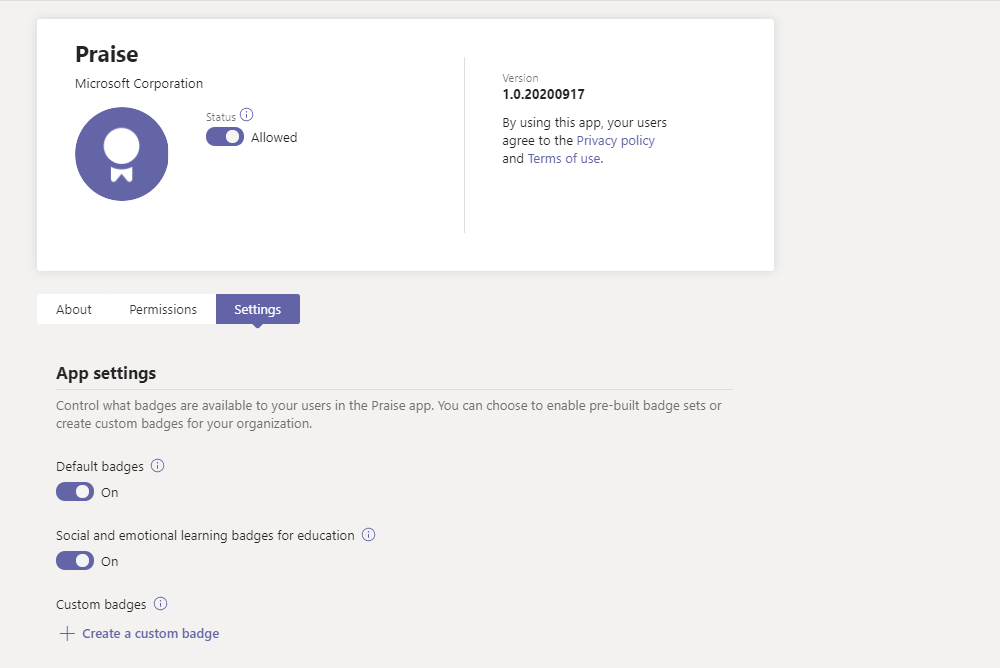
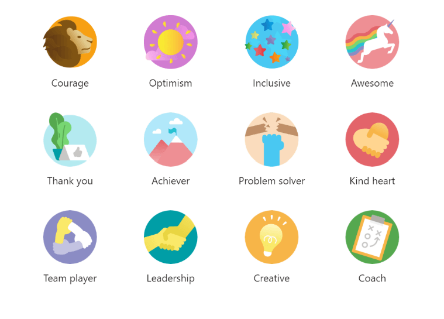
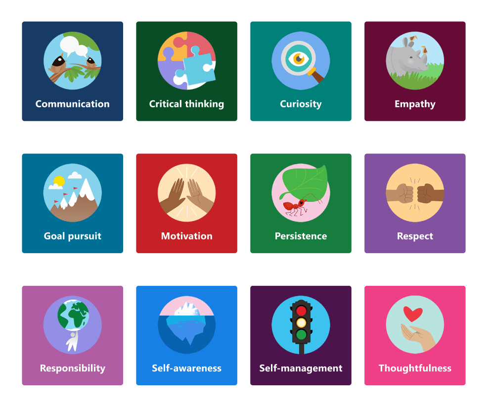
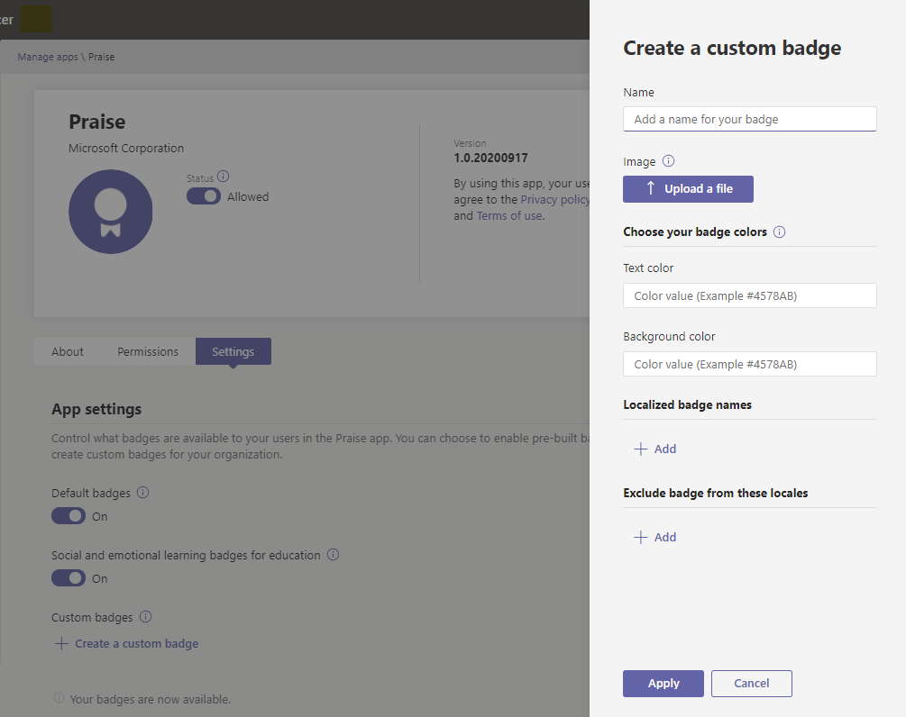
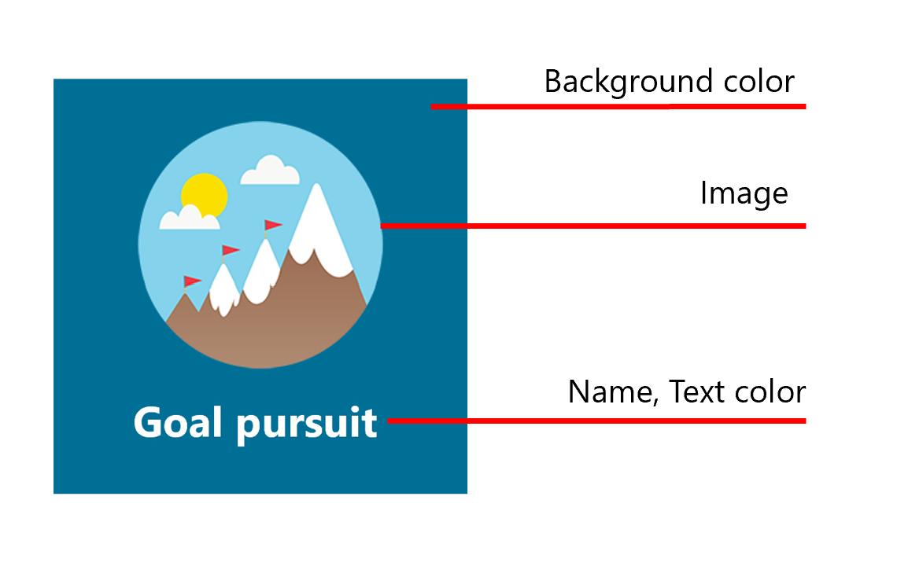
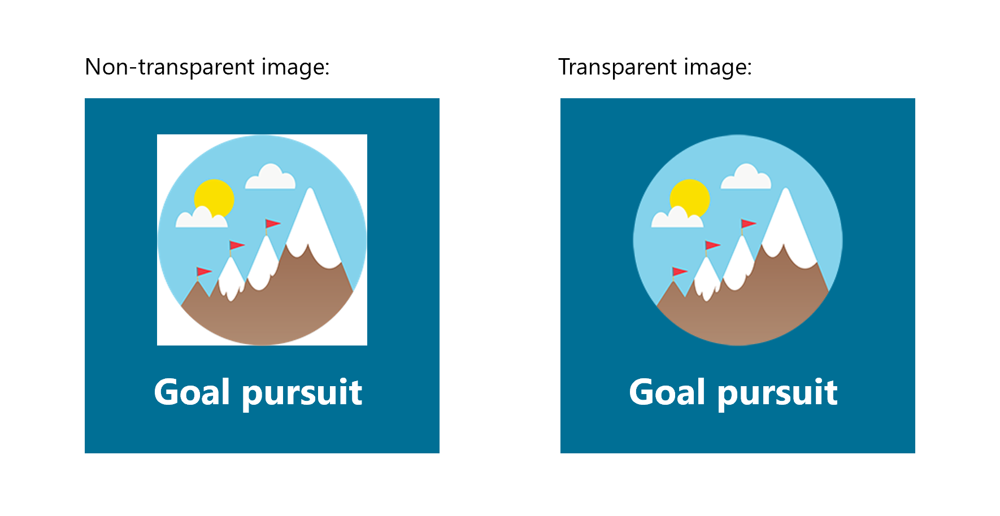

# Manage the Praise app in the Microsoft Teams admin center

> [!NOTE]
> Admins must have a Teams license to access this feature. If you try to access this feature without a Teams license, you'll get an error message.

The Praise app in Microsoft Teams helps users show appreciation to members of their organization or classroom. With a selection of badge sets to choose from and the option to create your own badges, Praise is designed to help recognize the effort that goes into the wide range of work that Teams users do, from educators to Frontline Workers. To learn more, check out [Send Praise to people](https://support.microsoft.com/office/send-praise-to-people-50f26b47-565f-40fe-8642-5ca2a5ed261e).

Admins can control what badges are available to their organization from the Microsoft Teams admin center. In the left navigation, go to **Teams apps > Manage apps**. In the list of apps, click **Praise**, and then select **Settings**.  From here, you can choose to enable default and built-in badge sets and create custom badges.

> [!NOTE]
> The Praise app feature isn't available for U.S. government clouds.

## Use built-in badge sets

Built-in sets are collections of badges designed by Microsoft for the Praise app. These sets are not editable by admins. The default badge set is already enabled and available in the Praise app. To change the availability of the default set or of any badges sets, switch the corresponding toggle to On or Off. 

<a name="default-badges"> </a>

### Default badges

The default badge set is designed to help Teams users recognize their peers for going above and beyond with their work.

<a name="sel-edu-badges"> </a>

### Social and emotional learning badges for education

Educators can recognize individual students for social and emotional learning (SEL) achievements and behaviors with badges that illustrate these concepts.

<a name="create-your-own-badges"> </a>

## Create your own badges

Select **Create a custom badge**. From here, you can design a custom badge in the side panel. You can create up to 25 custom badges. 

1. Enter a badge name. This is the name that will appear on the badge when users send praise.

2. Set your badge colors. To set the text and background colors of your badge, you need to enter the colors as hexadecimal (hex) values.

   > [!TIP]
   > If you’re new to hex values, this article includes a [quick introduction](#hex-colors-intro) to show you how to use them.

3. Upload a badge image. The accepted file type is .PNG. The image file must be less than 40 KB with maximum dimensions of 216 X 216 pixels.

4. Localize your badge name: Under **Localized badge names**, select **Add**. Select the desired locale from the drop-down list. Then enter the badge name in the designated language.

5. Exclude your badge from specific locales: Under **Exclude badge from these locales**, select **Add**. Select the locales you want to exclude from the drop-down list.

6. Select **Apply**. Your new badge will now appear in the custom badges table.

> [!NOTE]
> If steps 4 and 5 are skipped, the badge will be in the default language for all locales.
>
> When you’re finished making changes to your badge selection, make sure to select **Submit**. It may take up to a few hours before these changes are available to your organization.

<a name="hex-colors-intro"> </a>

## Specify colors with hex values

Hex color values are strings of six hexadecimal digits that represent the intensity of red (RR), green (GG), and blue (BB) in a specific color on a scale of 00 to FF. When you put the values of all three colors together, you get a hex value: #RRGGBB

For example, the hex value for the color red is #FF0000 because red is set at the highest possible value, FF, and green and blue are each set at the lowest possible value, 00.

To explore different colors and their hex values, check out [Bing color picker](https://www.bing.com/search?q=color+picker).

Below is a list of example colors to get you started:

|Color  |Hex value|
|-------|---------|
||  #FF6666   |
||  #7FFFD4   |
||  #FF75F0   |
||  #00BFFF   |
||  #800080   |
||  #000000   |

<a name="best-practices"> </a>

## Best practices for creating custom badges

**Submit all your badges at once.** Because it takes a while for new badges to be processed, it’s best to add all your custom badges to the table before submitting them.

**When choosing colors, keep accessibility in mind.** Some colors go together better than others.  Create contrast between your text and background colors to make the badge name easy to read. For example, if you chose a dark background color, choose a light text color.

**When selecting an image, keep badge dimensions in mind.** For the best quality, we recommend uploading an image file that is 216 x 216 pixels (which are the maximum dimensions). Avoid stretching or distorting the image to fit these dimensions.

**If your badge image isn’t rectangular, make the image transparent.** You’ll need to do this before uploading the image file to Praise.

## Badge set assets

Built-in badge sets can't be modified, so when a built-in set is enabled, all badges in the set are added to the Praise app. If you want to add specific badges from a built-in set and leave out others, re-create the badges you want to use as custom badges. You can download the badge image and find the text and background colors of badges from built-in sets in the tables below.

### Default badges assets

 

|Badge name     |Image file  |Text color | Background color |
|---------------|------------|---------- |--------|
|Achiever       |[Achiever PNG](https://github.com/MicrosoftDocs/OfficeDocs-SkypeForBusiness/raw/live/Teams/downloads/praise-app/default-set/achiever-badge.png)|#D36E70    |#E3F4FC|
|Awesome        |[Awesome PNG](https://github.com/MicrosoftDocs/OfficeDocs-SkypeForBusiness/raw/live/Teams/downloads/praise-app/default-set/awesome-badge.png)</a>|#8283B2    |#D1EFF2|
|Coach          |[Coach PNG](https://github.com/MicrosoftDocs/OfficeDocs-SkypeForBusiness/raw/live/Teams/downloads/praise-app/default-set/coach-badge.png)</a>|#6AA55A    |#DBF1D6|
|Courage        |[Courage PNG](https://github.com/MicrosoftDocs/OfficeDocs-SkypeForBusiness/raw/live/Teams/downloads/praise-app/default-set/courage-badge.png)</a>|#DC5041    |#FCF6C8|
|Creative       |[Creative PNG](https://github.com/MicrosoftDocs/OfficeDocs-SkypeForBusiness/raw/live/Teams/downloads/praise-app/default-set/creative-badge.png) |#CF9D50    |#FCF6C8|
|Inclusive      |[Inclusive PNG](https://github.com/MicrosoftDocs/OfficeDocs-SkypeForBusiness/raw/live/Teams/downloads/praise-app/default-set/inclusive-badge.png)</a>|#3C77BB    |#E2F4FC|
|Kind Heart     |[Kind Heart PNG](https://github.com/MicrosoftDocs/OfficeDocs-SkypeForBusiness/raw/live/Teams/downloads/praise-app/default-set/kind-heart-badge.png)</a>|#D36D6E    |#F4DEDE|
|Leadership     |[Leadership PNG](https://github.com/MicrosoftDocs/OfficeDocs-SkypeForBusiness/raw/live/Teams/downloads/praise-app/default-set/leadership-badge.png)|#419098    |#D2EAEC|
|Optimism       |[Optimism PNG](https://github.com/MicrosoftDocs/OfficeDocs-SkypeForBusiness/raw/live/Teams/downloads/praise-app/default-set/optimism-badge.png)</a>|#D8338C    |#F4DDDE|
|Problem solver |[Problem solver PNG](https://github.com/MicrosoftDocs/OfficeDocs-SkypeForBusiness/raw/live/Teams/downloads/praise-app/default-set/problem-solver-badge.png)|#B8916E    |#CBDADF|
|Team player    |[Team player PNG](https://github.com/MicrosoftDocs/OfficeDocs-SkypeForBusiness/raw/live/Teams/downloads/praise-app/default-set/team-player-badge.png)|#8B8DC0    |#F4EEC0|
|Thank you      |[Thank you PNG](https://github.com/MicrosoftDocs/OfficeDocs-SkypeForBusiness/raw/live/Teams/downloads/praise-app/default-set/thank-you-badge.png)|#469CA4    |#BACCB6|

 

### Social and emotional learning badges for education assets

 

|Badge name        |Image file  |Text color | Background color |
|------------------|------------|---------- |--------|
|Communication     |[Communication PNG](https://github.com/MicrosoftDocs/OfficeDocs-SkypeForBusiness/raw/live/Teams/downloads/praise-app/sel-edu-set/communication-badge.png)|#FFFFFF    |#173B65|
|Critical thinking |[Critical thinking PNG](https://github.com/MicrosoftDocs/OfficeDocs-SkypeForBusiness/raw/live/Teams/downloads/praise-app/sel-edu-set/critical-thinking-badge.png)|#FFFFFF    |#084D26|
|Curiosity         |[Curiosity PNG](https://github.com/MicrosoftDocs/OfficeDocs-SkypeForBusiness/raw/live/Teams/downloads/praise-app/sel-edu-set/curiosity-badge.png)|#FFFFFF    |#008078|
|Empathy           |[Empathy PNG](https://github.com/MicrosoftDocs/OfficeDocs-SkypeForBusiness/raw/live/Teams/downloads/praise-app/sel-edu-set/empathy-badge.png)|#FFFFFF    |#650B35|
|Goal pursuit      |[Goal pursuit PNG](https://github.com/MicrosoftDocs/OfficeDocs-SkypeForBusiness/raw/live/Teams/downloads/praise-app/sel-edu-set/goal-pursuit-badge.png)|#FFFFFF    |#006F95|
|Motivation        |[Motivation PNG](https://github.com/MicrosoftDocs/OfficeDocs-SkypeForBusiness/raw/live/Teams/downloads/praise-app/sel-edu-set/motivation-badge.png)|#FFFFFF    |#C52127|
|Persistence       |[Persistence PNG](https://github.com/MicrosoftDocs/OfficeDocs-SkypeForBusiness/raw/live/Teams/downloads/praise-app/sel-edu-set/persistence-badge.png)|#FFFFFF    |#167D3E|
|Respect           |[Respect PNG](https://github.com/MicrosoftDocs/OfficeDocs-SkypeForBusiness/raw/live/Teams/downloads/praise-app/sel-edu-set/respect-badge.png)|#FFFFFF    |#8251A0|
|Responsibility    |[Responsibility PNG](https://github.com/MicrosoftDocs/OfficeDocs-SkypeForBusiness/raw/live/Teams/downloads/praise-app/sel-edu-set/responsibility-badge.png)|#FFFFFF    |#B05DA3|
|Self-awareness    |[Self-awareness PNG](https://github.com/MicrosoftDocs/OfficeDocs-SkypeForBusiness/raw/live/Teams/downloads/praise-app/sel-edu-set/self-awareness-badge.png)|#FFFFFF    |#1680E5|
|Self-management   |[Self-management PNG](https://github.com/MicrosoftDocs/OfficeDocs-SkypeForBusiness/raw/live/Teams/downloads/praise-app/sel-edu-set/self-management-badge.png)|#FFFFFF    |#4C144D|
|Thoughtfulness    |[Thoughtfulness PNG](https://github.com/MicrosoftDocs/OfficeDocs-SkypeForBusiness/raw/live/Teams/downloads/praise-app/sel-edu-set/thoughtfulness-badge.png)|#FFFFFF    |#EE4086|
