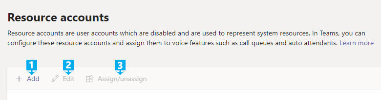
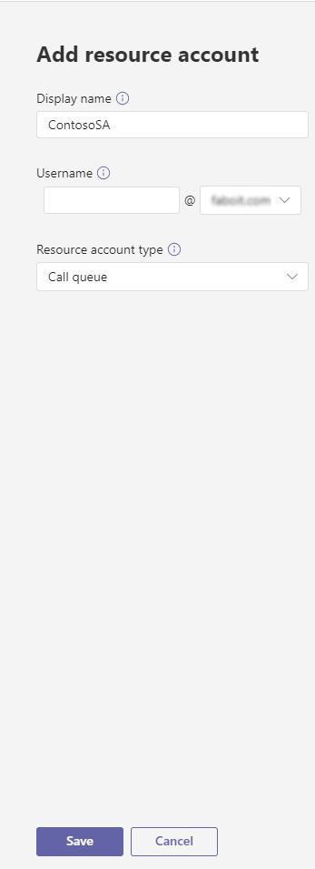
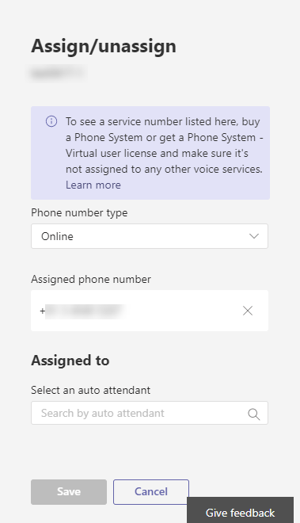
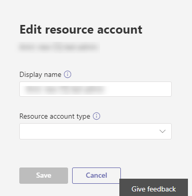

# Manage resource accounts in Microsoft Teams

A resource account is also known as a disabled user object in Azure Active Directory, and can be used to represent resources in general. In Exchange it might be used to represent conference rooms, for example, and allow them to have a phone number. A resource account can be homed in Microsoft 365 or on premises using Skype for Business server, and these accounts are created using Powershell commands.

In Microsoft Teams or Skype for Business Online, each call queue or auto attendant is required to have an associated resource account. Whether a resource account needs an assigned phone number will depend on the intended use of the associated call queue or auto attendant. Refer to the articles on call queues and auto attendants linked at the bottom of this article before assigning a phone number to a resource account.

> [!NOTE]
> This article applies to both Microsoft Teams and Skype for Business Online. For resource accounts homed on Skype for Business Server 2019, see [Configure Cloud auto attendants](/SkypeForBusiness/hybrid/configure-cloud-auto-attendant).

## Prerequisites to assign a phone number to a resource account

To get started it's important to remember a few things:
  
- An auto attendant or call queue is required to have an associated resource account. 
- The resource account will need an assigned phone number if it will be assigned to a top level auto attendant or call queue. 
- If the auto attendant or call queue is nested under a top level auto attendant, the associated resource account only needs a phone number if you want multiple points of entry into the structure of auto attendants and call queues.
- You only need to license the resource accounts with a phone number assigned to them. In a nested auto attendant or call queue, you do not need to license the rest of the auto attendants or call queues if they do not have phone numbers associated with them.
- If you are assigning a phone number that is used with Direct Routing and you have an Enterprise E1 or E3 licenses you must buy and assign a Phone System license to your the resource account that you will be using. If you have an Enterprise E5 license, Phone System is already included so there's no need to buy one. 
- If you are assigning a Microsoft service number instead, you need to acquire and assign the following licenses to your resource account \(Office 365 Enterprise E1, E3 or E5, with the Phone System add-on and a Calling Plan\).
- You can assign a Direct Routing Hybrid number to your resource account.  See [Plan Direct Routing](direct-routing-plan.md) for details.
- For Microsoft calling plans, you can only assign toll and toll-free service phone numbers that you got in the **Microsoft Teams admin center** or ported from another service provider to a resource account. To get and use toll-free service numbers, you need to set up Communications Credits.

> [!NOTE]
> Direct Routing service numbers assigned to resource accounts for auto attendant and call queues is supported for Microsoft Teams users and agents only.
>
> Microsoft is working on an appropriate licensing model for applications such as Cloud auto attendants and call queues, for now you need to use the user-licensing model.
>
> To redirect calls to people in your organization who are homed Online, they must have a **Phone System** license and be enabled for Enterprise Voice or have Office 365 Calling Plans. See [Assign Microsoft Teams licenses](assign-teams-licenses.md). To enable them for Enterprise Voice, you can use Windows PowerShell. For example run:  `Set-CsUser -identity "Amos Marble" -EnterpriseVoiceEnabled $true`
>
> User (subscriber) phone numbers can't be assigned to a resource account. Only service toll or toll-free phone numbers can be used.
>
> If you are outside the United States, you can't use the Microsoft Teams admin center to get service numbers. Go to [Manage phone numbers for your organization](manage-phone-numbers-for-your-organization/manage-phone-numbers-for-your-organization.md) instead to see how to do it from the outside of the United States.

### Phone numbers

Creating a resource account that uses a phone number would require performing the following tasks in the following order:

1. Transfer or get a toll or toll-free service number. The number can't be assigned to any other voice services or resource accounts.

   Before you assign a phone number to a resource account, you will need to get or port your existing toll or toll-free service numbers. After you get the toll or toll-free service phone numbers, they will show up in **Microsoft Teams admin center** > **Voice** > **Phone numbers**, and the **Number type** listed will be listed as **Service - Toll-Free**. To get your service numbers, see [Getting service phone numbers](https://docs.microsoft.com/SkypeForBusiness/what-is-phone-system-in-office-365/getting-service-phone-numbers?toc=/MicrosoftTeams/toc.json&bc=/microsoftteams/breadcrumb/toc.json) or if you want to transfer an existing service number, see [Transfer phone numbers to Office 365](transfer-phone-numbers-to-office-365.md).

2. Buy a Phone System license and a Calling Plan. See:  
   - [Office 365 Enterprise E1 and E3](teams-add-on-licensing/office-365-enterprise-e1-e3.md)
   - [Office 365 Enterprise E5](teams-add-on-licensing/office-365-enterprise-e5-with-audio-conferencing.md)
   - [Office 365 Enterprise E5 Business Software](https://products.office.com/business/office-365-enterprise-e5-business-software)- [Calling Plans for Office 365](calling-plans-for-office-365.md)

3. Create a new resource account. See [Create a resource account in Microsoft Teams admin center](#create-a-resource-account-in-microsoft-teams-admin-center) or [Create a resource account in Powershell](#create-a-resource-account-in-powershell)
4. Assign the Phone System license and the Calling Plan to the resource account. See [Assign Microsoft Teams licenses](assign-teams-licenses.md) and [Assign licenses to one user](https://docs.microsoft.com/office365/admin/subscriptions-and-billing/assign-licenses-to-users?redirectSourcePath=%252farticle%252f997596b5-4173-4627-b915-36abac6786dc&view=o365-worldwide#assign-licenses-to-one-user).
5. Assign the service number to the resource account. See [Assign/Unassign phone numbers and services](#assignunassign-phone-numbers-and-services).

A resource account that doesn't require a phone number can omit steps 1,2, and 5.

## Create a resource account in Microsoft Teams admin center

After you've bought a Phone System license and a Calling Plan, using Microsoft Teams admin center, navigate to **Org-wide settings** > **Resource accounts**. 




To create a new resource account click **+ New account**. In the pop-up, fill out the display name and user name for the resource account (the domain name should populate automatically) then click **Save**.



Next, apply a license to the resource account in the O365 Admin center, as described in [Assign licenses to users in Office 365 for business](https://docs.microsoft.com/office365/admin/subscriptions-and-billing/assign-licenses-to-users?view=o365-worldwide)

### Assign/Unassign phone numbers and services

 Once you've created the resource account and assigned the license, you can click on **Assign/Unassign** to assign a Calling Plan service number to the resource account, or assign the resource account to an auto attendant or call queue that already exists. Assigning a direct routing number can be done using Cmdlets only. If your call queue or auto attendant still needs to be created, you can link the resource account while you create it. Click **Save** when you are done.

> [!IMPORTANT]
> If your tenant hasn't bought a Phone System license and a Calling Plan, an internal check will cause a failure when you try to assign the phone number to the resource account. You won't be able to assign the number or associate the resource account with a service.



 You can edit the resource account display name using the **Edit** option.  Click **Save** when you are done.


## Create a resource account in Powershell

For Microsoft calling plans, you can only assign toll and toll-free service phone numbers that you got in the **Microsoft Teams admin center** or ported from another service provider to a resource account. To get and use toll-free service numbers, you need to set up Communications Credits.

Depending on whether your resource account is located online or on premises, you would need to connect to the appropriate Powershell prompt with Admin privileges. 
- The following Powershell cmdlet examples presume the resource account is homed online using [New-CsOnlineApplicationInstance](https://docs.microsoft.com/powershell/module/skype/new-CsOnlineApplicationInstance?view=skype-ps) to create a resource account that is homed online.

- For resource accounts homed on-premises in Skype For Business Server 2019 that can be used with Cloud Call Queues and Cloud Auto Attendants, see [Configure Cloud Call Queues](/skypeforbusiness/SfbHybrid/hybrid/configure-call-queue.md) or [Configure Cloud Auto Attendants](/skypeforbusiness/SfbHybrid/hybrid/configure-cloud-auto-attendant.md). Hybrid implementations (numbers homed on Direct Routing) will use [New-CsHybridApplicationEndpoint](https://docs.microsoft.com/powershell/module/skype/new-cshybridapplicationendpoint?view=skype-ps).

The application ID's that you need to use while creating the application instances are:
- **Auto Attendant:** ce933385-9390-45d1-9512-c8d228074e07
- **Call Queue:** 11cd3e2e-fccb-42ad-ad00-878b93575e07

> [!NOTE]
> If you want the call queue or auto attendant to be searchable by on-premise users, you should create your resource accounts on-premise, since online resource accounts are not synced down to Active Directory.

1. To create a resource account online for use with an auto attendant, use the following command.  

``` Powershell
New-CsOnlineApplicationInstance -UserPrincipalName testra1@contoso.com -ApplicationId “ce933385-9390-45d1-9512-c8d228074e07” -DisplayName "Resource account 1"
```

2. You will not be able to use the resource account until you apply a license to it. For how to apply a license to an account in the O365 admin center, see [Assign licenses to users in Office 365 for business](https://docs.microsoft.com/office365/admin/subscriptions-and-billing/assign-licenses-to-users?view=o365-worldwide#assign-licenses-to-one-user) as well as [Assign Skype for Business licenses](https://docs.microsoft.com/skypeforbusiness/skype-for-business-and-microsoft-teams-add-on-licensing/assign-skype-for-business-and-microsoft-teams-licenses).

3. (Optional) Once the correct license is applied to the resource account you can  set a phone number to the resource account as shown below. Not all resource accounts will require a phone number. If you did not apply a license to the resource account, the phone number assignment will fail.

``` Powershell
Set-CsOnlineVoiceApplicationInstance -Identity testra1@contoso.com
 -TelephoneNumber +14255550100
Get-CsOnlineTelephoneNumber -TelephoneNumber +14255550100
```

See [Set-CsOnlineVoiceApplicationInstance](https://docs.microsoft.com/powershell/module/skype/set-csonlinevoiceapplicationinstance?view=skype-ps) for more details on this command.

> [!NOTE]
> It's easiest to set the online phone number using the Microsoft Teams admin center, as described previously.

## Manage Resource account settings in Microsoft Teams admin center

To manage Resource account settings in Microsoft Teams admin center, navigate to **Org-wide settings**  > **Resource accounts**, select the resource account you need to change settings for, and then click on the **Edit** button. in the **Edit resource account** screen, you will be able to change these settings:

- **Display name** for the account
- Call queue or auto attendant that uses the account
- Phone number assigned to the account

When finished, click on **Save**.

## Delete a resource account

Make sure you dissociate the telephone number from the resource account before deleting it, to avoid getting your service number stuck in pending mode. You can do that using the following commandlet: 

``` Powershell
Set-csonlinevoiceapplicationinstance -identity <Resource Account oid> -TelephoneNumber $null
```

Once you do that, you can delete the resource account from the O365 admin portal, under Users tab.

## Related Information

For implementations that are hybrid with Skype for Business Server:

[Plan Cloud auto attendants](/SkypeForBusiness/hybrid/plan-cloud-auto-attendant)

[Configure Cloud auto attendants](/SkypeForBusiness/hybrid/configure-cloud-auto-attendant)

For implementations in Teams or Skype for Business Online:

[What are Cloud auto attendants?](what-are-phone-system-auto-attendants.md)

[Set up a Cloud auto attendant](/SkypeForBusiness/what-is-phone-system-in-office-365/set-up-a-phone-system-auto-attendant)

[Small business example - Set up an auto attendant](https://docs.microsoft.com/SkypeForBusiness/what-is-phone-system-in-office-365/tutorial-org-aa)

[Create a Cloud call queue](/SkypeForBusiness/what-is-phone-system-in-office-365/create-a-phone-system-call-queue)

[New-CsHybridApplicationEndpoint](https://docs.microsoft.com/powershell/module/skype/new-cshybridapplicationendpoint?view=skype-ps)

[New-CsOnlineApplicationInstance](https://docs.microsoft.com/powershell/module/skype/new-csonlineapplicationinstance?view=skype-ps)
