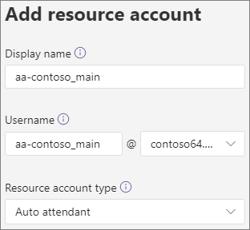
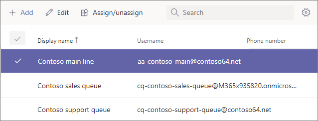
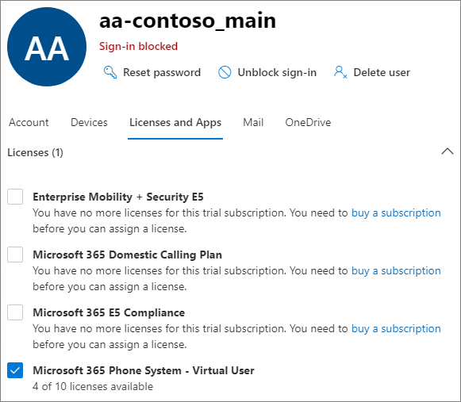
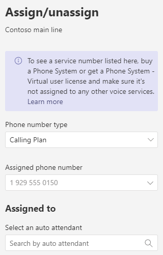

# Manage resource accounts in Microsoft Teams

In Microsoft Teams, a resource account is required for each auto attendant or call queue. Resource accounts may also be assigned service telephone numbers. This is how you assign phone numbers to auto attendants and call queues allowing callers from outside Teams to reach the auto attendant or call queue.

This article covers how to create resource accounts and ready them for use with auto attendants and call queues.

Before you start the procedures in this article, ensure you've done the following:

- [Obtain virtual user licenses](#obtain-virtual-user-licenses)
- [Obtain service numbers](#obtain-service-numbers)

> [!NOTE]
> Resource accounts used for auto attendants and call queues are disabled for sign in and must remain so. Chat and presence are not avaialble for these accounts.

### Obtain virtual user licenses

Each resource account requires a license in order to work with auto attendants and call queues. You can use a free *Microsoft 365 Phone System - Virtual User* license. To obtain these licenses, see [Virtual User license](teams-add-on-licensing/virtual-user.md).

We cover how to assign the license to a resource account later in this article.

To get the Virtual User license, in the Microsoft 365 admin center, go to **Billing** > **Purchase services** > **Add-on subscriptions** and scroll to the end - you will see *Phone System - Virtual User* license. Select **Buy now**. There is a zero cost, but you still need to follow these steps to acquire the license.

### Obtain service numbers

Service numbers are optional for auto attendants and call queues, however you will need at least one service number in order for callers to reach your auto attendant and call queue configuration. For any auto attendant or call queue that you want to be reachable directly by a service number, you must have a resource account with an associated service number.

Resource accounts can use either toll or toll-free service numbers. You can request new numbers or port existing numbers from another carrier.

To get new service numbers, see [Getting service phone numbers](getting-service-phone-numbers.md).

To port a number from another carrier, see [Transfer phone numbers to Teams](phone-number-calling-plans/transfer-phone-numbers-to-teams.md).

## Create a resource account

You can create a resource account in the Teams admin center.



1. In the Teams admin center, expand **Voice**, and then click **Resource accounts**.

2. Click **Add**.

3. In the **Add resource account** pane, fill out **Display name**, **Username**, and the **Resource account type**. The resource account type can be either **Auto attendant** or **Call queue**, depending how you intend to use this resource account.

4. Click **Save**.



## Assign a license

For each resource account, you must assign a *Microsoft 365 Phone System - Virtual User* license or *Phone System* license.



1. In the Microsoft 365 admin center, click the resource account to which you want to assign a license.

2. On the **Licenses and Apps** tab, under **Licenses**, select **Microsoft 365 Phone System - Virtual User**.

3. Click **Save changes**.

## Assign a service number

If you're planning to use the resource account with an auto attendant or call queue that requires a service number, assign a number to the resource account.



1. In the Teams admin center, on the **Resource accounts** page, select the resource account to which you want to assign a service number, and then click **Assign/unassign**.

2. In the **Phone number type** dropdown, choose the type of number that you want to use.

3. In the **Assigned phone number** box, search for the number you want to use and click **Add**.

4. Click **Save**.


To assign a direct routing or hybrid number to a resource account you need to use PowerShell:

```powershell
Set-CsPhoneNumberAssignment -Identity aa-contoso_main@contoso64.net -PhoneNumber +19295550150 -PhoneNumberType DirectRouting
```

## Next steps

Once you've completed the resource account setup and assigning a service number if needed, you're ready to use the resource account with an auto attendant or call queue.

See the following references:

 - [Cloud auto attendant](create-a-phone-system-auto-attendant.md)

 - [Cloud call queue](create-a-phone-system-call-queue.md)

You can edit the resource account **Display name** and **Resource account** type using the **Edit** option. Click **Save** when you are done.

## Change an existing resource account to use a Virtual User license

If you decide to switch the licenses on your existing resource account from a **Phone System** license to a Virtual User license, you'll need to acquire the free Virtual User license, and then follow the steps in the Microsoft 365 admin center to [Move users to a different subscription](/microsoft-365/admin/manage/assign-licenses-to-users#move-users-to-a-different-subscription).

> [!WARNING]
> Always remove a full Phone System License and assign the Virtual User license in the same license activity. If you remove the old license, save the account changes, add the new license, and then save the account settings again, the resource account may no longer function as expected. If this happens, we recommend you create a new resource account for the Virtual User license and remove the broken resource account.

## Skype For Business Server 2019

For resource accounts homed on Skype For Business Server 2019 that can be used with cloud call queues and cloud auto attendants, see [Plan Cloud call queues](/SkypeforBusiness/hybrid/plan-call-queue) or [Plan Cloud auto attendants](/SkypeForBusiness/hybrid/plan-cloud-auto-attendant). Hybrid implementations (numbers homed on Direct Routing) are configured using the [New-CsHybridApplicationEndpoint](/powershell/module/skype/new-cshybridapplicationendpoint) cmdlet on an on-premises Skype for Business Server 2019 server.

The application IDs that you need to use while creating the application instances are:

- **Auto Attendant:** ce933385-9390-45d1-9512-c8d228074e07
- **Call Queue:** 11cd3e2e-fccb-42ad-ad00-878b93575e07

> [!NOTE]
> If you want the call queue or auto attendant to be searchable by Skype For Business Server 2019 users, you should create your resource accounts on Skype For Business Server 2019, since online resource accounts are not synced down to Active Directory. When DNS SRV records for sipfederationtls resolve to Skype for Business Server 2019, then resource accounts **must** be created on Skype For Business Server 2019 using SfB Management shell and synchronized to Azure AD.

For implementations that are hybrid with Skype for Business Server:

   [Plan Cloud auto attendants](/SkypeForBusiness/hybrid/plan-cloud-auto-attendant)
  
   [Plan Cloud call queues](/SkypeforBusiness/hybrid/plan-call-queue)
   
   [Configure on-prem resource accounts](/SkypeForBusiness/hybrid/configure-onprem-ra)


## Delete a resource account

Make sure you dissociate the telephone number from the resource account before deleting it, to avoid getting your service number stuck in pending mode.

After you do that, you can delete the resource account in the Microsoft 365 admin center, under the Users tab.

To disassociate a direct routing telephone number from the resource account, use the following cmdlet:

```powershell
Remove-CsPhoneNumberAssignment -Identity <Resource Account Object ID> -PhoneNumber <assigned phone number> -PhoneNumberType DirectRouting
```
