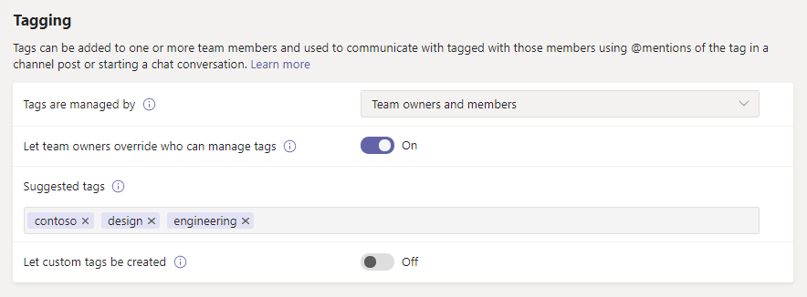
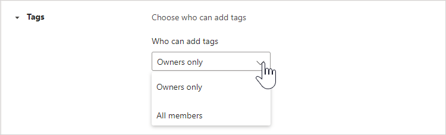
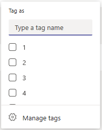

# Manage tags in Microsoft Teams

## Overview

Tags in Microsoft Teams let users quickly and easily connect with a subset of people on a team. You can create and assign custom tags to categorize people based on attributes, such as role, project, skill, or location. Or, tags can be automatically assigned to people based on their schedule and shift information in the [Shifts app](https://support.microsoft.com/office/apps-and-services-cc1fba57-9900-4634-8306-2360a40c665b?#PickTab=Shifts). After a tag is added to one or multiple team members, it can be used in @mentions by anyone on the team in a channel post or to start a conversation with only those people who are assigned that tag.

As mentioned earlier, there are two kinds of tags in Teams.

- **Custom tags**: Team owners and team members (if the feature is enabled for them) can manually create and assign tags to people. For example, a "Designer" or "Radiologist" tag will reach those sets of people on a team without having to type their names.
- **Tagging by shift**: With this feature, people are automatically assigned tags that match their schedule and shift group name in the [Shifts app](https://support.microsoft.com/office/get-started-in-shifts-5f3e30d8-1821-4904-be26-c3cd25a497d6#bkmk_openshiftsappdesktop) in Teams. For example, the "EngineerOnCall" tag reaches all engineers who are scheduled in Shifts to work at the time the tag is used in a chat or channel post. With tagging by shift, Teams takes the guesswork out of knowing the name of on-shift staff when users need to quickly relay information. Tagging by shift can also be backed by major workforce management systems like JDA, Kronos, and AMiON by integrating them with Shifts in Teams. To learn more about how to set up this feature, see [Set up tagging by shift](#set-up-tagging-by-shift).

> [!NOTE]
> Tags are not supported in private or shared channels.

## How tags work

A tag can be manually added or automatically assigned to a person on a specific team. It can then be used in @mentions on the **To** line in a chat or in a post on any standard channel of the team. Here's some examples of how tags can be used in Teams:

- A store manager posts an announcement to a channel to notify all cashiers.
- A hospital administrator sends a message to all radiologists in a channel.
- A marketing manager starts a group chat with all designers.
- A nurse sends a message to all on-call cardiologists. (coming soon)
- A system engineer posts an announcement to a channel to notify all on-shift field engineers. (coming soon)

When a tag is @mentioned in a channel conversation, team members associated with the tag will get notified, just like any other @mention.

## Manage custom tags for your organization

As an admin, you can control how tags are used across your organization in the Microsoft Teams admin center. Currently, you can't use PowerShell to manage tags.

A team can have up to 100 tags, up to 200 team members can be assigned to a tag, and up to 25 tags in the same team can be assigned to a single user.

### Set who can add custom tags

By default, team owners can add custom tags. You can change this setting to allow team owners and team members to create, edit, delete, and manage tags or you can turn off tags for your organization.

1. In the left navigation of the Microsoft Teams admin center, click **Teams** > **Teams settings**.
2. Under **Tagging**, next to **Tags are managed by**, select one of the following options:

    - **Team owners and members**: Allow team owners and members to manage tags.
    - **Team owners**: Allow team owners to manage tags.
    - **Disabled**: Turn off tags.

### Configure custom tags settings

You can configure the following tags settings to control how custom tags are used across your organization.

1. In the left navigation of the Microsoft Teams admin center, click **Teams** > **Teams settings**.
2. Under **Tagging**, set the following, depending on the needs of your organization.

    - **Let team owners override who can manage tags**: When you turn on this setting, team owners can set whether team members can create and manage tags within a team and the value of the **Tags are managed by** setting is the default value for each team. If you turn off this setting, the **Tags are managed by** setting can't be changed per team.
    - **Suggested default tags**: Use this to add a set of default tags. You can add up to 25 tags, and each tag can contain a maximum of 25 characters. Team owners and members (if the feature is enabled for them) can use these suggestions, add to them, or create a new set of tags.
    - **Let custom tags be created**: Turn on this setting to let people add tags other than the suggested default tags that you set. If this is turned off, people can only use the suggested default tags. If you turn this off, make sure that you add one or more default tags.

## Manage custom tags settings for a team

If you turned on the **Let team owners override who can manage tags** setting in the Microsoft Teams admin center, team owners can set whether members can add tags at the team level. To do this, on the **Settings** tab for a team, go to **Tags**, and then choose who can add tags.

## Use tags

Here's how to add custom tags and how to set up tagging by shift (if you're using the Shifts app in Teams). To learn more, check out [Using tags in Teams](https://support.office.com/article/using-tags-in-teams-667bd56f-32b8-4118-9a0b-56807c96d91e).

### Create and assign custom tags

To create and assign custom tags, select **Teams** on the left side of the app, and then find your team in the list. Select **... More options**, and then choose **Manage tags**. Here, you can create tags and assign them to people on your team.

To delete a tag, select **... More options** next to the tag, and then select **Delete tag**.

### Set up tagging by shift

Tagging by shift allows your users to reach the people on-shift in real-time. Teams automatically assigns users with tags matching their schedule and shift group name from the Shifts app, enabling dynamic role-based messaging. Notifications are sent only to those people who are on shift at the time a tag is used to start a chat or in a channel post.

1. In Teams, go to the [Shifts app](https://support.microsoft.com/office/get-started-in-shifts-5f3e30d8-1821-4904-be26-c3cd25a497d6#bkmk_openshiftsappdesktop).
2. Create [shift groups](https://support.microsoft.com/office/fill-out-a-schedule-in-shifts-2d58df9b-1c6c-4c84-b0c3-835de7ad13ea#bkmk_organizeshiftsbygroup) and name them after an attribute such as a role. For example, EngineerOnCall. The shift group name will be the name of the tag.
3. [Fill out a schedule](https://support.microsoft.com/office/fill-out-a-schedule-in-shifts-2d58df9b-1c6c-4c84-b0c3-835de7ad13ea) by assigning shifts to members of your teams. When you're finished, in the upper-right corner of the Shifts app, select **Share with team**.
4. Wait 15 minutes for the scheduled shifts to populate the tagging service.
5. Use the tag anywhere you use tags in Teams.

## Related topics

[Using tags in Teams](https://support.office.com/article/using-tags-in-teams-667bd56f-32b8-4118-9a0b-56807c96d91e)

[Manage the Shifts app for your organization in Teams](expand-teams-across-your-org/shifts/manage-the-shifts-app-for-your-organization-in-teams.md)

[Shifts Help documentation](https://support.microsoft.com/office/apps-and-services-cc1fba57-9900-4634-8306-2360a40c665b)
