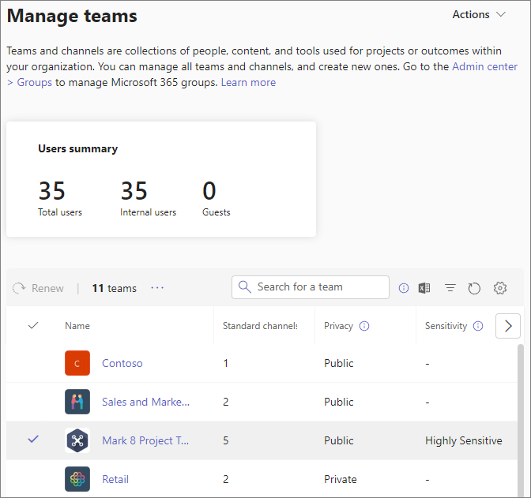
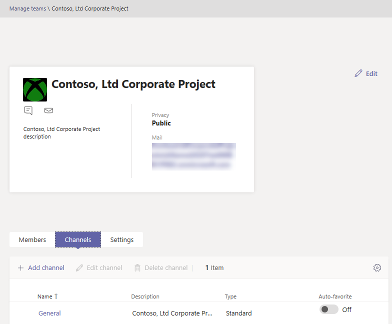

Manage teams in the Microsoft Teams admin center
==========================================

## Overview

As an admin, you may need to view or update the teams that your organization set up for collaboration, or you might need to perform remediation actions such as assigning owners for ownerless teams. You can manage the teams used in your organization through both the Microsoft Teams PowerShell module and the Microsoft Teams admin center. For full administration capabilities using these two toolsets, you should make sure that you are assigned one of the following roles:

- Global Administrator
- Teams Service Administrator

You can learn more about admin roles in Teams in [Use Microsoft Teams admin roles to manage Teams](using-admin-roles.md), and you can read more about how to use the PowerShell cmdlets for managing teams in the [Microsoft Teams cmdlet reference](https://docs.microsoft.com/powershell/teams/?view=teams-ps).

This article provides an overview of the management tools for teams in the Microsoft Teams admin center.

## Teams overview grid

Management tools for teams are under the **Teams** node in the Microsoft Teams admin center. (In the admin center, select **Teams** > **Manage teams**.) Each team is backed by an Office 365 group, and this node provides a view of groups that have been Microsoft Teams-enabled in your organization.

  

The grid displays the following properties:

- **Team name**
- **Channels** - a count of all channels in the team, including the default General channel.
- **Team members** - a count of total users, including owners, guests, and members from your tenant.
- **Owners** - a count of owners for this team.
- **Guests** - a count of Azure Active Directory B2B guest users who are members of this team.
- **Privacy** - the Visibility/AccessType of the backing Office 365 group.
- **Status** - the Archived or Active status for this team. Learn more about archiving teams in [Archive or restore a team](https://support.office.com/article/archive-or-restore-a-team-dc161cfd-b328-440f-974b-5da5bd98b5a7).
- **Description** - the description of the backing Office 365 group.
- **Classification** - the classification (if used in your organization) assigned to the backing Office 365 group. Learn more about classifications at [Create classifications for Office groups in your organization](https://docs.microsoft.com/office365/enterprise/powershell/manage-office-365-groups-with-powershell#create-classifications-for-office-groups-in-your-organization).
- **GroupID** - the unique GroupID of the backing Office 365 group.

> [!NOTE]
> If you don't see all these properties in the grid, click the **Edit columns** icon. In the **Edit columns** pane, you can use the toggles to turn on or turn off columns in the grid. When you're finished, click **Apply**.

### Add

To add a new team, click **Add**. In the **Add a new team** pane, give the team a name and description, set whether you want to make it a private or public team, and set the classification.

### Edit

To edit group and team-specific settings, select the team by clicking to the left of the team name, and then select **Edit**.

### Archive

You can archive a team. Archiving a team puts the team into read-only mode within Teams. As an admin, you can archive and unarchive teams on behalf of your organization in the admin center. 

### Delete

Deleting a team is a soft-delete of the team and corresponding Office 365 group. To restore a mistakenly deleted team, follow the instructions in [Restore a deleted Office 365 Group](https://docs.microsoft.com/office365/admin/create-groups/restore-deleted-group?view=o365-worldwide).

### Search

Search currently supports the string "Begins with" and searches the **Team name** field.

## Team profile

You can navigate to the team profile page of any team from the main teams overview grid by clicking  the team name. The team profile page shows the members, owners, and guests that belong to the team (and its backing Office 365 group), as well as the team’s channels and settings. From the team profile page, you can:

- Add or remove members and owners.
- Add or remove channels (note that you can't remove the General channel).
- Change team and group settings.
 

## Making changes to teams

On the team's profile page, you can change the following elements of a team:

- **Members** - add or remove members and promote or demote owners.
- **Channels** - add new channels, and edit or remove existing channels. Remember that you can't delete the default General channel.
- **Team name**
- **Description**
- **Privacy** - set whether the team is public or private.
- **Classification** - this is backed by your Office 365 group classifications. Choose **Confidential**, **Highly Confidential**, or **General**.
- **Conversations settings** - set whether members can edit and delete sent messages.
- **Channels settings** - set whether members can create new channels and edit existing ones, and add, edit, and remove tabs, connectors, and apps.

The changes that you make to a team are logged. If you're modifying group settings (changing the name, description, photo, privacy, classification, or team members), the changes are attributed to you through the audit pipeline. If you're performing actions against Teams-specific settings, your changes are tracked and attributed to you in the General channel of the team.

## Troubleshooting

**Issue: Teams missing from the Team overview grid**

Some of your teams are missing from the list of teams in the Teams overview grid.

**Cause**: This issue occurs when the team was incorrectly (or not yet) profiled by the system which can lead to a missing property for it to be recognized.

**Resolution: Manually set the property to the correct value via MS Graph**

Replace **{groupid}** in the Query for the actual GroupId in question, which you can get via the Exchange Online powershell, with the **"[Get-UnifiedGroup](https://docs.microsoft.com/powershell/module/exchange/users-and-groups/get-unifiedgroup?view=exchange-ps)"** cmdlet, as the "**ExternalDirectoryObjectId**" attribute.

1. Access [Graph Explorer](https://developer.microsoft.com/en-us/graph/graph-explorer).

2. Sign in to Graph Explorer on the left menu.

3. Change the query line to: PATCH > v1.0 > https://graph.microsoft.com/v1.0/groups/{groupid}.

4. Add the following value on the request body: {"resourceProvisioningOptions": ["Team"]}.

5. Run the query on the top-right.

6. Confirm the team appears correctly in the Microsoft Teams admin center - Team Overview.

## Learn more

- [Teams cmdlet reference](https://docs.microsoft.com/powershell/teams/?view=teams-ps)  
- [Use Teams administrator roles to manage Teams](using-admin-roles.md)
- [Plan for lifecycle management in Teams](plan-teams-lifecycle.md)
